# PD-PPO论文修订分析报告

## 执行摘要

这篇稿件已经具备较完整的主线骨架：问题动机、相关工作、形式化定义、方法、实验协议、结果、讨论、结论，以及附录中的命题与证明都已齐备；同时，实验主结论也很集中，围绕“固定气象主干 + 单专用通道”基准下，PD-PPO 相比固定掩码与规则式动态基线在 24 个最终测试种子上取得一致优势来展开。当前版本最有价值的内容有三点：任务定义明确、时间切分协议较干净、结果叙事有统一的 confirmatory/diagnostic 区分意识。fileciteturn0file0

但从投稿风险看，当前稿件的最大瓶颈并不在“有没有结果”，而在“技术表述是否足够严谨、实验展示是否足够可审阅”。最关键的问题有两个。第一，方法部分同时声称策略输出“每通道分数 + 确定性可行性投影”，又在 PPO 目标里直接写标准的动作概率比 \(\pi_\theta(a_t|o_t)/\pi_{\theta_{\text{old}}}(a_t|o_t)\)。若执行动作 \(a_t\) 来自 many-to-one 的确定性投影，这个 log-probability 需要被严格定义；否则 Eq. (8)–(10) 会成为审稿人最容易抓住的技术漏洞。第二，当前结果展示明显偏“计数式”，大量依赖“24/24”“6/6”这类 favorable seeds 计数，而较少展示完整分布、效应量、每种基线的具体差值结构，这会削弱可解释性并提高“过度包装结果”的主观观感。fileciteturn0file0 citeturn0academia0turn0academia2

我建议把修订重点集中到五件事上：其一，重写动作空间与投影的数学定义，最好在最终 benchmark 上直接改写成“可行动作上的 masked categorical PPO”；其二，把“通用 PD-PPO 框架”和“单专用通道特化实例”彻底分开写；其三，把结果图表从“通过/未通过计数”升级为“分布 + 配对差值 + 置信区间 + 每 regime 细分”；其四，增加一个严格的“在线可观测性审计”，澄清 event context、latent event type、辅助标签之间的边界；其五，补齐超参数、窗口数、checkpoint 选择规则、ablation 样本量、随机种子与 CSV 级别结果发布。这样改完后，论文会从“结果很强但有若干可质疑点”，转为“主线清楚、技术闭环完整、实证更有说服力”的状态。fileciteturn0file0 citeturn3academia0turn3academia2

由于本次任务中 target venue、page limit 和 available compute 都未指定，下面的建议按“短期可提交版”和“长期强化版”两层来组织；同时需要注意，尽管稿件首页写有 Expert Systems with Applications 预印本提交信息，这里仍按“投稿约束未最终锁定”的思路给出可伸缩方案。fileciteturn0file0

## 核心诊断与优先级行动

当前论文的核心优势在于问题设定收束得很好：mandatory backbone、one-specialist action geometry、固定评估预测器、时间分区隔离、固定掩码回放、行为诊断，已经形成了一条可复述的研究故事线。真正需要加强的是“方法闭环”和“证据形态”。尤其在最终 benchmark 中，动作空间其实很小：一个固定主干加至多一个专用通道，且表中只有有限个 specialist 候选。这意味着你既可以把它包装成“投影式一般框架的一个特例”，也可以更干净地直接把它写成“有限可行动作上的 PPO”；如果两层叙述不拆开，审稿人会同时从“是否真有组合动作难度”和“PPO action probability 是否定义正确”两边发问。fileciteturn0file0 citeturn0academia0turn0academia2

下表给出优先级排序后的具体行动。短期动作以“降低被 technicality 卡住的概率”为目标，长期动作以“提升说服力与扩展性”为目标。

| 优先级 | 时程 | 具体动作 | 为什么最重要 | 交付物 |
|---|---|---|---|---|
| P0 | 短期 | 重写动作定义：把最终 benchmark 改写成 masked categorical over feasible specialist actions，或明确 latent action 与 projected action 的概率关系 | 直接修补 PPO 数学闭环，是最可能决定审稿成败的问题 | 新版 Eq. (8)–(10)、动作概率定义、算法伪代码 |
| P0 | 短期 | 增加“在线可观测性审计表” | event context/aux label/latent regime 容易被质疑有信息泄露 | 新表：每个输入特征的来源、时间戳、是否部署期可得 |
| P0 | 短期 | 重构结果展示：把 Table 4 + Fig. 5 改成配对差值分布图和 confirmatory table | 当前 24/24 证据强但可视化单薄 | 新主结果图 + 分离后的两张表 |
| P0 | 短期 | 补全实验复现实务：超参数、checkpoint 规则、窗口数、种子用途、代码/CSV | 当前结果强，越强越需要 release-ready reporting | 新 Hyperparameter table + supplement |
| P1 | 短期 | 把“通用 PD-PPO”与“单专用 benchmark 特化”分成两个层次 | 现在泛化叙述与具体实例交织，影响叙事清晰度 | 方法章节重写 |
| P1 | 短期 | 增加 per-regime/per-baseline 细分图表 | 宏观指标已足够，缺少拆解会削弱可解释性 | 新增 regime margin plot、action heatmap |
| P1 | 中期 | 关键 ablation 从 6 seeds 扩到至少 12，理想为 24 | 6-seed mechanism check 容易被视为 pilot | 扩展版 Table 5/Fig. 7 |
| P2 | 中期 | 做 evaluator sensitivity：TCN 之外增加 1 个 forecaster family | 当前讨论里已承认 fixed evaluator limitation | 附加表：不同 evaluator 下排名稳定性 |
| P2 | 长期 | 增加更一般的 multi-specialist budget benchmark | 用于支撑“projected combinatorial action”而非仅单 specialist | 附录或后续版本实验 |

如果只能做最少修改，我建议至少完成四项：动作概率重写、可观测性审计、主结果图表重画、复现信息补齐。这四项完成后，论文的技术严谨性将明显提升，即便不扩做大规模新实验，也足以让主线更稳。fileciteturn0file0 citeturn3academia0turn3academia2

## 结构与技术修订建议

从结构上看，稿件当前已经有完整的 abstract–introduction–related work–problem formulation–method–setup–results–discussion–conclusion 流程，但抽象层级还不够干净：方法与 benchmark 特化交织，理论命题与经验结论紧贴，结果与诊断混在同一表格里。这些都不会推翻结果，却会让读者在第一次阅读时难以迅速抓住“主贡献究竟是什么”。对应用型期刊或综合类 AI 期刊，最佳策略通常是把“主结论最少依赖什么”单独凸显出来，再把“为解释该结论做的诊断与支持性分析”分层下放。fileciteturn0file0 citeturn3academia0turn3academia2

我建议按下面的方式重写各章节叙事。

| 章节 | 当前状态 | 主要问题 | 建议改法 |
|---|---|---|---|
| 摘要 | 信息完整，结果强 | 信息过密，应用细节偏多，24/24 重复出现，方法定义仍偏抽象 | 用“问题→方法→协议→主结果→边界”五句式；保留一次 24/24，再加一个效应量与 CI；明确“最终 benchmark 是固定主干 + 单专用通道” |
| 引言 | 动机清晰 | 贡献点与实验发现耦合较紧，理论命题过早进入主线 | 用一个 running example 串起 particle/flux/thermal；贡献改成“方法、协议、证据、诊断”四条；把 Prop. 1/2 的直觉放到引言最后一段即可 |
| 相关工作 | 涵盖面够广 | 文献组织还偏平铺，未把“估计目标”和“预测目标”对立得足够锋利 | 按“估计型调度”“约束下 RL 调度”“预测模型作为 evaluator”三段重写；每段末尾明确与本文差异 |
| 方法 | 框架完整 | 一般框架与单 specialist 实例混写，动作概率闭环不够严谨 | 先写 generic formulation，再写 benchmark instantiation；单独加入 notation table 与 observability table |
| 实验 | 协议清楚 | 主结果与诊断结果混排，缺少实验问题列表 | 在 5.4 开头加 Evaluation Questions/Hypotheses 表；把 confirmatory results 与 diagnostics 分成两小节 |
| 讨论/结论 | 边界意识较好 | 对 evaluator-specific limitation 的讨论略短 | 讨论中加入“如果 evaluator ranking 改变则主结论边界何在”；结论缩短，少重复 24/24 |

在技术正确性与清晰性方面，最需要修的是符号体系。当前文稿同时使用 \(x_t\)（truth state）、估计状态、scheduler observation \(o_t\)、执行动作 \(a_t\)、event context、event type，以及训练损失 \(L_{\text{train}}\)、评估损失 \(L_{\text{step}}\)、宏观分数 \(M_{\text{staticnorm}}\)。这些对象都出现了，但边界没有完全拉开，尤其 “event context” 到底是部署时可得的观测代理，还是模拟器内部标签的函数，必须说清楚。建议增加一个 1 页以内的符号表，至少定义：\(x_t,\hat{x}_t,o_t,z_t,a_t,c_t,\hat{c}_t\)、\(B_0,S,\mathcal{A}_{\text{feas}}(o_t)\)、\(L_{\text{train}},L_{\text{step}},M_{\text{staticnorm}}\)，并在首次出现时固定中文术语。fileciteturn0file0

当前最需要重点强调的技术问题，是 PPO 概率项与确定性投影的关系。PPO 的 clipped surrogate 依赖于一个定义良好的旧策略/新策略动作概率比；TRPO/PPO 的稳定性也正是建立在这种代理目标的可解释性之上。当前稿件里，策略先输出通道分数，再经“可行性投影”得到可执行子集，但 Eq. (9) 直接写成 \(\pi_\theta(a_t|o_t)/\pi_{\theta_{\text{old}}}(a_t|o_t)\)。如果 \(a_t\) 是被投影后的动作，而非 policy 直接采样的原始动作，那么需要明确：到底是对 latent action 求概率，并把 projection 当成 environment wrapper；还是直接在 feasible action set 上定义策略分布。对你这个最终 benchmark，我更推荐后一种写法，因为它最干净、最不容易被挑刺。fileciteturn0file0 citeturn0academia0turn0academia3turn0academia2

此外，当前最终 benchmark 的动作几何实际上是“固定 backbone + 单个 specialist 选择”，这让最终实验更接近有限离散动作选择，而离真正的“高维组合动作投影”还有距离。这个事实并不会削弱论文价值，但会改变最佳卖点：你应当把主贡献表述成“预测驱动、可行约束下的状态依赖 specialist scheduling”，而把“projected combinatorial policy”作为更一般的框架外延；如果仍想保留“投影”作为正面创新点，最好补一个更一般预算下的扩展实验，或者至少在附录里给出更广泛 action geometry 的实现说明。fileciteturn0file0

关于理论部分，我的建议是“降风险处理”。Prop. 1 与 Prop. 2 在逻辑上更像是动机性命题：它们帮助读者理解为什么单 specialist 下动态调度可能优于固定掩码、为什么 AoI/covariance 与 forecast loss 会排序不同；但它们的假设设置较强，收益主要是叙事性的，而非真正提供新理论。对多数应用导向 venue，一种更稳妥的写法是：正文保留“命题 + 直观解释 + 作用边界”，完整证明移至附录；如果篇幅紧，则正文改成 remark/proposition sketch 即可。这样能减少理论细节吸走审稿注意力。fileciteturn0file0

中文写作风格方面，建议统一使用下列术语，并在全文只保留一种译法。这样能显著降低阅读摩擦。

| 英文术语 | 建议中文 | 备注 |
|---|---|---|
| forecast loss | 预测损失 | 全文统一，不再混用“forecast-weighted loss / step loss”式口语写法 |
| fixed evaluation forecaster | 固定评估预测器 | 强调“先训练后冻结” |
| fixed-mask replay | 固定掩码回放 | 比“静态 mask 重放”更顺口 |
| one-specialist benchmark | 单专用通道基准 | specialist 建议译为“专用通道” |
| event-aware diagnostic replay | 事件感知诊断回放 | 明确其诊断/上界性质 |
| feasibility projection | 可行性投影 | 若最终改成 masked categorical，则在 benchmark 实验中弱化这一术语 |
| ordinary step-weighted loss | 常规步加权损失 | 与主要宏观指标分开 |
| static-reference-normalised macro score | 静态参考归一化宏分数 | 可在首次出现后简写为“静态归一化宏分数” |

引用与相关工作部分也建议再收紧。当前稿件引用面广，但有些非常新的 arXiv 论文在主线里承担的论证作用并不强。更稳妥的方案是把“经典/基础支柱”放前面：估计型 sensor scheduling 用 Shi 2011、Kaul 2012，策略优化用 TRPO/PPO，约束处理可援引 CPO，学习型 adaptive sensing 用 Murad 2020，评估预测器家族可用 TCN、TFT、iTransformer 作为代表。这样文献骨架更稳，也更容易向审稿人解释你的工作处于哪条主脉络上。citeturn0academia3turn0academia0turn0academia2turn7academia0turn10academia0turn10academia1turn11academia0

## 图表与表格修订方案

当前稿件已有 Figure 1–7、Table 1–6，数量并不多，但信息组织方式可以明显提升。总体评价是：图的“主题方向”大多正确，表的“内容覆盖”也基本够用；主要问题集中在三个层面。其一，多幅图更像“结果告知”，缺少“结果解释”；其二，多张表同时装入 confirmatory results、diagnostics、counts、means、medians、p-values，导致读者抓不到主结论层级；其三，缩印后字号偏小，尤其 Fig. 4–7 的双/多面板图，在期刊排版后可读性风险较高。以下表格逐项覆盖当前稿件的所有现有图表，并给出精确修改建议。fileciteturn0file0

| 现有项 | 当前作用 | 主要问题 | 具体修改 | 建议版式/示意 |
|---|---|---|---|---|
| Figure 1 框架图 | 展示 PD-PPO 调度框架 | 箭头较多，训练/评估/诊断混在一张图里；“forecaster-ranked feasible subsets”只是角落注释 | 改成左右两段式：左边“部署期 runtime”，右边“训练期/标签生成期”；用不同线型区分在线路径与离线路径；把 frozen evaluator 画成带锁图标 | 左：\(o_t \to \pi_\theta \to a_t\)；右：trajectory \(\to\) frozen forecaster \(\to\) reward / BC labels |
| Figure 2 时间切分图 | 显示 chronological split | 百分比有了，但每段允许做什么还不够醒目；读者仍可能问 normaliser/label/checkpoint 用了哪段 | 在每个色块内部写“fit forecaster / train policy / select static mask & checkpoint / final report only”；图下注明 lookback/horizon 是否跨边界截断 | 单行时间轴 + 上方禁止事项（no forecaster refit, no label gen on test） |
| Figure 3 AWS 渲染图 | 提供应用背景 | 科学信息密度偏低，占版面较大，且与 Table 2 部分功能重复 | 若篇幅紧张，移附录；若保留，缩为半栏，并在旁边并列一个“logical channels schematic”替代纯渲染 | 左：缩小实景渲染；右：6 logical channels + cost/warm-up 图例 |
| Table 1 基线家族表 | 说明 reference families | 有用，但偏“文字说明表”，可压缩 | 合并到实验协议表中，增加“是否部署可用”“是否使用 privileged info”“是否用于主显著性比较”三列 | 一张更标准的 baseline taxonomy 表 |
| Table 2 通道与代价 | 说明 6 logical channels | 非常关键，但缺一列“regime relevance”；warm-up 在正文定义不够 | 新增列：channel type、主要 regime、是否 mandatory、典型角色；表后接一句明确“最终 benchmark 的 action 实质” | 六行通道表 + 一句 action summary |
| Table 3 生成器校验 | 说明模拟器边界 | 信息足，但缺“为什么这项检查与调度问题有关” | 新增列：motivation/rationale；接受阈值与 anchor source 放在同一列；把“not policy-selection criteria”写进表注 | 更像 benchmark validity table |
| Figure 4 生成器统计图 | 可视化模拟器校验 | 四图缩得很小；(a)(b) 直方图信息冗余；(d) event-window fractions 的区域解释不够清楚 | 建议改成 2×2 但每 panel 更大；(a)(b) 用 KDE/直方 + 样本量注释；(c) 加 shaded tolerance band；(d) 标注 calm/event-heavy 的边界值 | 四个 panel 保留，但字号统一放大、阈值可视化更明显 |
| Table 4 主结果表 | 当前主证据总表 | 最大问题：把 confirmatory outcome、diagnostic outcome、均值/中位数/CI、p-value 全塞在一起；“Event-aware diagnostic improvement”语义含混 | 拆成两张表：主结果表只保留 confirmatory comparisons；诊断表单独给 event-aware / behavior / fixed-mask replay；主表中每行写清 baseline 与 metric | Table A：主性能；Table B：诊断与行为 |
| Figure 5 主结果图 | 展示 seed-level evidence | Panel B 的 24/24 横条信息密度低；Panel A 只画 fixed-mask step margin，和主宏分数联系不够 | 改成森林图或 paired dot plot：每个 seed 两个主指标都显示；把 step margin threshold 单独画成细虚线 | 左：macro margin forest；右：step margin + threshold |
| Figure 6 行为诊断图 | 显示 state dependence | 三个统计量在同一 y 轴上，量纲不一致；Panel B 仍是 count chart | 拆成三个小面板或统一标准化到 z-score；增加阈值线以及 fixed-like / cycle-like 危险区间 | 上排三图：entropy / MI / regime-separation；下排小表总结 |
| Table 5 机理消融 | 六种子机制检查 | n=6 太小且只有计数；macro margin 只有均值，缺 CI/每种子分布 | 至少增加 median、IQR、95% bootstrap CI；若算力允许扩到 12 或 24 seeds | 主文保留简表，完整版本进附录 |
| Figure 7 机理/鲁棒性图 | 可视化 Table 5/6 | 还是以 favorable count 为主；changed event mixture 与主 benchmark 的 n 不同，视觉上容易误读 | 改成 effect-size oriented 图：每种 ablation 的 paired macro margin 分布；changed mixture 单独成子图并标“pilot n=6” | 左：ablation violin/box；右：mixture sensitivity |
| Table 6 事件混合鲁棒性 | 小型 robustness check | 信息过少，只给通过计数 | 补充 event mixture 参数变化、每 regime 占比变化、step/macro 的均值与 CI | 成为一张真正的 robustness table，而不只是 counts |

图注也建议统一增强。每个图注至少补充四类信息：样本单位（seed 还是 window）、样本量 \(n\)、误差条定义（bootstrap 95% CI 还是 standard error）、指标方向（higher/lower is better）。目前这些信息部分分散在正文与表注中，读者需要来回查找。集中放到图注里，对审稿体验帮助很大。fileciteturn0file0

如果要做一个最小改图版本，我建议优先重做人眼最先关注的三项：Figure 1、Figure 5、Table 4。它们几乎决定了读者对于“这篇论文是否讲明白了方法、是否拿出了足够好证据”的第一印象。fileciteturn0file0

## 建议新增图表与实验协议

仅靠现有图表，读者能够知道“PD-PPO 赢了”，但还很难系统地回答三个更强的问题：为什么赢、在哪些 regime 上赢、靠什么行为模式赢。下面这组新增图表与实验协议，目标就是把这三件事补齐。由于当前稿件没有披露每个 partition 的具体窗口数，因此凡是按 “window” 汇总的新图，都应在最终版图注中补入确切 \(N_{\text{window}}\)；当前能明确给出的 seed-level 样本量是最终测试 \(n=24\)，机理/小鲁棒性检查目前是 \(n=6\)。fileciteturn0file0

| 新增项 | 目的 | 精确横纵轴/结构 | 指标与误差条 | 样本量 | 你要画的原始数据 |
|---|---|---|---|---|---|
| 学习曲线图 | 展示训练稳定性与样本效率 | x 轴：environment steps 或 PPO updates；y 轴：validation \(L_{\text{step}}\) 与 \(M_{\text{staticnorm}}\) 各一张图 | 均值 ± 95% bootstrap CI | 建议 6–12 个独立训练运行；若算力充足 24 | 每轮 checkpoint 的 validation 指标、entropy、KL、value loss |
| Per-regime 配对差值图 | 展示三类事件是否都改善 | x 轴：particle / flux / thermal；y 轴：baseline loss − PD-PPO loss | 每种子一个点 + 中位数/IQR 或箱线图 | 24 test seeds | 每个种子、每个 regime 的 \(L_c(\pi)\) 与 margin |
| Regime–Action 热力图 | 直观看策略是否 state dependent | 行：事件类型；列：specialist action（含 no specialist 如存在） | 单元格填充值为行归一化选择概率；角标写 count | 全部 final-test labeled windows across 24 seeds | 每个窗口的 dominant event type 与 chosen specialist |
| 代表性轨迹可视化 | 把“何时切换 specialist”画出来 | x 轴：time step；上层条带：event regime；中层：selected specialist；下层：关键物理量（wind/flux/temp） | 无误差条；选 3 个代表种子 | 3 seeds：最小 margin/中位 margin/最大 margin | 单条 episode 的时间序列、动作序列、event labels |
| Baseline 排名散点图 | 避免只给 24/24 | x 轴：baseline name；y 轴：seed-level paired margin | 点图 + 95% CI | 24 seeds | 每种子相对每个 baseline 的 step/macro margin |
| Action transition/run-length 图 | 支撑“非固定、非简单周期” | 左：transition matrix；右：run length histogram | 概率或频率 | 24 seeds 汇总，也可附单种子示例 | specialist transitions、连续选择长度 |
| Feature observability 审计表 | 解决 leakage 风险 | 列为 feature/source/timestamp/deploy-available/train-only/diagnostic-only | 表格式，无误差条 | 不适用 | 所有输入特征清单 |
| Hyperparameter 表 | 提升复现性 | policy net、critic net、optimizer、lr、clip、entropy coef、GAE λ、γ、rollout length、batch size、label ratio 等 | 表格式 | 不适用 | 所有训练配置 |
| Seed ledger 表 | 解释 117–140 | 列为 seed range/use/development or final holdout | 表格式 | 不适用 | 训练开发种子、最终报告种子、用途边界 |

围绕新增图表，建议同步补这几组实验。这里我把它们写成“实验矩阵”，并标明预期结果与推荐统计检验。统计上最重要的一点是：继续以 seed 作为独立分析单位，所有按窗口计算的量都先在 seed 内汇总再做种子层比较，避免 pseudo-replication。当前稿件已经采用 seed-level paired differences、bootstrap CI 和 sign test，这是正确方向，值得保留。fileciteturn0file0

| 实验 | 核心问题 | 最低建议样本量 | 预期结果 | 建议检验与呈现 |
|---|---|---|---|---|
| 主结果 confirmatory 扩写 | PD-PPO 是否稳定优于 strongest deployable baseline | 24 test seeds | step 与 macro 均保持正中位数 margin | 保留 sign test；新增 paired Wilcoxon signed-rank；报告中位数差、95% bootstrap CI、效应量 |
| 可观测性审计版 ablation | 去掉任何可能接近 oracle 的 event label/proxy 后是否仍有效 | 至少 12，理想 24 | 性能略降但排序保持 | 配对检验 + 每 regime 细分图 |
| 动作建模对照 | 直接 masked categorical PPO vs 当前 projected-score 版本 | 至少 12 | categorical 版本应持平或更稳；若显著下降，说明 projection 真的有贡献 | 主指标配对比较；学习曲线并列 |
| Forecaster sensitivity | 主结论是否依赖 TCN evaluator | 至少 6–12 development seeds + 24 fixed test seeds 复评 | 相对排序尽量稳定 | 报告各 evaluator 下的排名与 Kendall/Spearman 一致性；主表放附录即可 |
| 关键消融扩样 | imitation、event support、balanced loss 各自作用 | 至少 12，理想 24 | event-context/observable regime proxy 影响最大；BC 更偏样本效率；balanced loss 更影响 macro | 用 paired margin 分布图替代表中 6/6 counts |
| Baseline 完整对照 | strongest fixed mask、fixed-mask replay、cycling、stale-priority、random、event-aware diagnostic | 24 | PD-PPO 对 deployable baselines 保持优势；event-aware 作为上界或近上界 | 多重比较时做 Holm/BH 校正；主文只保留 deployable baselines，diagnostic 移单独表 |
| 训练稳定性 | 是否依赖偶然 checkpoint/seed | 6–12 训练 runs | 学习曲线平稳，validation-selected checkpoint 不敏感 | 画 learning curves 与 best/last checkpoint 对比 |
| 运行代价 | 训练/推理成本是否可接受 | 3–5 runs 即可 | 推理开销低；训练开销中等 | 表中列 wall-clock、GPU/CPU、参数量 |

关于 forecaster sensitivity，我建议优先选一个解释性较强的多步预测器替代家族，例如 TFT；如果更关注强经验性能，可再补一个 iTransformer。这样做不是为了和 forecasting literature 正面比模型，而是为了证明“调度优劣排序”不只是某一个固定 evaluator 架构的偶然产物。TCN、TFT、iTransformer 都是多变量多步 forecasting 的合理代表。fileciteturn0file0 citeturn10academia0turn10academia1turn11academia0

这里特别强调一个建议新增表：**Action-space instantiation table**。因为你的最终 benchmark 的理论泛化框架很宽，但实际实验是一个很具体的单 specialist 版本，所以最好单独列一张表，写清楚可行动作集合到底是什么、上一时刻动作为何会影响本时刻 feasibility、warm-up 如何作用、是否允许选择“无 specialist”。这张表会非常高效地消除审稿人的实现疑问。fileciteturn0file0

## 算法表达重构建议

如果你希望当前论文在技术上“最不容易被抓住”，我最推荐的做法是：**在正文中把最终 benchmark 的策略写成“对可执行 specialist 动作的 masked categorical PPO”，把更一般的 score-and-projection 写成扩展版框架或附录说明**。理由很直接：PPO 的核心对象是一个可求 log-prob 的策略分布，而你最终实验的 action space 小且有明确 feasibility set，这时直接在 feasible actions 上定义策略，数学和实现都会更干净。fileciteturn0file0 citeturn0academia0turn0academia3turn0academia2

建议你把方法定义改成下面这个顺序来写：

1. 给定 mandatory backbone \(B_0\) 与 specialist 候选集合 \(S\)，在时刻 \(t\) 的可行动作集合定义为 \(\mathcal{A}_{\text{feas}}(o_t)\subseteq S\cup\{\varnothing\}\)。
2. actor 输出对这些可行动作的 logits，经 mask 后 softmax 得到 \(\pi_\theta(u_t\mid o_t)\)。
3. 采样或贪心得到 specialist choice \(u_t\)，执行动作是 \(a_t = B_0 \cup \text{encode}(u_t)\)。
4. reward 由 frozen evaluator 给出，再叠加切换项/违规项。
5. 如需 imitation/auxiliary supervision，则作用于同一个可行动作空间，而不是另一个隐式空间。

如果你坚持保留“先输出每通道分数，再投影”的 general PD-PPO 叙述，那么必须新增一段，把原始采样动作 \(z_t\) 和执行动作 \(a_t=\Pi(z_t)\) 区分开来，并说明 PPO ratio 用的是 \(\pi_\theta(z_t\mid o_t)\) 还是聚合后的 \(\Pr(\Pi(z_t)=a_t\mid o_t)\)。前者更容易实现，后者更接近语义，但计算复杂一些。无论选哪一种，都要在正文里说透。fileciteturn0file0 citeturn0academia0turn0academia2

下面给出一个更适合你当前 benchmark 的伪代码版本。它的目的不是替代你的实现，而是给论文一个“数学定义与代码实现都能对上”的表达模板。

```text
算法：Benchmark-specific PD-PPO with Feasible Specialist Actions

输入：
  chronological partitions D_fit, D_train, D_val, D_test
  mandatory backbone B0
  feasible specialist action space S_feas(o_t)
  frozen evaluator f_psi
  policy π_θ(u | o), value V_φ(o)
  reward weights λ_fcst, λ_sw, λ_viol
  optional label ratio ρ_label and auxiliary heads

阶段一：评估预测器
  在 D_fit 上训练 f_psi
  冻结 f_psi 的全部参数

阶段二：可选离线标签生成
  对 D_train 中被抽样的状态 o_t：
    枚举或筛选当前可行动作集合 A_feas(o_t)
    用 frozen evaluator 回放各动作的未来预测损失
    记录 greedy label g_t = argmin_{u in A_feas(o_t)} L_train(t; u)
    记录可选辅助标签 ĉ_t（仅限部署期可观测信息的函数）

阶段三：PPO 训练
  for iteration = 1, 2, ..., K do
    用当前策略在 D_train 上收集轨迹：
      观测 o_t = [估计状态, 不确定度, AoI, 上一动作, 预算状态, 可观测事件代理]
      构造动作 mask m_t over A_feas(o_t)
      采样 u_t ~ π_θ(. | o_t, m_t)
      执行动作 a_t = B0 ∪ encode(u_t)
      更新估计器和观测元数据
      计算 reward:
        r_t = - λ_fcst L_train(t) - λ_sw I[u_t ≠ u_{t-1}] - λ_viol V_t
      存储 (o_t, u_t, log π_θ(u_t|o_t), r_t, V_φ(o_t), g_t, ĉ_t)
    end

    用 GAE 计算优势 Â_t
    优化 actor：
      L_actor = L_PPO-clip + β_BC L_BC(u_t, g_t) + β_aux L_aux(o_t, ĉ_t)
    优化 critic：
      L_value = MSE(V_φ(o_t), R_t)
  end

阶段四：选择与测试
  在 D_val 上按预注册主指标选择 checkpoint
  在 D_test 上一次性评测：
    与 fixed-mask replay、deployable rule-based dynamic baselines 做配对比较
    将 event-aware replay 仅作为诊断上界
    输出 step loss、macro score、行为诊断与每种子 margin
```

上述伪代码与当前稿件的 chronologic split、固定 evaluator、辅助标签、行为诊断逻辑是一致的；差别只在于把动作概率闭环收紧到了一个真的可写出 log-prob 的可行动作空间上。fileciteturn0file0 citeturn0academia0turn0academia3

下面给一个适合放正文或补充材料的 mermaid 流程图。它比现有 Figure 1 更适合突出“训练闭环”和“部署闭环”的分离。

```mermaid
flowchart LR
    A[Chronological split] --> B[Fit evaluator on D_fit]
    B --> C[Freeze evaluator]
    C --> D[Generate optional offline labels on D_train]
    D --> E[Observe scheduler state o_t]
    E --> F[Masked actor outputs feasible specialist distribution]
    F --> G[Sample specialist u_t]
    G --> H[Compose executable action a_t = backbone + specialist]
    H --> I[Replay schedule and update estimator]
    I --> J[Frozen evaluator computes multi-horizon forecast loss]
    J --> K[Reward and trajectory buffer]
    K --> L[GAE + PPO update + BC/Aux losses]
    L --> M[Select checkpoint on D_val]
    M --> N[Test once on D_test]
    N --> O[Compare with fixed-mask replay and deployable baselines]
    N --> P[Behavioral diagnostics and per-regime analysis]
```



如果版面允许，我建议在算法图旁边再加一张小表，明确哪几类信息只在训练可见、哪几类信息在测试/部署也可见。这个小表对化解“事件相关辅助信息是否构成 privileged information”尤其有效。fileciteturn0file0

## 可复现性与投稿就绪清单

当前稿件已经有不错的 protocol awareness：固定评估预测器、时间切分、seed-level paired analysis、固定掩码回放与行为诊断这些都说明作者很在意实验边界。真正欠缺的是把这些边界“产品化”成可复现实务。对于机器学习论文，尤其是结果非常整齐的论文，补齐 reporting checklist 往往比再多做一两个小实验更能提升可信度。NeurIPS reproducibility program 和后续的 reporting standards 研究都强调了这一点：代码、数据划分、超参数、随机性来源、模型选择规则、统计摘要和 artifact 发布方式，都会直接影响论文能否被顺畅验证与接收。fileciteturn0file0 citeturn3academia0turn3academia2

下面这张清单可直接当作投稿前自检表使用。

| 模块 | 投稿前必须回答的问题 | 当前状态判断 | 建议补齐内容 |
|---|---|---|---|
| 任务定义 | 最终 benchmark 的可行动作是否一眼可懂 | 部分清楚 | 增加 action-space instantiation table |
| 信息边界 | 每个输入特征是否部署期可得 | 风险较高 | 增加 observability audit table |
| 数学定义 | PPO ratio 对哪个动作空间求概率 | 高风险 | 改写为 feasible-action policy 或明确定义 latent/projected 概率 |
| 数据切分 | split 是否泄露、window 是否跨边界 | 基本清楚 | 在图注或附录明确 lookback/horizon 边界处理 |
| 模型选择 | checkpoint、static mask、normaliser 如何选 | 有描述但不集中 | 增加 model-selection protocol table |
| 超参数 | actor/critic/forecaster/optimizer 是否公开 | 明显不足 | 新增完整 hyperparameter table |
| 随机性 | 总共有几层随机性、每层随机种子如何使用 | 不够清楚 | 发布 seed ledger：开发种子、最终报告种子、训练初始化种子 |
| 结果发布 | 每种子 raw metrics 是否可下载 | 未明确 | 发布 CSV：per-seed、per-regime、per-baseline 指标 |
| 统计检验 | 是否只有 sign test | 略单薄 | 补 paired Wilcoxon、效应量、必要的多重比较校正 |
| 行为诊断 | 阈值与定义能否独立复现 | 基本可以 | 在附录给出脚本或伪代码 |
| 资源成本 | 训练/推理时间与硬件是否披露 | 未知 | 记录 wall-clock、设备、显存、参数量 |
| 可公开性 | 代码、生成器、图表脚本、配置文件可否归档 | 部分有意向 | 在 Data Availability 中给出仓库结构与 DOI 计划 |

如果篇幅允许，我建议把 supplement/appendix 按下面的结构整理：A 节放理论与额外证明，B 节放 observability audit 与 action-space specification，C 节放完整实验配置与超参数，D 节放全部 per-seed 结果表，E 节放额外学习曲线/ablation/robustness 图。这样正文保持主线清爽，附录又足够支撑复审。fileciteturn0file0

最后给一个更贴近执行层的投稿就绪建议。短期内，如果你只想形成一版更稳的中文稿，我会建议你按这个顺序落地：

| 顺序 | 本周内可完成的动作 | 预期收益 |
|---|---|---|
| 先做 | 重写方法中的动作定义、伪代码和 Figure 1 | 立刻消除最大 technical objection |
| 再做 | 重画 Table 4、Figure 5、Figure 6 | 让主证据从“口头强”变成“图表强” |
| 再做 | 补 observability audit、hyperparameter table、seed ledger | 明显提升可信度与复现性 |
| 再做 | 把 Table 5/6 与 Figure 7 改成 effect-size 视角 | 让 ablation/robustness 更像论文证据，而非试验记录 |
| 最后 | 决定是否补 evaluator sensitivity 或扩展 ablation seeds | 作为强化项，视算力与版面而定 |

一句话总结：**这篇稿件已经有发表潜力，当前最值得投入的修改，并不是再去堆更多“24/24”的数字，而是把动作建模、信息边界、图表证据和复现实务打磨到让审稿人难以质疑的程度。** 只要这四件事做好，论文会比现在强一个明显等级。fileciteturn0file0