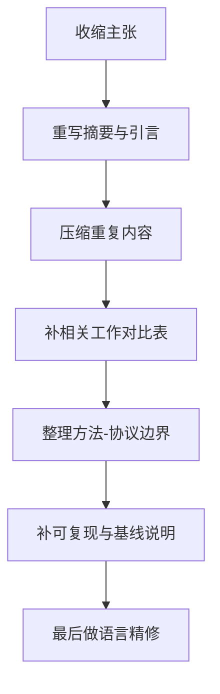

# 现稿深度评估与修改建议报告

## 执行摘要

基于你上传的当前稿件 PDF 版本，我先说明几个前提：你没有单独指定目标期刊，但稿件首页已经写明“Preprint submitted to *Expert Systems with Applications*”，因此我将 **ESWA 作为首要假设目标刊**，同时补充比较若干相邻的 AI、工程应用、传感与 IoT 期刊；你上传的是 PDF 终稿样式而非可逐行定位的 Word/LaTeX 源文稿，因此下面的定位以**页码+段落/句子起始内容**为主，而非精确行号。当前稿件总长 **54 页**，正文至第 44 页结束，之后是附录、作者贡献、数据声明和参考文献。fileciteturn0file0

我的总体判断是：**这篇稿件有明确的问题意识、实验协议意识与结果呈现意识，具备投稿潜力；但当前版本“主张过满、篇幅偏长、方法新意表述偏泛、验证边界交代不够前置、重复表达较多”，因此暂时不建议直接提交。** 如果以 ESWA 或 EAAI 一类综合 AI+工程应用期刊为目标，建议按“**大修后再投**”处理；若不愿意明显收缩篇幅并重新组织主线，桌拒风险会偏高。fileciteturn0file0 citeturn19view3turn18view0

从创新性看，稿件当前最有竞争力的部分，落点更接近于：**“面向预测目标的传感调度问题定义 + 固定评估 forecaster 的时序分割评测协议 + one-specialist benchmark 下的自适应调度证据链”**。相较之下，**“masked PPO 本身”** 作为算法层面的独创性，目前写法容易给人一种“方法创新比实际更大”的印象。近年的相关工作已经在 **goal-oriented scheduling、DRL sensor scheduling、predictive-accuracy-driven data acquisition** 等方向做了铺垫，因此你需要把主张从“提出一种全新的 RL 调度方法”收束到“在一个定义清楚、受约束、预测导向的 specialist scheduling 场景中，提出了具有可复核评测协议的有效方案”。这样会更稳，也更符合 ESWA / EAAI 对“清晰说明真实创新、使用标准术语、避免概念重命名”的偏好。citeturn20academia1turn20academia0turn9academia0turn19view4turn18view0

从篇幅看，当前版本对 **letters / short communications 明显过长**；对 **IEEE 类 8 页常规双栏稿** 也几乎肯定过长；对 **ESWA、Sensors 这类未明确给出硬性全文上限的 full article**，形式上仍可投稿，但叙述密度与重复度偏高；对 **EAAI**，官方明确要求所有投稿 **不超过 50 页**，你当前 PDF 已超出这一阈值。fileciteturn0file0 citeturn12view0turn14view0turn18view0turn5view7

我给你的核心修改策略只有一句话：**先收缩主张，再重写摘要与引言，再压缩方法/结果中的重复表达，最后补更强基线与更直接的新意对比。** 如果这一轮重写做扎实，论文会从“内容很多但主轴较散”提升为“问题定义清楚、证据闭环完整、主张边界可信”的状态。fileciteturn0file0

## 审稿前提与稿件概况

这篇稿件的题目为 **“Prediction-Driven Masked PPO for Forecast-Oriented Sensor Scheduling under Power Constraints”**，摘要、引言、问题定义、方法、实验协议、结果、讨论、结论、附录结构齐全；论文场景设定在**南极自动气象站吹雪监测**，核心实验几何是 **mandatory meteorological backbone + one specialist slot**，并以 **24 个独立 test seeds** 报告结果。全文的论证重点围绕：固定评估 forecaster、chronological split、fixed-mask replay、rule-based dynamic references、event-aware diagnostic replay、behavioural diagnostics 和 one-specialist adaptive scheduling 展开。fileciteturn0file0

从结构分布看，正文中 **Problem Formulation、Method、Setup、Results** 都写得比较长；尤其结果部分占比很高，同时讨论中又重复回顾了不少主结果。摘要与引言都已经提前给出大量结果句式，例如“24/24 seeds”“fixed-mask replay”“prespecified margin criterion”等，这增强了结果导向感，但也让前半篇阅读时多次遇到相同信息。fileciteturn0file0

如果按稿件首页信息把 ESWA 视作首选目标刊，那么有两点需要立刻对齐。第一，ESWA 要求摘要**简洁、事实性强，且不超过 250 词**；你当前摘要长度大体是合规的，但信息塞得过满。第二，ESWA 明确强调方法应使用**清晰、标准的优化术语**，重点要落在**真正创新**上，而非对已有概念做重新命名式包装。fileciteturn0file0 citeturn19view0turn19view4

如果把 EAAI 视作邻近备选刊，则约束更强：EAAI 在作者指南里明确写出，**所有投稿不得超过 50 页**；同时摘要要清楚说明 **AI contribution 是什么、engineering application 是什么**，标题和摘要中禁止未定义缩略词。你当前稿件长度已经越过这一硬阈值，且摘要虽然信息量大，但“AI 创新到底是什么、工程应用到底是什么”仍可以更直给。fileciteturn0file0 citeturn18view0

## 结构、逻辑与写作层面的主要问题

### 论文主轴仍然偏“多中心”

当前稿件同时试图完成至少五件事：定义 forecasting-oriented sensing-system scheduling、提出 masked PPO、定义 fixed-backbone one-specialist benchmark、提出 static-reference-normalised macro score、建立一整套 fixed-forecaster evaluation protocol。单看每件事都合理，但放在一篇文章里，读者会不断判断：**你的主创新究竟是新问题、新算法、新指标、新 benchmark，还是新评测协议？** 这种“多中心”状态，会削弱编辑与审稿人对论文核心贡献的瞬时把握。fileciteturn0file0

更准确地说，当前版本里**最强的贡献**来自“问题—协议—证据链”的组合，而非 PPO 这一算法壳本身。近年已有工作在 DRL sensor scheduling、goal-oriented sensor reporting scheduling、以及面向 predictive accuracy 的动态数据采集中展示出相近研究方向，因此稿件如果继续把“masked PPO”写成最显著的新意，会使审稿人更容易把你归类为“在已有 RL 框架上做任务定制”，进而追问为什么非要 PPO、为什么非要这套辅助损失、为什么没有更强的非 RL 比较。citeturn20academia1turn20academia0turn9academia0turn20academia3

我的建议是把论文主轴改成一句更聚焦的话：**在受功率约束、存在 mandatory backbone 与 scarce specialist slot 的 sensing system 中，验证“以 downstream forecasting objective 为驱动的自适应 specialist 调度”相对于固定 specialist 设计是否有稳定收益，并给出一套可复核的评测协议。** 这样一来，PPO 只是实现路径；benchmark 与 protocol 才是你支撑结论的骨架。fileciteturn0file0

### 引言的逻辑顺序需要重排

引言当前有几个优点：问题进入很快，应用动机明确，也较早点出了 fixed subset 与 regime-specific value 的冲突。问题在于，引言中很早就灌入了 benchmark 细节、协议细节和结果细节，使“研究空白—研究问题—研究假设”的链条不够锋利。页 2–5 的引言部分，读者会先后读到 forecasting 与 AoI/covariance 的差异、行动集合可行性掩码、fixed-backbone one-specialist benchmark、24/24 的结果、贡献列表；信息完整，但信息层级略平。fileciteturn0file0

更理想的顺序建议如下：

这样重写后，引言会更像“先建立必要性，再给方案，再说证据”，而不是“方案、协议、结果、贡献并行推进”。fileciteturn0file0

### 问题定义与方法之间存在重复叙述

第 3 节和第 4 节之间有明显的边界重叠。第 3 节已经详细给出 action mask、Lstep、macro score、reward，以及与 AoI/covariance 的差异；第 4 节又重新从 state/action/masking、fixed evaluation forecaster、PPO objective、chronological protocol 逐段展开。对于作者来说，这样写很严谨；对审稿人来说，阅读负担较大，因为很多核心名词在几页内被解释了两遍甚至三遍。fileciteturn0file0

尤其是这些概念反复出现：

- fixed-backbone, one-specialist
- fixed evaluation forecaster
- static-reference-normalised event-regime macro score
- fixed-mask replay
- behavioural diagnostics
- 24/24 seeds

重复本身不是问题，问题在于 **同一信息经常以接近同样的句法重现**。这会让稿件显得“过度防御式写作”，像在一轮轮提前回应潜在质疑，代价是正文推进速度变慢。fileciteturn0file0

建议做法是：**把 generic problem formulation 保留在第 3 节，把 benchmark-specific instantiation 和评估协议合并到实验设置；第 4 节只保留真正属于方法的部分。** 也就是说：

- 第 3 节：任务、目标、可行性集合、研究假设  
- 第 4 节：policy architecture、masking、training objective、auxiliary losses  
- 第 5 节：benchmark、data generation、chronological split、baselines、metrics、statistics  

这样部分重复会自然消失。fileciteturn0file0

### 结果与讨论存在“重复结论化”问题

结果部分的统计组织是认真且规范的：paired margins、win counts、bootstrap CI、sign test、fixed-mask replay、behavioural checks、ablation、mixture sensitivity 都在。优点很明显。问题在于，**结果正文、讨论、结论三处都多次重新讲同一结论**，而且采用类似表达，如 “24/24 seeds”“supports the main claim”“under the fixed evaluation-forecaster protocol”“state-dependent rather than fixed or periodic”。fileciteturn0file0

这种写法会带来两个副作用。第一，论文显得比实际更长。第二，审稿人容易把注意力从“结果本身是否有说服力”转向“作者是否过度强调胜负计数”。建议你把结果写成更清晰的层级：

- 主结果：对主假设最关键的 2–3 张表/图  
- 机制证据：行为诊断与事件-动作对应  
- 稳健性：ablation、changed-mixture、alternative evaluator（如果新增）  
- 讨论：只解释边界，不再重述数字  

这样第 7 节讨论就会更有价值。fileciteturn0file0

### 语言质量总体合格，但“密、重、重复”

语言层面，全文语法基本稳定，术语控制也比较统一，属于“能过技术评审”的水平。当前的主要问题不在 grammar，而在 **readability**：

- 长复合句偏多，信息压缩过重；
- 名词链偏长，例如 “static-reference-normalised event-regime macro score”；
- 防御式限定语频繁出现，削弱叙述流畅度；
- 很多句子是“同样内容的另一种硬核表述”。

ESWA 要求摘要简洁且事实性强，EAAI 也要求摘要清楚说明 AI 贡献与工程应用，你当前英文写法虽然专业，但“第一遍读懂”的门槛偏高。citeturn19view0turn18view0

## 创新点、文献定位与证据强度评估

### 创新性目前的真实强度

如果把创新拆成四层，你这篇稿件的大致强度可以这样判断。

首先，**问题设定层面的创新性：中等偏强。** 将 sensing-system scheduling 的目标明确改写成 downstream forecast loss，并在 one-specialist 受限场景下讨论 regime-specific specialist value，这个 framing 是有价值的。它比传统 AoI/covariance 目标更贴近“我到底想把哪类传感器在什么时候开起来”这一工程决策问题。fileciteturn0file0

其次，**算法层面的创新性：中等偏弱到中等。** masked action + PPO + auxiliary losses 的技术组合是合理的，但单个零件都不算新；action masking、reward shaping、auxiliary supervision 在 RL 文献里都很常见，近几年相关综述也明确把这些视为通用方法族。你更像是在一个结构清晰的 sensing scheduling 问题上做了有针对性的工程整合，而不是提出了一个全新 RL family。citeturn9academia2turn9academia0

再次，**benchmark / protocol 层面的创新性：这是全文最强的一层。** 固定评估 forecaster、严格 chronological split、validation-based fixed-mask selection、fixed-mask replay、behavioural diagnostics，这套 protocol 的严谨性高于很多“只报平均误差”的调度论文。它有效地回答了一个关键质疑：收益是否只是因为 baseline 设计不严，或者学到的是近似固定/轮转序列。这个部分非常值得保留，并且应该被前置强调。fileciteturn0file0

最后，**工程外推层面的创新性：当前仍偏弱。** 因为核心证据几乎全部来自一个生成 benchmark 和一个固定 evaluation forecaster，所以结论边界较强地依赖于当前模拟域与 evaluator。你自己在讨论里已经诚实说明了这一点，这很好，但这个边界应更早进入摘要和引言。fileciteturn0file0

### 当前 novelty claim 容易遇到的审稿质疑

近年的相关工作已经说明：RL 被用于 sensor scheduling 或 adaptive sensing 并不新鲜；goal-oriented scheduling 也已经把“与任务目标相关的感知调度”推到了前台；digital twin 场景中为提升 predictive accuracy 而动态调整数据采集同样已有案例。基于这一文献背景，审稿人很可能追问三件事：**你相对已有工作新在哪里、为什么一定需要 PPO、为什么当前 baseline 能足以证明你的改进来自 state-dependent scheduling 而不是 protocol advantage。** citeturn20academia1turn20academia0turn20academia3turn9academia0

因此，你在文中最好避免使用过宽的表述，比如“提出 forecast-driven scheduling”“forecast loss replaces AoI or covariance proxies”这类写法若缺少限定，容易被理解为该方向此前几乎无人涉及。更稳健的表述方式是：**你聚焦了一个更具体的 forecasting-oriented specialist scheduling 子问题，并给出了有严格 replay 和行为诊断的实验协议。** 这样的 claim 更容易经得住比对。citeturn20academia1turn20academia0turn19view4

### 文献综述的缺口与补强方向

当前相关工作已经覆盖了资源受限 sensing、DRL scheduling、active perception、forecasting evaluator 等板块，但针对“你这篇文章最想回答的问题”的邻近文献仍然略少。建议至少补出一张**对比表**，列出以下维度：

| 工作 | 优化目标 | 动作约束 | 是否面向下游预测 | 是否在线动态 | 是否有 hard feasibility | 是否行为诊断 | 是否使用单一 evaluator |
|---|---|---|---|---|---|---|---|

这张表能够直接把你的差异说清楚，比长段落综述更有效。建议重点补这几类文献：DRL sensor scheduling for monitoring、goal-oriented sensor reporting scheduling、adaptive sensor steering for digital twins、POMDP/active sensing survey。citeturn20academia1turn20academia0turn9academia0turn9academia2

另外，你当前参考文献对一篇 54 页稿件来说偏少，而且预印本比例偏高。就上传稿件可见的参考文献列表看，整体数量大约只有二十余篇，其中 arXiv/preprint 占比不低。这样的参考密度不足以支撑一篇同时谈 problem formulation、RL、forecasting、sensor systems、benchmark protocol 的长文。建议把参考文献扩充到一个更饱满的层次，尤其是**任务导向感知、受约束 RL、传感调度理论、数据采集与预测耦合**这四组。fileciteturn0file0

### 假设、证据与可复现性

你这篇稿件最值得保留的优点之一，是它已经有“假设—验证—诊断”的雏形。比如 proposition、fixed-mask replay、event-aware diagnostic、behavioural metrics 都是在努力把因果链闭合。问题在于，**论文没有把这些内容清晰提升为显式研究假设**。目前更像作者自己心里有三层 hypothesis，但正文没有以最简洁的方式亮出来。fileciteturn0file0

建议把研究假设在引言末尾改成这样的显式版本：

- **H1**：在 one-specialist 约束下，如果不同 event regimes 对 specialist 的最优选择不兼容，则状态依赖调度能优于 validation-selected fixed mask。  
- **H2**：这种优势在 fixed-mask replay 下仍成立，因此收益不来自 baseline 执行细节。  
- **H3**：若收益来自真实自适应，而非简单双周期/近固定策略，则 action trace 应体现事件依赖与非周期性。  

这样结果部分会更顺，理论部分也会更像为 H1 做服务。fileciteturn0file0

可复现性方面，稿件已经给出 Data Availability、code/reproduction scripts will be archived with final version 的声明；但对投稿稿而言，这种“将会归档”的表述力度仍然偏弱。对于强调可验证与工程可复现的期刊，最好在投稿时就给出 **repository 链接、commit hash、tagged release、seed list、environment file、生成器参数表、完整 hyperparameter search 空间**。MDPI *Sensors* 的作者指南明确强调正文应简明完整，同时要求**充分提供实验细节以便复现**；这一点对你同样适用。fileciteturn0file0 citeturn5view7

## 篇幅与目标期刊匹配度

先给结论：**按现状，short communication / letters 类型完全不匹配；IEEE 风格 8 页左右 regular paper 也基本不匹配；ESWA、Sensors 这类常规 full article 从形式上可投，但当前稿件仍偏长且偏散；EAAI 当前版本会直接触碰官方 50 页上限。** fileciteturn0file0 citeturn12view0turn14view0turn18view0turn5view7

下表中的“当前稿件长度”统一以**当前上传 PDF：54 页、正文约至第 44 页**作为基准；需要注意，IEEE 的页数通常指双栏终稿页，与你当前预印本页数并非一一对应，但考虑到本文图表、公式、表格、附录都不少，压到 4 页或 8 页量级并不现实。fileciteturn0file0

| 代表期刊 | 期刊类型与定位 | 官方长度说明 | 与当前稿件的匹配判断 |
|---|---|---|---|
| **Expert Systems with Applications** | AI 应用型 full article | 官方未见全文硬性页数上限；摘要需 concise and factual，且 **≤250 词**；Word 投稿需单栏。citeturn19view0turn19view2 | **可投但偏长**。形式上未必违规，编辑层面会更关注是否过度铺陈、是否真正突出创新。 |
| **Engineering Applications of Artificial Intelligence** | AI+工程应用 | 接收 Original Research、Short Communications 等；**所有投稿不得超过 50 页**；摘要须明确 AI contribution 与 engineering application。citeturn18view0 | **当前版本超长**。54 页 PDF 已高于 50 页阈值，需先压缩。 |
| **Mechanical Systems and Signal Processing** | 机械系统/信号处理 | 设有 Standard、Long Research Articles、Short Communications；Long article 需在 cover letter 中说明为何需要更长篇幅；Short Communication 通常明显更短。citeturn18view3turn18view5 | **篇幅上勉强可讨论 long article，但 scope 不是最自然匹配**，需要更强机械系统问题牵引。 |
| **Sensors** | 开放获取、传感器综合期刊 | **无最大长度限制**，前提是文本 concise and comprehensive，且充分给出实验细节以便复现。citeturn5view7 | **形式上可投**，但当前版本仍需要明显收束叙事和增强复现细节。 |
| **IEEE Sensors Journal** | 传感 regular journal | 通常提交稿**不应超过 8 页双栏**；超过 8 页会产生强制超页费。citeturn14view0 | **当前版本几乎肯定过长**，且需要大幅改写为 IEEE 风格。 |
| **IEEE Sensors Letters** | 短文/letter | **最多 4 页**，其中还要保留至少一栏给参考文献。citeturn12view0 | **完全不匹配**。 |

把这些期刊放在一起看，你当前稿件最现实的匹配范围仍然是 **ESWA / Sensors / 某些容纳 full article 的 AI+工程期刊**。如果坚持当前几乎全保留的结构，EAAI 和 IEEE 页限型期刊都不合适；如果愿意把主张收紧、正文压缩、附录外移，再做定制化改写，ESWA 仍有希望。citeturn19view3turn18view0turn5view7

## 分段修改建议与示例改写

下面这一部分按**页码+局部内容**给出更细的可操作修改意见。由于你上传的是 PDF，我用页面定位替代精确行号。所有定位均来自当前上传稿件。fileciteturn0file0

### 标题

当前标题的优点是技术对象明确，关键词完整。问题在于它的视觉重心落在 **“Masked PPO”** 上，容易把读者的第一预期引向“新 RL 算法”，而稿件最强证据其实更贴近**预测导向 specialist scheduling 的任务定义与评测协议**。fileciteturn0file0

建议把标题改得更“问题驱动”而不是更“算法驱动”。下面给两个可选方向：

| 方向 | 建议标题 | 适用场景 |
|---|---|---|
| 问题优先 | **Adaptive Specialist Sensor Scheduling for Forecast-Oriented Sensing under Power Constraints** | 如果想弱化“算法壳”，突出问题价值 |
| 方法+场景平衡 | **Forecast-Oriented Specialist Sensor Scheduling under Power Constraints via Masked PPO** | 如果仍希望保留 PPO 关键词 |

这类调整尤其适合 ESWA / EAAI，原因在于这类期刊更看重“AI contribution + application problem”的耦合，而不是单纯把方法名放到最前面。citeturn18view0turn19view4

### 摘要

摘要整体较完整，长度估计也基本能满足 ESWA 的 250 词要求，但目前有三个明显问题。第一，**信息点太密**，很多句子同时承载 state、masking、training reward、chronological split、benchmark、24/24 结论。第二，**方法新意与协议新意交织**，读者不容易一眼看出贡献的主次。第三，**benchmark-local 边界放得太后**，容易让人误以为结论更广泛。fileciteturn0file0 citeturn19view0

建议把摘要压成四段式逻辑：

1. 问题：为什么 forecasting-oriented scheduling 与 AoI/covariance 不同  
2. 方法：masked PPO + fixed evaluation forecaster  
3. 实验：one-specialist Antarctic benchmark + chronological split  
4. 结论：在该 protocol 下稳定优于 fixed-mask / rule-based references  

下面是一版更利于投稿的**英文摘要起句示例**：

> **We study forecast-oriented sensor scheduling in power-constrained sensing systems where a mandatory backbone is available but only a limited specialist subset can be activated at each decision epoch.**  
> **We propose a feasible-mask PPO scheduler trained with downstream multi-step forecast loss from a fixed evaluation forecaster.**  
> **On a chronologically separated Antarctic blowing-snow benchmark with one specialist slot, the learned policy consistently improves both ordinary forecast loss and a regime-balanced macro score over validation-selected fixed masks and rule-based references across 24 held-out seeds.**  
> **The contribution primarily lies in a forecasting-oriented scheduling formulation and an evaluation protocol that isolates adaptive specialist selection from fixed-mask design.**

这版改写的优点是：先讲问题，再讲方法，再讲 benchmark，再讲贡献归因，减少摘要里一上来堆 action/state/reward 细节。fileciteturn0file0

### 引言

页 2–5 的引言值得做一次较大重写。当前引言已经包含了很多最终想说的话，但顺序需要整理。尤其建议你把以下三部分分离开：

- **研究动机**：为什么 forecasting-oriented scheduling 不等于 refresh-oldest / reduce-covariance  
- **研究空白**：现有 adaptive sensing / DRL scheduling 论文尚未严格回答什么  
- **本文工作**：你用什么方法和什么协议回答这个问题  

现在的问题是这三部分在引言中交错出现，导致“我为什么要继续读下去”的抓力略弱。fileciteturn0file0

你可以把引言末尾的贡献列表改成“贡献层级更清楚”的版本。当前贡献列表把 formulation、masked PPO、benchmark score、evaluation protocol 并列，看起来有四个平级贡献，实际上它们的重要性并不完全等权。建议改为：

- **Contribution A**：提出 forecasting-oriented specialist scheduling 的问题定义  
- **Contribution B**：提出可执行 feasible-mask policy learning 方案  
- **Contribution C**：设计严格的 fixed-mask replay + balanced macro + behavioural diagnostics 评测协议  

这样条理会更稳。fileciteturn0file0

### 相关工作

当前相关工作覆盖面不差，但“离你最近的对手”不够集中。最需要补的是**一张相关工作对比表**，并在正文里增加对 goal-oriented sensor scheduling / predictive-accuracy-driven adaptive sensing 的针对性定位。否则审稿人很可能会说：你提到很多经典方向，但没有精确说明本文与最近几篇最像的工作相比有什么新内容。citeturn20academia1turn20academia0turn9academia0

推荐你补写一段很短但很关键的话，大意如下：

> 现有工作已经表明，资源受限 sensing 可以通过 DRL、goal-oriented polling、adaptive steering 等方式面向任务目标进行优化；本文的区别在于，我们研究的是 **mandatory backbone + scarce specialist slot** 场景，并用 **fixed-mask replay、state-dependent behavioural diagnostics 与 chronologically separated fixed-forecaster evaluation** 去隔离“自适应 specialist 调度”的净收益。citeturn20academia1turn20academia0turn9academia0

这段话写进去以后，整篇论文的新意边界会清楚很多。  

### 问题定义与理论部分

第 3 节的问题定义是完整的，但对 application journal 来说，当前主文中的理论密度有些过高。Proposition 1 和 Proposition 2 的作用主要是帮助读者理解：**为什么 one-specialist geometry 有动态调度价值、为什么 forecast loss 与 AoI/covariance 可能排序不同。** 这两点其实很重要，但目前的形式比较像“先写一个 theorem，再写 proof sketch”，容易中断叙述流。fileciteturn0file0

建议做法有两种。

第一种，保留 proposition，但在主文只留下**直觉版命题**，把 proof sketch 全部移入附录。  
第二种，更激进一些：在主文中完全改写成“intuition box / design rationale”，附录保留完整数学形式。  

如果目标是 ESWA，这样做通常更友好，因为编辑和多数审稿人更关心“理论是否服务问题”而非“命题是否像纯理论论文那样完整”。citeturn19view3

### 方法部分

第 4 节的核心方法是清楚的，但可以写得更“像算法论文”，少一点协议复述，多一点“输入—输出—训练—部署”的直线型表达。建议你加一个 **Algorithm box / pseudocode**，内容只保留以下五步：

1. 读取当前 estimator summary  
2. 计算 feasible mask set  
3. 采样或贪心选择 candidate mask  
4. 执行动作并由 fixed forecaster 产生 reward  
5. 更新 PPO 与 auxiliary heads  

这样会明显改善方法可读性。fileciteturn0file0

同时，辅助损失部分需要更坦率地交代其角色。当前读者读完以后可能会问：**这个方法到底是 PPO，还是 PPO + BC + event auxiliary 的混合训练框架？** 建议你在方法总览中直接写一句：  
“**The core policy learner is masked PPO; behaviour-cloning and event-context supervision are training aids rather than independent decision modules.**”  
这样就能避免审稿人把辅助项当成“隐藏主角”。fileciteturn0file0

### 实验设置与基线

实验协议是这篇论文最强的地方之一，但 baseline 仍有补强空间。当前 baseline 主要是：

- validation-selected fixed mask  
- rule-based dynamic references  
- event-aware diagnostic replay  
- fixed-mask replay  

这套基线能回答很多问题，但仍然少了几个**更危险的简单对手**：

| 建议新增基线 | 原因 |
|---|---|
| **myopic one-step forecast-greedy selector** | 直接验证 PPO 是否真的优于简单的局部贪心 forecast-loss 选择 |
| **contextual bandit / memoryless classifier baseline** | 验证是否必须要 sequential RL 才能得到收益 |
| **threshold policy based on event proxies / wind / uncertainty** | 工程上最常被质疑“其实阈值法就够了” |
| **oracle lookahead on reduced horizon** | 给出靠近上界的可解释参考 |
| **alternative evaluator forecaster** | 验证收益是否依赖单一固定 forecaster |

近年的相关工作已经展示了 goal-oriented scheduling 和 adaptive sensor steering 这样的邻近问题设定，因此“只有固定 mask 与几类规则 baseline”对某些审稿人来说仍可能不够有说服力。citeturn20academia1turn20academia0

### 结果部分

结果部分的数据组织总体是好的，尤其 paired comparison 和 behaviour checks 的结构很完整。但当前结果段落的最大问题是：**很多文字在重复图表已经表达过的事情。** 页 30–39 的结果区间里，表 9、图 5、表 10、图 6、图 7、表 11、图 8、表 12 连续出现，信息量很足，但文字与图题之间重复度偏高。fileciteturn0file0

建议具体压缩策略如下：

- 表 9 + 图 5 保留为主结果  
- 表 10 或图 6 二选一，另一个移附录  
- 图 7 若与图 6 的 event-type heatmap 部分重复，可合并  
- 表 11 + 图 8 的文字说明压缩 40% 左右  
- 表 12 的 changed-mixture sensitivity 放入附录正文只保留一句总结  

这样不会损失证据链，反而会提高主结果聚焦度。fileciteturn0file0

### 讨论与结论

讨论写得诚实，这是优点；但仍然花了太多篇幅重新解释结果成立。建议把讨论改成真正服务审稿人的三类问题：

- **结果为什么可信**  
- **结果能推广到哪里**  
- **结果不能推广到哪里**  

你当前讨论里已经提到 single fixed evaluator、simulator-local robustness、field transfer limitation，这些都值得保留；但建议进一步把“limitations”前置到摘要一句、引言一句、讨论一节中形成一致口径。fileciteturn0file0

结论则建议更短。当前结论再次重复 24/24、fixed-mask replay、ablation、changed-mixture。这里完全可以收成三句话：问题、方法、边界。结论越克制，整篇论文反而越显得稳。fileciteturn0file0

## 优先级修改清单

下面给出一个按优先级排序的修改清单，并附上我对工作量的估计。这里的“时间”是按你已经熟悉全文、且不需要重做大规模新实验来估计；如果新增 alternative evaluator 或 real-data 验证，时间会明显增加。fileciteturn0file0

| 优先级 | 修改任务 | 目标 | 预估工作量 | 预估时间 |
|---|---|---|---|---|
| 高 | **重写标题、摘要、引言主线** | 把主张收束为“forecast-oriented specialist scheduling + protocol evidence” | 中 | 1–2 天 |
| 高 | **压缩正文篇幅 20%–30%** | 删除重复表述，移动 proof sketch、部分图表、部分 sensitivity 到附录 | 高 | 2–4 天 |
| 高 | **补一张 related-work 对比表** | 直接说明与 DRL scheduling / goal-oriented sensing / adaptive steering 的差异 | 中 | 1 天 |
| 高 | **增强 baseline 讨论，至少补写为何当前 baseline 足够/不足** | 预先回应“为什么一定是 PPO”与“为何没有更简单对手” | 中 | 1 天 |
| 高 | **把研究假设显式化** | 让结果结构与命题结构一一对应 | 低 | 半天 |
| 中 | **重构第 3–5 节边界** | 减少问题定义、方法、协议间的重复 | 高 | 2–3 天 |
| 中 | **统一术语与缩写** | 减少长名词链与重复限定语 | 中 | 1–2 天 |
| 中 | **压缩结果文字，保留关键表图** | 提升阅读流畅度 | 中 | 1–2 天 |
| 中 | **补齐可复现材料表述** | 给出 repo、commit、seed、环境、搜索空间说明 | 中 | 1 天 |
| 中 | **扩充并更新参考文献** | 抬高 literature grounding 的密度与可信度 | 中 | 1–2 天 |
| 低 | **优化个别句子的英文风格** | 提升流畅度与期刊语言观感 | 中 | 1–2 天 |
| 低 | **美化图表层级** | 降低视觉负担 | 低 | 半天 |

如果你时间有限，我建议按照下面的顺序推进：

这条路径的收益最高，因为它先解决“会不会桌拒”的问题，再解决“评审会不会追着问”的问题，最后才解决“语言风格是否更顺”。  

## 综合结论与投稿建议

综合来看，这篇稿件**有实质内容，也有潜在发表价值**。它最强的地方在于：问题意识清楚、protocol 设计认真、固定 baseline replay 的意识较强、行为诊断链条完整。它当前最弱的地方在于：**主张范围偏大、算法新意写得比真实强度更显眼、篇幅明显偏长、邻近工作对比不够锋利、与单一 fixed evaluator 绑定得过深。** fileciteturn0file0 citeturn20academia1turn20academia0turn9academia0

就投稿结论而言，我的建议是：

**结论：大修后再投。**

理由如下。  
第一，当前版本对于 ESWA / EAAI 这类期刊来说，**论文主线还不够集中**；ESWA 和 EAAI 都强调真实创新、清晰术语与应用贡献表达，EAAI 还明确设有 50 页上限，你当前版本已经碰到了明显的篇幅问题。citeturn19view4turn18view0  
第二，当前工作最有说服力的贡献并非“masked PPO 本身”，而是“forecast-oriented specialist scheduling + strict protocol”；只要把这个重心调整好，稿件的可信度会明显提升。fileciteturn0file0  
第三，当前证据足以支撑“在这个 benchmark family 和 fixed-forecaster protocol 下有效”，但还不足以让更高要求的审稿人自然接受更强的广义主张，因此需要更早写清边界、或补更强 baseline / alternative evaluator。fileciteturn0file0

就期刊适配性而言：

- **如果目标仍是 ESWA**：建议先大修，再投；重点解决主张收束、篇幅压缩和 related work sharpen。citeturn19view3turn19view4  
- **如果考虑 EAAI**：当前版本先不要投，必须压到 50 页内，同时把 abstract 里 AI contribution / engineering application 写得更直接。citeturn18view0  
- **如果考虑 Sensors**：形式上更宽松，但依然要提高 concise 程度与 reproducibility 完整度。citeturn5view7  
- **如果考虑 IEEE Sensors Journal / IoT Journal / Letters**：当前版本篇幅和文风都不匹配，除非重写成另一篇稿。citeturn14view0turn16view0turn12view0

一句话收束：**这篇论文当前还没有到“可直接投”的状态，但距离“可投稿的大修稿”并不远；关键不在补更多同类表格，而在更精准地重新定义自己到底贡献了什么。** fileciteturn0file0