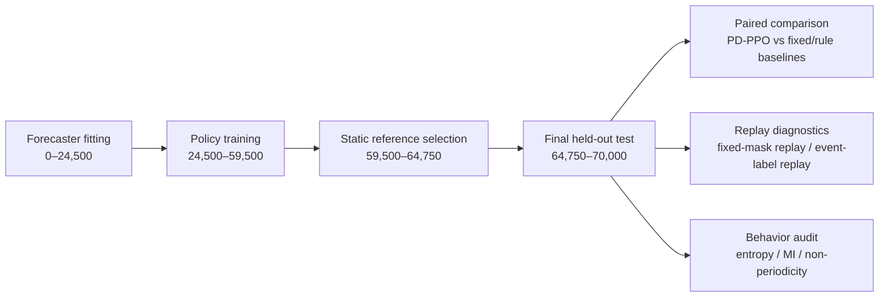

# 对 PD-PPO 稿件的审稿分析报告

## 执行摘要

这篇稿件研究的是**功率受限微气候传感调度**：在“气象骨干通道始终开启、每步只能再选一个 specialist 通道”的设定下，用一个固定的下游预测器来评价调度策略是否能改善未来预测。作者提出的 **PD-PPO** 本质上是一个带**在线可行性掩码**的 PPO 调度器，训练奖励来自**固定 forecaster 的多步预测损失**，并配套了**按时间顺序分割训练/验证/测试、固定掩码回放、行为诊断**的一整套评估协议。稿件在 24 个 held-out seeds 上报告了对固定掩码与规则基线的一致优势，并且作者主动把结论限定在“固定预测器 + 合成 benchmark + 单 specialist”这个边界内。就“当前 draft 能否支撑 ESWA 水准发表”这个问题，我的结论是：**有明确亮点，但以当前形态更像“大修后可再战”的稿件，尚未到稳妥接收线**。主要短板集中在**算法新意偏集成式、外部有效性不足、学习型强基线不够、评价过于依赖单一固定 forecaster、复现实证材料尚未真正开放**。fileciteturn0file0

从优点看，这篇稿件比很多 DRL 应用稿更克制：它没有把问题包装成泛化很强的大而全结论，反而明确承认结果仅对当前 benchmark family 成立；它还采用了**chronological split、paired seed 比较、bootstrap 区间、sign test、fixed-mask replay、行为退化排查**，这些做法明显比很多只给平均分数的 RL 应用论文更扎实。RL 评估文献长期指出，多随机种子、区间估计和稳健聚合对避免“偶然优胜”非常关键；从这个角度看，24 个独立 seeds 已经是该稿明显优于常见少 seed DRL 论文的地方。fileciteturn0file0 citeturn22academia1turn22academia3

从不足看，**真正的新意更多在“问题定义 + 评估协议”而非“RL 方法本身”**。PPO 本身是标准 on-policy policy-gradient 方法；带约束或可行性掩码的动作执行也属于常见工程化做法；active perception / adaptive sensing / POMDP 文献早已把“观察是为了未来任务，而非仅为了当前估计”作为核心思想。稿件的实质创新，更多体现在把这些元素整合到“forecast-driven sensor scheduling under hard operating rules”的具体问题里，并设计了一个可重复 replay 的基准。这个创新方向有价值，但若投 ESWA，通常还需要更强的**基线覆盖、验证广度、真实应用黏性**，才能把“有趣的 benchmark 结果”推升到“期刊级的有说服力贡献”。fileciteturn0file0 citeturn28academia1turn28academia0turn26academia0turn21academia1turn21academia3

## 创新性与核心贡献评价

稿件声称三项贡献：其一，提出面向预测质量而非 AoI / covariance 的传感调度目标；其二，提出具有硬约束可行性掩码的 PD-PPO；其三，提出结合 chronological split、fixed-mask replay、macro-normalized score、privileged diagnostic replay 与行为审计的评估协议。若按“是否首次提出一个全新的 RL 算法”来衡量，创新性偏弱；若按“是否在一个有清晰应用约束的问题中完成了**目标函数、执行约束、评估方法**的一体化设计”来衡量，创新性可评为**中等偏上**。fileciteturn0file0

更具体地说，**“用预测损失驱动传感调度”**这个问题 framing 是成立的，也确实区别于很多传统传感调度里常见的 AoI、估计误差或信息增益目标；这一点与 active perception、adaptive submodularity、POMDP 风格决策的思想是一致的。稿件在这里的价值，不在于重新发明一个理论范式，而在于把“未来预测质量才是最终目标”落实到一个可回放、可配对比较的 benchmark 上。这个方向值得肯定。fileciteturn0file0 citeturn28academia1turn28academia0turn26academia0

但 **PD-PPO 作为算法体** 的新颖度需要降调表述。PPO 是成熟方法，作者使用 masked categorical policy、value loss、entropy regularization、behaviour cloning 辅助项、event-context auxiliary head，这些都更像**任务定制训练 recipe**，还谈不上方法学层面的“核心突破”。尤其是硬约束的处理方式主要是**online feasibility masking**，这更接近合理的执行接口设计，而不是新的 constrained RL 理论。若作者继续把“方法贡献”放在太高位置，容易被审稿人质疑“新瓶装旧酒”；若把定位调成**application-driven integration with careful evaluation protocol**，会更稳。fileciteturn0file0 citeturn21academia1turn21academia3

稿件中两个 proposition 的作用也应当适度收束。Proposition 1 与 Proposition 2 更像是**设计合理性的 sufficient-condition 说明**，用于解释“何时动态 specialist allocation 可能优于固定选择”与“forecast loss 与 AoI/covariance 排序可能不一致”；它们并没有给出 PD-PPO 的算法最优性、收敛性或一般化性能保证。因此，这部分更适合被呈现为**theoretical motivation**，不宜让读者误解成“理论上证明了方法一定更优”。作者目前已有一定克制，但正文中关于 “captures approximately 92% of oracle advantage” 的表述仍然有些强，因为这个比例完全依赖于当前 benchmark、自定义归一化指标和特定 oracle diagnostic。fileciteturn0file0

如果我要给创新性一个审稿级总结，会写成这样：**问题与评估设计有新意，算法层创新有限，理论部分提供动机但不足以独立构成强理论贡献。** 这类稿子在 ESWA 可以成立，但前提是实验必须非常完整，且应用外推要更谨慎。fileciteturn0file0

## 主要 claims 与证据核查

下表按“主 claim—证据—当前可接受度”的方式逐条梳理。表中 claim 均来自摘要、引言、结果与讨论部分。fileciteturn0file0

| 主要 claim | 当前清晰度 | 可检验性 | 稿内证据 | 审稿判断 |
|---|---|---|---|---|
| 预测驱动的调度目标与 AoI / covariance 目标有本质区别 | 较清晰 | 高 | Proposition 2 + Appendix A.1 给出线性高斯反例；正文也用 event-sensitive channel 解释机制 | **基本成立**。作为概念主张足够，但仍属“存在性/机制性”证据，对广泛实用性支撑有限。 |
| PD-PPO 能在硬功率、启动、最短持续时间等规则下可执行 | 清晰 | 高 | 公式、可行性掩码定义、算法流程、动作表都较完整 | **成立**。这是实现层面强项。 |
| 在 24 个 held-out seeds 上，PD-PPO 优于 validation-selected fixed masks 和 rule-based dynamic references | 清晰 | 高 | Table 10、Figure 4、paired margins、bootstrap CI、sign test | **在当前 benchmark 内成立**。证据强于一般 DRL 应用稿。 |
| 优势来自“随状态变化的 specialist allocation”，并非隐藏 rotation 或近似固定策略 | 较清晰 | 中高 | fixed-mask replay、event-label replay、行为诊断、heatmap、entropy/MI 检查 | **大体成立**，这是稿件最有说服力的部分之一。 |
| 学到的策略使用多个 specialists，并依赖 event context | 清晰 | 中高 | Figure 5/6 热图与行为统计量 | **成立，但仍主要是描述性证据**；缺少更细的事件前后切换时序分析。 |
| learned policy 接近 oracle，捕获约 92% 的 oracle advantage | 中等 | 中 | 用 mean macro margin 0.0710 vs 0.0773 计算 | **方向成立，表述偏强**。建议补充该比例的不确定性区间，避免使用过度确定的措辞。 |
| 稿件贡献之一是 masked PPO implementation | 清晰 | 高 | 结构、损失、超参完整披露 | **作为“实现性贡献”可以接受**，作为“方法学创新”偏弱。 |
| benchmark 结果说明 RL trained from forecast loss 能把 event context 转化为有效 specialist schedules | 清晰 | 中高 | 主实验 + 行为审计 + oracle gap 全部支持 | **在 benchmark family 内成立**；外推到真实传感系统时证据不足。 |

从证据强弱的角度看，**最强的 claim** 是“在当前 benchmark 里，配上 fixed-mask replay 和行为审计后，PD-PPO 确实比固定 specialist 更好”；**最弱的 claim** 则是把这种结果上升为较强的“方法创新”或“接近 oracle 的一般能力”。审稿时建议你把评论的重心放在：**该文最好被视为一个 carefully evaluated benchmark-and-protocol paper，而不是一个强算法 paper。** 这种定位更匹配目前证据强度。fileciteturn0file0

还有一个很值得指出的细节：Table 10 中出现了“**Fixed mask replay wins, macro score 24/24**”和“**Fixed mask replay wins, step margin 24/24**”这样的表述，这与表前文字“PD-PPO improves … in all 24 seeds”明显冲突，极可能是表格文案错误或行标题写反。对于审稿人来说，这类自相矛盾会直接损伤对结果可信度的直觉判断，即便数值本身可能没问题，也应要求作者立刻修正。fileciteturn0file0

## 实验设计与可重复性

稿件实验框架的主线很清楚：先训练固定 forecaster，再用其给 PPO 提供 reward，接着用单独的 static-selection partition 选固定掩码参考，最后在 held-out final test 上统一回放比较。这个**时间顺序拆分**是稿件实验设计中最有说服力的优点之一。fileciteturn0file0

从设计合理性上看，这套流程可以有效避免把 final test 信息泄漏给固定参考选择或策略训练。与很多把验证、调参与报告混在一起的应用论文相比，这个设计明显更规范。RL 评估研究也持续强调，应使用多随机种子、区间估计和稳健统计，而不是只给单次最优曲线；作者在 seed-level paired differences、bootstrap CI 和 sign test 方面已经做得比常见做法好。fileciteturn0file0 citeturn22academia1turn22academia3

但若站在期刊审稿标准看，实验仍有几个关键缺口。

首先，**数据层面几乎完全依赖合成 benchmark**。作者说明 truth sequences 是以 Antarctic AWS 与 blowing-snow 统计为 anchor 的生成数据，并在 Appendix B 里做了 generator-family validation checks；这能说明模拟器不是随意捏造，但仍然不等于真实部署可迁移性。尤其 AntAWS 是真实观测资源，而稿件主实验并没有在真实观测或半真实 replay 上完成验证，结果仍停留在“受控模拟器中的任务证明”。对于 ESWA 这种应用取向较强的期刊，这通常不够，需要至少再补一层：**真实数据驱动的 proxy benchmark、半实物 replay，或公开实测时序上的外部验证**。fileciteturn0file0 citeturn23academia0turn22search4

其次，**baseline 还不够强**。作者比较了 validation-selected fixed masks、若干 rule-based dynamic policies，以及 privileged event-label replay diagnostic；作者自己也承认没有比较 DQN、SAC 等 RL 方法。问题在于，这个任务的最终动作空间只有 **6 个 candidate masks**，而且训练过程中作者已经会在“部分标注状态”上用固定 forecaster 对可行 masks 逐一 replay 排序，生成 behaviour-cloning 标签。既然如此，审稿人几乎一定会追问：**为什么不加一个 myopic greedy forecaster baseline、one-step lookahead baseline、contextual bandit baseline、supervised classifier baseline？** 在这样一个小动作空间场景下，简单方法很可能就能拿到大部分收益；如果没有这些强对照，就很难判断“PPO 的 sequential credit assignment”到底贡献了多少。fileciteturn0file0

再次，**评价过于绑定单一固定 forecaster**。作者使用的是一个 residual TCN 作为唯一 evaluator，并明确说明不对每个 schedule 重新训练 forecasting model。这保证了比较公平，却引入一个更深的 confounder：**策略在优化的是“对这一个 frozen evaluator 友好”的观测模式**。在多步预测文献里，TCN、TFT、iTransformer 等架构对输入结构和长短期依赖的偏好并不相同，因此只用单一 evaluator，会把调度优劣与 evaluator 偏好纠缠在一起。对于当前稿件，这个问题是最核心的外部有效性风险之一。fileciteturn0file0 citeturn21academia0turn26academia2turn26academia1

还有一些信息披露不完整的地方，适合作为 reviewer questions 明确提出。稿件虽给出了 PPO 超参数、split 长度、动作集合和部分网络设置，但下列内容在主文中仍然**未明确或不足够具体**：  
其一，**真实公开数据集名称未给出**，主实验基于生成序列而非公开 benchmark 名称；  
其二，**forecast targets 集合 Y、target weights α_j、horizon weights w_k、scale σ_j 的具体枚举未给出**；  
其三，**state estimator 的具体结构、噪声建模与更新方式未明确**；  
其四，**rule-based dynamic baselines 的确切策略定义不足**，例如 stale-channel priority 的计算细节、cycling 规则、随机策略是否受 warm-up/min-on-time 影响；  
其五，**station-side event context proxies 的生成机制、lead time、噪声水平、与真实 event labels 的相关性**没有充分报告；  
其六，**代码仓库 URL、软件版本、硬件配置、训练 wall-clock cost** 尚未给出；作者只说会在最终版本归档代码与 aggregate evidence。对于 current draft，这意味着**可复现性仍是“承诺态”，不是“可验证态”**。fileciteturn0file0

从统计上看，作者采用了 sign test 和 percentile bootstrap CI，这很好；但仍可更进一步。RL 评估研究建议报告更稳健的 aggregate metric 和 performance profiles；而 forecasting 评估研究强调自定义指标之外，还应给出可解释、可与他文横向比较的标准误差度量。当前稿件的主指标 **Mstaticnorm** 是 benchmark-specific 的自定义归一化 macro score，适合支持内部比较，却不利于外部读者理解“效果究竟大多少”。建议至少补充 **MAE / RMSE / MASE** 之类标准指标，或者给出原始非归一化 step loss 与 target-wise breakdown。fileciteturn0file0 citeturn22academia1turn22search0

### 实验缺口与建议补实验

下面这张表可以直接转化成 reviewer comments。其依据来自稿件现有实验设置以及 RL / forecasting 评估文献的通行标准。fileciteturn0file0 citeturn22academia1turn22academia3turn26academia2turn26academia1turn22search0

| 维度 | 当前状态 | 主要问题 | 建议补充实验或报告 |
|---|---|---|---|
| 数据来源 | 主实验为生成 truth sequences，真实公开数据未作为主评估集 | 外部有效性不足 | 增加至少一个真实或半真实 replay：用 AntAWS 或其他实测时序构造缺测/功率约束回放场景 |
| Forecaster robustness | 仅使用固定 TCN evaluator | 调度效果可能绑定 evaluator 偏好 | 增加 2–3 个 evaluator：如 LSTM/GRU、TFT、iTransformer；报告“同一策略在不同 evaluator 下”的一致性 |
| 学习型基线 | 无 DQN/SAC/A2C/带约束RL；无 contextual bandit | 不能说明 PPO 选择是否关键 | 增加 DQN 或 SAC（离散动作可用 DQN 类）、contextual bandit、监督分类器基线 |
| 简单强基线 | 无 myopic greedy / one-step lookahead | 小动作空间下，简单策略可能足够 | 用固定 forecaster 做“每步选当前最佳可行 mask”的 greedy baseline；若能赢过它，RL 价值会更清楚 |
| Metric interpretability | 主指标为 benchmark-specific Mstaticnorm | 外部读者难判断实际收益大小 | 补充 MAE/RMSE/MASE、target-wise error、raw loss improvement |
| 事件代理质量 | proxy 生成机制有说明，但定量质量未充分展示 | 可能存在 label leakage 或 proxy 过强 | 报告 proxy 与 event label 的 lead/lag、precision/recall、混淆矩阵、不同噪声下鲁棒性 |
| 统计报告 | 有 sign test 和 bootstrap CI | 还缺更稳健的 RL aggregate 视角 | 增加 IQM / performance profile / seed-level paired scatter；对主要比较统一 95% CI |
| 消融范围 | 有去掉 imitation / event aux / balanced loss 的消融 | 机制解释还不够闭环 | 增加“去掉 feasibility mask 不可行修复”“去掉 fixed-mask replay comparator”“去掉 event cues”影响 |
| 任务难度外推 | 只做了 event mix 改变 | 泛化边界仍窄 | 进一步改变 specialist 数量、预算、warm-up、minimum on-time、event detector 质量 |
| 可复现性 | 声称最终版本归档代码，目前未给出仓库 | 当前审稿阶段不可复核 | 在补充材料立即提供匿名仓库、配置文件、seed 列表、运行脚本、生成器参数 |

## 图表与表格评价

稿件的图表基础是好的，尤其 Figure 1–2 把 chronological split 讲清楚，Figure 4–6 也努力把“结果正确”与“行为不退化”分开呈现。问题主要不在“有没有图”，而在**主图有重复、个别图证据密度不足、审稿人最关心的对照图还缺位**。fileciteturn0file0

一个明显的结构性问题是：**Figure 5A 的 specialist-selection heatmap 与 Figure 6B 基本重复**。当前做法会让读者觉得正文版面被重复占用，尤其在期刊稿里这很伤节奏。我建议保留一次热图即可，把另一处替换成更有信息量的图，例如“事件前后若干小时的 specialist 切换概率曲线”或“oracle / learned / fixed 三者的 action agreement 随事件时间的变化”。fileciteturn0file0

另一个问题是 **Figure 3 的 author-rendered AWS 平台图**。它确实提供应用场景感，但在当前主文里更像氛围图，不是证据图。既然整篇论文最关键的问题在“传感 abstraction 与 schedulable action surface”，那比起渲染图，审稿人更需要一个**简洁的系统示意图**：列清 backbone、specialists、功率、warm-up、最短持续时间、观测流如何进入 estimator / forecaster / scheduler。Figure 3 更适合移到 appendix 或 supplementary。fileciteturn0file0

关于“还需要哪些图”，我认为至少有四类新增图很值得加。  
第一，**不同 forecaster 下的主结果对比图**，这是解决 evaluator 绑定问题最直接的证据。  
第二，**event proxy 质量图**，例如 confusion matrix、lead-time histogram、precision-recall；这里确实适合用 confusion matrix。  
第三，**event onset 对齐图**，展示在事件前、中、后 learned policy 的 specialist 切换与固定掩码/规则基线怎么不同。  
第四，**seed-level paired scatter 或 Bland–Altman 风格图**，比单纯箱线或 violin 更容易让读者看清每个 seed 的提升是否系统性存在。fileciteturn0file0 citeturn22academia1turn22search0

### 建议的图表修订清单

| 图/表 | 当前问题 | 建议修改 | 优先级 |
|---|---|---|---|
| Figure 1 + Figure 2 | 信息部分重复，都是 chronological split | 合并为一个“时间线 + 数据流”总图；节省版面 | 高 |
| Figure 3 | 更像场景渲染，证据价值有限 | 移 appendix；正文换成系统框图/信号流图 | 高 |
| Figure 4 | 结果方向清楚，但缺少更直观 paired relation | 加 paired scatter 或 slope chart；注明每点为同一 seed 的配对结果 | 中高 |
| Figure 5A 与 Figure 6B | 热图重复 | 保留一次热图；另一处换成 event-onset 对齐曲线 | 高 |
| Figure 5B | 只给 margin 分布，不足以解释动作机制 | 可改为 oracle-gap 对比图，展示 learned 与 oracle 差距 | 中 |
| Figure 6A | 行为统计量有用，但阈值标准需要更醒目 | 在图上标明 fixed-like / cycle-like 判据阈值 | 中 |
| Table 10 | 至少有一行文案疑似写反 | 全表逐行核对术语与方向，避免“wins”对象混淆 | 高 |
| Table 11 | 只有 mean ± SE，缺少 paired CI / p-value | 增加每事件类型 paired 95% CI；强调这只是 diagnostic，不是 confirmatory 主结论 | 中高 |
| Table 5 | 超参数完整但正文负担较重 | 主文保留关键超参，长表移 appendix | 中 |
| 新增图：proxy 质量 | 目前缺失 | 加 event-context auxiliary head 或 proxy-label 的 confusion matrix / PR 曲线 | 高 |

## ESWA 适配度与总体判断

如果把这篇稿件放到 ESWA 的习惯尺度下，我会给出一个**“有潜力，但当前版本偏弱，大修后可重审”**的判断。原因很明确。

一方面，它具备 ESWA 喜欢的若干元素：问题有应用背景，调度决策与预测任务结合紧密；方法流程完整，从 simulator、estimator、forecaster 到 scheduler 都串起来了；实验不是只报一个平均数，还包含 replay protocol、行为诊断、消融和局部鲁棒性。尤其是 **fixed-mask replay** 这一设计，很有“审稿人思维”——它主动堵住了“固定基线其实暗含 rotation”这种常见质疑口。单凭这一点，这篇稿件明显强于不少“换个网络再提点分”的常规应用文。fileciteturn0file0

但另一方面，ESWA 作为应用导向期刊，通常要求论文在“**应用意义、实验完整性、可复现性、对比充分性**”几个维度同时过线。当前稿件最大的问题不在结果不显著，结果其实挺整齐；最大的问题在于**证据面太窄**：  
一是只有单一合成 benchmark family；  
二是只有单一固定 evaluator；  
三是缺少强学习型和简单强基线；  
四是代码与数据还没在审稿阶段开放；  
五是多个关键细节仍停留在“文中概述”，不够达到“别人能复做”的程度。  
这些问题叠加在一起，会让审稿人产生一种合理怀疑：**现在看到的提升，是不是主要说明“在这个 carefully designed synthetic world 中，这个训练 recipe 对这个 frozen forecaster 很有效”？** 如果作者能把这个疑问压下去，稿件就会从“有趣”跃迁到“可发表”。fileciteturn0file0 citeturn22academia1turn22academia3turn26academia2turn26academia1

因此，我会把总体建议写成接近下面这种口径：

> 这篇稿件的**核心价值在问题刻画和评估协议**，不在 RL 算法体本身。当前版本已经证明：在作者定义的合成吹雪微气候 benchmark 中，forecast-driven masked PPO 可以在严格配对比较下优于固定 specialist 与简单规则策略。这个结论是可信的。  
> 但若要达到稳妥的 ESWA 录用强度，作者还需要补上三类关键证据：**更强基线、更宽 evaluator/data 泛化、更立即可审查的复现材料**。若这些缺口不补，稿件更适合被评价为“有潜力的 benchmark-style study”，尚不足以支撑强接收。

### 写作层面的高层建议

写作上，这篇稿件整体比很多初稿清楚，尤其是“主张范围”控制得不错，作者多次提醒读者结果受限于 fixed evaluator 与 generated benchmark，这一点值得保留。fileciteturn0file0

当前最需要改进的不是语法，而是**叙述层级**。正文里“方法贡献”“理论动机”“benchmark 结果”“协议贡献”有时混在一起，容易让读者误把整篇论文理解成“提出了一个新 RL 算法并有理论证明”。更好的写法是：

- 把**方法层**收束为“forecast-driven masked PPO implementation for a constrained scheduling benchmark”；
- 把**理论层**明确标成“design rationale / motivation”；
- 把**主结果层**聚焦在“固定掩码回放后仍有系统性优势”；
- 把**外推层**继续限定在 benchmark family，不要让摘要和结论过度上扬。fileciteturn0file0

如果作者能按这个方向重构叙事，再补上前述实验缺口，这篇稿件会更像一篇成熟的 ESWA 投稿；以当前形态，我会倾向于**大修**。

## 2026-07-02 路线纠偏：以算法/框架为主体，而不是 benchmark 论文

用户已明确拒绝把本文继续压低为“benchmark / protocol paper”的包装路线。前文关于外审风险和证据缺口的诊断仍有参考价值，但其主叙事建议需要被修正：当前论文不应把 benchmark 作为主要创新对象，也不应把 PD-PPO 写成“一个全新的 PPO 算法”。更合适的主线是：

> **PD-PPO 是一种预测驱动的受约束强化学习传感器系统调度框架。它用下游多步预测误差定义调度价值，并通过在线可行性掩码把功率预算、启动规则、最小开启时间等硬件运行规则嵌入可执行动作空间。**

这个路线比“benchmark 论文”更符合当前工作的技术实质。现有稿件已经具备支撑框架论文的主要部件：预测损失奖励、候选通道 mask、硬约束 feasibility masking、固定 forecast evaluator、事件上下文辅助项、行为克隆/候选策略引导、固定 mask replay、事件制度 macro score、行为诊断和消融实验。它们组合起来构成的是一个完整的智能调度系统设计，而不是单纯的数据集或 benchmark 设计。

因此，后续修改应遵守以下边界：

1. **主创新对象是预测驱动的受约束调度框架。**  
   Benchmark 是验证环境，不是论文主贡献。南极/微气象站场景应作为高功耗受限、预测目标明确、事件制度变化明显的评价场景出现，而不是把文章写成场景构造论文。

2. **PD-PPO 不应被表述为全新 PPO 算法。**  
   PPO 主体、熵正则、value loss、行为克隆辅助项都不是新理论。创新应落在“预测目标驱动 + 可执行 mask 动作空间 + 硬件规则内嵌 + replay 评估”的框架组合上。

3. **协议贡献服务于框架可信度，而不是替代方法贡献。**  
   固定 evaluator、时间分区、固定 mask replay、事件标签 diagnostic 和行为审计应被写成证明该框架没有退化为静态选择或机械轮换的证据，而不是把文章变成 protocol study。

4. **限制仍要保留，但不能主导摘要、引言和结果。**  
   合成场景、固定 evaluator、真实部署未闭环等边界放入 Discussion / Limitations。主文前半部分应正面说明 PD-PPO 解决了什么调度问题、如何解决、为什么与 AoI / covariance / fixed subset 不同。

## 面向“算法/框架论文”的补充实验优先级

为了让 PD-PPO 的算法/框架性质更稳，补实验不应只追求“再多几个 seed”或“再调一个场景”。最有价值的是证明：**优势来自预测驱动的受约束 sequential scheduling，而不是来自单一 evaluator、静态捷径、简单 greedy 或纯 reward 换名。**

### P0：最小但关键的框架支撑实验

| 实验 | 目的 | 推荐实现 | 论文作用 |
|---|---|---|---|
| Forecast-greedy / one-step lookahead baseline | 检验小动作空间下“每步选当前预测损失最低 mask”是否已足够 | 用固定 forecast evaluator 对每个时刻的可行 mask 打分，选择当前最优；遵守同一功率和运行规则 | 若 PD-PPO 胜出，可说明 sequential RL 不只是 myopic 预测打分 |
| Contextual bandit baseline | 检验是否只需要无记忆状态到 mask 的即时映射 | 同样输入状态和事件上下文，不建模长期回报，仅优化即时 forecast reward | 若 PD-PPO 胜出，可说明 PPO 的时序 credit assignment 有贡献 |
| PPO reward ablation: AoI / uncertainty / forecast | 检验“prediction-driven”是否真正必要 | 同一 PPO、同一可行 mask、同一约束，只替换 reward 为 AoI 或 covariance/uncertainty proxy | 这是支撑核心 claim 的最强对照：forecast-loss reward 比传统 freshness/uncertainty reward 更适合预测任务 |

这三类实验比直接补 SAC 更重要。当前动作空间较小且是 mask 选择问题，审稿人首先会怀疑 simple greedy 或 contextual bandit 是否已经足够；如果这些都被击败，PD-PPO 的框架价值会更清楚。

### P1：增强泛化与 evaluator 可信度

| 实验 | 目的 | 推荐实现 | 论文作用 |
|---|---|---|---|
| Forecaster sensitivity check | 排除结果只是 TCN evaluator artifact | 至少增加一个轻量 GRU/LSTM 或 iTransformer evaluator，对同一 final-test 调度轨迹重新评分 | 支撑“预测驱动框架”而非“适配某个 TCN” |
| Event proxy quality audit | 说明事件上下文不是泄漏或过强标签 | 报告 event proxy 与真实 event label 的 precision/recall、lead-time、混淆矩阵、噪声敏感性 | 支撑事件上下文输入的工程合理性 |
| Target-wise raw metric table | 增强指标可解释性 | 给出主要预测变量的 MAE/RMSE 或 raw forecast loss 改善 | 减少读者对自定义 macro score 的依赖 |

### P2：有时间再做的扩展

| 实验 | 目的 | 判断 |
|---|---|---|
| Masked DQN / Double DQN | 提供另一个学习型 RL baseline | 有价值，但优先级低于 greedy、bandit 和 reward ablation |
| A2C / REINFORCE | 提供非 PPO policy-gradient 对照 | 可选，主要用于说明 PPO 选择合理 |
| SAC | 连续控制中常见，但对小离散 mask 动作空间不自然 | 不建议作为当前补实验重点 |
| 真实或半真实 replay | 增强应用黏性 | 加分项，但不要包装成 field validation |

## 修改方向总结

后续论文修改应围绕三条贡献重组，而不是围绕 benchmark 自我限定：

1. **Prediction-driven constrained scheduling formulation.**  
   将功率预算下的传感器系统调度定义为下游多步预测价值优化问题，而不是 AoI、协方差或即时估计误差最小化问题。

2. **PD-PPO scheduler.**  
   提出一个基于 masked PPO 的可执行调度器，在候选通道 mask 集合中采样，并通过在线可行性 mask 保证功率、启动和最小开启时间等规则。

3. **Evidence protocol for adaptive scheduling.**  
   使用时间分区、固定 forecast evaluator、固定 mask replay、事件制度评分和行为审计，证明学到的策略不是静态 shortcut 或机械轮换，而是在预测相关状态下调整 specialist 通道。

由此，前文报告中“更适合作为 benchmark-style study”的结论应被视为被用户否定的旧路线。保留其风险诊断，但后续行动应转向：**用补充 baseline、reward ablation 和 evaluator sensitivity 来把 PD-PPO 固定为一个预测驱动的受约束 RL 调度框架。**
