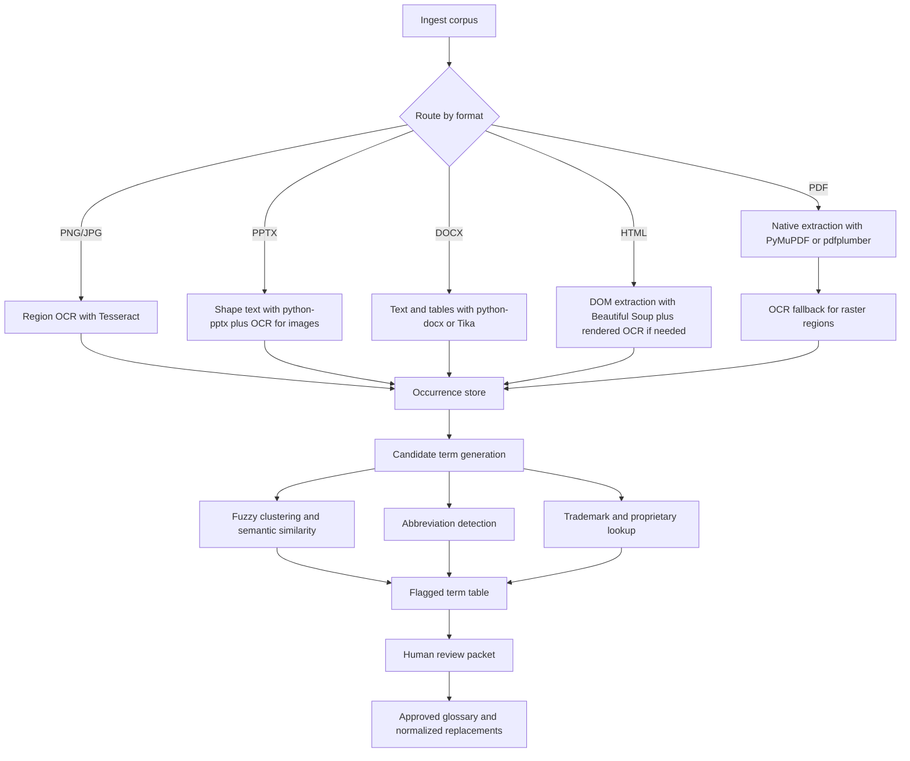

# Terminology Audit Framework for Charts Figures and Titles

## Executive Summary

For the audit you described, the most reliable approach is a **two-layer pipeline**: extract text natively wherever the source format already contains machine-readable text, and add **targeted OCR only for raster content** such as screenshot charts, scanned pages, embedded figures, or image-only slides. For PDFs, native extraction should come first because PyMuPDF and pdfplumber can return page text, word or character coordinates, and searchable locations, while OCRmyPDF and Tesseract are better used as a fallback or augmentation path for image content. Apache Tika is useful as a format-agnostic first pass because it can extract text and metadata from many file types and can be run in batch mode. For images, OCR quality improves materially when the input is deskewed, correctly oriented, and rendered at about 300 dpi or higher, and Tesseract’s page-segmentation mode should be chosen according to whether the region is a caption block, a sparse chart, or a single title line. citeturn3view0turn14view0turn6view1turn7view3turn18view0turn4view1turn19view0

Detection should then run on a **unified evidence store** that preserves every occurrence with exact snippet, file path, page or slide number, figure or caption link, extraction method, and bounding box. From that evidence store, use a combination of named-entity recognition, abbreviation detection, fuzzy string matching, similarity clustering, and trademark or registry lookups to flag five families of issues: internal lab terms, suspected AI-coined neologisms, proprietary or trademarked names, abbreviations, and inconsistent variants of the same term. spaCy’s NER can identify organizations and products, scispaCy’s AbbreviationDetector implements the Schwartz–Hearst abbreviation-definition algorithm, Sentence Transformers can score semantic similarity between candidate variants, and RapidFuzz or Python’s `difflib` can group spelling and formatting variants. For proprietary names, the safest verification path is to check official trademark sources such as WIPO’s Global Brand Database and, where relevant, the USPTO or the relevant national or regional office. citeturn6view2turn11view0turn13view1turn15view0turn15view1turn9view0turn9view1

Because the source corpus is otherwise unspecified, the output should be designed as a **reproducible audit system**, not as a one-off review. The practical deliverables are a normalized term inventory, an evidence table with all flagged occurrences, a reviewer packet with cropped screenshots or links to page locations, and a living normalization glossary for future materials. One important caution: “AI-generated neologism” is not something text analysis can prove. It should be handled as a **suspected** category based on novelty, rarity, awkward morphology, lack of external support, and overlap with established terminology, then confirmed manually. That uncertainty is methodological and should be recorded in the confidence field rather than hidden. citeturn13view1turn15view0turn9view0

The uploaded manuscript already illustrates the kinds of strings this audit would catch, including project-style method names, comparator names, abbreviations, dataset names, and shortened instrument labels such as **PD-PPO**, **Mstaticnorm**, **FC4 flux**, **AntAWS**, and **fixed-mask replay / fixed mask replay**. I treat that file only as an illustration, because your broader source set is unspecified. fileciteturn0file0

## Scope and Assumptions

The source corpus is **unspecified**. I therefore assume you want a method that works across common file types you named or implied: **PDF, PNG/JPG, PPTX, DOCX, and HTML**. I also assume the audit target is all visible text in **chart interiors, legends, axis labels, figure captions, figure titles, slide titles, document titles, and nearby heading text**. Whether to include hidden slides, speaker notes, comments, tracked changes, alt text, or metadata-only labels is **unspecified** and should be decided before implementation.

The implementation should preserve two truths at once. First, a term can belong to **more than one category** at the same time. A string may be both proprietary and inconsistently used, or both internal and abbreviation-like. Second, a finding is only as useful as its evidence. Every flagged term should therefore be linked to a location model that is format-specific: **page number and bounding box for PDF**, **slide number and shape identifier for PPTX**, **paragraph or table position for DOCX**, and **URL plus selector or XPath for HTML**. PyMuPDF, pdfplumber, and Tika all support extraction patterns that make this practical, although with different tradeoffs between fidelity and speed. citeturn3view0turn14view0turn6view1

Because your preferred output language is en-US, the glossary and normalization rules below assume an **en-US house style** for future materials unless a venue, publisher, or client style guide says otherwise. That means the glossary should explicitly lock spelling, capitalization, hyphenation, and abbreviation-expansion rules. If a journal requires en-GB spelling, you can switch the locale policy globally, but the principle stays the same: choose one style and enforce it everywhere.

## Extraction Method Across Formats

### Format-neutral extraction strategy

The most dependable workflow is:

1. **Detect file type and route to a native extractor first.**
2. **Run OCR only on content that is raster or that failed native extraction.**
3. **Merge native and OCR outputs into one occurrence table.**
4. **Attach contextual metadata**: file, page or slide, figure label, title or caption role, source block coordinates, extraction method, OCR confidence, and snippet window.

That order matters because PyMuPDF notes that plain text extraction from PDFs may not preserve reading order unless you use block or word extraction or invoke sorting, and OCRmyPDF documents several structural limitations inherited from Tesseract, including weak handling of reading order, headings, and paragraph structure. In other words, OCR is indispensable for image-heavy material, but it should not replace native extraction for born-digital files. citeturn3view0turn7view3

A good normalized **occurrence record** should contain at least these fields:

| Field | Purpose |
|---|---|
| `file_id` / `file_path` | Traceability |
| `format` | PDF, PNG/JPG, PPTX, DOCX, HTML |
| `page_or_slide` | Exact source location |
| `figure_id` | Linked caption identifier if present |
| `role` | title, caption, chart-text, legend, axis, heading, body |
| `bbox_or_selector` | Bounding box or DOM selector |
| `surface_text` | Exact extracted string |
| `snippet` | Short exact context window |
| `extractor` | pymupdf, pdfplumber, tika, tesseract, etc. |
| `ocr_confidence` | Null for native text; numeric for OCR |
| `normalized_key` | Canonical comparison key |
| `cluster_id` | Variant group identifier |
| `review_status` | open, approved, rejected, normalized |
| `confidence` | High, Medium, Low |

### PDF and image workflow

For PDFs, I recommend using **PyMuPDF** for fast page-wise text, word blocks, and location-aware search, and **pdfplumber** when you need character-level geometry, table extraction, or object-level inspection of machine-generated PDFs. PyMuPDF explicitly supports page text extraction as plain text, blocks, and words, and its `search_for()` behavior is helpful during review because it handles case-insensitive search and resolves line-end hyphenation. pdfplumber is especially useful when you need every character, line, rectangle, or image object preserved in a structured way. citeturn3view0turn14view0

For scanned or image-heavy PDFs, use **OCRmyPDF** as the PDF-aware OCR layer. Its documentation explains that it rasterizes a page for OCR and then reintegrates the OCR layer into the original PDF, preserving the document as much as possible. It also supports page rotation correction, deskewing, sidecar text output, page selection, and a “skip existing text” mode, all of which are valuable for audit pipelines. OCRmyPDF also cautions that OCR quality falls when the wrong language is chosen, and Tesseract does not auto-detect language in this workflow, so the language set must be configured deliberately. citeturn7view3turn18view0

For standalone PNG or JPG files, send the image directly to **Tesseract** using `--oem 1` for the LSTM engine and a page-segmentation mode matched to the region type. Tesseract’s own guidance says it performs best around **300 dpi**, warns that line segmentation degrades when pages are skewed, and documents different page-segmentation modes for single lines, sparse text, single words, and general pages. Those are exactly the situations you encounter when OCRing chart titles, legends, axes, and captions. citeturn4view1turn19view0

In practice, chart OCR works best when you crop regions before OCR:

- use **PSM 11** for sparse chart text such as legends, scattered labels, and axis annotations;
- use **PSM 6** for dense caption or paragraph blocks;
- use **PSM 7** for one-line titles;
- use **PSM 8** or **10** for isolated words or single characters, such as tiny tick labels. citeturn19view0

### PPTX, DOCX, and HTML workflow

For **PPTX**, extract all text-bearing shapes first. python-pptx documents that shapes with `has_text_frame=True` expose paragraph text and that shape text can be accessed directly through `_BaseShape.text` or the text frame. This captures slide titles, text boxes, labels placed as editable text, and many manually constructed figures. Any figure that is a screenshot or embedded image still needs OCR. citeturn4view2

For **DOCX**, use python-docx or Apache Tika. python-docx exposes paragraphs, headings, runs, tables, and pictures in the document model, which is enough to extract titles, figure captions stored as paragraphs, table text, and many surrounding contexts. Tika is useful here when you want one batch-capable extractor across DOCX, PPTX, PDF, and HTML, especially in early corpus inventory or metadata collection passes. citeturn20view0turn5view0turn6view1

For **HTML**, parse rendered or source text separately. Beautiful Soup’s `get_text()` is appropriate for general DOM text extraction, but for an audit you should also capture `<title>`, headings, `<figcaption>`, `alt`, `aria-label`, and SVG `<text>` nodes if charts are vector-based. For canvas-based charts, DOM extraction alone is insufficient; use rendered screenshots plus OCR or, if available, inspect the chart configuration object and underlying data labels during browser automation. Beautiful Soup gives you the baseline text layer, while Tika can provide a generic text extraction fallback for large mixed corpora. citeturn6view0turn6view1

## Detection Framework for Flagged Terms

### Internal lab jargon

Internal lab jargon usually has three signals at once: it is **frequent inside the corpus**, **poorly supported outside the corpus**, and **semantically central** to captions, figure titles, method labels, or local metric names. In practice, build a candidate list from title case, ALL CAPS, CamelCase, metric-like tokens, comparator names, dataset labels, and method strings. Then score each candidate against three lexicons: a general English lexicon, a domain lexicon relevant to the subject area, and your lab’s approved terminology list if one exists. Terms that are common internally but absent from the approved glossary and from external standard sources are prime internal-jargon candidates.

The NER layer helps because spaCy’s standard pipelines can label organizations, products, places, and numeric entities, which lets you separate likely proper nouns from local technical shorthand. Then use cluster-level frequency analysis: if a candidate appears in titles, captions, and axis labels across a small set of files but is absent from standard references, treat it as a probable internal term and send it to review. citeturn6view2turn13view1

### Suspected AI-coined neologisms

This category needs the most care. No text-only workflow can prove that a term was generated by an AI system. What you *can* do is flag **suspected** neologisms when several heuristics align: the term is rare or out-of-vocabulary, has awkward or overly compositional morphology, lacks support in official or standard references, sits semantically close to a more established phrase, and appears in high-visibility positions such as titles or captions without a strong definition.

An effective automated pattern is: generate candidate phrases, normalize them, compare them to known terminology using RapidFuzz or `difflib`, then use Sentence Transformers to find nearby established terms. If a candidate phrase is semantically near a known term yet differs lexically in an unnecessary or awkward way, flag it for human review as “suspected AI-coined” or “possible unnecessary neologism.” That category should almost always default to **Low or Medium confidence**, never High, unless the term is also clearly undocumented internal jargon. citeturn15view0turn15view1turn13view1

### Proprietary names and trademarks

Proprietary-name detection should combine **surface cues** and **registry validation**. Surface cues include ™ or ® marks, unusual capitalization, vendor-style product names, model numbers, and strings that look like official datasets or branded instruments. Automated NER also helps here because products and organizations are common outputs of entity recognition. But final classification should be based on official sources, not only on pattern matching.

WIPO’s Global Brand Database provides cross-jurisdiction trademark search over multiple participating collections and explicitly recommends that users also consult national or regional IP office registers when appropriate. The USPTO provides official access to U.S. trademark search tools. So the rule should be: if the term may be proprietary, run it through WIPO and the relevant national or regional office for the target jurisdiction, which is **unspecified** in your request. citeturn9view0turn9view1

### Abbreviations

Abbreviation auditing should be split into two tasks: **definition extraction** and **consistency enforcement**. The fastest deterministic pass is regex detection of patterns like “long form (ABBR)” and “ABBR (long form).” Then add a learned or rule-based abbreviation detector so you can recover pairs that are not perfectly punctuated. scispaCy’s AbbreviationDetector is specifically documented as implementing the Schwartz–Hearst algorithm for abbreviation-definition identification, and it exposes both abbreviations and their matched long forms in the parsed document object. citeturn11view0

Once pairs are extracted, flag four cases:

- abbreviation used before definition;
- one abbreviation mapped to multiple long forms;
- one long form mapped to multiple abbreviations without justification;
- long-form variants that differ only by case, hyphenation, spelling locale, word order, or optional words.

### Inconsistent variants of the same term

This part is the core consistency audit. Build a `normalized_key` that aggressively removes differences that often should not create separate concepts: Unicode variation, case, repeated whitespace, punctuation noise, dash variants, plural endings, and optional stopwords such as “the” in fixed names. Then group candidates in four passes.

The first pass is **deterministic normalization**: lowercase, dash normalization, spacing normalization, and light singularization. The second pass is **fuzzy matching** using RapidFuzz or `difflib.get_close_matches()` for spelling, hyphenation, and capitalization drift. The third pass is **semantic similarity** with Sentence Transformers for near-synonyms or renamed comparators. The fourth pass is **context alignment**: only merge candidates if they appear in similar roles or contexts, such as caption/title positions or the same set of neighboring nouns. This reduces false merges between genuinely different terms that happen to be lexically similar. citeturn15view0turn15view1turn13view1

A useful confidence rubric is:

| Confidence | Typical evidence |
|---|---|
| High | Exact trademark hit; deterministic abbreviation pair; exact normalized-key collision; same concept visible in multiple locations |
| Medium | Strong fuzzy or semantic match plus repeated contextual overlap |
| Low | Single occurrence, weak context, or “suspected AI-coined” signal only |

Manual review still matters. PyMuPDF’s location-aware search and annotation workflow is especially useful for generating review copies where a human can see each occurrence on the page, which is much faster than adjudicating terms from a CSV alone. citeturn3view0

## Evidence Table and Worked Example

The production output should be a **multi-label evidence table**. Each row should represent one flagged term cluster, and each cluster should expand to an occurrence subtable listing **every exact surface form**, **every location**, and **every context snippet**. That gives reviewers enough evidence to approve a canonical form or reject a false positive.

A practical top-level table looks like this:

| Flagged term | Category | Variants found | Occurrence count | Canonical form | Confidence | Reviewer action |
|---|---|---:|---:|---|---|---|
| `term_cluster_001` | internal, inconsistent | 4 | 19 | approved canonical string | High | normalize all future uses |
| `term_cluster_002` | proprietary | 2 | 7 | preserve official vendor spelling | High | verify with registry/vendor |
| `term_cluster_003` | abbreviation | 3 | 12 | one approved long form + short form | Medium | fix first-use expansion |
| `term_cluster_004` | suspected AI-coined | 1 | 2 | replace with established term | Low | manual judgment required |

The occurrence subtable should be more granular:

| Surface form | File | Location | Role | Exact context snippet | Extractor | OCR conf. |
|---|---|---|---|---|---|---:|
| `PD-PPO` | `paper.pdf` | p.1 title | title | `Prediction-Driven ...` | native |  |
| `fixed-mask replay` | `paper.pdf` | p.22 Table 6 | table/comparator | `Fixed-mask replay` | native |  |
| `fixed mask replay` | `paper.pdf` | p.30 Table 10 note | table note | `fixed mask replay` | native |  |
| `FC4 Blowing Snow Flux Sensor` | `paper.pdf` | p.24 Figure 3 | figure text | `FC4 Blowing Snow Flux Sensor` | OCR | 0.94 |

As an illustration, the uploaded PDF already contains several terms that a real run would flag for review. The table below is only an excerpt, not a complete audit of your full source set. fileciteturn0file0

| Flagged term | Category | Example occurrences and snippets | File / figure location | Suggested canonical replacement | Confidence |
|---|---|---|---|---|---|
| `PD-PPO` | internal, coined method name | `PD-PPO is a masked PPO scheduler`; title uses `Prediction-Driven Reinforcement Learning...` | title and abstract, p.1; results table, p.30 | Keep **PD-PPO** if intentional; define once in first title-adjacent use and reuse exactly | High |
| `FC4 flux` / `FC4 Blowing Snow Flux Sensor` | proprietary, inconsistent short/long variant | `Weather backbone + FC4 flux`; figure label shows full sensor name | Table 3, p.16; Figure 3, p.24; Table 7, p.25 | First use: **FC4 Blowing Snow Flux Sensor**; later: **FC4 flux sensor** | High |
| `fixed-mask replay` / `fixed mask replay` | inconsistent hyphenation | `Fixed-mask replay`; `fixed mask replay reference` | Table 6, p.22; Table 10 note and discussion, pp.30, 38 | Pick one form and keep it everywhere; for a named comparator, **fixed-mask replay** is usually cleaner | High |
| `event label replay` / `event-aware diagnostic replay` | internal, inconsistent comparator naming | `event label replay diagnostic`; `Event-aware diagnostic replay` | p.11; Table 6, p.22; discussion, p.33 | Standardize to one comparator label, such as **event-label replay diagnostic** | Medium |
| `AntAWS` | proper dataset name, proprietary/external name candidate | `AntAWS scalar variables`; figure legend shows `AntAWS anchor` | Table B.14, p.45; Figure B.7, p.46; reference entry, p.54 | Preserve official dataset spelling and cite on first use | High |

## Normalization Rules and Glossary for Future Use

The normalization glossary should be treated as a governed asset, not a side note. At minimum, every entry should store:

| Field | Meaning |
|---|---|
| Canonical term | Approved final form |
| Category | internal, proprietary, abbreviation, inconsistent, suspected AI-coined |
| Allowed variants | Acceptable short forms, if any |
| Disallowed variants | Forms to normalize away |
| First-use rule | Full form, abbreviation, or official product name requirement |
| Case policy | sentence case, title case, vendor case, all caps |
| Hyphenation policy | fixed style to enforce |
| Locale policy | en-US or venue-specific override |
| Evidence note | why the decision was made |
| Owner | who approves updates |
| Review date | governance trail |

I recommend the following house rules for future materials:

1. **One canonical term per concept.** If two strings refer to the same comparator, metric, chart title, method, or instrument, pick one canonical form and normalize all others.
2. **One first-use expansion per abbreviation.** If a chart title or caption uses an abbreviation before the body does, the expansion has to appear there.
3. **Official names keep official spelling.** Brand, dataset, software, and instrument names should match their official styling after verification.
4. **Short forms are allowed only after first mention.** For example, an instrument can be shortened after its official name has appeared once in the same document or slide deck.
5. **Compounds get one hyphenation policy.** Choose once for terms like `fixed-mask replay`, `event-label replay`, or `thermo-hygro`, then enforce it globally.
6. **Locale gets locked.** Because your requested output is en-US, future lab material should default to en-US spellings such as `behavioral`, `normalized`, and `optimization`, unless a venue requires otherwise.
7. **Category overlap is preserved.** A glossary entry can be both proprietary and inconsistent, or internal and abbreviation-based.
8. **Suspected AI-coined terms require explicit human approval.** If kept, document why; if replaced, record the canonical replacement.

For proprietary terms, WIPO explicitly notes that even its broad database should be supplemented with national or regional office registers when appropriate, so the glossary should store the **jurisdiction checked**, which is otherwise unspecified in your request. citeturn9view0

## Recommended Tooling Regex and Workflows

### Recommended stack

A strong implementation stack for this audit is:

- **PyMuPDF** for fast native PDF text extraction, block or word coordinates, and reviewer-friendly search and markup. citeturn3view0
- **pdfplumber** for character-level PDF geometry and detailed table or object inspection on machine-generated PDFs. citeturn14view0
- **OCRmyPDF** for PDF-aware OCR, page rotation, deskewing, page selection, sidecar text, and skip/redo modes. citeturn18view0
- **Tesseract** for image OCR and cropped chart regions, using `--oem 1` plus a region-specific `--psm`. citeturn4view1turn19view0
- **Apache Tika** for batch extraction of text and metadata across mixed formats and embedded content. citeturn6view1
- **python-pptx** for text-bearing shapes in slide decks. citeturn4view2
- **python-docx** for headings, paragraphs, tables, runs, and document structure in Word files. citeturn20view0turn5view0
- **Beautiful Soup** for HTML text extraction and selective DOM parsing. citeturn6view0
- **spaCy** for NER and general linguistic preprocessing. citeturn6view2
- **scispaCy AbbreviationDetector** when the material is scientific or technical and abbreviation density is high. citeturn11view0
- **Sentence Transformers** for semantic clustering of likely synonyms and renamed concepts. citeturn13view1
- **RapidFuzz** and optionally Python `difflib` for fuzzy matching and reviewer-friendly diffs. citeturn15view0turn15view1
- **WIPO Global Brand Database** plus **USPTO** and relevant local offices for proprietary-name verification. citeturn9view0turn9view1

### Regex patterns that work well in practice

Use regex as a deterministic front end, then let fuzzy or semantic clustering expand the candidate set.

```regex
# Figure / table / chart captions
(?im)^\s*(figure|fig\.|chart|exhibit|table)\s+[A-Za-z]?\d+[A-Za-z]?\s*[:.\-]

# Long form followed by abbreviation
\b(?P<long>(?:[A-Za-z][A-Za-z0-9/-]*\s+){1,8})(?P<abbr>\([A-Z][A-Z0-9-]{1,12}\))

# Abbreviation followed by long form
\b(?P<abbr>[A-Z][A-Z0-9-]{1,12})\s*\((?P<long>[^()]{3,120})\)

# ALL CAPS / acronym-like candidates
\b[A-Z]{2,}(?:-[A-Z0-9]{1,})?\b

# CamelCase / StudlyCaps candidates
\b[A-Z][a-z0-9]+(?:[A-Z][a-z0-9]+)+\b

# Product / model-like tokens
\b(?:[A-Z]{2,}[A-Za-z0-9-]*|[A-Z][a-z]+)\s*[A-Z]?\d{1,4}[A-Za-z0-9-]*\b

# Registered / trademark symbols
\b[^\s]+(?:™|®|℠)\b
```

For normalization keys, apply Unicode NFKC normalization, lowercase conversion where allowed, dash normalization, slash-to-space replacement where conceptually equivalent, collapse of repeated whitespace, and light singularization. Then compare both the original surface form and the normalized key.

### OCR settings that are usually right for charts

For chart-heavy material, the most robust defaults are: render or oversample to **300 dpi or above**, correct page orientation with `--rotate-pages`, fix slight skew with `--deskew`, and use a Tesseract segmentation mode that matches the region being read. OCRmyPDF documents `--rotate-pages`, `--deskew`, `--sidecar`, page selection, and modern `--mode skip` or `--mode redo`; Tesseract documents the LSTM engine, language selection, and the PSM modes for sparse text, single lines, and single words. citeturn18view0turn4view1turn19view0

A practical mapping looks like this:

| Region type | Suggested setting |
|---|---|
| Full scanned page | OCRmyPDF `-m skip --rotate-pages --deskew -l eng` |
| Dense caption block | Tesseract `--oem 1 --psm 6 -l eng` |
| Chart with sparse labels | Tesseract `--oem 1 --psm 11 -l eng` |
| One-line title | Tesseract `--oem 1 --psm 7 -l eng` |
| Single word / tick label | Tesseract `--oem 1 --psm 8` |
| One character / tiny symbol | Tesseract `--oem 1 --psm 10` |

If the corpus is multilingual, languages are **unspecified**, so you should explicitly set `-l eng+xxx` only after deciding what languages are present. OCRmyPDF notes that quality degrades when the wrong language is used, and Tesseract does not auto-detect it in this workflow. citeturn18view0turn4view1

### Batch workflow



A simple shell-oriented implementation can look like this:

```bash
# 1) OCR PDFs conservatively: keep native text, add OCR only where needed
mkdir -p ocr sidecar tika_out reports

find input -type f -iname '*.pdf' -print0 |
  while IFS= read -r -d '' f; do
    base="$(basename "$f")"
    ocrmypdf -m skip --rotate-pages --deskew -l eng \
      --sidecar "sidecar/${base%.pdf}.txt" \
      "$f" "ocr/$base"
  done

# 2) Batch extract text and metadata across mixed files
# Tika supports text, metadata, XHTML/HTML, JSONRecursive, and batch mode
java -jar tika-app.jar -t -i input -o tika_out

# 3) OCR standalone images with sparse chart text assumptions
find input -type f \( -iname '*.png' -o -iname '*.jpg' -o -iname '*.jpeg' \) -print0 |
  while IFS= read -r -d '' img; do
    base="$(basename "$img")"
    tesseract "$img" "reports/${base%.*}" --oem 1 --psm 11 -l eng
  done

# 4) Run your Python audit pipeline
python audit_terms.py \
  --native-dir tika_out \
  --ocr-dir sidecar \
  --out reports/term_audit.xlsx \
  --glossary reports/normalization_glossary.yml
```

That shell flow is aligned with OCRmyPDF’s documented modes, page-processing options, and sidecar support, Tesseract’s documented CLI options, and Tika’s documented batch and output modes. citeturn18view0turn4view1turn6view1

A minimal Python normalization helper for clustering can be as simple as:

```python
import re
import unicodedata

def normalized_key(text: str) -> str:
    s = unicodedata.normalize("NFKC", text)
    s = s.replace("–", "-").replace("—", "-").replace("/", " ")
    s = s.lower()
    s = re.sub(r"[^\w\s-]", "", s)
    s = re.sub(r"[-_]+", " ", s)
    s = re.sub(r"\s+", " ", s).strip()
    # light singularization for simple English plurals
    s = re.sub(r"\b([a-z0-9]+)s\b", r"\1", s)
    return s
```

That should only be your **first-pass** key. Final clustering should still use fuzzy distance and semantic similarity on top of it, because plural stripping and punctuation removal alone will miss synonyms and renamed comparators. RapidFuzz and Sentence Transformers are a strong combination for that second stage. citeturn15view0turn13view1