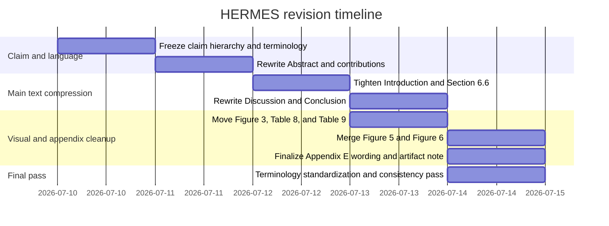

# Audit of the Current Manuscript and Actionable Revision Plan for HERMES

## Executive summary

The current manuscript is already much closer to a method-first ESWA paper than earlier versions. It now presents a clear prediction-driven scheduling problem, a masked PPO implementation over executable channel masks, a held-out 24-seed result against fixed and rule-based references, and an Appendix E that correctly demotes the context-aware extension to exploratory evidence rather than silently folding it into the main method. That is the right direction, and it should be preserved. fileciteturn0file2

The remaining problem is not experimental; it is editorial. The paper still spends too much space defending protocol choices, re-explaining claim boundaries, and repeating supporting material that has already been established once. This softens the paper’s voice and makes the manuscript feel longer than its actual method contribution requires. The largest gains now come from tightening the Abstract, Introduction, Discussion, and visual package, while keeping the main method claim strong: **this paper formulates prediction-driven constrained specialist scheduling and shows consistent gains over fixed, simple adaptive, and myopic references in the reported one-specialist setting.** fileciteturn0file2

The revision target should therefore be: **shorter, sharper, more method-first; no new experiments; no retreat into a benchmark paper; no over-apologetic wording about limits.** CA-PD-PPO and dev2 should remain in Appendix E as non-confirmatory evidence, but the main text should reference them in only two short sentences. The strongest edits are: remove the defensive “why not DQN/SAC” paragraph, compress repeated protocol explanations, merge or move redundant figures/tables, cut the duplicate heatmap, move the AWS rendering out of the main text, and replace weak terms such as “useful,” “bounded,” and “diagnostic” with stronger but honest wording. fileciteturn0file2

## Current manuscript status and what to preserve

The paper already does several important things correctly, and HERMES should **not** undo them.

The manuscript is already method-first in its opening structure. The Abstract foregrounds contextual specialist scheduling, masked PPO over executable channel masks, a fixed forecaster reward, and chronological separation of fitting, learning, fixed-schedule selection, and final testing. The Introduction clearly distinguishes a forecast objective from AoI/covariance objectives, states the fixed-backbone one-specialist setting, and lists three contributions in formulation–method–protocol order. That core structure should remain. fileciteturn0file2

The main empirical claim is already appropriately anchored on the 24-seed held-out comparison over validation-selected fixed schedules and rule-based schedules, with fixed-schedule replay and action-trace checks used as support rather than as the main evidence. Section 6.1 and Table 10 are the right center of gravity for the paper. Likewise, the forecast-greedy supplement is already correctly positioned as evidence for sequential value beyond one-step selection, while the context-alert bandit is treated as a strong claim-boundary comparator rather than hidden or omitted. Appendix E also correctly states that CA-PD-PPO and bounded dev2 did not pass the prespecified final-expansion gate and therefore remain development evidence only. These are all strengths and should be preserved. fileciteturn0file2

What should change is the way the paper talks about these strengths. It currently over-explains them, especially in Discussion, and that rhetorical over-caution weakens the perceived contribution. The paper should sound more like a paper that **establishes a specific methodological result** and less like a paper pre-responding to reviewer objections. The current weak point is style and repetition, not scientific content. fileciteturn0file2

## Section-by-section editing plan with paste-ready replacements

### Abstract

**Current issue.** The Abstract is structurally good, but the last four sentences try to do too much: held-out result, replay/trace checks, forecast-greedy boundary, context-alert bandit boundary, CA-PD-PPO status, and contributions. This makes the ending read like a mini-rebuttal rather than a crisp abstract. The final clause “The contribution is…” is also weaker than necessary. fileciteturn0file2

**Edit action.** Keep the first half mostly intact. Replace the final four sentences beginning with “Across 24 independent held-out seeds…” through “rotation effects” with the following three sentences:

> Across 24 held-out Antarctic blowing-snow seeds, PD-PPO improves both ordinary forecast loss and a regime-balanced macro score over validation-selected fixed schedules and rule-based references. Fixed-schedule replay and action-trace checks support the interpretation that the gain comes from state-dependent specialist allocation rather than hidden rotations or nearly constant choices. Supplementary references further localize the claim: PD-PPO remains better than a one-step forecast-greedy reference, while a strong handcrafted context-alert bandit remains competitive.

**Shorter, stronger alternative Abstract close.**

> The contribution is a prediction-driven constrained scheduling formulation, a feasible-mask PPO implementation, and a replay protocol that separates adaptive scheduling from fixed schedules, myopic selection, and privileged references.

**Recommended 2–3 sentence Abstract replacement if you choose to rewrite the full abstract more aggressively:**

> We formulate contextual specialist sensor scheduling as a prediction-driven constrained decision problem in which a mandatory weather backbone remains active and one specialist channel is selected under power, start-up, and minimum-duration rules. PD-PPO implements this formulation as masked PPO over executable channel masks and is trained using multi-step forecast loss from a fixed forecaster. On 24 held-out Antarctic blowing-snow seeds, it consistently improves forecast loss and a regime-balanced macro score over validation-selected fixed and rule-based references, remains better than a one-step forecast-greedy reference, and is competitive—but not stably dominant—against a strong handcrafted context-alert bandit. fileciteturn0file2

**Estimated reduction:** 70–120 words.

### Introduction and contributions

**Current issue.** The Introduction is conceptually strong, but it spends too many words on framing the evaluation protocol and too many words on claim-boundary explanation before the contributions list. The sentence “whether a learned scheduler… can produce useful specialist schedules” is also weaker than it should be. The supplementary-diagnostics paragraph is necessary, but it should be shorter and less apologetic. fileciteturn0file2

**Edit action at p. 2–5, paragraph beginning “The problem is formulated…”**  
Replace “can produce useful specialist schedules” with:

> can learn effective state-dependent specialist schedules

**Edit action at p. 4–5, paragraph beginning “Two supplementary diagnostics bound this interpretation.”**  
Replace the full paragraph with:

> Two supplementary references further locate the claim. A one-step forecast-greedy comparator does not explain the result: PD-PPO remains better across the 24-seed supplement despite the comparator’s future-loss privilege. A strong handcrafted context-alert bandit is more competitive and prevents any claim of universal superiority over context-aware heuristics. The claim of this paper is therefore specific: under the reported fixed-backbone, one-specialist operating rules, forecast-loss-trained masked PPO learns effective state-dependent specialist schedules and passes replay and behavior checks.

This keeps the claim strong while removing the apologetic “bound this interpretation” tone.

**Replace the current contributions list with the following stronger version:**

> The paper makes three contributions.  
> (1) It formulates contextual specialist scheduling as a prediction-driven constrained decision problem with a mandatory backbone, limited specialist capacity, and explicit operating rules.  
> (2) It implements this formulation with masked PPO over executable channel masks, using online feasibility masking and forecast loss from a fixed forecaster as the training signal.  
> (3) It establishes a replay-based evaluation protocol and empirical evidence showing consistent gains over validation-selected fixed schedules, rule-based schedules, and a one-step forecast-greedy reference, while also reporting a strong handcrafted context-aware stress-test baseline.

This keeps claim strength high and avoids reducing the paper to a protocol-only contribution. fileciteturn0file2

**Estimated reduction:** 120–180 words.

### Methods

**Current issue.** The Methods section is mostly sound, but it repeats the protocol story in too many places. Table 3 and Table 6 are strong. Table 4 is useful. Table 5 is useful. Table 8 is too large and duplicates multiple earlier items. The baseline-role explanation in Section 4.4 is almost right, but it can be made cleaner and more explicit. fileciteturn0file2

**Add this short baseline-taxonomy paragraph at the end of Section 4.4, after Table 6:**

> The comparison families serve different roles. Validation-selected fixed schedules test whether adaptation is needed at all. Rule-based schedules test simple non-learned adaptation under the same operating rules. The forecast-greedy reference is a myopic comparator that chooses the currently best feasible mask under the fixed forecaster and therefore probes whether the learned policy has sequential value. The context-alert bandit is a handcrafted stress-test baseline using station-side alert proxies; it is included to bound the claim against strong memoryless context rules, not to define the primary confirmatory comparison.

This paragraph is short, reviewer-facing, and resolves baseline-role ambiguity in one place.

**Cut or move.**
- Keep Table 3 in main text.
- Keep Table 4 in main text.
- Keep Table 5 in main text.
- **Move Table 8 to appendix** or compress it to a 6–8 row “Protocol summary” table. Table 8 duplicates Section 4, Table 5, and parts of Section 5.3. It is a good reproducibility table, but not necessary in the main narrative. fileciteturn0file2

**Suggested shorter caption if Table 8 stays at all:**

> Summary of the final evaluation setting and selected training hyperparameters. Items already defined in Tables 3–5 are not repeated in the main text discussion.

**Estimated reduction:** 150–250 words if Table 8 is moved; 60–100 words if merely compressed.

### Results

**Current issue.** The core result section is good, but there is some redundancy and one major duplication: Figure 5 Panel A and Figure 6 Panel B show the same specialist-use heatmap. Table 9 also duplicates information already visible in the “Fixed selections” column of Table 3. Section 6.6 is also longer than it needs to be. fileciteturn0file2

**Section 6 opening.** Replace the current meta paragraph beginning “The results are organised around the three checks…” with a one-sentence version:

> The main evidence is the held-out paired comparison against fixed and rule-based references, followed by regime decomposition, behavior checks, ablation, bounded sensitivity, and short claim-boundary references.

**Table 9.** Move Table 9 to Appendix F or delete it from the main text entirely. The fixed-schedule counts already appear in Table 3, and per-seed fixed selections are already in Appendix F. This is redundant in the main narrative. fileciteturn0file2

**Table 10.** Keep it, but shorten it by moving the following rows to Appendix E or to surrounding text:
- Event-label diagnostic improves over fixed-schedule replay, step loss
- Event-label diagnostic improves over fixed-schedule replay, macro score
- Action-trace checks support non-degenerate scheduling

The main table should foreground the confirmatory PD-PPO results; privileged references and behavior checks can be summarized in the caption or nearby text.

**Suggested replacement caption for Table 10:**

> Final held-out comparison against the validation-selected fixed reference. Positive margins mean reference loss minus PD-PPO loss. The table focuses on the confirmatory PD-PPO result; privileged references and supplementary claim-boundary comparisons are reported in the text and Appendix E.

**Section 6.6.** Replace the full subsection with the following shorter version:

> Supplementary references further localize the claim. PD-PPO remains better than the one-step forecast-greedy comparator across the 24-seed supplement, supporting sequential value beyond myopic selection. A strong handcrafted context-alert bandit remains competitive, so the paper does not claim universal superiority over context-aware heuristics. A context-aware PD-PPO extension narrows this gap on development seeds but does not pass the prespecified expansion gate and is therefore reported only in Appendix E.

This version is both stronger and shorter.

**Estimated reduction:** 220–350 words, plus figure/table space.

### Discussion

**Current issue.** This is now the single most overgrown part of the paper. Section 7.2 reads like a rebuttal. The sentence “The present paper therefore claims a useful forecast-driven constrained RL scheduling framework…” weakens the paper more than necessary. The entire DQN/SAC paragraph should be deleted. Section 7.3 is useful, but the CA-PD-PPO text there should be shorter. Section 7.4 is fine in substance but can be compressed. fileciteturn0file2

**Section 7.1.** Keep most of it. Replace the first sentence with a stronger version:

> The final experiment establishes a prediction-driven constrained scheduling result for the reported one-specialist setting.

This is stronger than “establishes a scheduling result for this benchmark.”

**Section 7.2. Rename and compress.**  
Rename the heading from **“Why the protocol is part of the contribution”** to:

> Comparator roles and claim scope

This avoids sounding defensive.

Then replace the entire section with this two-paragraph version:

> Fixed-schedule replay and event-label replay serve different purposes. Fixed-schedule replay ensures that the static reference remains truly constant on held-out windows, while the event-label reference measures the adaptive opportunity available in the setting under privileged information. Reporting both separates the strength of fixed designs from the upper bound on regime-matched specialist allocation.  
> The claim is therefore specific, not weak: PD-PPO establishes sequential forecast-driven specialist scheduling value under the reported operating rules. It remains stronger than a one-step forecast-greedy reference, while a strong handcrafted context-alert bandit shows that some instantaneous context structure can also be exploited by memoryless rules. The paper therefore claims a prediction-driven constrained RL scheduling framework, not universal dominance over every context-aware heuristic.

**Delete this entire paragraph from current Section 7.2:**

> The evaluation does not include comparisons against other learned RL methods such as DQN or SAC…

Delete it completely. It is rebuttal-like, long, and weakens the manuscript. If needed, address this once in the cover letter instead of the paper. fileciteturn0file2

**Section 7.3.** Keep the auxiliary-signals paragraph, but replace the second paragraph with:

> A context-aware PD-PPO extension improves the comparison against the context-alert bandit on development seeds, but neither this extension nor the bounded dev2 variants pass the prespecified expansion gate for fresh confirmatory testing. They are therefore reported only as exploratory appendix evidence and do not redefine the primary scheduler.

**Section 7.4.** Compress the three current limitation paragraphs into two paragraphs:
- one on fixed forecaster / no joint retraining,
- one on simulation scope / bounded mixture shifts / transfer limits.

**Estimated reduction:** 350–550 words.

### Conclusion

**Current issue.** The Conclusion still ends with too much boundary language and too much future-work enumeration. It should close on the method claim first, then one limit sentence, then stop. The bandit should appear once, not dominate the ending. fileciteturn0file2

**Replace the full Conclusion with this two-paragraph version:**

> This paper formulates specialist sensor scheduling under power, start-up, and minimum-duration constraints as a prediction-driven constrained sequential decision problem. PD-PPO implements this formulation with masked policy optimization over executable channel masks and, in the reported fixed-backbone one-specialist setting, consistently improves ordinary forecast loss and a regime-balanced macro score over validation-selected fixed schedules, rule-based policies, and a one-step forecast-greedy reference. Fixed-schedule replay and action-trace checks support the interpretation that the gain comes from state-dependent specialist allocation rather than hidden rotations or nearly constant choices.  
> A strong handcrafted context-alert bandit remains competitive, so the claim is not universal superiority over all context-aware heuristics. The paper instead establishes that forecast-loss-trained constrained RL can produce effective specialist schedules under a common frozen forecaster and strict replay protocol, and that this value is measurable in the reported held-out setting.

If you want a one-paragraph ending instead, use this final paragraph exactly:

> This paper establishes prediction-driven constrained specialist scheduling as a concrete method problem rather than a benchmark-only exercise. In the reported fixed-backbone one-specialist setting, masked PPO over executable channel masks consistently improves over fixed, rule-based, and myopic references, while a strong handcrafted context-alert bandit provides a clear claim boundary rather than a hidden omission. The result is therefore specific but methodologically strong: forecast-loss-trained constrained RL can generate effective state-dependent specialist schedules under hard operating rules and a common replay-based evaluation protocol. fileciteturn0file2

**Estimated reduction:** 120–180 words.

## Figures, tables, and appendix placement

The visual package can be tightened substantially without harming the claim.

| Item | Current issue | Action | Exact recommendation |
|---|---|---|---|
| Figure 1 | Good main schematic | Keep | Keep as the main method figure |
| Figure 2 | Largely overlaps Figure 1 chronology story | Move to appendix **or** merge with Figure 1 | Preferred: merge into Figure 1 caption and remove Figure 2 from main |
| Figure 3 | Pushes paper toward “application/benchmark” framing | Move to appendix | Keep one sentence in Section 5.1; move rendering to appendix as physical motivation only |
| Figure 4 | Core result figure | Keep | No major change |
| Figure 5 | Useful, but Panel B can be merged elsewhere | Keep Panel A; consider panel simplification | Use as the main regime-mechanism figure |
| Figure 6 | Duplicates Figure 5 Panel A via identical heatmap | Remove Panel B and keep scalar checks only, or move whole figure to appendix | Preferred: merge Figure 6 Panel A into Figure 5 as new Panel B; delete duplicate heatmap |
| Table 3 | Strong | Keep | No major change |
| Table 5 | Useful hyperparameters | Keep | No major change |
| Table 8 | Duplicative | Move to appendix or compress heavily | Preferred: appendix |
| Table 9 | Duplicative with Table 3 + Appendix F | Move to appendix or delete | Preferred: delete from main |
| Table 10 | Too dense | Keep but trim some rows | Main confirmatory metrics only |
| Table 11 | Useful regime decomposition | Keep | No major change |
| Table 12 | Useful ablation | Keep | Maybe trim explanatory caption slightly |
| Table 13 | Fine | Keep if space allows | Otherwise move to appendix if page pressure becomes severe |
| Table E.15 | Right place | Keep in appendix | This is exactly where it should stay |

**Suggested merged figure plan.**

**New Figure 1 caption**
> Prediction-driven scheduling pipeline and chronological split. The forecaster is fitted once, frozen, and then used for both policy reward and held-out evaluation. Forecaster fitting, policy learning, fixed-schedule selection, and final testing are separated chronologically before any reported comparison.

**New Figure 5 caption if Figure 6 is merged into it**
> Event-conditioned specialist allocation and action-trace audit in the final 24-seed evaluation. Panel A shows mean specialist selection frequency by event type. Panel B shows the seed distributions of action entropy, event–action mutual information, and event-conditioned specialist separation. Together they support event-dependent specialist allocation rather than a fixed or periodic specialist trace.

**Appendix caption for moved Figure 3**
> Author-rendered AWS platform motivating the reported sensing abstraction. The main text uses the logical channel table rather than the rendering as the experimental definition.

These changes will make the paper feel less like a benchmark article and more like a concise method paper. fileciteturn0file2

## Exact handling of CA-PD-PPO and dev2

This is the piece that most needs precise wording. The current manuscript already places CA-PD-PPO and dev2 in Appendix E and states that the predeclared final-expansion gate was not met. That is the correct scientific decision and should remain unchanged. The main text should mention this once in Results and once in Discussion, both briefly. Appendix E should carry the details. fileciteturn0file2

### Main-text sentence to paste into Results

Paste into Section 6.6:

> A context-aware PD-PPO extension substantially narrows the gap to the context-alert bandit on development seeds, but neither this extension nor a bounded dev2 wave of clean variants passes the prespecified expansion gate for fresh confirmatory testing. These runs are therefore reported only in Appendix E and do not redefine the primary method.

### Main-text sentence to paste into Discussion

Paste into Section 7.3:

> The context-aware extension is therefore evidence of a clean improvement direction, not confirmatory evidence for replacing the primary scheduler.

### Full Appendix E paragraph to paste

> CA-PD-PPO augments the primary PD-PPO observation with online alert/context features and a small context encoder while keeping the forecast-loss reward, masked executable action space, and final evaluation protocol unchanged. On development seeds 201–224, CA-PD-PPO improved the comparison against the context-alert bandit to 13/24 macro wins with a mean macro margin of 0.008257, but it did not meet the prespecified expansion gate of mean macro margin > 0.010 and at least 15/24 wins. A bounded dev2 wave of clean variants also failed to meet this gate (ctx128: 14/24, 0.004083; gated: 13/24, 0.002763; gated_ctx128: 13/24, 0.006706; nsteps2048: 10/24, 0.002962). These runs are therefore reported as exploratory development evidence only and were not advanced to fresh final evaluation.

### Appendix E table template to paste

| Variant | Seed set | Macro wins vs context-alert bandit | Mean macro margin | Status |
|---|---|---:|---:|---|
| CA-PD-PPO | 201–224 | 13/24 | 0.008257 | Did not pass expansion gate |
| ctx128 | 201–224 | 14/24 | 0.004083 | Did not pass expansion gate |
| gated | 201–224 | 13/24 | 0.002763 | Did not pass expansion gate |
| gated\_ctx128 | 201–224 | 13/24 | 0.006706 | Did not pass expansion gate |
| nsteps2048 | 201–224 | 10/24 | 0.002962 | Did not pass expansion gate |

**Recommended Appendix E footnote**
> Positive macro margins mean context-alert bandit loss minus PD-PPO-variant loss. No fresh confirmatory final evaluation was launched because the prespecified gate was not met.

### Artifact note to include in Appendix E or Data Availability

Add this exact note after the Appendix E table:

> Development artifacts are archived at: `reports/aggregate/contextaware_pdppo_dev_20260703capdppo/contextaware_pdppo_dev_summary.md`, `reports/aggregate/contextaware_pdppo_dev_20260703capdppo/contextaware_pdppo_dev_summary.csv`, `reports/aggregate/contextaware_pdppo_dev_20260703capdppo/contextaware_pdppo_dev_summary.json`, `reports/aggregate/contextaware_pdppo_dev_20260703capdppo/contextaware_pdppo_dev_seed_metrics.csv`, and `reports/aggregate/ca_pdppo_bounded_dev2_20260703capdppodev2/variant_summary.md`. If matching CSV/JSON summaries for the bounded dev2 wave are archived, list them here; otherwise do not invent file paths.

This keeps CA-PD-PPO honest, visible, and appropriately minimized in the main narrative. The current Appendix E already supports this positioning and should remain appendix-only. fileciteturn0file2

## Terminology standardization and phrase replacements

A lot of perceived weakness in the current draft comes from vocabulary rather than evidence. Standardizing the following terms will materially improve the paper.

| Weak / over-defensive phrase | Replace with | Where to apply |
|---|---|---|
| useful | effective / state-dependent / measurable / competitive | Intro, Discussion, Conclusion |
| bounded claim / claim must stay bounded | specific claim / scoped claim / claim is restricted to the reported setting | Discussion, Abstract |
| diagnostic schedule | comparator / reference / privileged reference / stress-test baseline | Intro, Results, Discussion |
| challenge baseline | strong handcrafted stress-test baseline | Results, Discussion |
| not promoted to the main method | not adopted as the primary scheduler because it did not pass the prespecified expansion gate | Abstract, Appendix E |
| narrow construction | controlled setting / scoped setting | Intro, Setup |
| benchmark result | result in the reported setting / held-out result in the controlled setting | Intro, Discussion |
| useful forecast-driven constrained RL scheduling framework | prediction-driven constrained RL scheduling framework | Discussion |
| improves competitiveness | substantially narrows the gap / improves the comparison | Appendix E, Discussion |
| bound this interpretation | further localize the claim | Intro, Results |
| not a failure of the fixed-backbone result | does not alter the confirmatory fixed-backbone result | Results |

**Highest-priority exact replacements**

Replace:
> useful forecast-driven constrained RL scheduling framework

with:
> prediction-driven constrained RL scheduling framework

Replace:
> The supplementary diagnostics show why the claim must stay bounded.

with:
> Supplementary references further localize the claim.

Replace:
> diagnostic challenge baseline

with:
> handcrafted stress-test baseline

Replace:
> a context-aware PD-PPO extension improves competitiveness

with:
> a context-aware PD-PPO extension substantially narrows the gap

These phrase changes preserve honesty without sacrificing contribution strength. fileciteturn0file2

## Prioritized checklist, length control, and cover-letter text

### Prioritized edit checklist

| Priority | Edit | Why | Estimated reduction |
|---|---|---|---:|
| Must-do | Delete the DQN/SAC defensive paragraph in Discussion 7.2 | Reads like rebuttal; weakens paper | 170–220 words |
| Must-do | Compress Discussion 7.2 into two short paragraphs | Current wording is over-defensive | 150–220 words |
| Must-do | Replace “useful/bounded/diagnostic” vocabulary | Raises claim strength without overreach | 0 words |
| Must-do | Shorten Section 6.6 to 3–4 sentences and point to Appendix E | Stops CA-PD-PPO from occupying too much space | 120–180 words |
| Must-do | Move Figure 3 to appendix | Reduces benchmark/application feel | ~0.5 page |
| Must-do | Remove duplicated heatmap by merging Figure 5 and Figure 6 | Cleaner visual story | ~0.5 page |
| Must-do | Move Table 9 out of main text | Duplicates Table 3 + Appendix F | ~0.4 page |
| Must-do | Move or compress Table 8 | Duplicates method details already given | ~0.5–0.8 page |
| Should-do | Trim Abstract ending and rewrite contributions | Stronger opening | 70–120 words |
| Should-do | Compress Introduction supplementary-diagnostics paragraph | Better tone | 80–120 words |
| Should-do | Trim Conclusion to 1–2 paragraphs | Stronger landing | 120–180 words |
| Should-do | Shorten Section 7.4 limitations | Reduces over-explanation | 120–180 words |
| Optional | Shorten theory remarks after Propositions 1 and 2 | Good if page pressure remains | 150–250 words |
| Optional | Move Table 13 to appendix if layout still long | Only if space pressure remains | ~0.5 page |

**Expected total reduction without touching experiments:** roughly **900–1,500 words** and **2–3 pages of layout**.

### Reviewer-facing cover-letter paragraph

Use this in the cover letter, not in the manuscript:

> The revised manuscript does not add further experiments because the strongest clean extension, CA-PD-PPO, and a bounded dev2 wave were already evaluated under prespecified expansion gates and did not qualify for fresh confirmatory final testing. We therefore stopped additional tuning to avoid post-hoc optimization on the same development seeds and report those runs only as exploratory appendix evidence. The confirmatory contribution remains the held-out 24-seed evaluation of the primary PD-PPO method against fixed, rule-based, myopic, and stress-test comparators under a common replay protocol. fileciteturn0file2

### Final recommendation to HERMES

Revise for **compression, tone, and hierarchy**, not for more content. Keep the main claim strong: the paper establishes **prediction-driven constrained specialist scheduling** with confirmed gains over fixed, simple adaptive, and myopic references in the reported one-specialist setting. Keep bandit and CA-PD-PPO visible, but short. Move redundant visual and setup material out of the main text. Delete rebuttal-like prose. Do not let the paper drift back into either “RL beats everything” or “this is mainly a benchmark.” The current evidence is already sufficient if the prose is tightened. fileciteturn0file2

