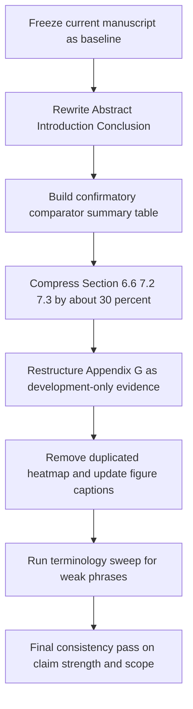

# PD-PPO 当前稿件二次同行评审与可交付修改指令

## Executive summary

当前稿件已经**基本完成从“实验性RL稿”向“方法框架稿”**的转向：摘要和引言明确把工作定义为 **prediction-driven constrained scheduling formulation + feasible-mask PPO implementation + replay-based evaluation protocol**，并且已经把 **forecast-greedy** 与 **context-alert bandit** 放进“claim boundary”而非“主胜利叙事”中，附录也已经把 **CA-PD-PPO / dev2** 压到 development-only evidence 的位置。换言之，**当前版本已经可以作为 ESWA 方向的可送审稿基础**，而且不会自然滑向“benchmark paper”。fileciteturn0file0

但它还存在三个会直接影响审稿印象的问题。第一，**方法主张仍可再抬高一档**：目前 Abstract、Discussion、Conclusion 中仍有一些偏保守或偏解释性的措辞，例如 “supplementary references further localize the claim” 和类似 “effective / measured in the reported held-out setting” 的表述，会削弱“方法构型贡献”的压强。第二，**bandit 相关文字略多**，尤其在 6.6、7.2、7.3、Conclusion 之间多次重复“为什么不做更强 claim”，容易让主线被“边界解释”稀释。第三，**结果组织仍可再收束**：主文需要一张真正的“confirmatory comparator summary table”，同时把 CA-PD-PPO 与 dev2 彻底固定为 appendix development table；此外当前主文里仍有行为图重复（event heatmap 在主结果和行为诊断处重复出现），这会拉长篇幅且削弱信息密度。fileciteturn0file0

因此，我的总体判断是：

| 项目 | 结论 |
|---|---|
| ESWA 可接受性 | **可送审，但建议先做一次有针对性的中等强度 revision** |
| 是否已避免 benchmark 化 | **是，已基本避免** |
| 是否应继续弱化 claim | **否，不应再弱化** |
| 最高优先级修改 | **抬高方法措辞、压缩 bandit 解释、分离 confirmatory 与 development 结果** |

## Current manuscript assessment

当前稿件最正确的地方，是它已经把主张稳定落在 **prediction-driven constrained scheduling framework** 上，而不是“PPO 赢所有 heuristic”。摘要中已经把论文贡献写成“prediction-driven constrained scheduling formulation, feasible-mask PPO implementation, and replay protocol”，并且同时保留了 **forecast-greedy 更弱** 与 **context-alert bandit 仍 competitive** 这两个边界条件；Introduction 也把三条贡献按 formulation → implementation → protocol/evidence 的顺序给出来；Discussion 进一步明确写成 “prediction-driven constrained RL scheduling framework, not universal dominance over every context-aware heuristic”；Appendix G 还把 CA-PD-PPO 和 bounded dev2 variants 明确限定为 development evidence only。这个总体骨架是对的，而且已经明显优于更早那种容易被误解为“benchmark + RL superiority”的写法。fileciteturn0file0

但是，当前稿件也确实存在“**过度收敛**”的问题。最典型的是 Section 6.6、Section 7.2、Section 7.3 与 Conclusion 中对 claim boundary 的反复解释：读者已经能从 6.6 和 Appendix G 理解 bandit 的地位，Discussion 再多次解释会降低方法锋芒。另一个问题是当前 Conclusion 虽然内容正确，但最后一句仍然偏保守，落点更像“我们在 reported setting 中可测到价值”，而不是“我们建立了一个 prediction-driven constrained sequential scheduling framework，并证明其 sequential value beyond myopic choice”。这会让方法 strength 低于你目前实验事实上允许的强度。fileciteturn0file0

简化地说，当前版本不是“claim 过强”，而是“**方法 claim 正确但语义压强不够，边界解释占比略高**”。这意味着接下来的修改目标不是继续收敛，而是：

> **保持 honesty，提升方法句子的主体性；保留 bandit，但压缩 bandit 篇幅；把 confirmatory 与 development 分层得更清楚。**

## Paste-ready textual revisions

下面给出可直接交付 HERMES 粘贴替换的文字。原则是：**加强方法强度，不做不实扩张，不改成 benchmark 叙事。**

### Abstract 全段替换稿

建议用下面这一整段替换当前 Abstract：

> Remote sensing stations often contain more measurement channels than can be powered simultaneously. This paper formulates contextual specialist scheduling as a prediction-driven constrained decision problem: a low-power weather backbone remains active while one specialist channel is selected under power, startup, and minimum-duration operating rules. PD-PPO implements this formulation as masked PPO over executable channel masks and uses downstream multi-step forecast loss from a fixed forecaster as the training signal. The policy observes estimator state, uncertainty, channel freshness, previous selection, budget state, and event cues, and samples only feasible masks. The evaluation uses a controlled Antarctic blowing-snow setting because particle, flux, and thermal regimes favor different specialists under the same power budget. Across 24 held-out seeds, PD-PPO improves ordinary forecast loss and a regime-balanced macro score over validation-selected fixed schedules and rule-based references. Fixed-schedule replay and action-trace checks support the interpretation that the gain comes from state-dependent specialist allocation rather than hidden rotation or near-constant choices. Additional references delimit the scope of superiority claims: PD-PPO remains stronger than a one-step forecast-greedy comparator, supporting sequential value beyond myopic mask choice, while a handcrafted context-alert stress-test reference remains competitive. The paper contributes a prediction-driven constrained scheduling formulation, a feasible-mask PPO implementation, and a replay protocol that distinguishes adaptive scheduling from fixed, myopic, and privileged references.

这版 Abstract 的好处是三点。第一，它把 **formulation** 放在句首位置，不再让 benchmark 先出现。第二，它把 **forecast-greedy** 定义成 sequential value 证据，而不只是“supplementary reference”。第三，它对 **bandit** 的表述是 “delimit the scope of superiority claims”，不是“我们失败了”，也不是“局部 useful only”。这更强，也更诚实。当前稿件摘要已经接近这一方向，但还没有把 sequential value 的方法含义提得这么明确。fileciteturn0file0

### Introduction 收束段与贡献列表替换稿

建议将 Introduction 末尾、即当前 “In the reported benchmark ... The paper makes three contributions.” 这一段替换为下面文本：

> In the reported one-specialist benchmark, PD-PPO improves ordinary forecast loss and the validation-frozen macro score over validation-selected fixed schedules and rule-based schedules across 24 held-out seeds. Fixed-schedule replay and action-trace analysis attribute the gain to event-dependent specialist allocation rather than constant or cyclic behavior. Additional claim-boundary references sharpen the interpretation: the result is not explained by one-step forecast-greedy selection, while a strong handcrafted context-alert rule remains a competitive stress-test baseline.  
>   
> The paper makes three contributions.  
> 1. It formulates contextual specialist scheduling as a prediction-driven constrained sequential decision problem with a mandatory backbone, limited specialist capacity, and explicit operating rules.  
> 2. It implements this formulation with masked PPO over executable channel masks, using online feasibility masking and forecast loss from a fixed forecaster as the training signal.  
> 3. It establishes a replay-based evaluation protocol and confirmatory evidence showing gains over validation-selected fixed schedules and rule-based schedules, while using one-step forecast-greedy, handcrafted context-alert, and privileged event-label references to delimit sequential value and claim scope.

这里最关键的不是文字润色，而是**重新界定 Contribution 3 的角色**。当前版本的第三条虽然已经不错，但还偏 protocol-only。上面这个版本明确说明：Contribution 3 不是“我有个 protocol”，而是“**我用这个 protocol 建立了 confirmatory evidence，并通过 claim-boundary references 解释 sequential value 与 scope**”。这样方法贡献会更强，而且不会变成 benchmark 论文。fileciteturn0file0

### Conclusion 全段替换稿

建议用下面两段替换当前 Conclusion：

> This paper formulates specialist sensor scheduling under power, startup, and minimum-duration constraints as a prediction-driven constrained sequential decision problem and implements it with masked PPO over executable channel masks. In the reported fixed-backbone, one-specialist setting, PD-PPO consistently improves ordinary forecast loss and a regime-balanced macro score over validation-selected fixed schedules and rule-based references across 24 held-out seeds. Constant fixed-schedule replay and action-trace checks support the interpretation that the gain comes from state-dependent specialist allocation rather than hidden rotations or nearly constant choices.  
>   
> The result supports a method claim, not a benchmark-only claim. PD-PPO remains stronger than a one-step forecast-greedy comparator, which shows that the learned policy captures sequential value beyond myopic mask choice. A strong handcrafted context-alert stress-test reference remains competitive, so the manuscript does not claim dominance over the full class of context-aware heuristics. Instead, it establishes that forecast-loss-trained constrained RL can learn effective specialist schedules under hard operating rules and a common fixed-forecaster evaluation protocol.

这版 Conclusion 相比当前稿件的改进点有两个。第一，首句直接把论文定成 **method claim**，避免“this paper studied sensor scheduling...”那种平铺直叙的应用口吻。第二，第二段把 **forecast-greedy** 放到更高的解释地位——它不是一个附带 baseline，而是 sequential non-myopic value 的证据。当前稿件 Conclusion 已经相当接近这个方向，但结尾落点仍然偏弱，可以进一步抬高。fileciteturn0file0

### 建议直接替换的弱词与短语

| 当前倾向性措辞 | 建议替换 | 理由 |
|---|---|---|
| useful forecast-driven constrained RL scheduling framework | prediction-driven constrained RL scheduling framework | “useful” 过弱，缺乏方法压强 |
| supplementary references further localize the claim | additional references delimit the scope of superiority claims | 更清晰，也更像方法论文语言 |
| diagnostic（泛用） | stress-test reference / claim-boundary reference / privileged reference | “diagnostic” 在文中出现过多，削弱核心证据层级 |
| specific to this setting and consistent | established under the reported one-specialist protocol | 更简洁，更方法化 |
| do not redefine the primary method | are reported as development-only evidence | 更准确，少一点防御语气 |

这些词汇替换的目标不是做语言美化，而是**去掉不必要的防御感**。当前稿件已经诚实，不需要再用过多“降温词”来强调边界。fileciteturn0file0

## Results and appendix restructuring

当前主文最大的结构改进空间，是把“confirmatory evidence”和“development evidence”完全拆开，并用**两张功能明确的总表**来承接。

### 主文结果结构建议

建议把 Results 重组为：

| 建议主文结构 | 保留/压缩建议 | 理由 |
|---|---|---|
| Held-out confirmatory comparisons | 保留并前置主 summary table | 这是主 claim 的核心 |
| Event-type mechanism and privileged reference | 保留 Table 11 + Figure 5 | 用来解释为什么 dynamic specialist scheduling 有值 |
| Action-trace diagnostics | 保留，但删去重复 heatmap | 当前 Figure 5 与 Figure 6 存在重复信息 |
| Ablation and bounded robustness | 保留 Table 12；将 Table 13 视篇幅可转 appendix | 重要，但不是 claim 核心 |
| Scope-delimiting references | 保留为一小节 + 一张 summary table，不再展开长解释 | 保留 bandit，压缩 bandit 篇幅 |

当前稿件已经在 Section 6.6 把 forecast-greedy / context-alert / CA-PD-PPO 放到 supplementary framework references，并且 Appendix G 已有 development-only 表。这个方向正确；建议再进一步，把主文 6.6 压成**一个短段落 + 一张总表**，所有 development 细节都留在 Appendix G。fileciteturn0file0

### 主文总表建议

建议新增或重做一张主文表，名称与 caption 可直接写成：

**Table X. Held-out comparator summary for the reported PD-PPO framework.**  
*Positive margins mean comparator loss minus PD-PPO loss, so positive values favor PD-PPO. Rows 1–3 are the confirmatory comparisons supporting the main claim. Rows 4–5 delimit sequential value and claim scope without redefining the primary confirmatory result. Confidence intervals are bootstrap intervals over seed-level paired margins.*

建议列如下：

| Comparator family | Role | Seed set | Macro wins | Mean macro margin | 95% CI | Step wins |
|---|---|---:|---:|---:|---|---:|
| Validation-selected fixed schedule / replayed constant schedule | Primary confirmatory comparator | 117–140 | 24/24 | populate from final aggregate | populate | 24/24 |
| Best rule-based schedule family | Primary confirmatory comparator | 117–140 | 24/24 | populate from final aggregate | populate | populate |
| One-step forecast-greedy | Sequential-value boundary reference | 117–140 | 24/24 | populate from supplement artifact | populate | populate |
| Context-alert bandit | Handcrafted context-aware stress-test | 117–140 | populate from supplement artifact | populate | populate | populate |

这张表的目的非常明确：**把所有“我们为什么强”与“我们为什么不 overclaim”一次性说明白**。当前稿件 Table 7/10、6.6、Appendix G 分散承载了这些内容，但读者需要来回跳。收成一张总表会显著提升读者抓主线的速度。fileciteturn0file0

### Appendix development table 建议

Appendix G 保留，并将当前 G.12 扩展为一张 development-only total table，caption 直接建议写成：

**Table G.X. Development-only context-aware PD-PPO variants against the context-alert bandit.**  
*Positive margins mean bandit loss minus variant loss, so positive values favor the variant. These runs were used only to assess whether a clean context-aware extension justified a fresh confirmatory final launch. None passed the prespecified expansion gate, so the table documents a promising improvement direction rather than confirmatory superiority.*

表头建议如下：

| Variant | Seed set | Macro wins vs bandit | Mean macro margin | 95% CI | Step wins vs bandit | Gate decision |
|---|---|---:|---:|---|---:|---|
| Original clean PD-PPO | 201–224 | populate | populate | populate | populate | not passed |
| Feature-parity PD-PPO | 201–224 | populate | populate | populate | populate | not passed |
| CA-PD-PPO | 201–224 | populate | populate | populate | populate | not passed |
| ctx128 | 201–224 | populate | populate | populate | populate | not passed |
| gated | 201–224 | populate | populate | populate | populate | not passed |
| gated_ctx128 | 201–224 | populate | populate | populate | populate | not passed |
| nsteps2048 | 201–224 | populate | populate | populate | populate | not passed |

这个表会把当前 Appendix G.12 中的 development evidence 再清楚一层：**不是没有改进，而是没有达到 frozen final launch gate**。当前稿件已经这样说了，但表格层级还不够“审稿友好”。fileciteturn0file0

### 图表主文与附录分工建议

| Figure | 建议去向 | 修改建议 |
|---|---|---|
| Figure 1 协议总览 | 主文保留 | caption 更强调 prediction-driven constrained loop |
| Figure 2 主 held-out paired margins | 主文保留 | 作为主证据图，不必扩展 |
| Figure 3 / Figure 5 specialist-use heatmap | 主文保留一个即可 | 保留 event-mechanism heatmap；不要在行为节重复 |
| Figure 4 / Figure 6 behavior diagnostics | 主文保留纯 scalar diagnostics | 删除重复 heatmap panel，只留 entropy / MI / separation |
| Sensitivity plot / extra ablation distribution | 附录 | 避免正文变长 |

当前稿件的一个明显篇幅问题，是**行为图重复展示 specialist heatmap**。Figure 5 已经很好地解释了 event-dependent specialist use；Figure 6 Panel B 再重复一次，会浪费正文空间并弱化行为诊断的独立功能。这个冗余建议删除。fileciteturn0file0

## HERMES implementation checklist

下面这份 checklist 可以直接交给 HERMES 执行。

### 必做修改清单

| 任务 | 目标文件/章节 | 要求 |
|---|---|---|
| 重写 Abstract | Abstract | 用上面的整段替换稿；抬高 formulation 与 sequential value 的表达 |
| 重写 Introduction 末端贡献块 | Introduction 最后两段 | 用上面的 paste-ready 版本替换；保留三条贡献但强化第 3 条 |
| 重写 Conclusion | Conclusion | 用上面的两段替换稿；方法落点更强，边界更简洁 |
| 压缩 Section 6.6 | Results 6.6 | 压缩到约当前长度的 60%–70%；保留 forecast-greedy 与 bandit，development 只一句指向 Appendix G |
| 压缩 Section 7.2 | Discussion 7.2 | 删除重复的 comparator role 解释与冗余防御语气 |
| 压缩 Section 7.3 | Discussion 7.3 | 保留 auxiliary role + CA-PD-PPO 一句边界说明，不再展开 dev2 解释 |
| 新增主文总表 | Results 主文 | 按上文 Table X 结构插入 |
| 重做 Appendix G 表 | Appendix G | 改成 development-only table，明确 gate not passed |
| 删除重复 heatmap | 行为图部分 | Figure 6 Panel B 删掉或移 appendix |

### 应删减约三成的部分

最应该压缩的是三块：**Section 6.6、Section 7.2、Section 7.3**。当前这些地方都已经是正确方向，但文字略多，且存在“为 bandit 解释 bandit”的风险。压缩目标不是删掉 bandit，而是让 bandit 从“叙事中心”退回“stress-test comparator”。这一点非常重要。fileciteturn0file0

### 术语替换清单

请 HERMES 全文搜索并优先替换这些短语：

| 搜索词 | 替换建议 |
|---|---|
| useful | prediction-driven / effective / method-consistent（按句义选） |
| bounded / localize the claim | delimit the scope of superiority claims / under the reported protocol |
| diagnostic（若非特指 privileged event-label） | stress-test reference / claim-boundary reference |
| do not redefine the primary method | are reported as development-only evidence |
| specific to this setting | established under the reported one-specialist protocol |

这里的原则很简单：**不要删 honest boundary，但要删“解释型弱词”**。当前稿件已经够诚实，不需要再用这些词把方法强度往下压。fileciteturn0file0

### CA-PD-PPO appendix 条目建议写法

这段建议放在 Appendix G 开头、表格前：

> The context-aware PD-PPO line is reported as a clean development extension rather than as a replacement primary method. It adds online alert/context features and a small context encoder while preserving the forecast-loss reward, masked PPO policy class, and hard feasibility interface of the main framework. On development seeds, this extension narrows the gap to the context-alert bandit and makes the comparison more competitive. However, neither CA-PD-PPO nor the bounded dev2 variants passed the prespecified expansion gate for launching a fresh confirmatory final evaluation. These runs are therefore reported only to document a method-consistent improvement direction and a principled stopping rule, not to support a claim of stable superiority over handcrafted context-aware policies.

这段话的关键价值在于：**既保住 clean improvement，又不把 development 结果写成失败实验**。当前稿件 Appendix G 已经接近这个思路，但还可以更统一、更像“受控开发记录”。fileciteturn0file0

### Discussion 中 CA-PD-PPO 的单段短 blurb

按你的限制，我给出一个 **≤150 词** 的版本，可以直接替换进 Discussion 7.3 或 6.6：

> A context-aware PD-PPO extension is reported only as development evidence. Adding online alert features and a small context encoder improves the comparison against the context-alert bandit and turns the mean macro margin positive on development seeds, but neither CA-PD-PPO nor the bounded dev2 variants passed the prespecified gate for launching a fresh confirmatory final evaluation. We therefore use these runs only to document a clean improvement direction, not to claim stable superiority over handcrafted context-aware policies. This boundary does not weaken the main result: the held-out paper claim remains that prediction-driven masked PPO consistently improves over fixed, rule-based, and one-step forecast-greedy references under the reported operating rules.

这段保留了 honesty，同时明确说：**main result 仍然很强**。

### 影响与工作量优先级

| 优先级 | 修改项 | 影响 | 工作量 |
|---|---|---:|---:|
| 最高 | Abstract / Introduction contributions / Conclusion 重写 | 很高 | 低 |
| 最高 | 主文新增 confirmatory comparator summary table | 很高 | 中 |
| 很高 | 6.6、7.2、7.3 压缩约 30% | 很高 | 低 |
| 很高 | Appendix G 改成 development-only structured table | 高 | 中 |
| 中高 | 删除重复 heatmap，重整行为图 | 中高 | 低 |
| 中等 | 术语全局 sweep | 中等 | 低 |

## Sources and revision timeline

修改时，HERMES 应按下面的优先顺序使用材料。

| 优先级 | 来源 | 用途 |
|---|---|---|
| 最高 | 当前 manuscript `main(33).pdf` | 所有正文、图表、章节组织与当前措辞修改的基准文本 |
| 最高 | `reports/aggregate/contextaware_pdppo_dev_20260703capdppo/` | CA-PD-PPO development summary、macro wins、mean margin、CI、step wins |
| 最高 | `reports/aggregate/ca_pdppo_bounded_dev2_20260703capdppodev2/variant_summary.md` | dev2 variant gate failure、表格填数、Appendix G 说明 |
| 高 | `reports/aggregate/framework_baseline_supplements_forecast_greedy24_20260702/...` | forecast-greedy row 的 macro/step/CI |
| 高 | `reports/aggregate/framework_baseline_supplements_context_20260702/...` | context-alert bandit row 的 macro/step/CI |
| 中 | CA-PD-PPO 代码变更记录与 CHANGELOG | Appendix G 方法一致性说明 |
| 中 | 旧版 manuscript | 仅用于核查回归，不作为主修改源 |

下面是一份适合 HERMES 的 revision timeline：

最后给出一个可执行的 figure 改动小表，便于 HERMES 快速处理：

| 当前图 | 建议动作 | 新 caption 核心 |
|---|---|---|
| Figure 1 | 保留并微调 caption | 强调 prediction-driven constrained scheduling loop |
| Figure 2 | 保留 | 强调 held-out paired margins against fixed references |
| Figure 3 / 5 heatmap | 保留一个 | 强调 regime-dependent specialist use |
| Figure 4 / 6 behavior plot | 仅保留 scalar diagnostics | 强调 non-fixed and non-cyclic behavior |
| 其余补充图 | 迁移 appendix | 不占主文篇幅 |

综合来看，**当前论文不需要再收敛 claim**；它需要的是一次“**提升方法压强、压缩边界解释、清晰分层证据**”的整理。做完上述修改后，它会更像一篇稳定的 ESWA 方法框架稿，而不是 benchmark 论文，也不会因为过度保守而显得贡献不足。当前稿件已经具备这个基础，只差最后一轮结构化收束。fileciteturn0file0