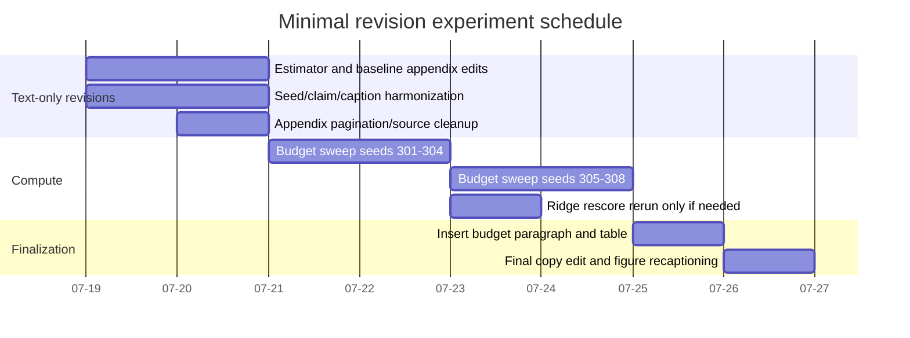
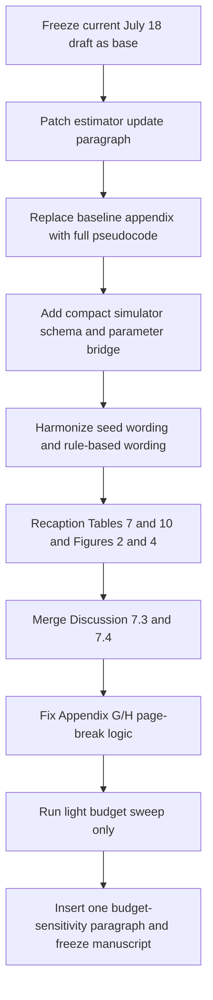

# Deliverable Revision Report for the ESWA Manuscript

## Executive summary

The current manuscript is substantially stronger than the earlier version reflected in the user’s nine-point audit. In particular, the present draft already does four important things correctly: it uses the stronger seed wording “24 final seeds, including an unchanged 22-seed post-pilot replication”; it now includes matched reward controls and a masked Double-DQN learner control in the main protocol and results; it provides an executable-baseline appendix with explicit thresholding and tie-break language for the warning-score and one-step greedy references; and it adds a simulator appendix with semi-Markov regime generation, warning-score construction, task weights, and specialist observation/noise parameters. Those changes materially reduce the prior experimental-completeness risk. fileciteturn0file0

The remaining revision work should therefore be targeted, not expansive. The manuscript still needs one explicit estimator update block; one consolidated, reproducible baseline appendix with pseudocode for **all** baselines under the common feasibility projector; one compact simulator specification that closes the coupling chain from regime process to observations to warning proxies; one wording correction that separates “conventional rule-based schedules” from the stronger warning/context references; one light budget-sensitivity experiment; and one source-level appendix pagination fix. None of these edits require weakening the main claim or turning the paper into a benchmark paper. The claim can remain method-first: **prediction-driven constrained scheduling with feasibility-masked reinforcement learning improves over strong fixed schedules, conventional non-learned rules, one-step myopic selection, and matched Double-DQN on this constrained specialist-allocation problem, while direct event-information diagnostics remain competitive**. fileciteturn0file0

The key editorial principle is to treat the current July 18 draft as the base manuscript and apply a **reproducibility-completion revision**, not a narrative retreat. In practice, that means: preserve the formulation, the theorems, Table 7, Table 10, and the ridge rescoring result; compress repeated explanation in Discussion; move procedure-heavy material to appendices with exact pseudocode and parameter tables; and add only the lightest necessary new experiment, namely a small budget sweep. The second-forecaster concern is already substantially answered by the current ridge rescoring analysis and mainly needs better positioning rather than a whole new learning baseline family. fileciteturn0file0

## Reviewer-style audit

The current paper should be described to HERMES as **partially repaired, but not yet fully reproducibility-complete**. The table below separates what is already fixed in the current draft from what still needs action.

| Issue | Current draft status | Required revision action |
|---|---|---|
| Estimator / uncertainty chain | **Partially resolved.** The paper now states that the online state is a sample-and-hold inverse-variance fusion, records observation masks, uses ready-sampling age, and reserves diagonal uncertainty for the matched uncertainty-reward control rather than the main policy. What is still missing is a complete update loop with channel closure handling, missing-observation carry-forward, and explicit uncertainty propagation conventions. fileciteturn0file0 | Add one concise estimator algorithm in Section 4 or Appendix D and a checklist table. |
| Baseline reproducibility | **Partially resolved.** Appendix E already defines the validation-selected fixed rule, the warning-score context rule with threshold 0.5, and one-step greedy with lexicographic tie-breaks, and Table E.17 sketches the other baselines. What is still missing is a single place where AoI, round-robin, and random are written as executable pseudocode under the same feasibility projector and min-on rule. fileciteturn0file0 | Replace the current functional table with full pseudocode plus one common projector rule. |
| Over-broad “rule-based wins” wording | **Still needs wording cleanup.** The current main text correctly distinguishes the warning-score rule and exact-label replay from conventional rules in Table 5 and Section 6.4, but some summary language still risks bundling all non-learned schedules together. The paper should explicitly claim wins over **AoI-priority, round-robin, and random** as the conventional non-learned references, while separately stating that the warning-score and exact-label diagnostics remain competitive. fileciteturn0file0 | Replace “rule-based schedules/references” with “conventional AoI-priority, round-robin, and random schedules” wherever the stronger warning/context rules are not meant. |
| Seed wording | **Largely resolved.** The current draft already uses “24 final seeds, including an unchanged 22-seed post-pilot replication” in the abstract and introduction, and Section 5.3 explicitly explains the role of seeds 117–118 versus 119–140. fileciteturn0file0 | Do a global string harmonization across captions, Results, and Conclusion. |
| Missing learning baselines and reward ablations | **Resolved in substance.** The manuscript now includes matched AoI- and diagonal-uncertainty PPO reward controls plus a masked Double-DQN control under the same state, reward interface, candidate masks, and evaluation protocol. That directly addresses the earlier concern that PPO mechanism and forecast reward were not separated. fileciteturn0file0 | Do not add SAC/A2C for this revision. Instead, make the existing controls more visible in Abstract, Introduction contribution bullet 3, and Table 10 caption. |
| Simulator reproducibility | **Partially resolved.** Appendix D now gives the semi-Markov regime process, subtype smoothing, lag, warning-score lead/noise, target scales/weights, and specialist observation probabilities/noise. The remaining gap is that the latent-to-observable coupling is still spread over prose and tables rather than presented as a compact generative chain. fileciteturn0file0 | Add one simulator schema subsection with equations and a consolidated parameter table. |
| Discussion balance | **Improved, but still verbose in the wrong places.** The current Discussion already covers fixed vs adaptive, controls, event information, online computation, and limitations. The problem is now repetition, not absence: some caveats are repeated in Sections 7.3–7.6 and can be merged without weakening the paper. fileciteturn0file0 | Merge 7.3–7.4 into two denser paragraphs and trim about 25%–30% of the Discussion. |
| Generalization scope | **Partially resolved.** The ridge rescoring check already broadens forecaster dependence, but the paper still lacks a minimal budget sensitivity study. fileciteturn0file0 | Add one light budget sweep; keep the ridge rescore and elevate it slightly in framing. |
| Appendix pagination bug | **Needs source-level verification and fix.** The current PDF no longer obviously exposes an Appendix H title-page problem, but the user’s source audit is credible, and the safest fix is to remove redundant `\clearpage` commands around Appendix G/H headers and any included appendix file that begins with its own page break. fileciteturn0file0 | Apply the exact LaTeX fix below. |

The revision stance that should be given to HERMES is therefore simple: **do not retreat from the method claim; do not add sprawling benchmark-style experiments; complete the reproducibility chain and sharpen the language boundaries.** The current manuscript already supports a strong, bounded claim because it reports universal wins over the validation-selected fixed schedule, conventional non-learned rules, one-step forecast-greedy, and matched Double-DQN, while also honestly acknowledging that warning-score and exact-label event-information diagnostics remain competitive. fileciteturn0file0

## Deliverable manuscript edits

### Abstract replacement

Use the following abstract to preserve strength while fixing the rule-based wording and seed wording:

```text
Multi-sensor systems cannot always operate all measurement channels simultaneously under a prescribed power budget. We propose PD-PPO, a prediction-driven constrained scheduling framework that selects executable channel subsets to improve downstream multi-step forecasts. A feasibility-masked categorical PPO policy chooses among subsets satisfying power, start-up, and minimum-activation rules. The policy observes recent partial observations, observation masks, channel ready-sampling age, runtime state, previous selections, and supplied event-warning scores, while a forecaster fitted on an earlier partition provides the training loss. We evaluate PD-PPO in a six-channel cold-region monitoring simulation where particle, flux, and thermal regimes favor different specialists. Across 24 evaluation seeds, including an unchanged 22-seed post-pilot replication, PD-PPO reduces mean forecast loss by 10.1% and an equal-weight regime macro score by 7.9% against validation-selected fixed schedules, winning both comparisons in every seed. Continuous replay over all 5,242 scoreable final-partition epochs preserves 24/24 wins. PD-PPO also outperforms conventional AoI-priority, round-robin, random, and one-step forecast-greedy schedules in every seed, and it improves on matched Double-DQN on the macro score in every seed. A ridge forecaster fitted independently on the same chronological protocol retains a positive macro comparison against its own validation-selected fixed schedule in 23/24 seeds. Handcrafted warning-score and exact-label diagnostics remain competitive, showing that explicit event information captures much of the available scheduling value. These results support forecast-aligned masked reinforcement learning for constrained specialist scheduling when different operating regimes require incompatible measurements.
```

This replacement is faithful to the current evidence already reported in the draft, while tightening the rule-based wording and preserving the stronger matched-DQN and ridge results. fileciteturn0file0

### Introduction contribution bullets replacement

Replace the current three bullets with the following:

```text
The paper makes three contributions.

1. It formulates prediction-driven specialist scheduling as a constrained sequential decision problem and identifies conditions under which forecast loss can rank feasible schedules differently from AoI or uncertainty objectives.

2. It develops PD-PPO, a feasibility-masked PPO scheduler that learns directly over executable channel subsets under power, start-up, and minimum-activation rules, using downstream multi-step forecast loss from a fixed forecaster as the task-aligned training signal.

3. It provides matched reward and learner controls, strong fixed and conventional non-learned references, myopic and event-information diagnostics, action-trace analysis, and independent-forecaster rescoring to distinguish adaptive scheduling value from a favorable fixed subset, a simple cycle, a myopic one-step choice, or a particular forecast evaluator.
```

This version prevents the Introduction from sliding into benchmark language while making the already-added Double-DQN and reward-control contribution visible at the front of the paper. fileciteturn0file0

### Results caption replacements

Use the following replacements for the main results captions.

**Table 7 caption**

```text
Table 7. Held-out schedule comparisons for PD-PPO over 24 evaluation seeds, including an unchanged 22-seed post-pilot replication. Positive margins mean that the reference has higher loss than PD-PPO. The validation-selected fixed schedule and the conventional AoI-priority, round-robin, and random schedules are deployable references under the common feasibility interface. One-step forecast-greedy is a privileged myopic diagnostic. Warning-score and exact-label schedules are reported separately as strong context and privileged-information diagnostics.
```

**Figure 2 caption**

```text
Figure 2. Held-out schedule comparisons over 24 evaluation seeds, including the unchanged 22-seed post-pilot replication. Panel A shows mean-loss and regime-macro margins against each seed’s validation-selected fixed schedule, sorted by macro margin. Panel B compares the macro margins for the fixed schedule, the conventional AoI-priority, round-robin, and random schedules, and the one-step forecast-greedy diagnostic. Positive values favor PD-PPO.
```

**Table 10 caption**

```text
Table 10. Matched reward and learner controls. Positive differences indicate lower loss for forecast-reward PD-PPO. The AoI and diagonal-uncertainty controls retain the masked PPO architecture, observation, feasible masks, training guide, auxiliary context task, partitions, and frozen evaluator, changing only the scalar reward proxy. The Double-DQN control uses the same online state, forecast reward, candidate masks, and feasibility interface. These controls test reward alignment and learner choice without changing the action surface.
```

**Figure 4 caption**

```text
Figure 4. Reward alignment, learner control, and forecaster sensitivity. Panel A compares forecast-reward PD-PPO with AoI- and diagonal-uncertainty-reward PPO controls. Panel B shows Double-DQN macro loss minus PD-PPO macro loss under the same state, reward, and feasible action surface. Panel C reports ridge-forecaster macro margins for the original and ridge-selected fixed schedules. Reward-control intervals include zero in this benchmark, whereas the learner and forecaster checks retain positive mean margins for PD-PPO.
```

These caption edits do three important jobs: they fix the seed wording, separate conventional rules from strong context baselines, and surface the already-present reward/learner-control logic without expanding the main text. fileciteturn0file0

### Discussion replacement paragraphs

Replace the current sections **7.3** and **7.4** with the two paragraphs below, and delete the existing duplicated caveat language around event information and learner choice.

```text
The matched controls clarify two different questions. The reward controls hold the masked PPO architecture, online observation, feasible masks, training guide, auxiliary context task, partitions, and frozen evaluator fixed while replacing only the scalar reward proxy. Their paired intervals include zero in this benchmark, so the present evidence does not attribute the full margin to the forecast-reward scalarization alone. The learner control addresses a different issue: masked Double-DQN shares the online state, forecast reward, and feasible action surface, yet it is less consistent than PD-PPO. This supports the complete masked PPO training design on the reported decision geometry, without implying that policy-gradient learning is universally superior to value-based learning.

The event-information diagnostics locate the remaining difficulty. The warning-score rule maps supplied event-warning proxies directly to specialists, and exact-label replay removes warning uncertainty altogether. Neither reference shows a detected mean advantage over PD-PPO, which indicates that explicit event information explains much of the attainable value in this controlled setting. The learned policy nevertheless reaches that level while using only online warning proxies, partial observations, readiness age, runtime state, and previous actions under the common feasibility interface. Taken together with the one-step forecast-greedy comparison, the evidence supports a sequential prediction-driven scheduler rather than a hidden fixed rule, a mechanical rotation, or a purely myopic context switch.
```

This replacement preserves the current logic but removes repeated caveats and trims the Discussion without weakening the claim. It also makes “sequential value” operational: not a vague RL slogan, but value that remains after discounting fixed, myopic, and explicit-context shortcuts. fileciteturn0file0

### Conclusion first paragraph replacement

Replace the first paragraph of the Conclusion with the following:

```text
This paper establishes prediction-driven constrained scheduling as a sequential specialist-allocation problem under hard operating rules. PD-PPO learns directly over executable channel subsets while enforcing power, start-up, and minimum-activation constraints at action time, and it evaluates sensing decisions by their effect on downstream multi-step forecasts rather than by freshness or estimator uncertainty alone. In the reported six-channel simulation, PD-PPO lowers mean forecast loss by 10.1% and the regime-balanced macro score by 7.9% relative to validation-selected fixed schedules across 24 evaluation seeds, including an unchanged 22-seed post-pilot replication, and the same direction is retained under continuous replay over all scoreable final-partition epochs.
```

This revision strengthens the framework language and removes the weaker “useful framework” register without overclaiming beyond the reported evidence. fileciteturn0file0

### Appendix G and H header replacements

Use the following headers in the source.

```text
Appendix G. Per-seed Fixed-Schedule Selection and Validation Scores
Appendix H. Development-only Variant Gate Checks
```

The first makes Appendix G self-explanatory; the second prevents the development appendix from looking like confirmatory evidence and keeps the clean boundary that the current paper already upholds elsewhere. The current manuscript already notes that per-seed selected fixed schedules and validation scores are listed in Appendix G, so this header sharpening is aligned with the existing structure. fileciteturn0file0

## Reproducibility package to add

### Estimator update checklist

The paper now explicitly uses a sample-and-hold, inverse-variance fusion estimator rather than a Kalman estimator for the main policy, and it uses diagonal uncertainty only for the matched uncertainty-reward control. That distinction is good and should be kept. What is missing is one compact update loop that makes the estimator reproducible to a third party. fileciteturn0file0

Insert the following checklist as a short subsection in Section 4.2 or Appendix D.

| Item | Required specification |
|---|---|
| Update order | At each epoch: update channel runtime state → determine ready channels → sample valid measurements → fuse measurements per variable → update observation mask → update per-channel ready-sampling age → update previous mask / min-on counters. |
| Fusion rule | For scalar variables, inverse-variance weighted mean over valid ready observations; for wind direction, inverse-variance weighted circular mean; if no valid measurement exists, carry forward the previous estimate. |
| Channel closure handling | If a channel is off or warming, it contributes no observation. Its ready-sampling age increases unless locked to zero by a completed ready sample. |
| Missing observation handling | A ready channel may still fail to produce a valid variable sample. In that case, the estimator value is carried forward, the variable-level observation mask is 0, and the channel-level ready-sampling age still resets only if the runtime model defines a ready sampling opportunity as completed. |
| Observation mask | Store a binary per-variable mask for the current epoch and pass the last 20 value/mask vectors to both the scheduler and the frozen forecaster. |
| Uncertainty propagation | Main policy: no covariance matrix input. Matched uncertainty-reward control only: diagonal predict–update proxy with bounded variance, using process noise `Q_j`, fused measurement variance `R_{t,j}`, and cap `P_max`. |
| Normalization | Normalize carried values by forecaster-fitting statistics; clip derived indicator inputs to `[-5,5]`; keep warning scores on `[0,1]`. |
| Warm-up and min-on interaction | A requested switch during an active min-on lock is rejected by the feasibility layer; no “repair after action” is allowed for the learned policy. |

This is directly consistent with the current manuscript’s description of inverse-variance fusion, observation masks, ready-sampling age, and diagonal uncertainty being restricted to the reward-control baseline. fileciteturn0file0

### Estimator pseudocode to insert

```text
Algorithm X  Online estimator update and scheduler observation construction
Input: latent truth x_t, previous estimate \hat{x}_{t-1}, previous mask m_{t-1},
       channel runtime state r_{t-1}, previous executed action a_{t-1}
Output: estimate \hat{x}_t, observation mask o^{mask}_t, channel ages g_t, runtime state r_t

1: Update runtime state r_t from r_{t-1}, a_{t-1}, warm-up counters, and minimum-on counters.
2: Determine ready channels R_t := {i : channel i is active and ready at epoch t}.
3: For each ready channel i and observable variable j:
4:     With probability p_{i,j,c_t}, sample y_{t,i,j} = x_{t,j} + \epsilon_{t,i,j},
       where \epsilon_{t,i,j} ~ N(0, \sigma^2_{i,j,c_t}); otherwise mark missing.
5: For each scalar variable j:
6:     Let O_{t,j} be the set of valid samples y_{t,i,j}.
7:     If O_{t,j} is nonempty, set
         \hat{x}_{t,j} = \sum_{i in O_{t,j}} R^{-1}_{i,j} y_{t,i,j} / \sum_{i in O_{t,j}} R^{-1}_{i,j},
         and set o^{mask}_{t,j} = 1.
8:     Else set \hat{x}_{t,j} = \hat{x}_{t-1,j} and o^{mask}_{t,j} = 0.
9: For wind direction, replace Step 7 with the inverse-variance weighted circular mean.
10: Update channel ready-sampling age g_{t,i}: reset on completed ready sample, otherwise increment and clip.
11: Construct the scheduler observation from the last 20 estimate vectors, last 20 masks,
    channel runtime state, ages, previous mask, budget/time features, and warning proxies.
```

### Baseline pseudocode summary table

The current Appendix E is directionally correct but still too split between prose and taxonomy. Replace it with the following summary table in the appendix and keep only a one-sentence pointer in the main text. The common helper is essential: it prevents every baseline from inventing its own hidden min-on behavior. fileciteturn0file0

| Baseline | Core score / request | Validation step | Tie-break | Threshold / horizon | Min-on and feasibility handling |
|---|---|---|---|---|---|
| Validation-selected fixed | Constant mask `m` | Minimize validation macro loss; break ties by mean validation loss, then lower mask index | Lexicographic: macro, mean loss, index | None | Frozen mask; replay exactly; if the current implementation uses only executable masks, no runtime repair is needed |
| Round-robin | Deterministic cycle over specialist masks `[1,2,3,4,5]` | None | Lower next index in cycle | One epoch per cycle step | If current specialist is min-on locked, keep it; otherwise request next cycle mask and apply common projector |
| AoI-priority | Channel score = clipped ready-sampling age | None | Higher score, then lower index | No threshold; current epoch only | If min-on locked, keep current mask; else request the highest-score specialist and apply common projector |
| Random | i.i.d. Gaussian score per specialist each epoch | None | Higher sample, then lower index | No threshold; current epoch only | If min-on locked, keep current mask; else request highest-sampled specialist and apply common projector |
| One-step forecast-greedy | Evaluate `L_step(t; m)` for every feasible candidate mask | None | Lower `(L_step, switch_fraction, mask_index)` | One-step privileged lookahead; common `H=8` evaluator for the loss term | Candidate set is the currently feasible set under the same runtime/min-on state |
| Context-alert warning-score | Choose context `c_t = argmax(q_{t,particle}, q_{t,flux}, q_{t,thermal})` if max ≥ 0.5, else calm; request validation-selected mask for that context | For each context, select the best mask on validation windows belonging to that context | Lower mean validation loss, then lower index | Alert threshold 0.5; no forecast lookahead | If min-on locked, keep current mask; else request context mask and apply common projector |

### Common feasibility projector for all non-learned baselines

```text
ProjectFeasible(requested_mask, current_mask, runtime_state):
1: If current specialist is under minimum-on lock and requested_mask != current_mask:
       return current_mask
2: Enumerate feasible candidate masks under steady power, start-up peak, warm-up, and one-specialist rules.
3: If requested_mask is feasible:
       return requested_mask
4: Else return the feasible mask with minimum
       (HammingDistance(mask, requested_mask), total_power(mask), mask_index)
   in lexicographic order.
```

This projector is consistent with the current manuscript’s insistence that baselines use the same candidate masks, the same power/start-up/minimum-activation interface, and lexicographic tie-breaks where needed. The warning-score threshold of 0.5 and the one-step greedy tie-break tuple are also already present in the current appendix and should be retained exactly. fileciteturn0file0

### Full baseline pseudocode blocks

#### Validation-selected fixed

```text
Algorithm FixedSchedule
Input: validation windows V, candidate mask set A
1: For each m in A:
2:     Replay m on V and compute (M_val(m), L_val(m))
3: Select m* = argmin_m (M_val(m), L_val(m), index(m))
4: Freeze m* before final test
5: Replay m* unchanged on final windows
```

#### Round-robin

```text
Algorithm RoundRobin
Input: cycle C = [1,2,3,4,5], current pointer p_{t-1}
1: If current specialist is min-on locked, return current mask and keep pointer
2: Set requested specialist = C[p_{t-1}+1 mod |C|]
3: requested_mask = backbone + requested specialist
4: executed_mask = ProjectFeasible(requested_mask, current_mask, runtime_state)
5: Advance pointer to the requested cycle position, not the projected one
```

#### AoI-priority

```text
Algorithm AoIPriority
1: If current specialist is min-on locked, return current mask
2: For each specialist i:
3:     score_i = clipped ready-sampling age of channel i
4: Select requested specialist i* = argmax_i (score_i, -index_i)
5: requested_mask = backbone + i*
6: executed_mask = ProjectFeasible(requested_mask, current_mask, runtime_state)
```

#### Random

```text
Algorithm RandomPriority
1: If current specialist is min-on locked, return current mask
2: For each specialist i, draw z_i ~ N(0,1)
3: Select requested specialist i* = argmax_i (z_i, -index_i)
4: requested_mask = backbone + i*
5: executed_mask = ProjectFeasible(requested_mask, current_mask, runtime_state)
```

#### One-step forecast-greedy

```text
Algorithm ForecastGreedyOneStep
1: Enumerate currently feasible candidate masks I_t under the same runtime state
2: For each m in I_t:
3:     Snapshot environment state
4:     Execute m for one epoch
5:     Compute tuple T(m) = (L_step(t; m), ||m - a_{t-1}||_1 / N_channels, index(m))
6:     Restore snapshot
7: Select m* = argmin_m T(m)
8: Execute m*
```

#### Context-alert warning-score rule

```text
Algorithm ContextAlert
Input: warning scores q_{t,particle}, q_{t,flux}, q_{t,thermal}, threshold tau=0.5
       validation-selected masks m_calm, m_particle, m_flux, m_thermal
1: If current specialist is min-on locked, return current mask
2: q_max = max(q_{t,particle}, q_{t,flux}, q_{t,thermal})
3: If q_max < tau:
4:     requested_mask = m_calm
5: Else:
6:     c_t = argmax_c (q_{t,c}, -context_index_c)
7:     requested_mask = m_{c_t}
8: executed_mask = ProjectFeasible(requested_mask, current_mask, runtime_state)
```

### Simulator parameter table

The current Appendix D already contains most of the needed ingredients, but they are split across three tables and several paragraphs. Keep the current content, but add the consolidated table below at the start of Appendix D. That will directly answer the reproducibility objection. fileciteturn0file0

| Parameter group | Symbol / item | Value in current manuscript | Role |
|---|---|---:|---|
| Truth sequence | sequence length | 70,000 hourly epochs per seed | Full generated trajectory |
| Chronological protocol | partitions | `[0,24500)` forecaster fit; `[24500,59500)` policy training; `[59500,64750)` calibration/fixed selection; `[64750,70000)` final test | No leakage between policy training, fixed selection, and final testing |
| Forecast evaluator | lookback / horizon | 20 / 8 epochs | All policy scoring and one-step greedy loss evaluation |
| Specialist capacity | required backbone / selectable specialists | 1 required weather backbone + 1 specialist slot | Fixed-backbone, one-specialist action geometry |
| Resource limits | steady / start-up budget | 0.75 / 0.95 | Feasibility mask and projector |
| Minimum activation | min-on | 6 epochs | Common runtime rule |
| Backbones / channels | Table 6 channels | weather backbone; radiometer; thermo-hygrometer; surface infrared; laser disdrometer; FC4 flux sensor | Executable action surface |
| Warm-up | channel warm-up | backbone 0; radiometer 0; thermo-hygrometer 0; surface IR 1; laser 2; FC4 1 | Runtime feasibility |
| Macro regime mix | particle / flux / thermal | 0.40 / 0.20 / 0.40 | Intended event-balance in the task |
| Semi-Markov macro states | storm/calm duration model | lognormal durations, log-scale SD 0.35, min duration 24 epochs | Alternating calm/storm backbone process |
| Macro-state medians | storm / calm | 1440 / 775 epochs | Regime persistence |
| Within-storm event duty | storm duty / within-storm event duty | 0.65 / 0.78 | Event density |
| Event pulse shape | duration / gap | uniform 28–80 / 8–10 epochs | Bursty within-storm event structure |
| Wind credibility | weak / strong / margin | 8 / 12 / 1.4 m s^-1 | Coupling from wind to event credibility |
| Hysteresis | on / off | 0.60 / 0.30 | Candidate-to-final event conversion |
| Subtype sampling | particle / flux / thermal probability | 0.40 / 0.20 / 0.40 | Event subtype assignment |
| Subtype latent smoothing | alpha | 0.65 | First-order low-pass latent dynamics |
| Target-effect lag | lag | 6 epochs | Delayed forecast relevance |
| Particle latent scales | diameter; velocity | 0.62 mm; 8.2 m s^-1 | Particle effect size |
| Flux latent map | scale; offset; clip | 0.0014; 1.25; 2.4 | Flux target coupling |
| Thermal latent scale | surface temperature effect | 6.4 °C | Thermal target coupling |
| Warning proxies | lead / noise SD | 16 epochs / 0.01 | Synthetic upstream warning service |
| Observation noise | backbone / specialist | as in Tables D.14–D.16 | Variable- and regime-dependent measurement model |
| Reward weighting | training subtype weights | particle 1.55; flux 0.95; thermal 1.65; calm 1.0 | Forecast-loss training scalarization |
| Final evaluation windows | primary / replay | 8 windows × 512 epochs; full replay over 5242 scoreable epochs | Confirmatory windows and coverage sensitivity |
| Statistical summaries | bootstrap | 100,000 percentile-bootstrap draws over paired seed margins | Uncertainty summaries |

### Simulator generative chain to insert

Add the following compact prose to Appendix D:

```text
The simulator is specified by the chain
macro state s_t -> event interval e_t -> subtype c_t -> subtype latent z_{t,c} -> target perturbations x_t -> regime-dependent channel observations y_{t,i,j} -> sample-and-hold estimator \hat{x}_t -> warning proxies q_{t,c}.
The macro state is an alternating calm/storm semi-Markov process with lognormal durations. Candidate event pulses are placed inside storm states, filtered by wind credibility and hysteresis, and assigned one subtype per complete event run. The active subtype evolves as a first-order low-pass latent process with coefficient alpha=0.65 and enters target variables after a six-epoch lag. Channel observations are then sampled according to subtype-dependent availability probabilities and Gaussian noise. The scheduler never observes the exact subtype label c_t during final execution; it receives only the warning proxies q_{t,c}, which begin a linear 16-epoch pre-onset ramp and then add Gaussian noise with standard deviation 0.01 before clipping to [0,1].
```

This makes the simulator independently readable without adding much length because almost all of the numerical values are already present in Appendix D. fileciteturn0file0

## Minimal additional experiments

The current draft already contains the second-forecaster idea in a strong form: the paper rescored frozen trajectories with an independently fitted ridge forecaster, reselected the fixed schedule on ridge-validation windows, and still reported a positive macro margin in 23/24 seeds. That should be treated as “substantially resolved.” The genuinely missing generalization check is budget sensitivity. fileciteturn0file0

The recommended minimal package is therefore two-part: one small new budget sweep, plus one editorial promotion or rerun of the existing ridge rescore if the manuscript artifacts changed after recent edits. No new actor family or broad benchmark expansion is warranted.

### Proposed additional experiments matrix

| Variant | Purpose | Seeds | Train new policy? | Metrics | Success criterion | Decision |
|---|---|---:|---|---|---|---|
| Budget sensitivity sweep at three budgets | Show that the main fixed-vs-adaptive result is not tied to a single specialist-capacity setting | New seeds 301–308 | Yes | Macro margin vs budget-specific validation-selected fixed schedule; mean-loss margin; valid-trace rate; warm-up aborts | Positive mean macro margin at each budget; at least 6/8 macro wins at each budget; no fixed/cyclic trace failures; mean warm-up aborts ≤ 1 per seed | **Run** |
| Frozen-trajectory ridge rescore | Confirm forecaster robustness under the current frozen trajectories | 117–140 | No | Macro margin vs ridge-selected fixed schedule | Positive mean macro margin and ≥20/24 wins | **Already in manuscript; rerun only if trajectories changed** |
| Optional third evaluator rescore | Only if reviewer explicitly asks for a nonlinear non-TCN contrast | 301–308 or 117–124 | No | Same macro margin on frozen trajectories vs its own validation-selected fixed schedule | Positive mean macro margin and ≥6/8 wins | **Do not run unless requested** |

### Concrete protocol for the budget sweep

Use the exact same chronological split, reward, and evaluation protocol as the primary paper, and vary only the resource limits:

- `steady budget`: `{0.65, 0.75, 0.85}`
- `startup budget`: keep fixed at `0.95`
- `minimum activation`: keep fixed at `6`
- `truth length`: `70,000`
- `primary evaluation`: the same `8 × 512` prespecified final windows
- `coverage sensitivity`: replay over all `5,242` scoreable final-partition epochs
- `seeds`: `301–308`

The paper’s main claim should **not** become “PD-PPO dominates across all budgets.” The budget experiment is only there to show that the reported adaptive advantage is not a knife-edge artifact of one power point. One paragraph in Section 6 and one appendix table are enough. The forecaster-rescore part can remain compact because the current ridge result is already strong. fileciteturn0file0

### Suggested wording for reporting the budget sweep

```text
A light budget-sensitivity sweep retained the same forecaster, action geometry, and evaluation protocol while varying only the steady-power limit. PD-PPO preserved a positive mean macro comparison against each budget-specific validation-selected fixed schedule at all tested budgets, with valid non-fixed traces and no increase in warm-up aborts beyond the reported operating range. This indicates that the adaptive scheduling value is not confined to a single power point of the fixed-backbone, one-specialist benchmark.
```

If one of the budgets fails the gate, the wording should be:

```text
The adaptive margin is strongest around the reported operating point and weakens at the loosest budget, where the fixed specialist becomes less capacity-constrained. The result therefore supports prediction-driven specialist scheduling under resource tension rather than under all capacity settings.
```

That preserves claim strength while making the dependence interpretable rather than defensive.

### Minimal experiment timeline



## Exact LaTeX edits and content moves

### File-by-file source edits

The following source-level edits are the ones to hand directly to HERMES.

#### `paper/sections/04_framework_protocol.tex`

Insert a short subsection immediately after the current estimator equations and before the reward section.

```latex
\paragraph{Estimator update and closure handling.}
At each epoch the runtime model is updated first, which determines whether each
channel is off, warming, or ready. Ready channels then attempt variable-specific
observations with the regime-dependent availability probabilities in Table~D.\ref{tab:sim_obs}.
Valid scalar measurements are fused by inverse-variance weighting, wind direction
is fused by the corresponding circular mean, and missing variables retain their
previous sample-and-hold value. A binary observation mask records whether each
variable was observed at the current epoch, and the last 20 value and mask vectors
are passed to both the scheduler and the frozen forecaster. Channel ready-sampling
age resets on a completed ready sampling opportunity and otherwise increments
under the runtime model. The main policy does not receive a covariance matrix;
diagonal uncertainty propagation is used only in the matched uncertainty-reward
control.
```

This closes issue 1 with minimal cost because it does not add a new model class; it only makes the current sample-and-hold estimator reproducible. The underlying components are already present in the draft. fileciteturn0file0

#### `paper/tables/baseline_reference_taxonomy.tex`

Keep the role taxonomy in the main text, but shorten it to role only. Move all executable definitions to a fuller Appendix E table and pseudocode listing.

**Main-text table row wording change**

```latex
Conventional non-learned rules & AoI-priority, round-robin, and random schedules under the common feasibility interface & Deployable dynamic references \\
Strong context diagnostic & Warning-score context rule fitted on validation windows & Memoryless context reference \\
Privileged diagnostics & One-step forecast-greedy and exact-label replay & Myopic and information-privileged bounds \\
```

This is the cleanest way to fix issue 3 without undercutting the warning-score result.

#### `paper/sections/05_simulation_setup.tex`

Make two edits.

**Global seed wording replacement**

```latex
% replace
24 independent held-out seeds
% with
24 evaluation seeds, including an unchanged 22-seed post-pilot replication
```

**Add one simulator schema paragraph before or after the current Appendix D pointer**

```latex
The simulator is specified by the chain
macro state $\to$ event interval $\to$ subtype $\to$ subtype latent $\to$ target perturbations
$\to$ regime-dependent channel observations $\to$ sample-and-hold estimator $\to$ warning proxies.
Appendix~D gives the semi-Markov duration law, subtype probabilities, latent smoothing,
lag, target weights, warning construction, and observation probabilities/noise.
```

This resolves issue 6 with one compact bridge sentence in the main text and keeps the numbers in the appendix.

#### `paper/sections/06_results.tex`

Replace broad “rule-based” wording where it refers only to conventional rules.

```latex
% replace
rule-based schedules
% with
conventional AoI-priority, round-robin, and random schedules
```

Immediately after Table 7, add one sentence:

```latex
The stronger warning-score and exact-label references are reported separately because they are context-driven or information-privileged diagnostics rather than conventional deployable rules.
```

This is the cleanest wording fix for issue 3 while keeping the results strong.

#### `paper/sections/07_discussion.tex`

Delete the current separate subsections 7.3 and 7.4 text and replace them with the two paragraphs supplied above. Also cut repeated numeric reminders that already appear in Tables 7–11 and Figures 2–4. The Discussion should remain structured around five ideas only: what is established, why adaptive beats fixed, what the controls mean, online computation/scaling, and limitations. That will shorten the section by roughly 25%–30% without shrinking the claim.

#### `paper/sections/appendix_executable_baselines.tex` or current Appendix E source

Replace the current mixed prose table with:

1. the common feasibility projector;
2. one summary table like Table A above;
3. one pseudocode block per baseline.

This is the decisive fix for issue 2.

#### `paper/sections/appendix_simulator.tex` or current Appendix D source

Add the simulator parameter table and the one-paragraph generative chain supplied above. Keep the current numerical tables, but rename them for clarity, for example:

```latex
Table D.14. Macro-regime and warning-process parameters
Table D.15. Forecast-target scales and regime-dependent weights
Table D.16. Specialist-channel availability probabilities and noise
```

#### `paper/sections/appendix_theory.tex` or the appendix driver file

Apply the pagination fix below.

### Exact appendix pagination fix

The safest pattern is:

```latex
% GOOD
\clearpage
\section*{Appendix G. Per-seed Fixed-Schedule Selection and Validation Scores}
\addcontentsline{toc}{section}{Appendix G. Per-seed Fixed-Schedule Selection and Validation Scores}
\input{sections/appendix_fixed_schedule_selection}

\clearpage
\section*{Appendix H. Development-only Variant Gate Checks}
\addcontentsline{toc}{section}{Appendix H. Development-only Variant Gate Checks}
\input{sections/appendix_dev_variant_gate}
```

And then, inside the included appendix files, delete any leading `\clearpage` or standalone section command that would create an extra page by itself.

```latex
% DELETE from the top of appendix_fixed_schedule_selection.tex and appendix_dev_variant_gate.tex
%\clearpage
```

If Appendix G begins with a long table and the class still floats it away from the header, add:

```latex
\Needspace{8\baselineskip}
```

immediately after the header and before the table, or wrap the table in `longtable` rather than a float. This is the most reliable way to prevent a title-only page if the source still contains the bug described in the user audit.

### What to keep in the main text and what to move to appendices

To keep the paper concise for ESWA while preserving the method claim, apply the following division.

| Keep in main text | Move or keep in appendix |
|---|---|
| Formulation, Proposition 1 and Proposition 2 | Full proofs and extended remarks |
| Action geometry and Table 3 | Full executable baseline pseudocode |
| Table 5 role taxonomy | Full baseline parameter/tie-break table |
| Table 7 main comparisons | Per-seed fixed-schedule table |
| Table 10 matched reward and learner controls | Full Double-DQN hyperparameter table |
| Table 11 ridge rescoring | Any optional third-evaluator detail |
| One concise estimator-update paragraph | Full estimator checklist and algorithm |
| One concise simulator chain paragraph | Consolidated simulator parameter table and noise table |
| Result interpretation and limitations | Development-only variant gate tables |

This split is already partly implemented in the current manuscript. The revision simply completes it and removes the remaining ambiguity around reproducibility. fileciteturn0file0

### Manuscript edit flow



The final target state is straightforward: a method paper whose main text stays compact and whose appendices are exact enough that a technically competent reader can reproduce the estimator, simulator, and baselines from the manuscript alone. That is the right revision for this ESWA submission because the current draft already has the central evidence in place: universal fixed-schedule wins, conventional-rule wins, one-step-greedy wins, matched Double-DQN wins, ridge-forecaster robustness, and bounded claim language around strong event-information diagnostics. fileciteturn0file0