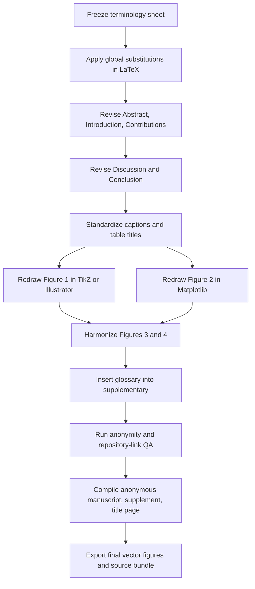

# Detailed Editorial and Figure Revision Plan for the ESWA Manuscript

## Executive summary

The manuscript is scientifically mature enough for submission, but it still needs a **focused editorial normalization pass** and a **figure-system redesign pass** before it will read like a polished *Expert Systems with Applications* paper rather than a strong internal lab manuscript. The highest-value work is no longer experimental. It is editorial: freeze a single terminology system, remove development-style phrasing, simplify several dense method and discussion sentences, standardize comparator names in captions and tables, and rebuild the main figures so that they communicate the method and evidence hierarchy at journal quality. The current uploaded PDF is clearly an author-version manuscript with author names on page 1, while the separate submission audit confirms that a 49-page anonymized build already exists and is packaged for ESWA submission; the revision plan below should therefore be applied to the anonymous LaTeX as the binding review version. fileciteturn0file0 fileciteturn0file3

ESWA’s current author guide sets the practical constraints for this pass: the journal uses **double-anonymized review** and requires a separate title page and anonymized manuscript; the abstract must not exceed **250 words**; highlights should be **3–5 bullets** with **85 characters maximum each**; figures must be uploaded as **separate files** and should be supplied as **vector PDF or EPS** when they are line drawings; color artwork should remain accessible; supplementary files must be cited in the text; and the journal does **not** permit generative AI to create or alter submitted figures or artwork. ESWA also applies **Option C** research-data rules, which require repository deposit plus dataset citation and linking, or a clear explanation if sharing is not possible. citeturn2view0turn2view1turn3view0turn2view2turn2view3

Across recent adjacent manuscript builds, terminology has drifted in exactly the way you flagged: the same metric appears as “validation-normalized equal-regime macro score,” “equal-weight regime score,” and “regime-balanced macro score”; the framing alternates between “prediction-driven sensing system scheduling,” “forecast-based scheduling protocol,” and “contextual specialist scheduling”; and comparator references shift between broad family labels and specific names. That drift is the clearest sign that the manuscript needs one frozen editorial style sheet before submission. fileciteturn0file0 fileciteturn0file5 fileciteturn0file8

The practical conclusion is straightforward: do **one final editorial sprint** with five outputs only—terminology sheet, representative text edits, redesigned Figure 1, redesigned Figure 2, and a final consistency checklist. Do **not** add new experiments, do **not** change the scientific claims, and do **not** expand the scope of the paper. The evidence chain already exists; the remaining task is to make it read clearly, consistently, and professionally. fileciteturn0file0 fileciteturn0file3

## Journal constraints and the current diagnosis

The current manuscript is already close to ESWA form in structure. It has a conventional section layout, explicit contributions, tables and captions placed appropriately, and a reasonably bounded discussion of limitations and claim scope. The submission audit also confirms that the current package already includes a separate anonymized manuscript, title page, highlights, supplementary material, vector figures, and a source archive, all compiled successfully. That means the revision pass should be **surgical rather than structural**. fileciteturn0file0 fileciteturn0file3

The main editorial weaknesses are concentrated in four recurrent patterns.

First, the manuscript still carries **compound technical phrasing** that is accurate but heavier than necessary for ESWA style. Phrases such as “validation-normalized equal-regime macro score,” “matched reward-control and learner-control comparisons,” and “the reward-control experiment therefore evaluates objective substitution within the reported training scaffold” are not wrong, but they read like internal method notes rather than a journal article. ESWA is not opposed to technical detail; its style preference is for standard terminology, concise titles and captions, and readable English in either American or British form, but not a mixture. fileciteturn0file0 citeturn1search0

Second, **comparator naming is still not frozen**. The current main figure and discussion use precise names in some places and vague family labels in others. For example, Figure 1 still includes the phrase “Learned, fixed, rule-based, and supplementary references,” while Figure 2 correctly names “AoI-priority, round-robin, random, and one-step forecast-greedy.” That inconsistency makes the comparator hierarchy feel less deliberate than the experimental design actually is. fileciteturn0file0

Third, **figure grammar is inconsistent**. The current Figure 1 is conceptually sound but visually compressed: the type is small, the comparator label is vague, and several boxes mix method, training, validation, and evidence roles in one image. Figure 2 uses a connected line plot for ranked seed margins, which visually suggests continuity over an arbitrary seed order. Figure 3 uses a heatmap–bar–scatter composite with a switching-rate colorbar, while Figure 4 uses boxplots with a different semantic sign convention on the axis labels. All four figures are legible, but they do not yet behave like one coherent family. fileciteturn0file0

Fourth, some **internal lab-language residues** remain. Terms such as “training-only labels,” “supplementary references,” “trace diagnostics,” “training scaffold,” and “selected evaluation windows” are meaningful to the authors, but they will read as internal shorthand to reviewers unless defined once and then simplified. The current manuscript already contains the scientific boundary statements you need—especially the aggregation-boundary sentence in Limitations and the reward-control boundary in Discussion—and those should be preserved. The problem is not lack of rigor; it is editorial overcomplexity. fileciteturn0file0

The table below prioritizes the deliverables that should be produced in this pass.

| Deliverable | What it contains | Estimated effort | Priority |
|---|---|---:|---|
| Terminology sheet and glossary | Frozen naming system for methods, metrics, baselines, controls, and runtime states | 3–4 h | Critical |
| Abstract, Introduction, Discussion, Conclusion pass | Sentence simplification, tone normalization, comparator consistency | 5–6 h | Critical |
| Representative annotated LaTeX diff | 20 sample replacements across major sections | 3–4 h | High |
| Figure 1 redesign | New method/protocol diagram in vector format | 4–5 h | Critical |
| Figure 2 redesign | New core-results figure in vector format | 4–5 h | Critical |
| Figure 3 and Figure 4 harmonization | Style-only pass: fonts, line weights, labels, palette | 2–3 h | High |
| Caption and table standardization | Exact comparator names and consistent metric wording | 2–3 h | High |
| Final QA checklist | Anonymous manuscript, repository link, Data Availability, figure exports | 1.5–2 h | Critical |

In total, this is about **25–32 hours** of focused work. That is the right scale for a final editorial sprint on a submission-ready paper; it is much smaller than another experimental cycle and much more likely to improve reviewer experience.

## Terminology normalization and the supplementary glossary

The core requirement of this pass is to freeze one vocabulary and stop editorial drift. The manuscript already has the right scientific content, but recent builds show multiple labels for the same concepts. The safest solution is to adopt the table below as a **binding style sheet** for the anonymous manuscript, supplementary glossary, figure captions, and table titles. The current manuscript and adjacent builds are enough to justify this freeze because they already show repeated alternation among these labels. fileciteturn0file0 fileciteturn0file5 fileciteturn0file8

### One-page glossary of standardized terms and abbreviations

This table is already formatted to be moved into the supplementary material as a one-page glossary.

| Standard term | Use exactly this for | Avoid or retire |
|---|---|---|
| **PD-PPO** | Main method name throughout the article | prediction-driven PPO, forecast-PPO, masked PPO alone |
| **validation-selected fixed schedule** | Primary fixed comparator chosen on the validation partition | selected fixed schedule, original fixed, fixed specialist schedule |
| **AoI-priority schedule** | Conventional dynamic baseline based on information age | AoI rule, AoI baseline, AoI controller |
| **round-robin schedule** | Cyclic conventional baseline | cyclic rule unless explicitly generic |
| **random feasible schedule** | Random baseline constrained by feasibility | random schedule, random mask policy |
| **one-step forecast-greedy schedule** | Myopic diagnostic comparator | forecast-greedy baseline, greedy mask choice |
| **warning-score rule** | Deterministic context-aware rule based on warning scores | context-alert rule **if it is not actually a bandit** |
| **context-alert bandit** | Use only if the source truly contains a contextual bandit comparator | warning-score rule, alert heuristic, handcrafted bandit used interchangeably |
| **matched Double-DQN** | Learned-policy control using the same state, reward, and action interface | DQN baseline, DQN comparator |
| **forecaster** | Frozen forecasting model used for reward and evaluation | forecasting model, predictor, evaluator model used interchangeably |
| **ridge forecaster** | Secondary frozen linear evaluator | secondary evaluator, ridge model, second forecasting family |
| **sample-and-hold estimator** | The carried and fused online state update mechanism | estimator state, state summary, state estimate used without definition |
| **candidate mask** | Predefined executable channel subset in the action set | action mask when the object is actually the subset |
| **feasibility mask** | Binary mask over candidate indices applied online before action selection | feasible mask used for both the candidate subset and the index mask |
| **executed mask** | The selected channel subset applied at the current epoch | action mask, chosen subset, action vector used interchangeably |
| **weather backbone** | Mandatory always-on channel set | core weather context, basic weather channels, met core |
| **one specialist slot** | System capacity statement: at most one specialist active | one selectable specialist, one-specialist regime, single specialist selection |
| **specialist channel** | An individual selectable specialist instrument | specialist sensor when “channel” is meant |
| **warm-up time** | Time until a newly activated channel becomes ready | startup delay when discussing runtime state |
| **warming state** | Runtime state label for a channel still in warm-up | startup state if this means runtime mode |
| **ready-sampling age** | Age since a channel last had a ready sampling opportunity | freshness, channel age, age proxy used without definition |
| **mean forecast loss** | Primary ordinary-loss metric | mean loss, ordinary loss used alone in results plots |
| **validation-normalized equal-regime macro score** | Secondary main metric | equal-weight regime score, regime-balanced macro score, equal-regime macro score |
| **24 evaluation seeds, including a 22-seed post-pilot replication** | Canonical seed-scope wording | 24 held-out seeds, 24 independent held-out seeds, final seeds |
| **pilot seeds 117–118; post-pilot seeds 119–140** | Exact frozen seed wording when needed | any legacy 117/122 wording |

Two special normalization decisions should be enforced everywhere.

The first is the **metric name**. The paper currently oscillates among several versions of the macro metric. The cleanest freeze is **validation-normalized equal-regime macro score** in the Methods and Results, and **macro score** as the short form after first definition. Do not alternate with “equal-weight regime score” or “regime-balanced macro score.” Those variants create unnecessary uncertainty about whether the definition changed. fileciteturn0file0 fileciteturn0file1 fileciteturn0file8

The second is the **seed-scope sentence**. The submission audit already fixes the true boundary: pilot seeds **117–118**, and unchanged post-pilot evaluation on **119–140**. The canonical wording should therefore be: *“Results are reported for 24 evaluation seeds, including a 22-seed post-pilot replication after architecture selection on pilot seeds 117–118.”* Use that full sentence once in Setup. Elsewhere, shorten to *“24 evaluation seeds, including 22 post-pilot replication seeds.”* fileciteturn0file3

Two sentences should be frozen verbatim because they already do the right scientific work and should **not** be paraphrased again.

The seed boundary sentence should have exactly one canonical version, and the aggregation boundary should remain at the end of Limitations in a single stable form: *“The reported advantage is established for mean forecast loss and the validation-normalized equal-regime macro score; invariance to alternative target or regime weightings is not claimed.”* The current manuscript already contains this boundary in substance, and it should remain the sole place where aggregation invariance is explicitly limited. fileciteturn0file0

## Text revision plan with representative rewrites

The goal of the editorial pass is not to make the paper less technical. It is to make the technical content easier to read. The target style is concise, active, standard, and slightly more direct than the current manuscript. In practice, that means three editorial rules.

Use **shorter noun phrases**. Replace stacked modifiers such as “validation-normalized equal-regime macro score” with a first-definition sentence plus a short form. Use **verbs instead of abstractions**. Prefer “the forecaster scores each schedule” to “the comparison is about the observation pattern induced by each scheduler.” And remove **meta-phrases** that sound like rebuttal prose, such as “the present paper,” “the reported implementation,” or “the comparison should not be read as.” Those phrases are sometimes necessary in Discussion, but they should be used sparingly. The current manuscript is strongest when it states the mechanism directly. fileciteturn0file0

### High-impact sentence revisions

The following ten sentence pairs are the highest-value edits because they affect first impression, claims, and clarity.

| Location | Original phrasing | Revised phrasing | Why this is better |
|---|---|---|---|
| Abstract | “We propose PD-PPO, a prediction-driven reinforcement-learning framework that schedules executable channel subsets to improve downstream multistep forecasts.” | “We propose PD-PPO, a reinforcement-learning scheduler that selects feasible channel subsets to improve downstream multi-step forecasts.” | Shorter, more direct, fewer stacked modifiers |
| Abstract | “It uses partial-observation histories, channel ready-sampling age and runtime, previous selections, and event-warning scores; a forecaster fitted on an earlier partition supplies the training loss.” | “The policy uses recent partial observations, ready-sampling age, runtime state, the previous selection, and event-warning scores. A forecaster fitted on an earlier partition provides the training loss.” | Splits a heavy sentence into two readable units |
| Abstract | “Across 24 evaluation seeds, including 22 post-pilot seeds run after the configuration was fixed...” | “Across 24 evaluation seeds, including a 22-seed post-pilot replication after configuration freeze...” | Canonical seed wording; less procedural |
| Abstract | “Action-trace diagnostics exclude fixed and cyclic patterns in every seed and record no warm-up aborts.” | “Action-trace diagnostics show no fixed or cyclic behavior and no warm-up aborts in any seed.” | More natural English |
| Introduction | “The decision problem is sequential: the best executable choice at the current epoch need not be the schedule that gives the lowest forecast loss over future epochs.” | “The problem is sequential: the best feasible choice now may not minimize forecast loss over the next several epochs.” | Simpler and tighter |
| Introduction | “The method therefore learns over the action set that the sensing system can execute, rather than learning unconstrained choices that are repaired after selection.” | “The policy learns directly over executable actions instead of choosing invalid actions and repairing them afterward.” | Stronger verb; clearer contrast |
| Introduction | “Training uses labelled auxiliary signals from the policy-training partition to improve representation learning...” | “During training, auxiliary labels from the policy-training partition improve representation learning...” | Removes nominalized phrasing |
| Contribution statement | “It provides matched reward-control and learner-control comparisons...” | “It provides matched reward controls and a matched learned-policy control...” | Standardizes “control” terminology |
| Discussion | “The reward-control experiment therefore evaluates objective substitution within the reported training scaffold, rather than reward-only learning from scratch.” | “The reward-control experiment therefore tests alternative scalar objectives within the same training pipeline, not reward-only learning from scratch.” | Replaces internal phrase “training scaffold” |
| Conclusion | “Taken together, the results indicate that masked sequential learning can translate forecast requirements into feasible sensor-activation decisions...” | “Taken together, the results show that masked sequential learning can turn forecast requirements into feasible sensor-activation decisions...” | More direct verb; less abstract |

The next ten edits are lower-risk but still worth making because they remove internal language and sharpen tone.

| Location | Current wording | Suggested revision | Editorial note |
|---|---|---|---|
| Related work | “A strong fixed subset therefore provides a demanding reference.” | “A strong fixed subset is therefore a demanding reference.” | Fixes stiffness and keeps meaning |
| Related work | “Using one fixed model for all schedules isolates the observation pattern induced by each scheduler.” | “Using one fixed forecaster isolates the effect of each schedule’s observation pattern.” | Prefer canonical term “forecaster” |
| Methods | “Feasibility masking is part of the deployed policy.” | “Feasibility masking is part of the online policy.” | “Online” is clearer than “deployed” in a simulation paper |
| Methods | “The comparison families serve different roles.” | “The comparator families serve different roles.” | “Comparator” is the frozen preferred term |
| Results/Figure lead-in | “Figure 3 shows the corresponding decisions.” | “Figure 3 shows how the learned and fixed schedules allocate the specialist channel.” | More informative lead sentence |
| Discussion | “The learner control addresses a separate issue.” | “The matched Double-DQN control answers a different question.” | Replace abstract label with actual comparator |
| Discussion | “The one-step greedy result provides stronger evidence for sequential value.” | “The one-step forecast-greedy comparison provides the clearest evidence for sequential value.” | Uses canonical comparator name |
| Discussion | “These comparisons indicate that event-signal quality is an important design variable rather than an unreported advantage.” | “These comparisons show that event-signal quality is an important design variable, not an unreported advantage.” | More natural cadence |
| Limitations | “The exact-label reference remains an offline diagnostic...” | “The exact-label reference is an offline diagnostic...” | Simpler tense |
| Conclusion | “The learned traces allocate different specialists to particle, flux, and thermal regimes...” | “The learned traces allocate different specialist channels in particle, flux, and thermal regimes...” | Avoids implying specialists are abstract categories rather than channels |

### Representative diff-ready LaTeX snippets

These examples are formatted so they can be dropped into `latexdiff` or manual source edits. They preserve meaning and only simplify language.

```latex
% Abstract
- We propose PD-PPO, a prediction-driven reinforcement-learning framework that schedules executable channel subsets to improve downstream multistep forecasts.
+ We propose PD-PPO, a reinforcement-learning scheduler that selects feasible channel subsets to improve downstream multi-step forecasts.
% Comment: shorter noun phrase; "scheduler" is more concrete than "framework" in the first mention.
```

```latex
% Introduction
- The method therefore learns over the action set that the sensing system can execute, rather than learning unconstrained choices that are repaired after selection.
+ The policy learns directly over executable actions instead of choosing invalid actions and repairing them afterward.
% Comment: active voice, clearer subject, less abstract syntax.
```

```latex
% Discussion
- The reward-control experiment therefore evaluates objective substitution within the reported training scaffold, rather than reward-only learning from scratch.
+ The reward-control experiment therefore tests alternative scalar objectives within the same training pipeline, not reward-only learning from scratch.
% Comment: replace "reported training scaffold" with plainer publication language.
```

```latex
% Conclusion
- Taken together, the results indicate that masked sequential learning can translate forecast requirements into feasible sensor-activation decisions when different operating regimes require incompatible measurements.
+ Taken together, the results show that masked sequential learning can turn forecast requirements into feasible sensor-activation decisions when different operating regimes require incompatible measurements.
% Comment: simpler verb and less AI-sounding abstraction.
```

### Tone rules to apply throughout the LaTeX source

The manuscript should prefer **active constructions** when the subject is clear. “PD-PPO allocates the specialist slot more effectively than the validation-selected fixed schedule” is better than “a specialist slot is allocated more effectively by PD-PPO.” Passive voice is fine when the method is the object of analysis, but it should not dominate descriptive prose. The current Discussion and Conclusion already move in the right direction; this pass should extend that style backward into the Abstract and Introduction. fileciteturn0file0

The manuscript should also avoid **pseudo-legal framing** except where it genuinely bounds a claim. Leave the aggregation-boundary sentence and the reward-control boundary sentence in place. Elsewhere, reduce phrases such as “the present paper,” “the reported setting,” “the reported implementation,” and “claim scope” unless they are doing real argumentative work. That edit will make the paper sound more like a finished ESWA article and less like a carefully hedged internal review memo. fileciteturn0file0

## Figure, table, and caption revision plan

The figure pass should be treated as a **system design problem**, not as four isolated edits. At present, the figures are scientifically informative but stylistically heterogeneous. Figure 1 is compact but text-heavy; Figure 2’s ranked line plot implies continuity over arbitrary seed order; Figure 3 mixes three grammars in one figure but remains useful; Figure 4 is closest to publishable style, but its axis phrasing and panel logic should be aligned with Figure 2. The revision goal is a single visual language: same sans-serif font, same panel labeling, same axis-sign convention, same line weights, and a stable color mapping for comparator families. fileciteturn0file0

ESWA’s figure requirements reinforce this plan. Line-drawing figures should be delivered as **vector PDF or EPS** with embedded fonts; each figure should be submitted as a **separate file** and cited in sequence; captions should have a **brief title plus description**; text inside figures should be minimized; colors should remain accessible; and figures may not be made or altered by generative AI. That means the redesigned figures should be built from tracked source code or vector-editable artwork, not screen captures or AI-generated mockups. citeturn3view0turn3view1turn3view2turn2view2

### Global figure style specification

Adopt the following style guide for all four main figures.

| Element | Specification |
|---|---|
| Figure font | **Source Sans 3** or **Arial** for Illustrator/TikZ; **DejaVu Sans** if staying in Matplotlib |
| Body font | Keep the manuscript serif from `elsarticle`; do not force figures to match body font |
| Final figure width | 178 mm for Figures 1 and 2; 178 mm or 120 mm for Figures 3 and 4 depending panel density |
| Axis/outline line weight | 0.8 pt |
| Median/summary line weight | 1.1 pt |
| Marker size | 4.0–4.5 pt |
| Panel label style | Bold sans, upper-left, “A”, “B”, “C” |
| Caption style | One-sentence title + 2–3 sentence description |
| Export | PDF with embedded fonts; no raster unless necessary |
| Gridlines | Light gray only, horizontal where needed; avoid dense full-grid backgrounds |

Recommended comparator palette:

| Element | Hex |
|---|---|
| PD-PPO | `#0072B2` |
| validation-selected fixed | `#4D4D4D` |
| AoI-priority | `#009E73` |
| round-robin | `#D55E00` |
| random | `#CC79A7` |
| one-step forecast-greedy | `#E69F00` |
| warning-score rule / context-aware comparator | `#56B4E9` |
| matched Double-DQN | `#7B3294` |
| neutral points / whiskers | `#B3B3B3` |

Use this palette consistently. If a comparator is not shown in a figure, do not recycle its color for another meaning.

### Audit of the four main figures

| Figure | Current strength | Current problem | Revision action | Priority |
|---|---|---|---|---|
| Figure 1 | Correct pipeline concept and chronology | Small type, vague comparator phrase, mixed method/evidence labels, detached validation callout | Redesign from scratch | Critical |
| Figure 2 | Correct result hierarchy for fixed + conventional baselines | Ranked line plot suggests a trend over seed order; strong comparators are not integrated into the core visual hierarchy | Redesign from scratch | Critical |
| Figure 3 | Good behavioral evidence | Small labels, mixed visual grammars, colorbar style not aligned with other figures | Harmonize style only | High |
| Figure 4 | Useful control summary | Panel logic overlaps partly with Figure 2; axis wording differs from Figure 2; font/box style should match | Harmonize and possibly simplify | High |

### Exact redesign for Figure 1

**Recommended tool:** TikZ or Illustrator.  
**Why:** This figure is a diagram, not a data plot. TikZ gives the cleanest version-controlled vector output; Illustrator is acceptable if the final asset is exported as editable PDF and the source file is preserved.

**Canvas:** two-column landscape, approximately 178 mm × 90 mm.

**Layout:**
- **Top strip:** four chronological partitions as a horizontal timeline  
  `Forecaster fitting | Policy training | Validation | Final evaluation`
- **Middle-left block:** **Online inputs**  
  `recent carried values + masks`  
  `ready-sampling age`  
  `runtime state`  
  `previous mask`  
  `warning score`
- **Middle-center-left block:** **Feasible candidate masks**  
  annotation: `online power, startup, and minimum-duration checks`
- **Middle-center-right block:** **PD-PPO actor**  
  annotation: `samples one feasible candidate mask`
- **Middle-right block:** **Frozen forecaster**  
  annotation box above: `fit once, then frozen`
- **Right output block:** **Evaluation outputs**  
  `mean forecast loss`  
  `validation-normalized equal-regime macro score`  
  `action-trace diagnostics`
- **Bottom-left callout:** **Training-only auxiliary supervision**  
  arrows only into policy training, not into final evaluation
- **Bottom-right callout:** **Comparator schedules**  
  `validation-selected fixed`  
  `AoI-priority`  
  `round-robin`  
  `random feasible`  
  `one-step forecast-greedy`  
  `warning-score rule / context-aware comparator`  
  `exact-label reference`  
  `matched Double-DQN`

**Arrow logic:**
- Inputs → Feasible candidate masks → PD-PPO actor → Executed mask
- Executed mask + simulator observations → Frozen forecaster → forecast loss
- Forecast loss loops back to actor **only inside policy training**
- Validation partition feeds only fixed-schedule selection and macro normalizers
- Final evaluation receives learned and comparator schedules

**Exact wording to place on the figure:**
- replace “Learned, fixed, rule-based, and supplementary references” with **Comparator schedules and diagnostics**
- replace “Training-only labels” with **Auxiliary supervision (training only)**
- replace “Validation partition for fixed schedules” with **Validation partition for fixed-schedule selection and macro normalizers**

**Proposed caption:**

> **Figure 1. Training and evaluation protocol for PD-PPO.** A forecaster is fitted on an early chronological partition and then frozen. PD-PPO is trained on later rollouts using forecast loss as the reward while online feasibility masking restricts decisions to executable channel subsets. Validation windows are used to choose fixed-schedule references and macro normalizers. Final evaluation replays the learned scheduler and comparator schedules on held-out rollouts and reports mean forecast loss, the validation-normalized equal-regime macro score, and action-trace diagnostics.

This design preserves the scientific logic of the current Figure 1 while removing its two main weaknesses: tiny type and vague category names. The current figure already contains the right ingredients; the redesign simply separates them by function. fileciteturn0file0

### Exact redesign for Figure 2

**Recommended tool:** Matplotlib.  
**Why:** This figure is data-driven and should be reproducible directly from the aggregate seed tables.

**Canvas:** two-column landscape, approximately 178 mm × 110 mm.

**Recommended three-panel arrangement:**

**Panel A — ranked seed-level comparison against the validation-selected fixed schedule**  
Two **stacked dot plots** sharing the same seed rank on the x-axis:
- A1: `Mean forecast loss difference (fixed - PD-PPO)`
- A2: `Macro score difference (fixed - PD-PPO)`
- sort seeds by the macro difference, as now, but use **dots only** or **lollipops**, not connected lines
- add a bold zero line
- add a compact annotation box:  
  `24/24 wins`  
  `mean loss: -10.1%`  
  `macro score: -7.9%`

**Panel B — conventional and myopic comparators**  
Box + swarm or half-violin + swarm for:
- validation-selected fixed schedule
- AoI-priority schedule
- round-robin schedule
- random feasible schedule
- one-step forecast-greedy schedule

Use the y-axis:
`Macro score difference (comparator - PD-PPO)`

Above each category, place a short win label:
`24/24`, `24/24`, etc.

**Panel C — strong contextual and learned comparators**  
Box + swarm or point-range for:
- warning-score rule **or** context-alert bandit (whichever is the true final comparator)
- exact-label reference
- matched Double-DQN
- ridge-selected fixed schedule *(optional; include only if you want one “secondary evaluator” anchor in the main results figure, otherwise leave ridge in Figure 4)*

Use the same zero-centered sign convention.

**What to remove from the current Figure 2:**
- the connected lines in Panel A
- overuse of pastel full fills if they reduce comparability
- any comparator omitted from the figure but mentioned in the caption

**Proposed caption if you keep the three-panel structure:**

> **Figure 2. Core final-partition comparisons.** Panel A shows ranked seed-level differences against the validation-selected fixed schedule for mean forecast loss and macro score. Panel B summarizes macro-score differences against the validation-selected fixed, AoI-priority, round-robin, random, and one-step forecast-greedy schedules. Panel C summarizes macro-score differences against the context-aware comparator, the exact-label diagnostic, and matched Double-DQN. Positive values favor PD-PPO; labels above each comparator report wins over 24 evaluation seeds.

This redesign fixes the main visual issue in the current figure: seeds are independent replications, not a time series, so a connected line is not the best visual form. It also makes the claim hierarchy visible: primary fixed comparison, conventional non-learned comparators, then strong contextual/learned comparators. The current manuscript already emphasizes these families in prose; the figure should do the same. fileciteturn0file0

### Figure 3 and Figure 4 harmonization

Figure 3 should keep its current three-panel logic because it does real explanatory work: regime duty, fixed-specialist selection frequencies, and regime–mask dependence. The pass here is stylistic. Increase panel-title size, use the same sans font as Figures 1–2, align the colorbar size with the panel height, and rename the colorbar to **Switches per 1000 steps** in the same style as other axes. Also replace “State-dependent traces” with **Behavioral diagnostics** if you want slightly plainer wording. The current caption is scientifically good but can be shortened by one sentence. fileciteturn0file0

Figure 4 should adopt the same sign convention as Figure 2: always phrase the y-axis as **Comparator loss difference (comparator − PD-PPO)**. At present, the logic is understandable, but the wording changes from panel to panel. If Figure 2 absorbs matched Double-DQN, then Figure 4 can become a **two-panel** figure: reward controls and ridge forecaster. If you prefer to keep Figure 4 unchanged structurally, that is acceptable, but the y-axis, typography, and palette should still be made consistent with Figure 2. fileciteturn0file0

### Updated caption and table-text recommendations

Use exact comparator names in captions and never generic families when a caption only shows a subset of comparators. The current manuscript already fixes this for Figure 2 better than earlier builds; the final pass should extend that precision everywhere. fileciteturn0file0

| Item | Recommended caption or wording |
|---|---|
| Figure 1 title phrase | **Training and evaluation protocol for PD-PPO** |
| Figure 2 title phrase | **Core final-partition comparisons** |
| Figure 3 title phrase | **Specialist allocation and behavioral diagnostics** |
| Figure 4 title phrase | **Matched controls and evaluator sensitivity** |
| Table 6 caption | **Validation-normalized equal-regime losses for PD-PPO and the validation-selected fixed schedule. Lower values are better; positive margins favor PD-PPO.** |
| Table 7 caption | **Matched PPO objective controls and matched learned-policy control. Positive differences indicate lower loss for forecast-reward PD-PPO.** |
| Comparator taxonomy table | **Comparator families used in the final evaluation and claim boundaries** |

Two caption rules should be enforced globally. First, do not say **rule-based** when you mean only **AoI-priority, round-robin, and random**. Second, do not mention **context-alert bandit**, **warning-score rule**, or **exact-label reference** in a caption unless that specific figure or table actually contains them. This sounds obvious, but it is the most common source of reviewer confusion in dense empirical papers.

## Workflow, deliverables, and the final-pass checklist

The most efficient way to run this editorial sprint is to separate it into one vocabulary phase, one text pass, one figure pass, and one final QA pass. That avoids the common failure mode in which terminology changes halfway through figure redesign and forces a second full cleanup.



### Deliverables to produce in this pass

| Deliverable | Exact content | Recommended file or format |
|---|---|---|
| Annotated text-edit file | 20 representative edits across Abstract, Introduction, Contributions, Discussion, Conclusion, with rationale | `editorial_pass_notes.md` or `latexdiff` PDF |
| Frozen terminology sheet | canonical labels, forbidden alternates, metric names, seed sentence, comparator names | `terminology_sheet.md` |
| Revised Figure 1 | fully redrawn vector method diagram | `Figure_1.pdf` + source (`.tex` or `.ai`) |
| Revised Figure 2 | fully redrawn vector core-results figure | `Figure_2.pdf` + plotting script (`.py`) |
| Harmonized Figure 3/4 | style-aligned exports | updated `Figure_3.pdf`, `Figure_4.pdf` |
| Updated captions and table text | revised figure captions + standardized table titles | integrated into LaTeX source |
| One-page glossary | standardized terms and abbreviations for supplement | `supplementary_glossary.tex` |
| Final submission checklist | anonymity, repository link, Data Availability, ESWA formatting | `submission_final_checklist.md` |

### Final submission checklist

This list is the last gate before uploading files to Editorial Manager.

The first block is **anonymity**. ESWA requires a separate title page and anonymized manuscript. The anonymous manuscript must not contain author names, affiliations, acknowledgements, or other identifying information. Your audit already indicates that this system is in place, but the editorial pass must be run on the anonymous source too, not only on the author version. citeturn2view0 fileciteturn0file3

The second block is **repository and data statement**. ESWA Option C requires repository deposit plus dataset citation and linking, or an explicit reason why data cannot be shared. The audit says the anonymous repository archive is prepared but not yet publicly hosted. That means the final editorial pass should include one precise replacement step: insert the real anonymized repository URL into the Data Availability statement, the repository citation, and the submission metadata, then rebuild all PDFs and checksums. citeturn2view3 fileciteturn0file3

The third block is **figure compliance**. Upload each main figure as a separate file, keep the line-drawing figures in vector PDF, embed fonts, minimize text inside the artwork, and ensure the final exports are not AI-generated or AI-altered. If Figure 1 is rebuilt from the tracked script or vector source, that already satisfies the policy. citeturn3view0turn3view1turn2view2

The fourth block is **front matter**. Keep the abstract under 250 words, keep highlights in a separate editable file with 3–5 bullets under 85 characters each, and make sure the paper uses one English variety consistently—here, en-US is the sensible final choice. ESWA explicitly allows either American or British English, but not a mixture. citeturn2view1turn1search0

The fifth block is **caption and supplement integrity**. Every supplementary file must be cited in the main manuscript, and each one should have a concise descriptive caption. Since you already created a separate supplementary PDF, the editorial pass should ensure that the new glossary is cited there and that all moved tables and figures retain stable numbering and cross-references. citeturn3view0

## Recommended implementation order

The best order is:

1. freeze the terminology sheet and seed sentence;  
2. revise the Abstract, Introduction, Contributions, Discussion, and Conclusion;  
3. standardize captions and table titles;  
4. redraw Figure 1;  
5. redraw Figure 2;  
6. harmonize Figures 3 and 4;  
7. append the glossary to the supplement;  
8. insert the anonymized repository link and rebuild the anonymous manuscript;  
9. run the final anonymity and submission checklist.

If you follow that order, the manuscript will retain its current scientific claims while eliminating the remaining sources of editorial friction: invented wording, comparator drift, overly complex sentences, and figure inconsistency. That is exactly the type of final revision that tends to improve reviewer reception without reopening the scientific scope of the paper. fileciteturn0file0 fileciteturn0file3