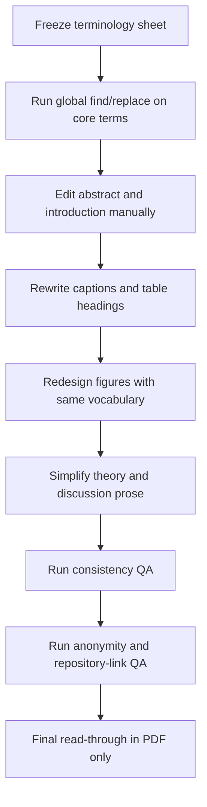

# Revision Plan for Removing AI-Style Wording and Standardizing the ESWA Manuscript

## Executive summary

Your manuscript is now structurally close to submission-ready: the late-July submission pass reports a 50-page named manuscript, a 49-page anonymized manuscript, and a 9-page supplement, with the remaining open gate being the anonymous public repository link rather than new experiments. fileciteturn0file4

The main remaining risk is **presentation quality**, not scientific completeness. In its current late-July form, the manuscript still shows four stylistic problems that ESWA reviewers and editors are likely to notice quickly: **invented or branded terminology**, **drift in naming the same concept across sections and builds**, **dense phrasing that reads like model-generated text rather than field-standard technical prose**, and **internal experiment labels that are meaningful to the lab but not to outside readers**. That diagnosis is consistent with ESWA’s own guidance: the journal explicitly discourages renaming existing concepts, asks authors to use standard optimization terminology, and emphasizes clarity over superficial novelty in presentation. citeturn3view0

A good revision pass for ESWA should therefore do three things at once. First, it should freeze a **single controlled vocabulary** for the whole paper. Second, it should replace prose that sounds “AI-written” with shorter, more concrete, reader-facing sentences. Third, it should bring the figures into the same house style: fewer words inside panels, fewer colors, clearer comparator names, and captions that explain the scientific point rather than restate the graphic. Those priorities are also aligned with broader scholarly style guidance: APA frames good scholarly style as concise, elegant, and clear; IEEE emphasizes consistency in punctuation, abbreviations, headings, and references; NIH plain-language guidance stresses telling readers exactly what they need to know without unnecessary wording; and PLOS and Nature both recommend concise, accessible, well-structured scientific prose. citeturn6search0turn2view2turn7search2turn7search3turn7search7turn7search0

The key editorial conclusion is simple: **do not add new content to solve a language problem**. Instead, run a controlled style pass with a frozen terminology sheet, a figure-specific redesign plan, and a QA checklist that audits consistency, anonymity, captions, comparator names, and repository wording before submission. ESWA’s Guide for Authors supports exactly this kind of clean-up: it requires double-anonymized submission, a concise factual abstract under 250 words, separate figure files, captions supplied with submission, a data-availability statement, and prohibits generative AI in submitted figures. citeturn4view0turn4view1turn4view2turn4view3turn4view4turn4view5turn9view0

## House style for the final manuscript

### AI-style elimination rules

The table below is the rule set I would use as the manuscript’s **final editorial style contract**. It is tailored to applied-AI journal writing and specifically to ESWA’s preference for standard terminology and clear problem–method–evidence presentation. citeturn3view0turn6search0turn2view2turn7search2turn7search7

| Pattern to eliminate | Do | Do not | Why it matters |
|---|---|---|---|
| Branded or invented phrasing | Use a standard field term first, then define the project-specific name once | Rebrand ordinary ideas as “prediction-driven,” “contextual,” “stress-test,” or “scaffolded” everywhere | ESWA explicitly discourages renaming existing concepts and asks for standard optimization terminology. citeturn3view0 |
| Long noun chains | Break into two clauses with a clear head noun | Write phrases like “validation-normalized equal-regime macro score” repeatedly in running prose | Dense stacks make prose sound synthetic and force rereading. citeturn7search2turn7search7 |
| Internal lab labels in main text | Translate them once into reader-facing names | Use “exact-label reference,” “warning-score rule,” “action-trace checks,” “supplementary references” without explanation | Reviewers understand *oracle baseline*, *warning heuristic*, *action-sequence diagnostics* faster than internal tags. |
| Over-signposted rhetoric | State the claim directly | Use meta-phrases like “the result is not explained by…” in the Introduction unless essential | Introductory prose should define the problem, question, and contribution, not litigate every reviewer objection upfront. |
| Pseudo-objectivity through abstraction | Use concrete subject–verb–object sentences | Overuse passives and nominalizations like “the comparison is about the observation pattern induced…” | Clear technical writing is easier to review and less likely to sound AI-generated. citeturn7search2turn7search3 |
| Comparator family names | Name the actual comparators | Say “rule-based references” when you mean AoI, round-robin, and random only | Precision prevents overclaiming and avoids scope drift. |
| Unstable terminology | Freeze one term per concept in a style sheet | Alternate among “forecaster,” “forecasting family,” “fixed forecasting model,” and “evaluator” without rule | Consistency is a core editorial requirement in IEEE-style technical writing. citeturn2view2 |
| Excessive hedging or theatrical phrasing | Use measured claims with exact scope | Use “support,” “localize,” “sharpen,” “delimit,” or “stress-test” repeatedly as rhetorical fillers | These terms are not wrong, but repeated use creates an AI-toned cadence. |
| Too much text in figures | Move explanation to caption or panel notes | Put sentence fragments and procedure details inside every box | Elsevier asks authors to keep text in figures to a minimum and supply captions separately. citeturn9view0 |
| Color as the only visual code | Use direct labels, shapes, line types, and high contrast | Depend on hue alone to convey comparator groups or wins/losses | Elsevier recommends color-blind-safe palettes, high contrast, and non-color encodings when possible. citeturn8view0turn8view1turn8view2 |
| Results language that sounds like internal auditing | Use publication-facing wording | Say “scoreable epochs,” “non-fixed checks,” “held-out diagnostic,” “validation-mapped” unless the phrase is formally defined | These are lab-valid terms, but not journal-natural terms. |
| Self-referential manuscript phrasing | Describe the method, evidence, or implication | Write “the paper makes three contributions” too often or in too many sections | One clear contribution list is enough; repetition feels templated. |

### Preferred sentence shape

The best default sentence pattern for this paper is:

> **Problem → operational constraint → method → evidence → claim boundary**

For example:

> Under a power budget, the scheduler can activate only one specialist channel at a time. We therefore model channel selection as a constrained sequential decision problem and train a masked PPO policy with forecast loss from a fixed forecaster. In 24 evaluation seeds, the learned policy outperforms the validation-selected fixed schedule and the conventional AoI, round-robin, random, and one-step greedy schedules. Competitive oracle-style and warning-based references show that event information accounts for much of the remaining headroom. fileciteturn0file2

That structure reads like a human technical author: concrete, sequential, and evidence-bounded.

## Priority edit map

### What to edit first

The manuscript already shows terminology drift across nearby builds. For example, recent versions alternate among **“contextual specialist scheduling,” “prediction-driven sensing system scheduling,” “sensing system scheduling under a power constraint,” “equal-weight regime score,” “regime-balanced macro score,” “validation-normalized equal-regime macro score,” “held-out seeds,” “final seeds,”** and **“post-pilot replication.”** fileciteturn0file8turn0file9turn0file5turn0file2

That is fixable, but only if you edit in the right order. The first pass should be **terminology freezing**, not sentence polishing, because line-editing before a vocabulary freeze just creates rework.

| Section or figure | Priority | Why it matters most | Main revisions |
|---|---|---|---|
| Abstract | High | Editors and reviewers form their first impression here; it still contains internal wording like “24 final seeds,” “unchanged 22-seed post-pilot replication,” “scoreable final-partition epochs,” and “four-specialist actions pass non-fixed and non-cyclic checks.” fileciteturn0file2 | Replace with standard terms, reduce noun stacks, remove internal audit phrasing |
| Introduction | High | The Introduction still carries legacy wording from earlier versions such as “contextual specialist scheduling,” “rule-based schedules,” “action-trace analysis,” “supplementary references,” and “claim-boundary references.” fileciteturn0file8turn0file9turn0file5 | Freeze reader-facing problem statement and comparator names |
| Figure 1 and its caption | High | This is the visual entry point and currently bears the heaviest text burden; earlier and recent builds show dense flow boxes and labels such as “Training labels,” “supplementary references,” and multiple nested subpanels. fileciteturn0file0turn0file2 | Rebuild as one clean workflow plus one training-only inset |
| Comparator terminology across Results and captions | High | Terms drift across builds: “rule-based,” “conventional,” “warning-score rule,” “supplied-warning rule,” “exact-label diagnostic,” “exact-label reference.” fileciteturn0file5turn0file2turn0file3 | Standardize every baseline label and audit every caption |
| Problem Formulation around Proposition 1 | Medium | The theory is useful, but phrases like “label-informed policy,” “validation-mapped diagnostic,” and “observable regime evidence” are denser than needed. fileciteturn0file3turn0file9 | Keep the math; simplify the prose around it |
| Background and Related Work | Medium | Mostly sound, but the tone is sometimes abstract and there is at least one copy-editing error: “an demanding reference.” fileciteturn0file3turn0file5 | Tighten wording and correct grammar |
| Results section captions and discussion lead sentences | Medium | This is where internal experiment language tends to creep in again. | Replace lab-facing labels with comparator-facing labels |
| Supplementary material labels | Low | Important for consistency, but less visible to editors at first pass. | Harmonize terms after the main text is frozen |
| Keywords and abbreviations | Low | Easy cleanup, but minor compared with abstract and captions. | Remove overly branded phrases if still present |

### The vocabulary freeze you should enforce

Before editing line by line, adopt this **one-term-per-concept sheet** for the whole paper:

- **Method**: PD-PPO on first mention; after that, **the PD-PPO policy** or **the learned policy**
- **Task**: **sensor scheduling under power constraints**
- **Action object**: **feasible channel subset** or **feasible action**
- **Primary static comparator**: **validation-selected fixed schedule**
- **Conventional comparators**: **AoI-priority**, **round-robin**, **random**, **one-step greedy**
- **Strong contextual comparator**: **warning-score heuristic**
- **Privileged comparator**: **oracle regime-label baseline**
- **Learned-policy comparator**: **matched Double-DQN**
- **Primary loss metric**: **mean forecast loss**
- **Secondary metric**: **regime-balanced macro score**
- **Seeds**: **24 evaluation seeds, including a 22-seed post-pilot replication**
- **Replay**: **continuous final-partition replay** or **full-partition replay**
- **Behavior analysis**: **action-sequence diagnostics**

Do not allow synonyms once this map is adopted.

## Representative rewrites

The table below gives **representative patch targets** from the recent uploaded builds. Because I do not have line-locked `.tex` snippets for every page in this report, treat them as **source-accurate but patch-oriented examples** to verify against your working files before a mechanical replace. The quoted passages are drawn from the recent late-July main builds and nearby versions. fileciteturn0file2turn0file3turn0file5turn0file8turn0file9

| Original text | Diagnosis | Concise rewrite | Formal rewrite | Source |
|---|---|---|---|---|
| “Across 24 final seeds, including an unchanged 22-seed post-pilot replication…” | “final seeds” and “unchanged” are internal-status wording, not reader-facing scientific prose. | “Across 24 evaluation seeds, including a 22-seed post-pilot replication…” | “Results are reported over 24 evaluation seeds, of which 22 belong to the post-pilot replication set run after the configuration was fixed.” | fileciteturn0file2 |
| “Continuous replay over all 5,242 scoreable final-partition epochs preserves 24/24 wins.” | “scoreable final-partition epochs” is lab jargon. | “Continuous replay over all 5,242 evaluable epochs in the final partition preserves 24/24 wins.” | “When the frozen policies are replayed over all 5,242 evaluable epochs in the final partition, PD-PPO retains 24/24 wins.” | fileciteturn0file2 |
| “Its four-specialist actions pass non-fixed and non-cyclic checks in all seeds and produce no warm-up aborts.” | “four-specialist actions,” “non-fixed checks,” and “non-cyclic checks” sound internal and unclear. | “The learned action sequences are neither fixed nor cyclic in any seed, and no warm-up aborts occur.” | “Action-sequence diagnostics show that the learned schedules are neither fixed nor periodic in any evaluation seed, and no warm-up aborts are observed.” | fileciteturn0file2 |
| “Handcrafted warning-score and exact-label references remain competitive…” | “handcrafted” plus two internal labels creates avoidable jargon. | “The warning-score heuristic and the oracle regime-label baseline remain competitive…” | “The warning-score heuristic and the oracle regime-label baseline remain competitive with PD-PPO, indicating that regime information accounts for much of the remaining scheduling value.” | fileciteturn0file2turn0file3 |
| “The method therefore learns over the action set that the sensing system can execute, rather than learning unconstrained choices that are repaired after selection.” | Correct idea, but long, explanatory, and slightly rhetorical. | “The policy learns directly over feasible actions.” | “Because infeasible actions are removed before sampling, the policy is trained only on actions that satisfy the operating constraints.” | fileciteturn0file1turn0file2 |
| “Training uses labelled auxiliary signals from the policy-training partition to improve representation learning…” | “labelled auxiliary signals” is vague; “policy-training partition” is clunky. | “During training, auxiliary labels from the training partition improve the state representation.” | “Auxiliary labels are used only during policy training to improve representation learning; they are not used at deployment.” | fileciteturn0file1turn0file2 |
| “This choice makes the comparison about the observation pattern induced by each scheduler.” | Awkward abstraction; sounds synthetic. | “This isolates the effect of each scheduler’s observation pattern.” | “Using one frozen forecaster isolates performance differences due to the observation pattern generated by each scheduler.” | fileciteturn0file2 |
| “A strong fixed subset is therefore an demanding reference.” | Grammar error and slightly awkward noun phrase. | “A strong fixed subset is therefore a demanding reference.” | “A strong fixed subset therefore provides a demanding comparison point.” | fileciteturn0file3turn0file5 |
| “The condition states when observable regime evidence can make dynamic specialist allocation valuable.” | Abstract and generic. | “The condition identifies when regime-dependent scheduling can help.” | “The condition identifies cases in which observable regime cues can justify changing the selected specialist over time.” | fileciteturn0file2turn0file3 |
| “The exact-label replay summarized in Supplementary Table S11 is a finite, validation-mapped diagnostic…” | “exact-label replay,” “finite,” and “validation-mapped diagnostic” are internal and over-technical. | “The oracle regime-label baseline in Supplementary Table S11 uses held-out regime labels under the fixed evaluation mapping.” | “Supplementary Table S11 reports an oracle regime-label baseline that receives the held-out simulator regime label under the same evaluation mapping used in the main experiment.” | fileciteturn0file3 |
| “Prediction-driven sensing system scheduling.” | Good title phrase in isolation, but repeated branding feels unnecessary. | “Forecast-based sensor scheduling under power constraints.” | “Sensor scheduling under power constraints with forecast-loss-based reinforcement learning.” | fileciteturn0file2turn0file9 |
| “supplementary references” | Internal categorization, not reader-facing language. | “additional comparators” | “additional diagnostic comparators” | fileciteturn0file8turn0file9 |

### Rewrite pattern to apply globally

A reliable mechanical rule for this paper is:

- Replace **branded adjective + abstract noun** with **standard noun + operational qualifier**
- Replace **internal comparator label** with **plain comparator name**
- Replace **auditing phrase** with **result statement**

Examples:

- `prediction-driven scheduler` → `forecast-loss-based scheduler`
- `exact-label reference` → `oracle regime-label baseline`
- `action-trace checks` → `action-sequence diagnostics`
- `rule-based references` → `AoI-priority, round-robin, and random schedules`
- `scoreable epochs` → `evaluable epochs`

## Terminology and figure redesign

### Glossary of invented or drifting terms

The manuscript’s terminology drift is visible across recent builds. For example, closely related versions alternate among **“contextual specialist scheduling,” “prediction-driven constrained decision problem,” “sensing system scheduling,” “equal-weight regime score,” “regime-balanced macro score,” “validation-normalized equal-regime macro score,” “warning-score rule,” “supplied-warning rule,”** and **“exact-label diagnostic/reference.”** fileciteturn0file8turn0file9turn0file5turn0file2turn0file3

Use the glossary below as the canonical replacement map.

| Current or variant term | Problem | Recommended replacement | Use note |
|---|---|---|---|
| prediction-driven | Vague branding | forecast-loss-based | Use when the reward is forecast loss |
| contextual specialist scheduling | Invented and narrow | sensor scheduling with one selectable specialist channel | Best in abstract/introduction if the one-specialist geometry matters |
| executable channel subset | Acceptable but long | feasible channel subset | Shorter and standard |
| candidate channel mask | Internal implementation term | candidate feasible action | Use in prose; keep “mask” in equations/code discussion |
| feasible mask / masked policy | Fine in methods | feasible action / masked policy | Use “mask” only where the implementation matters |
| warning-score rule | Internal comparator label | warning-score heuristic | Clear and standard |
| supplied-warning rule | Inconsistent variant | warning-score heuristic | Delete entirely |
| exact-label reference | Internal label | oracle regime-label baseline | Best standard replacement |
| exact-label diagnostic | Inconsistent variant | oracle regime-label baseline | Same term everywhere |
| action-trace diagnostics | Understandable but lab-like | action-sequence diagnostics | Better publication wording |
| fixed-schedule replay | Slightly internal | replay evaluation of frozen schedules | Use in detail; keep “fixed-schedule replay” only if defined once |
| regime-balanced macro score | One of several variants | regime-balanced macro score | Freeze to this unless you need the equation-specific long form once |
| validation-normalized equal-regime macro score | Too long for routine prose | regime-balanced macro score | Define once in Methods, then shorten |
| equal-weight regime score | Incomplete shorthand | regime-balanced macro score | Delete |
| held-out seeds / final seeds / evaluation seeds | Drift | evaluation seeds | Then specify “including a 22-seed post-pilot replication” |
| strong comparator | Vague | warning-score heuristic / oracle regime-label baseline / matched Double-DQN | Name the actual comparator |
| second frozen forecasting family | Awkward | alternative frozen forecaster | Plain and precise |
| rule-based references | Too broad | AoI-priority, round-robin, and random schedules | Name them explicitly |
| claim-boundary references | Author-facing language | additional diagnostic comparators | Use sparingly |
| training scaffold | Jargon | shared training setup | Simpler |
| learned-policy control | Lab language | matched Double-DQN baseline | Prefer the model’s actual name |
| specialist duty | Potentially informal | specialist selection frequency | Use if “duty” is not formally defined |

### Figure and graphic guidelines for ESWA

Elsevier requires figures to be supplied as separate files, cited in the text, numbered in sequence, and accompanied by captions. It also recommends keeping text in figures to a minimum, using color-blind-safe palettes, ensuring high contrast, and not relying on color alone where shapes, positions, or line types can do the job. ESWA further prohibits generative AI in submitted figures unless the image generation itself is part of the research method. citeturn4view3turn4view4turn8view0turn8view1turn8view2turn9view0

I recommend the following **house figure style** across all four main figures:

- **Font**: one sans-serif font throughout, with 8–10 pt effective print size
- **Line weight**: 1.0–1.2 pt minimum for axes and connectors
- **Palette**: grayscale plus 3–4 color-blind-safe accents only  
  - blue `#0072B2`
  - orange `#E69F00`
  - green `#009E73`
  - purple `#CC79A7`
  - neutral gray `#666666`
- **Encoding rule**: color for comparator family, shape or line type for method class, direct labels where possible
- **Captions**: one brief title sentence, then 2–3 evidence sentences; do not repeat obvious visual structure
- **Inside-panel text**: nouns only; move verbs and explanations to the caption
- **Abbreviations**: if an abbreviation appears only once, spell it out instead

### Concrete redesigns for the four main figures

| Figure | Current problem | Recommended redesign | Labels to use | Accessibility notes |
|---|---|---|---|---|
| Figure 1 | Too text-heavy; combines chronology, online loop, training-only updates, sensor list, and implementation detail in one dense graphic; earlier/recent builds also use internal labels such as “supplementary references” and “training labels.” fileciteturn0file0turn0file2 | Split visually into **one top timeline** and **one bottom online decision loop**, with a small dashed training-only feedback arrow. Remove detailed sensor list from the figure. | Top: “Forecaster fit,” “Policy training,” “Validation,” “Final evaluation.” Bottom: “Observation update,” “Policy network,” “Feasibility filter,” “Execute subset.” Dashed return: “Forecast-loss update.” | Use no more than four colors; use dashed borders for training-only elements; keep all box text under 4 words where possible. |
| Figure 2 | The conceptual proposition figure is readable but still box-heavy and text-dense for a theorem schematic. | Convert to a **two-step logic figure**: left panel is a simple regime × specialist matrix; right panel is a fixed-vs-adaptive comparison with a single inequality strip below. | “Best specialist by regime,” “Best fixed specialist,” “Adaptive policy,” “Macro loss of fixed schedule > macro loss of adaptive policy.” | Use green only for regime-matched cells and gray for mismatches; add text labels instead of relying on fill color alone. |
| Figure 3 | The core results figure is compact but crowded; win counts, percentages, comparator groups, and y-axis meanings compete for attention. | Rebuild as a **2×2 results dashboard**: A) seed-level margins vs fixed schedule, B) box/strip summaries for conventional comparators, C) strong comparators, D) a compact numerical summary panel. | Use comparator names directly: “Fixed,” “AoI,” “Round robin,” “Random,” “1-step greedy,” “Warning-score,” “Oracle label,” “Double-DQN.” Use one y-axis label: “Macro margin vs PD-PPO.” | Keep the same y-axis direction in every panel; use horizontal zero lines; use direct labels rather than legend-only decoding. |
| Figure 4 | Scientifically useful, but the heatmap, seed-count bar chart, and behavior scatter compete visually; labels are small and “MI,” “entropy,” and switching are not equally legible. | Rebuild as **behavior figure with one dominant panel**: A) large heatmap of specialist selection frequency by regime, B) small bar chart of fixed-schedule selections, C) larger two-axis behavior plot using shape or label for switching-rate bands. | “Selection frequency by regime,” “Fixed-schedule specialist,” “Action entropy,” “Regime–action mutual information,” “Switches per 1000 steps.” | Do not use a rainbow map; use a sequential single-hue heatmap; encode switching with marker size or labeled bands instead of hue alone. |

### Caption models for the four figures

Use caption structure like this:

- **Figure 1**: “Workflow of forecaster fitting, policy training, validation, and final evaluation. The top row shows the chronological partitioning. The bottom row shows the online scheduling loop, in which the policy scores feasible channel subsets and the training-only forecast-loss update is applied only during policy training.”
- **Figure 2**: “Conceptual condition for adaptive value when different regimes prefer different specialists. No fixed specialist can match the best regime-specific choice in every regime, whereas an adaptive policy can change specialists when the operating rules permit.”
- **Figure 3**: “Primary and comparator results for PD-PPO. Positive margins favor PD-PPO. Panels separate comparisons against the fixed schedule, conventional heuristics, and stronger diagnostic baselines.”
- **Figure 4**: “Specialist allocation patterns and action-sequence diagnostics. The learned policy reallocates specialists across regimes, whereas the fixed reference keeps one specialist throughout evaluation.”

### Sample mockup for a redesigned Figure 1

```svg
<svg width="860" height="300" xmlns="http://www.w3.org/2000/svg">
  <style>
    .box { fill:#ffffff; stroke:#666666; stroke-width:1.2; rx:8; ry:8; }
    .blue { stroke:#0072B2; }
    .green { stroke:#009E73; }
    .orange { stroke:#E69F00; }
    .dash { stroke-dasharray:6 4; }
    .txt { font: 14px Arial, sans-serif; fill:#222222; }
    .small { font: 12px Arial, sans-serif; fill:#444444; }
    .arrow { stroke:#666666; stroke-width:1.4; marker-end:url(#m); fill:none; }
  </style>
  <defs>
    <marker id="m" viewBox="0 0 10 10" refX="8" refY="5" markerWidth="6" markerHeight="6" orient="auto-start-reverse">
      <path d="M0,0 L10,5 L0,10 z" fill="#666666"/>
    </marker>
  </defs>

  <!-- top timeline -->
  <rect class="box blue" x="20" y="20" width="180" height="45"/>
  <text class="txt" x="35" y="48">Forecaster fit</text>

  <rect class="box green" x="230" y="20" width="180" height="45"/>
  <text class="txt" x="245" y="48">Policy training</text>

  <rect class="box" x="440" y="20" width="180" height="45"/>
  <text class="txt" x="455" y="48">Validation</text>

  <rect class="box orange" x="650" y="20" width="180" height="45"/>
  <text class="txt" x="665" y="48">Final evaluation</text>

  <path class="arrow" d="M200 42 L230 42"/>
  <path class="arrow" d="M410 42 L440 42"/>
  <path class="arrow" d="M620 42 L650 42"/>

  <!-- online loop -->
  <rect class="box blue" x="40" y="120" width="150" height="55"/>
  <text class="txt" x="55" y="150">Observation update</text>

  <rect class="box green" x="260" y="120" width="150" height="55"/>
  <text class="txt" x="285" y="150">Policy network</text>

  <rect class="box orange" x="480" y="120" width="150" height="55"/>
  <text class="txt" x="503" y="150">Feasibility filter</text>

  <rect class="box green" x="700" y="120" width="120" height="55"/>
  <text class="txt" x="725" y="150">Execute subset</text>

  <path class="arrow" d="M190 147 L260 147"/>
  <path class="arrow" d="M410 147 L480 147"/>
  <path class="arrow" d="M630 147 L700 147"/>

  <!-- training-only -->
  <rect class="box dash orange" x="300" y="225" width="180" height="45"/>
  <text class="txt" x="322" y="252">Forecast-loss update</text>
  <path class="arrow dash" d="M760 175 L760 210 L480 210 L480 225"/>
</svg>
```

Use this as a structural template, not as final production art.

### Sample Matplotlib scaffold for a redesigned Figure 3

```python
import matplotlib.pyplot as plt
import pandas as pd

# expected columns:
# comparator, seed, macro_margin, group
# group in {"fixed", "conventional", "strong"}

fig = plt.figure(figsize=(8.5, 6.5))

ax1 = fig.add_axes([0.08, 0.58, 0.38, 0.32])  # fixed vs PD-PPO
ax2 = fig.add_axes([0.55, 0.58, 0.37, 0.32])  # conventional comparators
ax3 = fig.add_axes([0.08, 0.12, 0.37, 0.32])  # strong comparators
ax4 = fig.add_axes([0.55, 0.12, 0.37, 0.32])  # numerical summary

# Panel A: seed-level dot plot
fixed = df[df["comparator"] == "Fixed"].sort_values("macro_margin")
ax1.scatter(range(len(fixed)), fixed["macro_margin"], s=18)
ax1.axhline(0, linewidth=1)
ax1.set_title("A  Fixed schedule")
ax1.set_ylabel("Macro margin vs PD-PPO")
ax1.set_xlabel("Seeds")

# Panel B: strip + summary for conventional comparators
order = ["AoI", "Round robin", "Random", "1-step greedy"]
for i, name in enumerate(order):
    x = [i] * len(df[df["comparator"] == name])
    y = df[df["comparator"] == name]["macro_margin"]
    ax2.scatter(x, y, s=16, alpha=0.8)
ax2.axhline(0, linewidth=1)
ax2.set_xticks(range(len(order)))
ax2.set_xticklabels(order, rotation=20, ha="right")
ax2.set_title("B  Conventional comparators")
ax2.set_ylabel("Macro margin vs PD-PPO")

# Panel C: strong comparators
order = ["Warning-score", "Oracle label", "Double-DQN"]
for i, name in enumerate(order):
    x = [i] * len(df[df["comparator"] == name])
    y = df[df["comparator"] == name]["macro_margin"]
    ax3.scatter(x, y, s=16, alpha=0.8)
ax3.axhline(0, linewidth=1)
ax3.set_xticks(range(len(order)))
ax3.set_xticklabels(order, rotation=20, ha="right")
ax3.set_title("C  Strong comparators")
ax3.set_ylabel("Macro margin vs PD-PPO")

# Panel D: compact text summary
ax4.axis("off")
summary_lines = [
    "Fixed: 24/24 wins",
    "AoI: 24/24 wins",
    "Round robin: 24/24 wins",
    "Random: 24/24 wins",
    "1-step greedy: 24/24 wins",
    "Double-DQN: 24/24 macro wins",
]
for i, line in enumerate(summary_lines):
    ax4.text(0.0, 0.95 - i * 0.12, line, fontsize=11, transform=ax4.transAxes)

fig.suptitle("Core final-partition comparisons", y=0.98)
plt.show()
```

This scaffold deliberately reduces color dependence and makes the comparison structure visually explicit.

## Implementation workflow and final QA

### Patch-style change log

Apply the revision in **controlled passes**, not simultaneous free editing. This keeps terminology drift from reappearing.

| Patch | Files most affected | What changes |
|---|---|---|
| terminology freeze | abstract, intro, results, captions, tables | Standardize method, metric, seed, and comparator names |
| de-jargon pass | abstract, intro, discussion, captions | Replace lab-internal labels with reader-facing names |
| sentence simplification pass | abstract, intro, theory prose, discussion | Split long sentences; remove stacked modifiers and abstract fillers |
| comparator precision pass | results, tables, figures | Replace broad families such as “rule-based” with explicit comparator lists |
| figure-label pass | all figure source files and captions | Reduce text inside graphics; align labels with frozen vocabulary |
| caption pass | figure/table captions only | Make captions do scientific interpretation, not graphic narration |
| supplement consistency pass | supplement, appendix references | Use the same comparator and metric names as the main text |
| anonymity/data pass | anonymized manuscript, title page, data statement | Verify anonymous links, repository wording, and no leaked identifiers |

### Suggested git-friendly commit messages

Use small commits with scopes that reviewers and coauthors can audit easily.

```text
style: freeze core terminology across abstract intro and results
style: replace internal experiment labels with reader-facing comparator names
style: simplify abstract and remove audit-style wording
style: shorten theory prose around proposition 1 and oracle baseline
results: standardize metric and seed-scope wording in text tables and captions
figures: redesign workflow figure with reduced in-panel text
figures: unify comparator labels and color-safe styling across all main figures
captions: rewrite figure and table captions for concise ESWA style
supplement: harmonize terminology with main manuscript
qa: audit anonymity figure metadata and repository wording before submission
```

### Editing workflow



### Final QA checklist

This is the checklist I would require before calling the manuscript stylistically finished.

#### Consistency

- One term per concept across abstract, introduction, methods, results, discussion, captions, and supplement
- One seed phrase everywhere: **24 evaluation seeds, including a 22-seed post-pilot replication**
- One metric short name everywhere: **regime-balanced macro score**
- One privileged baseline name everywhere: **oracle regime-label baseline**
- One strong heuristic name everywhere: **warning-score heuristic**
- Comparator family names replaced by explicit comparator lists where needed
- No remaining “rule-based references” unless all listed rules are actually intended
- No remaining drift between **forecaster**, **forecasting model**, **evaluator**, and **forecasting family** without a deliberate rule

#### Style

- No sentence over ~35 words in abstract or contribution list unless mathematically necessary
- No stacked phrases like “validation-normalized equal-regime macro score” more than once outside formal definition
- No unexplained internal labels: `scoreable`, `non-fixed`, `non-cyclic`, `validation-mapped`, `supplementary reference`, `stress-test reference`, `held-out diagnostic`
- No rhetorical filler like “sharpen the interpretation,” “localize the claim,” “support the interpretation” unless it adds scientific content
- No grammar slips such as “an demanding”
- Contribution list uses parallel grammar

#### Figures

- Every figure supplied as separate vector or accepted high-resolution file
- No generative-AI-created or AI-altered figure assets in the submission package
- Same font family and comparable lettering size across all figures
- Same comparator names in figures and text
- Same directionality of margins across figures
- Zero line shown wherever positive/negative margins are plotted
- Color-blind-safe palette and sufficiently high contrast
- No figure depends on color alone to distinguish comparator groups
- Text inside figures minimized; prose moved to captions
- Captions stored and reviewed separately, as Elsevier recommends

#### Anonymity and repository links

- Anonymous manuscript contains no names, affiliations, emails, acknowledgements, repository owners, or lab paths
- Anonymous repository link is real, public, and identity-safe
- Data Availability statement and repository citation use the same anonymous URL
- Source bundle and figure metadata contain no author identity
- No hidden metadata in SVG/PDF figure files
- No old build strings, superseded seed notes, or historical terminology leak into the anonymized package

#### Submission readiness

- Abstract remains under 250 words
- Highlights remain 3–5 bullets and under 85 characters each
- Every figure is cited in the manuscript text
- Every supplementary file is cited in the manuscript text
- Captions refer to what the figure shows and why it matters
- Final PDF pass done **as a reader**, not as the author: title, abstract, Figure 1, Figure 3, Discussion, Data Availability, references

### The shortest path to completion

If you want the highest-yield order of operations, do it in this sequence:

1. **Freeze the vocabulary sheet**
2. **Rewrite the abstract completely**
3. **Rewrite the first two Introduction pages**
4. **Redesign Figure 1**
5. **Rename all comparators and metrics globally**
6. **Rewrite all figure captions**
7. **Simplify theory prose around Proposition 1**
8. **Run the final QA checklist in PDF form**

That sequence will remove most of the “AI-style” impression quickly because readers usually detect it first in the abstract, opening pages, and figures—not deep in the appendix. This approach is also the most ESWA-aligned one: clear methods, standard terminology, concise exposition, accessible figures, proper anonymization, and clean submission packaging. citeturn3view0turn4view0turn4view1turn4view3turn4view4turn4view5turn8view0turn9view0turn6search0turn2view2turn7search2turn7search7turn7search0