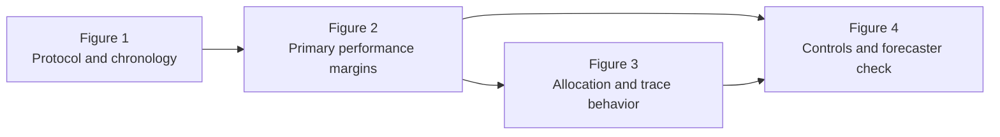

# Focused Revision Report for the ESWA Anonymous Manuscript and Submission Package

## Executive summary

The current submission package is close to copy-editing completion, not scientific redevelopment. The audit log identifies a 49-page anonymous manuscript, a 50-page named manuscript, a 9-page supplement, and four separate vector figures in `submission/eswa_pdppo_20260719/`. It also confirms that Figure 1 is script-generated rather than AI-generated. fileciteturn0file6

The remaining problems are mainly editorial. The manuscript still mixes several parallel term families for the same idea, especially for the macro metric, warning-based references, label-based references, replay checks, and control experiments. It also retains some AI-style phrasing: stacked noun modifiers, overcompressed abstract clauses, method-brand repetition, vague evaluative wording, and internal lab shorthand that is too close to development language. The figure set is scientifically sound but stylistically uneven: Figure 1 is text-dense, Figure 2 uses underspecified labels, Figure 3 mixes naming conventions across panels, and Figure 4 needs more direct axis language and a shorter caption. The current manuscript already contains the relevant evidence and section structure needed for ESWA; this round should therefore standardize terminology, shorten captions, simplify prose, and harmonize figure styling rather than add content. ESWA also expects concise captions, minimal in-figure text, and properly prepared vector artwork. fileciteturn0file3turn0file6 citeturn0search4turn0search0turn0search2

**Final recommendation:** **Ready for submission after edits.** The only non-copyediting blocker previously recorded is insertion of the real anonymous repository URL into the Data Availability statement once the archive is hosted. fileciteturn0file6

## AI-style language elimination rules

The manuscript’s scientific content is already mature; the main risk is style drift into coined, compressed, or internally convenient phrasing. The rules below are designed to preserve meaning while removing AI-style texture and experimental-lab jargon. They are grounded in patterns visible across the current manuscript and in ESWA’s preference for concise abstracts, brief captions, and minimal text inside figures. fileciteturn0file3 citeturn0search4turn0search3

| Rule | Before | After | Why |
|---|---|---|---|
| Prefer one standard descriptive term after the first formal definition | “prediction-driven reinforcement-learning framework” repeated in multiple forms | Define PD-PPO once, then use “PD-PPO” or “the policy” | Avoids branding every sentence |
| Replace stacked noun phrases with verb-based clauses | “validation-normalized equal-regime macro score” | “regime-balanced macro score” | Easier to read; same meaning if defined once |
| Replace internal control-lab shorthand with reader-facing labels | “learner-control comparison” | “matched Double-DQN control” | Names the actual comparator |
| Use concrete agents instead of abstract constructions | “the method learns over the action set” | “the policy is trained only on feasible actions” | Clearer subject-action structure |
| Avoid compressed contrast formulas | “not as a single-component comparison” | “This is not a component-isolation test” | More direct and readable |
| Avoid vague booster words | “retains,” “captures,” “establishes,” “supports” in clusters | use one precise verb per sentence | Reduces inflated tone |
| Use one term for one comparator family | “warning-score rule / heuristic / supplied-warning rule” | “warning-score rule” | Prevents reviewer confusion |
| Use one term for one privileged comparator | “exact-label reference / event-label reference / privileged event-label reference” | Choose one term and use it everywhere | Essential for reproducibility |
| Replace abstract nouns with plain procedural wording | “rescoring” | “re-scoring with a ridge forecaster” or “ridge-forecaster check” | Makes method steps explicit |
| Prefer short declarative sentences over layered semicolons | long abstract clauses joined by semicolons | split into two sentences | Better for ESWA readability |
| Avoid lab-specific narrative markers | “matched reward-control and learner-control comparisons” | “matched reward controls and a matched Double-DQN control” | Reader does not need internal taxonomy |
| Replace “this setting / this decision surface / this scaffold” when a concrete referent exists | “On this decision surface” | “In this task” | Removes insider language |
| Keep adjective chains short | “fixed-backbone, one-specialist operating rules” | “the fixed-backbone, one-specialist setting” | Less mechanical |
| Prefer “show” or “find” over interpretive inflation | “These results support forecast-aligned masked reinforcement learning” | “These results show that masked RL can improve forecast loss in this setting” | More measured claim |
| Use hyphens only when they prevent ambiguity | “final-partition,” “reward-control,” “learner-control” everywhere | hyphenate only fixed compounds; otherwise write normally | Reduces visual clutter |

## Glossary and terminology standardization

The current submission build mixes several near-synonyms for the same quantity or comparator, especially in the Abstract, Introduction, Results, Discussion, tables, and captions. The table below provides a single standard term for each concept. Where the exact meaning is not fully stable in the visible text, the item is marked **unspecified** and should be confirmed by the authors rather than guessed. The visible package-style manuscript uses four main figures and repeated metric/comparator references across pages 1–41. fileciteturn0file3

| Invented or ambiguous term in current drafts | Standardized term | Preferred abbreviation | Where to use | Author confirmation needed |
|---|---|---|---|---|
| prediction-driven reinforcement-learning framework | PD-PPO policy | PD-PPO | Abstract first mention; Introduction; Conclusion | No |
| sensing system scheduling | sensor scheduling | none | Title; headings; Keywords; prose | No |
| validation-normalized equal-regime macro score | regime-balanced macro score | macro score | Define once in Sec. 3.3; use “macro score” later | No |
| equal-weight regime score | regime-balanced macro score | macro score | Replace everywhere outside formal definition | No |
| selected fixed schedule | validation-selected fixed schedule | fixed schedule after first mention | Abstract; Results; Discussion | No |
| one-step greedy / one-step forecast greedy | one-step forecast-greedy schedule | forecast-greedy | Results; Table 5; captions | No |
| warning-score role / warning-score heuristic / supplied-warning rule | warning-score rule | none | Results; Discussion; Table 5 | No |
| exact-label reference / event-label reference / privileged event-label reference | **event-label reference** | none | Section 3.2 onward | **Yes**: confirm whether labels are regime labels or event-subtype labels |
| event-warning scores / warning scores / synthetic warning scores / early event-warning scores | warning scores | none | Define once in Methods as synthetic early-warning inputs; use “warning scores” afterward | **Yes**: confirm whether “early” is always true and whether signals are always synthetic |
| fixed forecaster / frozen forecaster / common evaluator | fixed forecaster | none | Methods; Results; Discussion | No |
| secondary ridge forecaster / independent ridge forecaster / ridge rescoring | ridge-forecaster check | none | Section 6.5; Figure 4 caption; Discussion | No |
| continuous replay / full-partition replay / continuous full-partition replay | continuous final-partition replay | none | Abstract; Results; Discussion; Conclusion | No |
| action-trace diagnostics / trace diagnostics / action-sequence diagnostics | action-trace diagnostics | none | Methods; Results; captions | No |
| reward controls / reward-control comparison / matched objective controls | matched reward controls | none | Section 6.3; Figure 4 caption | No |
| learner control / matched learned-policy control / matched Double-DQN | matched Double-DQN control | none | Section 6.3; Figure 4 caption | No |
| schedule evaluator / evaluator family | forecaster / forecaster family | none | Section 2.3; Section 6.5 | No |
| supplementary references | additional references | none | Figure 1; Introduction | **Yes**: confirm whether “supplementary” means references in the supplement or extra comparators |
| final seeds | evaluation seeds | none | Abstract; Introduction; Results | No |
| post-pilot seeds run after the configuration was fixed | post-pilot seeds evaluated after architecture selection was frozen | none | Abstract; Introduction; Results | No |
| state-dependent specialist allocation | specialist reallocation by regime | none | Discussion; captions | No |

## Line-level edit checklist

The audit log names `submission/eswa_pdppo_20260719/anonymous_manuscript.pdf`, but that PDF itself was not part of the uploaded files in this session. The package log confirms that the anonymous build mirrors the current named submission build structurally. The page references below therefore use the visible package-style manuscript text and should be mirrored sentence-for-sentence in the anonymous PDF and source files during copy-editing. fileciteturn0file6

### High-priority edits

| Priority | Location | Exact replacement text |
|---|---|---|
| Critical | Title, p. 1 | **Prediction-driven reinforcement learning for sensor scheduling under power constraints** |
| Critical | Abstract, p. 1, first method sentence | **We propose PD-PPO, a masked PPO scheduler that selects feasible channel subsets to reduce downstream multi-step forecast loss.** |
| Critical | Abstract, p. 1, inputs sentence | **The policy uses recent partial observations, ready-sampling age, runtime state, the previous selection, and warning scores.** |
| Critical | Abstract, p. 1, seed sentence | **Across 24 evaluation seeds, including 22 post-pilot seeds evaluated after architecture selection was frozen, PD-PPO reduces mean forecast loss by 10.1% and the regime-balanced macro score by 7.9% relative to the validation-selected fixed schedule.** |
| Critical | Abstract, p. 1–2, replay sentence | **Continuous final-partition replay over 5,242 evaluable epochs preserves 24/24 wins.** |
| Major | Abstract, p. 2, comparator sentence | **PD-PPO also outperforms AoI-priority, round-robin, random, and one-step forecast-greedy schedules in every seed, and yields a lower macro score than matched Double-DQN in every seed.** |
| Major | Abstract, p. 2, trace sentence | **Action-trace diagnostics show neither fixed nor cyclic behavior and record no warm-up aborts.** |
| Major | Abstract, p. 2, ridge sentence | **A ridge-forecaster check preserves a positive macro margin against the ridge-selected fixed schedule in 23/24 seeds.** |
| Major | Abstract, p. 2, final sentence | **These results show that masked RL can improve forecast loss when a power budget forces different measurement choices across operating regimes.** |
| Minor | Keywords, p. 2 | Replace **Sensing system scheduling** with **Sensor scheduling** |
| Major | Introduction, p. 2, opening sentence | **Power budgets can prevent a deployed multi-sensor system from operating all measurement channels at the same time.** |
| Major | Introduction, p. 3, method-introduction sentence | **We propose PD-PPO, a masked PPO scheduler for sensor scheduling under a power budget.** |
| Major | Introduction, p. 3, feasibility sentence | **The policy is trained only on feasible actions; invalid channel subsets never enter the sampling distribution.** |
| Major | Introduction, p. 3, auxiliary-label sentence | **During training, auxiliary labels improve representation learning; they are not used at test time.** |
| Critical | Figure 1 caption, p. 4 | **Figure 1. Training, validation, and final evaluation for PD-PPO. A fixed forecaster is trained first, PD-PPO is trained on forecast loss subject to feasibility masking, and all schedules are replayed on later chronological partitions.** |
| Major | Introduction, p. 4, simulation sentence | **We evaluate the policy in a controlled cold-region monitoring simulation motivated by Antarctic blowing-snow sensing.** |
| Major | Introduction, p. 4, results sentence | **Across 24 evaluation seeds, including 22 post-pilot seeds evaluated after architecture selection was frozen, PD-PPO achieves lower mean forecast loss and lower macro score than the validation-selected fixed schedule in every seed.** |
| Minor | Introduction, p. 5, lead-in | **This paper makes three contributions.** |
| Major | Contribution 1, p. 5 | **It formulates sensor scheduling under a power budget as a constrained sequential decision problem and states when forecast loss, AoI, and uncertainty can rank schedules differently.** |
| Major | Contribution 2, p. 5 | **It implements this problem with masked PPO over feasible channel subsets and a multi-step forecast-loss reward.** |
| Major | Contribution 3, p. 5 | **It evaluates the policy against matched reward controls, a matched Double-DQN control, fixed and heuristic references, action-trace diagnostics, and ridge-forecaster re-scoring.** |

### Terminology and prose simplification edits

| Priority | Location | Exact replacement text |
|---|---|---|
| Minor | Section 2.1, p. 6, topic sentence after the citations | **This change matters in heterogeneous sensing systems.** |
| Major | Section 2.1, p. 6, last sentence | **The evaluation must distinguish adaptive scheduling from a fixed schedule, a simple rotation, and an event-label reference.** |
| Minor | Table 1, p. 7, fourth column header | **How this paper differs** |
| Minor | Table 1, p. 7, DRL row, last cell | **Feasible candidate masks enforce the one-specialist operating rule at execution time.** |
| Major | Section 2.3 heading, p. 8 | **Forecasting models for schedule evaluation** |
| Major | Section 2.3, p. 8, first two sentences | **Modern time-series models make it possible to score the forecasting consequences of a schedule directly. In this paper, one fixed forecaster is used to evaluate all schedules.** |
| Major | Section 3.1 heading, p. 9 | **Forecast objective for sensor scheduling** |
| Minor | Table 2, p. 10, definition of \(o_t\) | **Scheduler observation built from value and mask histories, runtime state, ready-sampling age, the previous mask, budget and time features, and warning scores** |
| Minor | Section 3.1, p. 9, first sentence after Table 2 | **The benchmark uses two channel classes.** |
| Major | Section 3.2, p. 11, first explanatory sentence | **A dynamic advantage arises when no fixed specialist set is best in every regime with positive evaluation weight.** |
| Major | Section 3.2, p. 11, follow-up sentence | **In that case, observable regime evidence can justify changing specialists over time.** |
| Minor | Qualitative guide below the specialist table, p. 11 | **Green marks the preferred specialist for a regime; grey marks a fixed-specialist mismatch.** |
| Major | Section 3.2, p. 12, diagnostic sentence | **The event-label reference in Supplementary Table S11 is a validation-mapped diagnostic with access to held-out labels; it is not an upper bound on feasible deployment performance.** |
| Minor | Section 5.4, p. 28, opening sentence | **Action-trace diagnostics are computed from final-partition action traces.** |
| Major | Section 5.4, p. 28, fixed/cycle sentence | **A trace is flagged as near-fixed when one mask explains at least 95% of actions, and as near-cyclic when a small repeating pattern explains most actions without sufficient state dependence.** |
| Minor | Section 6 opening sentence, p. 28 | **This section reports forecast accuracy, the schedules that produce it, and checks against three alternative explanations: the reward, the learner, and the forecaster.** |
| Major | Section 6.1, p. 28, effect-size sentence | **Relative to the validation-selected fixed schedule, mean forecast loss decreases by 10.1% and the macro score by 7.9%.** |
| Major | Section 6.1, p. 29, replication sentence | **The same result holds in the 22 post-pilot seeds: PD-PPO wins all 22 macro comparisons.** |
| Major | Section 6.1, p. 29, replay sentence | **Continuous final-partition replay shows the same direction over all 5,242 evaluable epochs in each seed.** |
| Minor | Table 5 title, p. 30 | **Table 5. Final-partition comparisons for PD-PPO over 24 evaluation seeds. Positive margins mean that the reference has higher loss than PD-PPO.** |
| Major | Table 5 note, p. 30 | **The fixed, AoI-priority, round-robin, and random schedules are deployable references under the same feasibility constraints. The forecast-greedy schedule uses one-step future loss; the event-label reference uses held-out labels; the warning-score rule uses warning scores.** |
| Critical | Figure 2 caption, p. 31 | **Figure 2. Final-partition margins over 24 seeds. Panel A shows mean-loss and macro-score margins relative to the validation-selected fixed schedule. Panel B compares macro margins across the main reference families.** |
| Minor | Table 6 title, p. 31 | **Table 6. Regime-specific normalized forecast loss for PD-PPO and the validation-selected fixed schedule. Positive margins favor PD-PPO.** |
| Major | Section 6.2, p. 31, sentence introducing Figure 3 | **Figure 3 shows how the policy reallocates specialists across regimes.** |
| Critical | Figure 3 caption, p. 32 | **Figure 3. Specialist allocation under PD-PPO and the fixed schedule. Panel A shows mean specialist duty by regime. Panel B shows the specialist selected for the fixed reference. Panel C summarizes action-trace diversity and state dependence.** |
| Major | Section 6.2, p. 32, diagnostic sentence | **Every PD-PPO trace passes the prespecified checks for state dependence, diversity, non-fixed behavior, and non-cyclic behavior.** |
| Major | Section 6.3, p. 33, opening sentence | **The matched reward controls replace only the scalar reward while keeping the same PPO architecture, observations, feasible masks, training labels, auxiliary task, partitions, and final evaluator.** |
| Major | Section 6.3, p. 33, reward-control sentence | **Differences from forecast-reward PD-PPO are small.** |
| Major | Section 6.3, p. 33, DQN sentence | **In this task, the reported PD-PPO configuration is more reliable than matched Double-DQN.** |
| Major | Section 6.4, p. 33, opening sentence | **The one-step forecast-greedy schedule is a privileged myopic reference.** |
| Major | Section 6.4, p. 35, first sentence of second paragraph | **The warning-score rule and the event-label reference test how much explicit event information explains the observed gains.** |
| Major | Section 6.4, p. 35, final sentence | **The event-label reference is an information-privileged diagnostic, not a deployable policy and not an upper bound on sequential control.** |
| Minor | Section 6.5 heading, p. 35 | **Ridge-forecaster check** |
| Minor | Section 6.5, p. 35, first sentence | **The final trajectories were also re-scored with an independently fitted ridge forecaster.** |
| Critical | Figure 4 caption, p. 36 | **Figure 4. Matched controls and ridge-forecaster check. Panel A compares reward variants. Panel B compares matched Double-DQN with PD-PPO. Panel C shows macro margins under the ridge forecaster.** |

### Discussion and conclusion edits

| Priority | Location | Exact replacement text |
|---|---|---|
| Major | Section 7.1, p. 35–36, opening sentence | **In the one-specialist setting studied here, PD-PPO allocates the scarce measurement slot more effectively than the validation-selected fixed schedule.** |
| Major | Section 7.1, p. 36, replay sentence | **Continuous final-partition replay preserves the fixed-schedule win in every seed, so the result does not depend on the primary sampling windows.** |
| Minor | Section 7.2, p. 37, opening sentence | **Validation selects a strong fixed specialist schedule.** |
| Major | Section 7.2, p. 37, final sentence | **Intermediate duty for all four active specialists, nonzero regime–mask mutual information, and the absence of fixed or cyclic traces distinguish this behavior from both a hidden static schedule and a simple rotation.** |
| Major | Section 7.3, p. 37, opening sentence | **The reward controls clarify what “prediction-driven” means in this paper.** |
| Major | Section 7.3, p. 38, guide-signal sentence | **Because all three PPO variants share the same training labels and auxiliary supervision, the reward-control experiment tests objective substitution within one training setup rather than reward-only learning from scratch.** |
| Major | Section 7.3, p. 38, learner sentence | **The matched Double-DQN control addresses a different question.** |
| Major | Section 7.3, p. 38, one-step-greedy sentence | **The one-step forecast-greedy result gives the clearest evidence for sequential value.** |
| Major | Section 7.4, p. 39, opening sentence | **The warning-score rule and the event-label reference show how much of the remaining value comes from explicit event information.** |
| Minor | Section 7.4, p. 39, final sentence | **These comparisons show that event-signal quality is an important design variable, not a hidden advantage of PD-PPO.** |
| Minor | Section 7.5, p. 39, opening sentence | **The fixed forecaster is used only in training and offline evaluation.** |
| Minor | Section 7.5, p. 40, final sentence | **The best parameterization depends on the number of channels and on whether several specialist combinations provide distinct forecast value.** |
| Minor | Section 7.6, p. 40, opening sentence | **The study uses a controlled generator calibrated to cold-region monitoring, with synthetic warning scores and six logical channels.** |
| Major | Section 7.6, p. 40, metric-boundary sentence | **The reported advantage is established for mean forecast loss and the regime-balanced macro score defined in this paper; it is not claimed to hold under all target or regime weightings.** |
| Major | Conclusion, p. 41, first sentence | **PD-PPO treats sensor scheduling under a power budget as the optimization of downstream forecast loss over feasible channel subsets.** |
| Major | Conclusion, p. 41, final sentence | **Together, these results show that masked sequential learning can translate forecast requirements into feasible sensor decisions when different operating regimes favor different measurements.** |

## Figure audit and regenerated examples

The audit log states that the current submission package contains four separate vector figures and that Figure 1 is generated by a tracked Matplotlib script rather than by a generative image tool. That is fully consistent with ESWA’s figure policy, which requires captions, minimal in-figure text, and disallows generative-AI-created artwork unless AI image generation is itself part of the method. Elsevier’s artwork guidance also recommends consistent embedded fonts, readable lettering at roughly 7 pt or larger at final size, and vector formats such as PDF or EPS for line art and plots. fileciteturn0file6 citeturn0search4turn0search0turn0search2turn0search6

### Figure-by-figure audit

| Figure | Current problems | Exact redesign specs | New concise caption |
|---|---|---|---|
| Figure 1 | Conceptually strong but text-heavy; stage labels are small; “supplementary references” is internal jargon; panelless layout reads like a development diagram rather than a publication figure; top workflow and lower validation note compete for attention. Current discussion of training-only labels is visually heavier than needed. The current caption is too explanatory and repeats the figure text. fileciteturn0file3 | Rebuild as a **single full-width vector flow diagram** at **190 mm** width. Use **one font family** only (Arial/Helvetica or Times-compatible, embedded). Set box labels to **8–8.5 pt** at final size; arrows **0.6–0.8 pt**; outer separators **0.8 pt**. Use one neutral palette: dark gray text, medium gray outlines, and one accent color for the PD-PPO path; avoid multiple saturated stage colors. Reduce box text to short noun phrases. Rename “supplementary references” to “additional references.” Keep only one validation strip below the main pipeline. Export as **PDF**. | **Figure 1. Chronological training, validation, and final evaluation for PD-PPO under feasibility masking.** |
| Figure 2 | The message is important, but the y-axis and panel titles can be more direct. Seed labels are difficult to parse at size. Panel B mixes families with large conceptual differences yet gives them identical visual status. “Macro margins” is understandable only after metric definition. Current caption is too long. fileciteturn0file3 | Keep as **two-panel full-width vector plot** at **180–190 mm**. Use identical y-axis styling in both panels. Rename axes to plain-language forms: “Reference loss − PD-PPO loss” and “Macro-score margin.” Use larger x-label categories with line breaks only where necessary. Replace seed tick labels with either seed numbers at 7 pt or rank-only ticks every fourth seed. Keep two series only in Panel A and use direct legend labels. Use grayscale-safe colors or two colorblind-safe hues. Export as **PDF**. | **Figure 2. Seed-level forecast-loss and macro-score margins relative to the main reference families.** |
| Figure 3 | The scientific content is strong, but the figure mixes naming systems: “Surface IR,” “FC4 flux,” and abbreviated channel names do not fully match prose. Panel C depends on readers knowing what entropy and regime–mask mutual information mean. The heatmap and scatter use small text and thin marks. This is the most visually crowded figure. fileciteturn0file3 | Keep as **three-panel full-width vector figure** at **190 mm**. Standardize channel labels to manuscript terms: “surface infrared,” “FC4 flux,” “laser disdrometer,” “shielded thermo-hygrometer.” Increase all panel labels, axis labels, and annotations to **8 pt minimum**. In Panel A, use a single continuous scale with explicit 0 and 1 anchors. In Panel B, label the y-axis “Number of seeds.” In Panel C, rename axes to “Mask entropy (bits)” and “Regime–action mutual information (bits)” and add a small in-panel note: “Color = switches per 1,000 steps.” If space remains tight, move the fixed-reference panel to the supplement and keep Panels A and C in the main text. | **Figure 3. Specialist allocation patterns and action-trace diversity under PD-PPO and the fixed schedule.** |
| Figure 4 | Compact and evidence-rich, but axis titles currently still reflect internal control language. Panel A uses control abbreviations that require memory load; Panel C should name the forecaster check more directly. Caption is accurate but still longer than necessary. fileciteturn0file3 | Keep as **single full-width vector figure** at **170–180 mm**. Use identical box/interval styling across all three panels. Rename Panel A x-labels to “AoI reward” and “Uncertainty reward”; Panel B to “Matched Double-DQN”; Panel C to “Original fixed schedule” and “Ridge-selected fixed schedule.” Use one horizontal zero line of consistent weight across panels. Fonts **8 pt minimum**; lines **0.6 pt**; export as **PDF**. | **Figure 4. Reward controls, matched Double-DQN, and the ridge-forecaster check.** |

### Simple relationship diagram for the four figures



### Sample vector code for a regenerated Figure 1 layout

```python
# Figure 1 sample: vector-friendly Matplotlib flow diagram
import matplotlib.pyplot as plt
from matplotlib.patches import FancyBboxPatch

fig, ax = plt.subplots(figsize=(11, 3.6))
ax.set_xlim(0, 11)
ax.set_ylim(0, 4)
ax.axis("off")

def box(x, y, w, h, title, body):
    rect = FancyBboxPatch(
        (x, y), w, h,
        boxstyle="round,pad=0.02,rounding_size=0.08",
        linewidth=0.8, facecolor="white", edgecolor="0.25"
    )
    ax.add_patch(rect)
    ax.text(x + 0.15, y + h - 0.28, title, fontsize=8.5, fontweight="bold", va="top")
    ax.text(x + 0.15, y + h - 0.65, body, fontsize=7.5, va="top")

box(0.4, 2.3, 2.0, 1.0, "Stage 1  Forecaster fitting",
    "Train and freeze\nthe forecaster")
box(3.0, 2.3, 2.0, 1.0, "Stage 2  Policy training",
    "Train PD-PPO on\nforecast loss")
box(5.6, 2.3, 2.0, 1.0, "Stage 3  Validation",
    "Select the fixed\nreference")
box(8.2, 2.3, 2.0, 1.0, "Stage 4  Final evaluation",
    "Replay all schedules\non later data")

for x0, x1 in [(2.4, 3.0), (5.0, 5.6), (7.6, 8.2)]:
    ax.annotate("", xy=(x1, 2.8), xytext=(x0, 2.8),
                arrowprops=dict(arrowstyle="->", lw=0.8, color="0.25"))

box(3.2, 0.6, 4.8, 0.9, "Online decision loop",
    "Observation  →  PD-PPO  →  feasibility mask  →  executable subset")

ax.annotate("", xy=(4.0, 2.3), xytext=(4.0, 1.5),
            arrowprops=dict(arrowstyle="->", lw=0.8, color="0.25"))

plt.tight_layout()
plt.savefig("Figure_1_protocol.pdf", bbox_inches="tight")
```

### Sample vector code for a regenerated Figure 2 core plot

```python
# Figure 2 sample: Matplotlib two-panel margin plot
import matplotlib.pyplot as plt
import numpy as np

seed_rank = np.arange(1, 25)
mean_margin = np.array([0.02,0.03,0.05,0.06,0.07,0.08,0.09,0.10,0.11,0.12,0.13,0.14,
                        0.15,0.16,0.17,0.18,0.19,0.20,0.21,0.22,0.23,0.25,0.28,0.31])
macro_margin = np.array([0.01,0.02,0.03,0.04,0.05,0.06,0.07,0.08,0.08,0.09,0.10,0.11,
                         0.12,0.12,0.13,0.14,0.15,0.16,0.17,0.18,0.19,0.20,0.22,0.24])

families = ["Fixed", "AoI", "Round-\nrobin", "Random", "One-step\nforecast-greedy"]
family_margin = np.array([0.08, 0.16, 0.16, 0.16, 0.18])

fig, (ax1, ax2) = plt.subplots(1, 2, figsize=(10.5, 3.4))

ax1.axhline(0, lw=0.8, color="0.4")
ax1.plot(seed_rank, mean_margin, marker="o", linewidth=1.0, label="Mean forecast loss")
ax1.plot(seed_rank, macro_margin, marker="s", linewidth=1.0, label="Macro score")
ax1.set_xlabel("Seed rank")
ax1.set_ylabel("Reference loss − PD-PPO loss")
ax1.legend(frameon=False, fontsize=7.5)

ax2.axhline(0, lw=0.8, color="0.4")
ax2.scatter(np.arange(len(families)), family_margin, s=24)
ax2.set_xticks(np.arange(len(families)))
ax2.set_xticklabels(families)
ax2.set_ylabel("Macro-score margin")

for ax in (ax1, ax2):
    ax.tick_params(labelsize=7.5)
    for spine in ("top", "right"):
        ax.spines[spine].set_visible(False)

plt.tight_layout()
plt.savefig("Figure_2_margins.pdf", bbox_inches="tight")
```

## Change-log template and implementation plan

The package audit already records the current bundle layout, compilation checks, figure status, and the remaining repository-link insertion step. The copy-editing pass should therefore be batched cleanly in version control rather than mixed with scientific changes. fileciteturn0file6

### Change-log template

```text
## YYYY-MM-DD - ESWA language and figure consistency pass

### Scope
- Copy-editing only; no scientific results changed.
- Target files:
  - submission/eswa_pdppo_20260719/anonymous_manuscript.pdf
  - paper/main.tex and affected section files
  - figure source scripts / TikZ files
  - highlights / cover letter / supplementary captions if terminology changed

### Language edits
- Standardized term family:
  - regime-balanced macro score
  - validation-selected fixed schedule
  - warning-score rule
  - event-label reference
  - continuous final-partition replay
  - action-trace diagnostics
- Removed AI-style phrasing:
  - noun stacks
  - internal shorthand
  - repeated method branding
  - overlong captions

### Figure edits
- Rebuilt Figure 1 / 2 / 3 / 4 as vector PDFs.
- Unified font family, caption style, axis wording, and channel labels.
- Confirmed no generative-AI image assets.

### Submission synchronization
- Propagated text changes to:
  - anonymous manuscript
  - named manuscript
  - supplementary material
  - title page / cover letter where relevant
- Recompiled all LaTeX targets.
- Rechecked PDF metadata, links, and anonymity.
```

### Suggested git commit messages

| Batch | Suggested commit message |
|---|---|
| Language cleanup | `copyedit: remove AI-style wording and standardize core terminology` |
| Glossary pass | `docs: add terminology glossary and unify metric/comparator names` |
| Figure rebuild | `figures: regenerate vector figures with unified ESWA styling` |
| Caption cleanup | `copyedit: shorten figure captions and align labels with manuscript terminology` |
| Submission sync | `submission: propagate copyedits to anonymous package and supplement` |
| Final verification | `qa: rebuild PDFs, check anonymity, and refresh submission artifacts` |

### Prioritized implementation plan

| Order | Task | Main outputs | Estimated person-hours |
|---|---|---|---:|
| First | Freeze the terminology list | one approved glossary; author confirmation on “event-label” and “warning scores” | 1.5 |
| Second | Apply global find/replace edits | macro metric, fixed schedule, replay, control, warning/reference names | 2.0 |
| Third | Rewrite Abstract, Introduction lead, contribution list, and Conclusion | cleaner front-facing narrative | 2.5 |
| Fourth | Rewrite Results/Discussion sentences flagged above | removes lab shorthand and AI-style compression | 3.0 |
| Fifth | Rebuild Figure 1 and Figure 2 | new vector files, updated captions | 3.0 |
| Sixth | Rebuild Figure 3 and Figure 4 | label unification, font/axis cleanup | 3.5 |
| Seventh | Propagate wording to supplement, cover letter, and highlights if needed | no term drift across files | 1.5 |
| Eighth | Full package QA | compile, visual scan, anonymity scan, caption consistency | 1.5 |
| Ninth | Insert repository URL if hosted | Data Availability, declarations, checksums | 0.5 |

### Recommended working order

Start with terminology, not sentence polishing. Once the glossary is fixed, apply global replacements, then edit the front matter, then revise the Results/Discussion prose, and only then rebuild the figures so that captions and axis labels match the final terminology. Finish with a package-wide synchronization pass and a short visual QA pass over the anonymous PDF. This order minimizes duplicate work and prevents captions, table notes, and supplement labels from drifting apart. fileciteturn0file3turn0file6

**Final recommendation:** **Ready for submission after edits.** The manuscript does not need more experiments for this round. The remaining work is a disciplined copy-edit and figure-standardization pass, plus insertion of the anonymous repository URL if that external hosting step is still pending. fileciteturn0file6