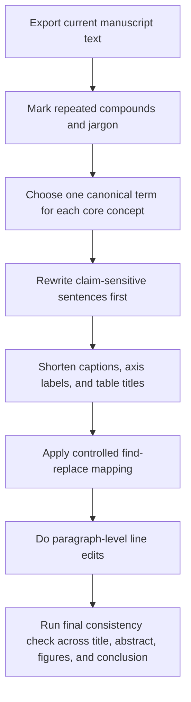

# Detailed Revision Review for AI-Style Wording, Neologisms, Terminology Drift, and Figure Text

## Executive summary

The current retrievable manuscript proxy still carries a noticeable layer of over-engineered phrasing, repeated hyphenated compounds, comparator-label drift, and internal experiment language that will affect reviewer perception before they reach the actual technical contribution. The largest remaining problems are concentrated in the title, abstract, contribution list, control descriptions, comparator naming, and figure captions. In particular, repeated compounds such as “forecast-loss-based,” “regime-balanced,” “validation-selected,” “final-partition,” “ridge-forecaster,” “warning-score,” and “regime-label” make the prose sound machine-generated and internally coded rather than journal-ready. The manuscript also still uses multiple names for the same concepts, especially for the forecaster, fixed schedule, privileged comparator, and macro metric. Figures on pages 4, 30, 32, and 35 are scientifically useful, but their captions and panel text remain denser and more jargon-heavy than they need to be for *Expert Systems with Applications* reviewers. fileciteturn0file0

This report uses the latest retrievable manuscript proxy, `main(43).pdf`, as the primary review target. The requested `anonymous_manuscript.pdf` and `supplementary_material.pdf` were not retrievable in this workspace, so supplementary comments are limited to cross-references visible in the manuscript and to the submission audit note, which states that a 49-page anonymous manuscript and a 9-page supplement exist in the submission bundle. Where the intended meaning is uncertain, I mark the item as **ambiguous** and give alternatives rather than inventing a correction. fileciteturn0file0turn0file7

The highest-priority edits are straightforward. Replace the most artificial hyphen chains, adopt one canonical name for each main concept, simplify the privileged-training statement, make the seed wording plain and stable, and make every caption read like a figure caption rather than a lab notebook headline. These are mostly editorial changes, but a few are **claim-sensitive** because they affect how reviewers will read novelty, fairness, and scope. fileciteturn0file0

## Source scope and high-priority findings

The current manuscript proxy is the named version titled **“Forecast-loss-based reinforcement learning for sensor scheduling under power constraints.”** Its abstract still uses several dense compounds and internal labels in close succession, including “forecast-loss-based reward,” “regime-balanced macro score,” “validation-selected fixed schedule,” “continuous final-partition replay,” “ridge-forecaster check,” “warning-score rule,” and “oracle regime-label baseline.” Those phrases are technically understandable, but in aggregate they give the abstract a coded and overly synthetic tone. fileciteturn0file0

The same pattern persists in the Introduction, Methods, Results, and Discussion. The reward-control paragraph on pages 32–33 is especially dense because it piles together “training-only guide signals,” “auxiliary context task,” “common final evaluator,” “forecast-reward PD-PPO,” and “diagonal-uncertainty-reward policy” in rapid succession. The Discussion then repeats similarly compressed terminology such as “forecast-loss-based objective,” “reward proxies,” “fixed-schedule win,” and “ridge-forecaster check.” These are not scientific errors. They are presentation errors. They make a careful manuscript sound less human and less confident than it is. fileciteturn0file0

Several terms are also inconsistent across the document family reflected in the uploaded revision trail: different versions alternated among “prediction-driven,” “forecast-loss-based,” “forecast-aligned,” “fixed forecasting model,” “frozen forecaster,” “common evaluator,” “oracle regime-label baseline,” “exact-label reference,” “warning-score rule,” and “supplied-warning rule.” The current main proxy has already converged partway, but not fully. A canonical term list is therefore still needed. fileciteturn0file0turn0file7

Not every hyphenated term is a problem. **Sample-and-hold**, **time-series**, **blowing-snow**, **state-dependent**, and **resource-constrained** are standard technical compounds and should generally remain. The editorial goal is not to remove hyphens indiscriminately; it is to remove **invented or unnecessary hyphenated packaging** that makes ordinary ideas sound proprietary or over-formalized. fileciteturn0file0

## Problematic compounds and overcomplicated phrasing

The table below consolidates the distinct problematic compounds and the main locations where they appear in the current manuscript proxy. Frequencies are from the current manuscript proxy only.

### Hyphenated terms and invented compounds

| Term in current draft | Frequency | Main locations | Representative context | Recommended replacement | Rationale |
|---|---:|---|---|---|---|
| `forecast-loss-based` | 3 | Abstract, Introduction, Discussion | “forecast-loss-based reward”; “forecast-loss-based objective” | **forecast-loss**, **based on forecast loss**, or **using forecast loss as the reward** | Reads like an invented modifier chain; the underlying idea is simple. |
| `regime-balanced` | 33 | Abstract, Results, Discussion, Conclusion | “regime-balanced macro score” | **equal-regime macro score** after first definition; later simply **macro score** | Too repetitive and mechanical; also sounds like internal metric branding. |
| `validation-selected` | 16 | Abstract, Intro, Results, Discussion | “validation-selected fixed schedule” | First use: **fixed schedule selected on the validation partition**; later **selected fixed schedule** | Repeated adjective stack is cumbersome. |
| `final-partition` | 7 | Abstract, Results, Discussion, Conclusion | “continuous final-partition replay” | **replay over the full final partition** | Clause form is clearer than noun stacking. |
| `ridge-forecaster` | 10 | Abstract, Results, Discussion | “ridge-forecaster check” | **ridge forecaster check** | The hyphen adds no meaning. |
| `fixed-schedule` | 12 | Results, Discussion, Appendix | “fixed-schedule comparison” | **fixed schedule** in prose; keep hyphen only if absolutely needed in a table stub | Overused as an attributive label. |
| `warning-score` | 8 | Abstract, Results, Discussion | “warning-score rule” | **warning-score heuristic** or **warning rule** | “Rule” is fine, but “heuristic” better signals comparator status. |
| `regime-label` | 16 | Abstract, Methods, Results, Discussion | “oracle regime-label baseline” | **event-label reference** or **regime-label reference** | Current phrase is long and sounds like internal code. |
| `ready-sampling` | 7 | Abstract, Methods, Conclusion | “ready-sampling age” | Prose: **time since the channel last produced a ready sample**; keep formal variable name only where defined | Current phrase is technical but unnatural in repeated prose. |
| `minimum-activation` | 8 | Abstract, Intro, Methods, Conclusion | “minimum-activation rule” | **minimum-on rule** or **minimum-on time** | More physical and easier to read. |
| `AoI-priority` | 8 | Abstract, Results, Table 5 | “AoI-priority schedule” | **AoI schedule** | “Priority” is redundant once the baseline is defined. |
| `one-step` | 9 | Abstract, Results, Discussion | “one-step greedy baseline” | **one-step forecast-greedy baseline** | Keeps the actual meaning while removing drift across mentions. |
| `action-trace` | 7 | Abstract, Results, Discussion | “action-trace diagnostics” | **action-trace checks** | Shorter and more natural. |
| `training-only` | 7 | Figure 1, Methods, Discussion | “training-only guide signals” | **used only in training** | Good for figure labels, poor for continuous prose. |
| `Candidate-index` | 1 | Table 2 | “Candidate-index set” | **candidate index set** | Not a standard compound and unnecessary in table text. |
| `evaluable` | 7 | Abstract, Results, Discussion, Conclusion | “5,242 evaluable epochs” | **5,242 epochs with complete targets** or **5,242 scored epochs** | “Evaluable” is acceptable but still bureaucratic; “scored” is simpler. |
| `warm-up` | 8 | Abstract, Results, Discussion | “warm-up aborts” | **start-up aborts** or **warm-up aborts** but use one consistently | Fine term, but fix consistency with “startup” elsewhere. |
| `blowing-snow` | 11 | Related work, Setup | standard | **retain** | This is a standard domain compound. |
| `sample-and-hold` | 5 | Intro, Methods | standard | **retain** | Standard signal-processing term; do not “de-hyphenate.” |

The current draft also contains several **overcomplicated phrasings** that should be simplified even when no single compound is at fault. These are the kinds of sentences that make reviewers think “AI-edited” even when the science is solid. They are all present in the current manuscript proxy. fileciteturn0file0

### Overcomplicated phrasings that should be simplified

| Page and section | Current wording | Recommended wording | Why it matters |
|---|---|---|---|
| Abstract | “The evidence is specific to the simulated one-specialist setting and its synthetic warning scores.” | **These results are limited to the simulated one-specialist setting and its synthetic warning scores.** | Cleaner limitation statement; less abstract. |
| Introduction | “The policy therefore assigns probability only to executable selections.” | **The policy assigns probability only to feasible actions.** | More direct; “executable selections” is awkward. |
| Methods | “This common model attributes score differences to the observation patterns induced by the schedules while holding forecaster parameters fixed.” | **Using one fixed forecaster makes the comparison about the observation pattern produced by each schedule.** | Less nominalized and easier to follow. |
| Results | “The same direction therefore holds beyond the transport-rich windows used for the primary balanced comparison.” | **The advantage therefore persists beyond the transport-rich windows used in the primary analysis.** | Less abstract than “the same direction.” |
| Results | “The one-step greedy baseline is a privileged myopic diagnostic.” | **The one-step forecast-greedy baseline is a myopic diagnostic that uses information unavailable to the deployed policy.** | Signals the same fairness boundary without stylized phrasing. |
| Discussion | “The controls separate three sources of sensitivity.” | **The controls test sensitivity to the learner, the reward, and the forecaster.** | Much clearer. |
| Discussion | “These boundaries motivate hardware replay…” | **These limits suggest three next steps: hardware replay, additional channel sets, and joint scheduler-forecaster adaptation.** | Converts vague abstract language into concrete next steps. |
| Conclusion | “Masked sequential learning can turn forecast requirements into feasible sensor-activation decisions…” | **Masked reinforcement learning can convert forecast requirements into feasible sensor schedules…** | More readable and less slogan-like. |

## Canonical terminology and global mapping

The manuscript should adopt one preferred term for each central concept and keep it everywhere unless a mathematically distinct meaning is intended. That matters most for the reviewer-sensitive concepts: novelty, privileged training information, pilot/evaluation scope, comparators, and metric boundaries. The current draft still uses overlapping labels for the same ideas. fileciteturn0file0

### Canonical term list

| Concept | Current variants | Canonical term to keep | Notes |
|---|---|---|---|
| Main method | PD-PPO, prediction-driven proximal policy optimization, policy | **PD-PPO** after first definition | Define once in full; then use PD-PPO. |
| Forecaster used for reward and evaluation | frozen forecaster, fixed forecasting model, forecasting model, common model, evaluation forecaster | **frozen forecaster** | Most concise and already established. |
| Secondary model for robustness check | ridge-forecaster check, ridge model, second forecasting family | **ridge forecaster check** | Use without hyphen. |
| Primary fixed comparator | validation-selected fixed schedule, selected fixed schedule, fixed schedule | **selected fixed schedule** after first definition | First definition can retain full form. |
| Macro metric | regime-balanced macro score, macro score | **equal-regime macro score** after first definition, then **macro score** | If normalization matters, define once as **validation-normalized equal-regime macro score**. |
| Warning comparator | warning-score rule, synthetic warning-score rule | **warning-score heuristic** | Better comparator tone than “rule.” |
| Privileged comparator | oracle regime-label baseline, regime-label baseline, privileged diagnostic | **event-label reference** | Add one short clause once: “which uses unavailable regime labels.” |
| One-step comparator | one-step greedy baseline, one-step greedy schedule | **one-step forecast-greedy baseline** | Precise and stable. |
| Controls over reward | reward controls, matched reward controls | **matched reward controls** | Keep “matched” to signal fairness. |
| Learner control | matched Double-DQN, learned-policy control | **matched Double DQN** | Remove hyphen in prose unless style guide requires it. |
| Pilot wording | two pilot seeds and 22 post-pilot seeds, 22-seed post-pilot replication | **24 evaluation seeds, including a 22-seed post-pilot replication** | Best balance of honesty and readability. |
| Training privilege | training-only guide signals, auxiliary labels, training auxiliaries | **guide and auxiliary signals used only in training** | Clearer and more transparent. |
| Action-sequence validation | action-trace diagnostics, action-trace analysis | **action-trace checks** | Short and consistent. |
| Partition-wide replay | continuous final-partition replay, full-partition replay | **continuous replay over the full final partition** | Avoid internal shorthand. |

### Global find-replace mapping

Use the following as a **controlled mapping**, not a blind global replace in every equation or caption.

| Find | Replace | Scope |
|---|---|---|
| `ridge-forecaster` | `ridge forecaster` | Safe global replace in prose and captions |
| `fixed-schedule` | `fixed schedule` | Safe in prose; review tables manually |
| `warning-score` | `warning score` | Safe in prose; keep comparator name as **warning-score heuristic** |
| `Candidate-index` | `candidate index` | Safe global replace |
| `minimum-activation` | `minimum-on` | Context-sensitive; check equations and figure labels |
| `AoI-priority schedule` | `AoI schedule` | Safe global replace |
| `one-step greedy` | `one-step forecast-greedy` | Safe if comparator refers to the same baseline everywhere |
| `training-only` | `used only in training` | Not a blind replace; rewrite sentence-by-sentence |
| `regime-balanced macro score` | `equal-regime macro score` | Use after first formal definition |
| `validation-selected fixed schedule` | `selected fixed schedule` | Only after the first full definition |
| `oracle regime-label baseline` | `event-label reference` | Context-sensitive; add one explanatory clause at first use |
| `continuous final-partition replay` | `continuous replay over the full final partition` | Safe in prose; may shorten table captions |

### Ambiguous items that need author confirmation

| Current wording | Why ambiguous | Safer alternatives |
|---|---|---|
| “Paired intervals among the PPO policies trained with forecast, AoI, and uncertainty rewards include zero.” | It is unclear whether this means both pairwise comparisons against the forecast-reward policy, or all pairwise comparisons among the three PPO variants. | **If only two comparisons were tested:** “The paired intervals for the forecast-vs-AoI and forecast-vs-uncertainty PPO comparisons include zero.” **If all were tested:** “All pairwise intervals among the forecast-, AoI-, and uncertainty-reward PPO policies include zero.” |
| “The warning-score rule and oracle regime-label baseline show no detected mean difference from PD-PPO.” | It is unclear whether “no detected mean difference” refers to bootstrap CIs crossing zero, a formal hypothesis test, or both. | **If CI-based:** “For both comparators, the paired bootstrap interval includes zero.” **If test-based:** “Neither comparator differs significantly from PD-PPO under the prespecified paired test.” |
| “selected fixed schedule” in later sections | It is unclear whether the text refers to the TCN-based primary comparator, the ridge-selected comparator, or a generic fixed comparator. | Use **selected fixed schedule** only for the primary comparator; use **ridge-selected fixed schedule** explicitly for the robustness check. |

## Figure and table text revisions

The current figures are informative, but the captions and labels still read like internal experiment summaries. Figure 1 on page 4 is the most text-dense. Figure 3 on page 30 has cramped category labels and a long two-line y-axis repeated across panels. Figure 4 on page 32 has overlapping category labels in Panel A and visually overloaded dual encoding in Panel C. Figure 5 on page 35 is close to acceptable, but still uses dense internal terminology in the caption and panel title. fileciteturn0file0

### Original versus revised captions and labels

| Item | Original | Revised | Why this is better |
|---|---|---|---|
| Figure 1 caption | “PD-PPO protocol and scheduling loop. Panel A separates forecaster fitting, policy training, calibration, and final evaluation…” | **Figure 1. Chronological evaluation protocol and PD-PPO decision loop. Stage 1 fits and freezes the forecaster. Stage 2 trains PD-PPO. The validation partition selects the fixed schedule and metric normalizers. The final partition is used only for evaluation. In the online loop, the policy builds the scheduler state, masks infeasible actions, and executes one feasible subset. The dashed branch is used only in training.** | Shorter sentences, less repetition, clearer chronology, less “AI diagram” tone. |
| Figure 1 Panel A title | “Chronological protocol” | **Evaluation timeline** | More concrete. |
| Figure 1 Panel B title | “Online constrained scheduling” | **Online decision loop** | Simpler and more readable. |
| Figure 1 Panel C title | “Offline scoring and training updates” | **Training-only reward and updates** | Immediately signals scope. |
| Figure 1 box label | “Training supervision” | **Guide and auxiliary losses** | More precise and less generic. |
| Figure 2 caption | “Sufficient condition for adaptive value with one selectable specialist…” | **Figure 2. Why adaptive specialist selection can outperform a fixed specialist. If regimes prefer different specialists, any fixed specialist incurs excess loss in at least one regime, whereas a regime-informed policy can switch when the operating rules allow it.** | Less theorem-like in caption; the theorem itself already carries the formal statement. |
| Figure 3 caption | “Final-partition differences over 24 evaluation seeds…” | **Figure 3. Seed-level performance differences relative to PD-PPO. Panel A compares PD-PPO with the selected fixed schedule. Panel B compares PD-PPO with the AoI, round-robin, random, and one-step forecast-greedy baselines. Panel C compares PD-PPO with the warning-score heuristic, event-label reference, and matched Double DQN. Positive values indicate higher loss for the comparator.** | Makes the metric direction explicit and standardizes comparator names. |
| Figure 3 Panel B title | “Schedule comparators” | **Baseline schedules** | Less vague. |
| Figure 3 Panel C title | “Additional comparators” | **Additional references** | Cleaner distinction between deployable baselines and diagnostic references. |
| Figure 3 y-axis label | “Regime-balanced macro score difference (comparator - PD-PPO)” | **Macro-score difference vs. PD-PPO (comparator − PD-PPO)** | Shorter and still explicit. Define “macro score” in caption note. |
| Figure 3 x-axis label | “Seed rank (macro-score difference)” | **Seed rank by macro-score difference** | Slightly more natural. |
| Figure 4 caption | “Specialist allocation and action-trace diagnostics for PD-PPO and the validation-selected fixed schedule. Marker size and color in Panel C encode switching.” | **Figure 4. Specialist use by regime, fixed-schedule choices across seeds, and action-trace checks. Panel A shows specialist-selection frequency by regime. Panel B shows which specialist the selected fixed schedule chooses in each seed. Panel C plots action entropy against regime–action mutual information; marker size and color show switching rate (switches per 1,000 steps).** | Explicit, concise, metric-aware. |
| Figure 4 Panel A title | “Specialist selection by regime” | **Specialist use by regime** | Shorter. |
| Figure 4 Panel B title | “Fixed-schedule selections” | **Selected fixed specialist by seed** | More explicit. |
| Figure 4 Panel C title | “Action-trace diagnostics” | **Action-trace checks** | Matches canonical term list. |
| Figure 4 x-axis tick text | “Thermo-hygrometer / Surface infrared / Laser disdrometer / FC4 flux” with rotation and crowding | **Use short labels: Thermo-H, Surface IR, Laser, FC4 flux** with a caption note defining them | Reduces visual clutter without losing meaning. |
| Figure 5 caption | “Matched reward controls and the ridge-forecaster check…” | **Figure 5. Reward-control and ridge-forecaster comparisons. Panel A compares the AoI- and uncertainty-reward PPO controls with PD-PPO. Panel B compares the original selected fixed schedule with the ridge-selected fixed schedule under the ridge forecaster. Positive values indicate lower macro score for PD-PPO.** | Better separation of the two checks; explicit metric. |
| Table 1 title | “Position of this work relative to nearby scheduling and sensing literatures.” | **Relation of this work to prior scheduling and sensing literature** | Shorter, more editorially conventional. |
| Table 2 title | “Notation used for the scheduling formulation and PPO objective.” | **Notation for the scheduling problem and PPO objective** | Shorter. |
| Table 3 title | “Executable sensor choices in the reported one-specialist simulation.” | **Feasible channel subsets in the reported one-specialist simulation** | Matches the action definition more directly. |
| Table 5 title | “Final-partition schedule comparisons for PD-PPO over 24 evaluation seeds.” | **Seed-level comparisons of PD-PPO with reference schedules** | Removes internal shorthand and repetition. |
| Table 6 title | “Regime-specific normalized losses and the regime-balanced macro score.” | **Regime-specific losses and equal-regime macro score** | Shorter, more canonical. |
| Table 7 title | “Matched reward and Double-DQN controls.” | **Matched reward controls and matched Double DQN** | Parallel wording. |

### Which figures should be redrawn

| Figure | Redraw priority | Why | Recommended redraw action |
|---|---|---|---|
| Figure 1 | **High** | Too text-dense; caption and panel labels repeat the same ideas; visually resembles a slide rather than a journal figure. | Redraw as one top timeline plus one compact online loop; keep training-only branch as a small dashed inset. |
| Figure 2 | **Low to medium** | Concept is clear, but decorative box layout is slightly presentation-heavy. | Keep the logic; simplify titles and reduce decorative styling. |
| Figure 3 | **High** | Panel B and C labels are cramped; repeated y-axis wording is too long; Panel A annotation is heavy. | Increase panel width, shorten labels, and move some explanatory text from the figure into the caption. |
| Figure 4 | **High** | Overlapping x-axis labels in Panel A; Panel C uses two encodings plus a color bar in a small space. | Widen the figure or split Panel C if space allows; use short sensor labels defined in the caption. |
| Figure 5 | **Medium** | Scientifically fine, but terminology-heavy. | Minor redraw: simpler panel titles, simpler caption, slightly larger axis labels. |

## Representative sentence-level rewrites

The sentence rewrites below preserve technical meaning while removing AI-style packaging, unnecessary compounds, and internal project wording. All examples are drawn from the current manuscript proxy. fileciteturn0file0

### Concrete rewrites across the manuscript

| Section | Original text | Revised text |
|---|---|---|
| Abstract | “Prediction-driven proximal policy optimization (PD-PPO) selects feasible channel subsets using a forecast-loss-based reward.” | **Prediction-driven proximal policy optimization (PD-PPO) selects feasible channel subsets using forecast loss as the reward.** |
| Abstract | “Its inputs comprise recent partial observations, ready-sampling age, runtime state, the previous action, and synthetic warning scores.” | **Its inputs are recent partial observations, time since each channel last produced a ready sample, runtime state, the previous action, and synthetic warning scores.** |
| Abstract | “Results cover 24 evaluation seeds, comprising two pilot seeds and 22 post-pilot seeds evaluated after the configuration was frozen.” | **Results are reported for 24 evaluation seeds, including a 22-seed post-pilot replication run after the configuration was fixed.** |
| Abstract | “Continuous final-partition replay over 5,242 evaluable epochs per seed retains 24/24 wins.” | **Continuous replay over the full final partition retains 24/24 wins across 5,242 scored epochs per seed.** |
| Abstract | “Paired intervals among the PPO policies trained with forecast, AoI, and uncertainty rewards include zero.” | **The paired intervals for the forecast-, AoI-, and uncertainty-reward PPO policies include zero.** |
| Abstract | “The warning-score rule and oracle regime-label baseline show no detected mean difference from PD-PPO.” | **The warning-score heuristic and the event-label reference show no detected mean difference from PD-PPO in this simulation.** |
| Abstract | “The evidence is specific to the simulated one-specialist setting and its synthetic warning scores.” | **These results are limited to the simulated one-specialist setting and its synthetic warning scores.** |
| Introduction | “Consequently, the feasible choice at the current epoch may not minimize forecast loss over the next several epochs.” | **Accordingly, the feasible action at the current epoch need not minimize forecast loss over the next few epochs.** |
| Introduction | “The policy therefore assigns probability only to executable selections.” | **The policy assigns probability only to feasible actions.** |
| Introduction | “During training, auxiliary labels from the policy-training partition improve representation learning; the final action is always produced by the masked PPO actor.” | **During training, auxiliary labels from the training partition improve the representation, but final action selection always comes from the masked PPO actor.** |
| Introduction | “Particle, flux, and thermal regimes favor different measurements, and the validation-selected fixed schedule is the primary comparator for adaptive allocation.” | **Because particle, flux, and thermal regimes favor different measurements, the selected fixed schedule is the main test for adaptive allocation.** |
| Contributions | “Matched reward and Double-DQN controls test the objective and learner, while action-trace diagnostics, continuous final-partition replay, and a ridge-forecaster check test periodicity, window selection, and forecaster choice.” | **Matched reward controls and matched Double DQN test the reward and learning algorithm, while action-trace checks, continuous replay over the full final partition, and a ridge forecaster check test periodicity, window selection, and forecaster choice.** |
| Methods | “This channel-level quantity is an AoI-inspired runtime proxy.” | **This channel-level variable is a runtime proxy for information age.** |
| Methods | “To summarize recent physical evidence without using event labels, the policy also receives ten deterministic indicators…” | **The policy also receives ten deterministic indicators that summarize recent physical evidence without using event labels.** |
| Methods | “They describe particle, flux, thermal, trend, and recent coverage evidence using only quantities available online.” | **They summarize particle, flux, thermal, trend, and recent coverage information using only variables available online.** |
| Methods | “This common model attributes score differences to the observation patterns induced by the schedules while holding forecaster parameters fixed.” | **Using one fixed forecaster makes the comparison about the observation pattern produced by each schedule.** |
| Methods | “The reward controls define the scope of the forecast-loss-based objective.” | **The reward controls show what changes when forecast loss is replaced by alternative scalar rewards within the same training pipeline.** |
| Methods | “The learned-policy control is a masked dueling Double-DQN.” | **The learner-control baseline is a masked dueling Double DQN.** |
| Results | “The primary windows deliberately balance particle, flux, and thermal regimes.” | **The primary windows were selected to balance particle, flux, and thermal regimes.** |
| Results | “The same direction therefore holds beyond the transport-rich windows used for the primary balanced comparison.” | **The advantage therefore persists beyond the transport-rich windows used in the primary analysis.** |
| Results | “These action traces link the gain to sparse, regime-dependent reallocation.” | **These traces tie the gain to sparse reallocation across regimes.** |
| Results | “The one-step greedy baseline is a privileged myopic diagnostic.” | **The one-step forecast-greedy baseline is a myopic diagnostic that uses information unavailable to the deployed policy.** |
| Results | “These diagnostics therefore show no detected mean difference from PD-PPO in this controlled setting, while neither establishes a consistent advantage over the learned online policy.” | **In this simulation, neither diagnostic shows a clear mean advantage over PD-PPO.** |
| Discussion | “The controls separate three sources of sensitivity.” | **The controls test sensitivity to the learner, the reward, and the forecaster.** |
| Discussion | “Forecast loss remains the direct task objective and removes the need to assume that freshness or uncertainty is an adequate surrogate.” | **Forecast loss remains the task objective, so the method does not rely on AoI or uncertainty as surrogates.** |
| Discussion | “The comparison therefore does not establish a general advantage of policy-gradient learning over value-based learning.” | **The comparison does not imply that policy-gradient methods are generally better than value-based methods.** |
| Discussion | “Event-signal quality is therefore an important design variable.” | **The quality of the warning signal is therefore a key design variable.** |
| Limitations | “These boundaries motivate hardware replay, multiple channel sets, and joint scheduler–forecaster adaptation as the next validation steps.” | **These limits suggest three next steps: hardware replay, additional channel sets, and joint scheduler-forecaster adaptation.** |
| Conclusion | “PD-PPO treats sensor scheduling under power constraints as downstream forecast optimization over feasible channel subsets.” | **PD-PPO casts sensor scheduling under power constraints as optimization of forecast performance over feasible channel subsets.** |
| Conclusion | “Masked sequential learning can turn forecast requirements into feasible sensor-activation decisions when different operating regimes require incompatible measurements.” | **When different operating regimes favor different measurements, masked reinforcement learning can convert forecast requirements into feasible sensor schedules.** |

## Change log and reviewer-sensitive edits

The table below prioritizes the edits most likely to affect reviewer perception. I classify a change as **substantive** only when it changes the framing of the claim, the fairness boundary of a comparator, or the description of privileged training information. Otherwise, the change is **editorial**. The file column refers to the manuscript proxy because the requested anonymous source files were not retrievable here. fileciteturn0file0turn0file7

### Priority change log

| File and section | Old text | New text | Type | Why it matters |
|---|---|---|---|---|
| Main manuscript proxy, Title | “Forecast-loss-based reinforcement learning for sensor scheduling under power constraints” | **Prediction-driven reinforcement learning for sensor scheduling under power constraints** | Editorial | Removes one of the most artificial compounds in the manuscript. |
| Abstract | “comprising two pilot seeds and 22 post-pilot seeds evaluated after the configuration was frozen” | **including a 22-seed post-pilot replication run after the configuration was fixed** | Substantive | Cleaner and more transparent about evidence scope. |
| Abstract | “forecast-loss-based reward” | **forecast loss as the reward** | Editorial | Removes a reviewer-triggering compound without changing meaning. |
| Abstract | “warning-score rule and oracle regime-label baseline” | **warning-score heuristic and event-label reference** | Editorial | Cleaner comparator language; less lab-internal. |
| Introduction | “The policy therefore assigns probability only to executable selections.” | **The policy assigns probability only to feasible actions.** | Editorial | Strong readability gain. |
| Methods | “training-only guide signals and auxiliary context labels” | **guide and auxiliary signals used only in training** | Substantive | More explicit about training privilege; easier for reviewers to parse. |
| Methods | “The reward controls define the scope of the forecast-loss-based objective.” | **The reward controls show what changes when forecast loss is replaced within the same training pipeline.** | Substantive | Clarifies what the controls isolate and what they do not isolate. |
| Results | “one-step greedy baseline” | **one-step forecast-greedy baseline** | Editorial | Removes terminology drift. |
| Results | “oracle regime-label baseline” | **event-label reference, which uses unavailable regime labels** | Substantive | Better fairness boundary; less “oracle baseline” rhetoric. |
| Discussion | “The controls separate three sources of sensitivity.” | **The controls test sensitivity to the learner, the reward, and the forecaster.** | Editorial | Makes the logic explicit. |
| Limitations | “These boundaries motivate…” | **These limits suggest…”** | Editorial | Less AI-like abstraction; more direct. |
| Conclusion | “Masked sequential learning can turn forecast requirements into feasible sensor-activation decisions…” | **Masked reinforcement learning can convert forecast requirements into feasible sensor schedules…”** | Editorial | Stronger closing sentence; less slogan-like. |

### Edit workflow

## Short style guide for future drafts

A short internal style guide will prevent most of these problems from returning.

1. **Prefer noun phrases over stacked hyphenated modifiers.** Write “reward based on forecast loss,” not “forecast-loss-based reward.”
2. **Define the precise term once; then shorten.** For example, define “validation-normalized equal-regime macro score” once, then use “macro score.”
3. **Use one name for each comparator.** Do not alternate among “oracle,” “privileged,” “event-label,” and “regime-label” unless they are genuinely different objects.
4. **Avoid internal experiment language in the main text.** Terms such as “check,” “control,” “diagnostic,” “mapping,” and “pipeline” are fine, but they should not pile up in a single sentence.
5. **State training privilege plainly.** Use “used only in training” instead of “training-only” when the sentence is about fairness or information access.
6. **Prefer direct verbs over abstract nouns.** Write “uses,” “tests,” “selects,” “scores,” and “compares,” not “defines the scope of,” “establishes the role of,” or “motivates.”
7. **Keep captions factual and short.** A caption should say what the figure shows, what metric is plotted, and what direction favors which method.
8. **Reserve theorem language for theorem statements.** Figure captions and paragraph openings should not sound like propositions unless they are formal statements.
9. **Use one level of technical precision at a time.** If a sentence already includes one metric name and one comparator, do not also add two training caveats and one partition detail.
10. **When a phrase sounds like a project label, rewrite it.** “Final-partition replay,” “reward-control comparison,” and “ridge-forecaster check” are warning signs; turn them into standard academic English unless the exact label is necessary.