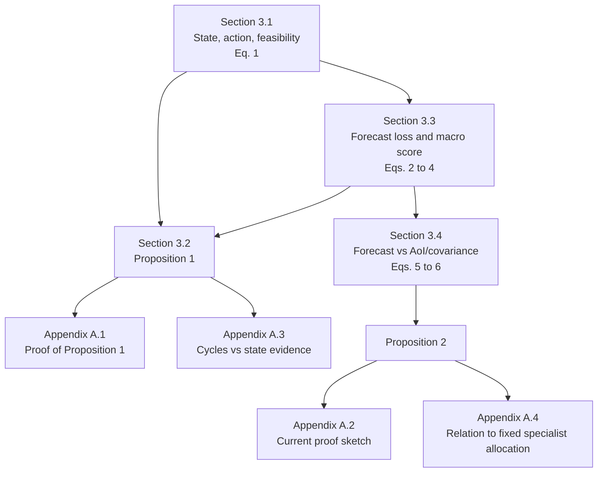
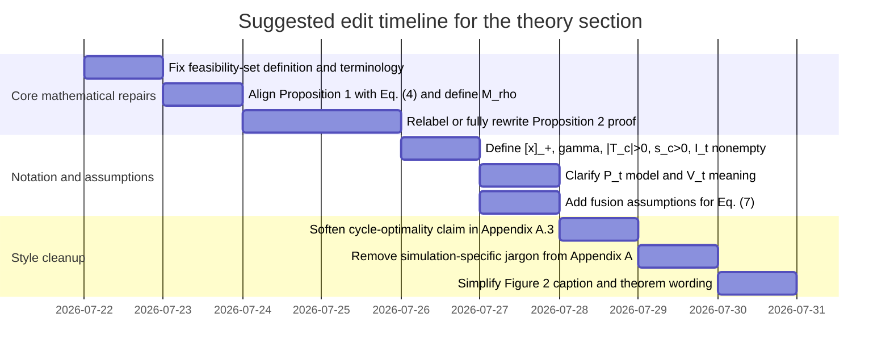

# Theory Section Review of the Manuscript

## Executive summary

I reviewed only the manuscript’s theory-bearing material in the provided PDF: the formal problem statement in Section 3, the PPO objective in Section 4.4, and Appendix A. No LaTeX source was provided, and the supplementary document referred to in several places was not included with the upload, so any derivation or definition that exists only in the supplement remains **unspecified** here rather than reconstructed. fileciteturn0file0

The overall theoretical structure is **conceptually sound but not yet publication-grade**. The sequential decision framing under partial observation is appropriate for the problem class and is consistent with standard POMDP and stochastic-control formalisms, and the PPO equations mostly match the original clipped-surrogate formulation up to the usual sign convention for minimizing a loss rather than maximizing a return. citeturn0search0turn3search2turn0academia26 The strongest parts are the action-index separation, the forecast-loss metric, the macro-score definition, and the masked-policy equations. fileciteturn0file0

The main weaknesses are not algebraic slips in the core RL equations. They are more serious theory-writing problems: the feasible-set equation does **not** encode all constraints it is said to encode; Proposition 1 and Appendix A.1 mix a generalized weighted macro objective with the paper’s actual equal-weight macro score without defining the connection; Proposition 2 is presented as if it were a proof built on a “linear-Gaussian” construction, but the stated model uses a binary event indicator and does not specify the covariance recursion needed for the covariance-trace claim; and Appendix A.3 makes an overbroad statement about when a fixed cycle can be optimal. fileciteturn0file0

In short: **the framework is defensible, but the theory section should be revised from “broad theorem-like claims” to “clean sufficient conditions plus clearly labeled proof sketches and implementation-specific definitions.”** The most urgent changes are local and feasible. They do not require new experiments, but they do require sharper assumptions, cleaner notation, and removal of a few overclaimed statements. fileciteturn0file0

## Overall soundness

The manuscript correctly treats the scheduling problem as a sequential decision problem with partial observation, action-dependent information, and feasibility-constrained action selection. That is a legitimate modeling choice for sensing under resource limits, and it fits the standard POMDP viewpoint that actions are chosen under incomplete state information and affect future information quality. citeturn0search0turn3search2 The masked categorical policy in Eq. (10) and the clipped PPO surrogate in Eqs. (11)–(12) are also standard in form. citeturn0academia26

The dimensional consistency is mostly fine. Eq. (2) produces a dimensionless loss because each target error is divided by its scale and then combined by nonnegative weights. Eq. (4) is also dimensionless because it averages regime losses normalized by fixed-schedule reference losses. Eq. (1) is dimensionally consistent **if** \(p_i\) and \(B\) share one normalized steady-power unit and \(p_i^{\text{peak}}\) and \(B^{\text{peak}}\) share one normalized startup-power unit. Eq. (7) is dimensionally coherent for scalar variables because both numerator and denominator use inverse variances of the same variable. fileciteturn0file0

The problems lie elsewhere. First, the formal feasible set in Eq. (1) omits the minimum-on-time rule, even though the surrounding text repeatedly says feasibility includes minimum-on-time. Second, Proposition 1 is a correct **idea** stated as a sufficient condition, but its proof silently changes notation from the paper’s actual equal-weight macro score to a generalized weighted macro score. Third, Proposition 2 is not really proven. It is shown only by a stylized narrative argument, and that argument calls the model “linear-Gaussian” while using a binary rare-event indicator. Fourth, several theory paragraphs slide into simulation-specific language and internal experimental labels that belong in Results or Discussion, not in a proof appendix. fileciteturn0file0

The wording also still carries traces of internal lab language. In the theory section, this appears as terms like “label-informed policy,” “positive-weight regime,” “common offline evaluator,” and “state evidence.” None are disastrous, but all can be rewritten in more conventional mathematical English. The present version is much improved over earlier drafts, yet it still reads like a hybrid of manuscript prose and internal experiment notes. fileciteturn0file0

## Prioritized action list

The ten fixes below are the ones I would make before submission, in order.

1. **Repair Proposition 2 and Appendix A.2.** Either relabel it explicitly as a *proof sketch* and remove “linear-Gaussian,” or replace it with a fully specified state-space counterexample that really supports the covariance-trace claim. This is the single most important theory fix. fileciteturn0file0

2. **Fix Eq. (1) or the surrounding prose.** As written, Eq. (1) does not include minimum-on-time, so it cannot be called the full feasible action set if the text says it is. Split “structural candidate set” from “epoch-feasible set,” or add the missing state-dependent constraint. fileciteturn0file0

3. **Unify Proposition 1 with Eq. (4).** Define a weighted normalized macro objective \(M_\rho\) for the proposition, or explicitly set \(\rho_c=1/3\) for the paper’s reported metric. Right now the proof is notationally correct only after an unstated reinterpretation. fileciteturn0file0

4. **Soften Appendix A.3.** Replace “a fixed cycle can be optimal only in the special case…” with a statement that a fixed cycle *may* be optimal in structured cases, but is generally not justified without phase-locked or otherwise periodic reward structure. fileciteturn0file0

5. **Define \([x]_+\) in Eq. (14).** The positive-part operator is used but never defined. This is a simple but important notation fix. fileciteturn0file0

6. **Clarify whether \(V_t\) in Eq. (8) can ever be nonzero.** If infeasible actions are masked out before execution, there should be no feasibility-violation penalty unless “violation” means something narrower and explicitly defined. fileciteturn0file0

7. **Add missing existence conditions for the metrics.** State that \(|T_c|>0\) and \(s_c>0\) for each reported regime, and that \(I_t\neq\varnothing\) for every epoch in Eq. (10). fileciteturn0file0

8. **State the assumptions behind Eq. (7).** Precision weighting is reasonable for scalar fusion only under an independence or effective-independence assumption; for wind direction, the circular-mean language is standard in directional statistics, but that should be kept explicitly separate from the scalar fusion rule. citeturn1search6turn1search8

9. **Reclassify heuristic training terms as heuristics, not theory.** The subtype weights in Eq. (9), the guide-mask mapping, and the auxiliary context loss are implementation choices. They should not be described as if they were theorem-level consequences of the formulation. fileciteturn0file0

10. **Remove internal experiment jargon from Appendix A.** Terms like “oracle regime-label baseline,” “held-out simulator subtype,” and “selected on validation data” are fine in Results, but in the proof appendix they dilute the mathematical argument. fileciteturn0file0

## Detailed line-referenced edits

The locations below refer to the provided PDF by section, page, equation number, and approximate local line range from the extracted text. All quoted problem locations come from the uploaded manuscript. fileciteturn0file0

| Location | Problem type | Issue | Suggested correction | Severity |
|---|---|---|---|---|
| Section 3.1, p. 10, lines 1–25, Eq. (1) | Missing condition / notation inconsistency | Eq. (1) is introduced as the feasible action set, but it does not encode the minimum-on-time rule that the text says is part of feasibility. | Replace Eq. (1) and the next paragraph with: **“Let \(A_{\text{cand}}\) denote the structural candidate set satisfying backbone, cardinality, steady-power, and startup-peak rules. Let \(I_t=\{k: m_k\in A_{\text{cand}}\text{ and }m_k\text{ also satisfies the minimum-on-time rule given the runtime state at }t\}\).”** | Major |
| Section 3.2, p. 10 lines 46–48 and p. 11 lines 1–3 | Missing assumption | The prose jumps from latent regimes to “changing specialists in response to regime evidence” without assuming that online observations contain informative regime evidence. Proposition 1 uses label access, not evidence access. | Replace the last sentence before Proposition 1 with: **“If online observations contain information predictive of regime changes, then changing specialists in response to that evidence can reduce forecast loss under the conditions below.”** | Major |
| Section 3.2, p. 11, lines 4–16, Proposition 1 | AI-style wording / overcompound | “label-informed policy” is nonstandard and reads coined. | Replace **“label-informed policy \(\pi^{\mathrm{lab}}\)”** with **“policy \(\pi^{\mathrm{lab}}\) with access to regime labels”** throughout Section 3.2 and Appendix A.1. | Minor |
| Section 3.2, p. 11 lines 4–16 and Appendix A.1, p. 42 lines 11–31 | Notation inconsistency | Proposition 1 and its proof use positive regime weights \(\rho_c\), but the paper’s actual reported macro score in Eq. (4) is equal-weighted. The object being proved is therefore not literally the same \(M_{\text{macro}}\) unless this is stated. | Add before Proposition 1: **“For Proposition 1, define the weighted normalized macro objective \(M_\rho(\pi)=\sum_{c\in C}\rho_c \tilde L_c(\pi)\), where \(\tilde L_c(\pi)=L_c(\pi)/s_c\), \(\rho_c>0\), and \(\sum_c \rho_c=1\). The reported metric in Eq. (4) is the special case \(\rho_c=1/3\) for \(c\in\{\text{particle},\text{flux},\text{thermal}\}\).”** | Major |
| Appendix A.1, p. 42 lines 11–31, Eqs. (A.1)–(A.2) | Missing definition | \(\delta_c(S_0)\) is called a “normalized regime loss minus that of \(\pi^{\mathrm{lab}}\),” but the normalization is not explicitly tied to \(s_c\). | Replace the definition sentence with: **“For a fixed subset \(S_0\), define \(\delta_c(S_0)=\tilde L_c(\pi^{S_0})-\tilde L_c(\pi^{\mathrm{lab}})\), where \(\tilde L_c(\pi)=L_c(\pi)/s_c\). Define \(C_{\mathrm{mis}}(S_0)=\{c\in C: S_0 \text{ mismatches } S_c^\star\}.”** | Major |
| Section 3.3, p. 13 lines 17–45, Eqs. (3)–(4) | Missing condition | Eqs. (3)–(4) divide by \(|T_c|\) and \(s_c\), but the existence conditions \(|T_c|>0\) and \(s_c>0\) are not stated. | Add after Eq. (4): **“This score is reported only when \(|T_c|>0\) and \(s_c>0\) for each event regime \(c\).”** | Minor |
| Section 3.4, p. 13 lines 49–58 and p. 14 lines 1–24, Eqs. (5)–(6) | Missing definition / logical gap | \(\gamma\) is undefined in Eq. (5), and \(P_t\) in Eq. (6) is introduced without specifying the estimator model. Also \(J_{\mathrm{cov}}\) omits the explicit time limits shown in \(J_{\mathrm{AoI}}\). | Replace the paragraph introducing Eqs. (5)–(6) with: **“Let \(\gamma\in(0,1]\) denote a discount factor. For a separate model-based estimator with covariance \(P_t\), define \(J_{\mathrm{cov}}(\pi)=-\mathbb E_\pi[\sum_{t=0}^{T-1}\mathrm{tr}(P_t)]\).”** | Major |
| Section 4.2, p. 16 lines 54–77, Eq. (7) | Missing assumption | Eq. (7) is mathematically reasonable only as a precision-weighted scalar fusion rule under an independence or effective-independence assumption. Otherwise it is a heuristic, not the minimum-variance linear estimator. | Add after Eq. (7): **“For scalar variables, Eq. (7) assumes conditionally independent measurement errors with known variances \(R_{i,j}\); if channel errors are correlated, it should be interpreted as a heuristic fusion rule rather than an optimal linear estimator.”** | Major |
| Section 4.3, p. 19 lines 9–16, Eq. (8) | Logical inconsistency | If infeasible masks are removed before sampling, then a “feasibility violation” penalty appears redundant. | Replace the sentence after Eq. (8) with: **“Here \(V_t\) denotes any residual runtime penalty that can remain nonzero after masking; if masking excludes all such cases in implementation, then \(V_t\equiv0\).”** | Major |
| Section 4.3, p. 19 lines 17–34, Eq. (9) | Heuristic presented too strongly | “The training loss aligns the policy update with the balanced event objective” is too strong. Eq. (9) includes calm epochs and fixed hand-tuned weights, so it is a heuristic reweighting rather than a theorem-level alignment. | Replace the first sentence before Eq. (9) with: **“The training loss reweights policy updates toward the event-balanced evaluation objective while retaining calm epochs.”** | Minor |
| Section 4.4, p. 21 lines 2–13, Eq. (10) | Missing condition | Eq. (10) requires \(I_t\neq\varnothing\), but this is never stated. | Add after Eq. (10): **“By construction, the backbone-only mask is always feasible, so \(I_t\neq\varnothing\) for every epoch.”** | Minor |
| Section 4.4, p. 21 lines 40–59, Eq. (14) | Notation inconsistency | The positive-part operator \([\hat A_t]_+\) is used but never defined. | Replace the sentence after Eq. (14) with: **“where \([x]_+=\max(x,0)\) and \(\ell_t\in\{0,1\}\) marks states with a valid guide.”** | Major |
| Appendix A.2, p. 43 lines 2–25, Eq. (A.3) | Math error / missing proof conditions | The text says the example is “linear-Gaussian,” but \(e_t\in\{0,1\}\) is a binary indicator, not a Gaussian state component. No state estimator or covariance recursion is given, so the covariance-trace part is not actually proved. | Minimum repair: replace **“uses a linear-Gaussian model”** with **“uses a stylized two-variable counterexample”** and replace **“proof”** with **“proof sketch.”** Better repair: provide a full state-space model and estimator recursion, or delete the covariance-trace claim from the proof and keep only the AoI counterexample. | Critical |
| Appendix A.3, p. 44 lines 1–16 | Overclaim | “Such a cycle can be optimal only in the special case…” is too strong. Periodic policies can be optimal in broader structured environments than deterministic phase-locking. | Replace the first two sentences with: **“A fixed cycle can be optimal in some structured settings, for example when regimes or rewards are periodic and phase-aligned with the cycle. In the absence of such structure, a fixed cycle need not be optimal and can incur positive expected regret relative to a policy that conditions on informative observations.”** | Major |
| Appendix A.3–A.4, p. 44 lines 9–24 | Overcomplex phrasing / internal-experiment language | The proof appendix mixes theorem statements with phrases like “reported simulation,” “audit rules,” and “Section 6 confirm.” That weakens theoretical tone. | Move the last two sentences of Appendix A.3 and the empirical half of Appendix A.4 into Results or Discussion, leaving only model-agnostic statements in the theory appendix. | Minor |
| Figure 2 caption, p. 12 lines 66–69 | Figure wording / notation clarity | The figure formula uses \(C_{\mathrm{mis}}(S_0)\), \(\rho_c\), and \(\Delta_c\), but the caption does not define them plainly. | Replace the last sentence with: **“For any fixed specialist \(S_0\), at least one positive-weight regime is mismatched; if the normalized excess loss in mismatched regimes is \(\Delta_c>0\), then the weighted macro loss exceeds that of the label-access policy by at least \(\sum_{c\in C_{\mathrm{mis}}(S_0)}\rho_c\Delta_c\).”** | Minor |

## Equation audit

The table below summarizes every equation visible in the theory-bearing pages of the uploaded PDF. The “Original” column is abbreviated to equation purpose rather than reproducing each full expression verbatim. All equation references refer to the manuscript. fileciteturn0file0

| Equation | Original | Purpose | Correct? | Recommended fix |
|---|---|---|---|---|
| (1) | \(A_{\text{mask}}\) feasible action set | Define structural feasibility under backbone/cardinality/power/startup | **No** | Either add minimum-on-time explicitly or rename this as a structural candidate set and define epoch-feasible \(I_t\) separately. |
| (2) | \(L_{\text{step}}(t)\) weighted normalized absolute forecast loss | Per-step evaluation loss | **Yes** | Add explicit condition \(w_k\ge 0\), \(\alpha_{j,c_t}\ge 0\), denominator \(>0\). |
| (3) | \(L_c(\pi)\) regime-average loss | Average event-regime loss | **Yes** | State \(|T_c|>0\). |
| (4) | \(M_{\text{macro}}(\pi)=\frac13\sum_c L_c(\pi)/s_c\) | Equal-regime macro metric | **Yes** | State \(s_c>0\). Align Proposition 1 notation with this equal-weight case. |
| (5) | \(J_{\text{fcst}}(\pi)=\mathbb E_\pi[-\sum_{t=0}^{T-1}\gamma^tL_{\text{step}}(t)]\) | Generic forecast-return objective | **Yes** | Define \(\gamma\). |
| (6) | \(J_{\text{AoI}}(\pi)\), \(J_{\text{cov}}(\pi)\) | Proxy objectives for freshness and covariance | **No** | Add explicit time limits to \(J_{\text{cov}}\) and define estimator model for \(P_t\). |
| (7) | Precision-weighted scalar fusion | Fuse multiple ready-channel measurements | **Yes** | State independence/effective-independence assumption. |
| (8) | \(r_t=-[\lambda_{\text{fcst}}L_{\text{train}}+\lambda_{\text{sw}}S_t+\lambda_{\text{viol}}V_t]\) | PPO reward | **No** | Clarify whether \(V_t\) can be nonzero after hard masking. |
| (9) | \(L_{\text{train}}(t)=\omega_{c_t}L_{\text{FW}}(t)/d_{c_t}\) | Training loss reweighting | **Yes** | Present as heuristic reweighting, not exact alignment theorem. State \(d_c>0\). |
| (10) | Masked categorical policy \(\pi_\theta(u\mid o_t)\) over \(I_t\) | Feasible-action policy | **Yes** | State \(I_t\neq\varnothing\) for all \(t\). |
| (11) | PPO clipped surrogate \(L_{\text{clip}}(\theta)\) | Policy optimization objective | **Yes** | No mathematical change needed. It matches PPO up to sign convention. citeturn0academia26 |
| (12) | Importance ratio \(\rho_t(\theta)\) | PPO likelihood ratio | **Yes** | No change needed. |
| (13) | \(L_{\text{PD-PPO}}\) composite loss | Combine PPO, value, entropy, BC, and event losses | **Yes** | Clarify in prose that BC and event terms are training heuristics, not part of the online decision rule. |
| (14) | Advantage-weighted BC loss | Training-only guide loss | **No** | Define \([x]_+=\max(x,0)\); keep numerator/denominator parentheses explicit. |
| (15) | Auxiliary context-classification loss | Training-only event classifier | **Yes** | No mathematical change needed. |
| (A.1) | \(C_{\text{mis}}(S_0)\) mismatch set | Define regimes mismatched by a fixed specialist | **Yes** | Define normalized regime loss before using it. |
| (A.2) | \(M_{\text{macro}}(\pi^{S_0})-M_{\text{macro}}(\pi^{\text{lab}})\ge \sum_{c\in C_{\text{mis}}}\rho_c\Delta_c>0\) | Proposition 1 proof inequality | **No** | Use \(M_\rho\) or explicitly set \(\rho_c=1/3\) for the paper’s reported metric. |
| (A.3) | \(y_{t+1}=c z_t+M e_t+\eta_t\) | Stylized counterexample for Proposition 2 | **No** | Do not call it linear-Gaussian if \(e_t\) is binary. Either relabel as a proof sketch or replace with a fully Gaussian state-space model. |

## Dependency map and edit timeline

The internal dependency structure of the theory is narrow enough that a small number of fixes will propagate cleanly through the whole section. Proposition 1 depends on the formal metric definition. Proposition 2 depends on the forecast-vs-proxy objective definitions and should not be left as an underspecified example if it is going to carry theorem-like wording. Appendix A.3 and A.4 depend on the conceptual claims of Propositions 1 and 2 and should therefore be revised only after those propositions are cleaned up. fileciteturn0file0

The order below minimizes rework.

The theory section can be made strong with revision, but it should not go forward unchanged. The manuscript already has the right conceptual backbone; what it now needs is **tighter theorem hygiene, explicit assumptions, and plainer mathematical prose**. The biggest single correction is to downgrade or repair Proposition 2 so that the text no longer claims a level of proof that the appendix does not currently supply. The second biggest is to reconcile Eq. (1) and Proposition 1 with the notation and constraints the manuscript actually uses. Once those are fixed, the rest of the theory cleanup becomes routine. fileciteturn0file0