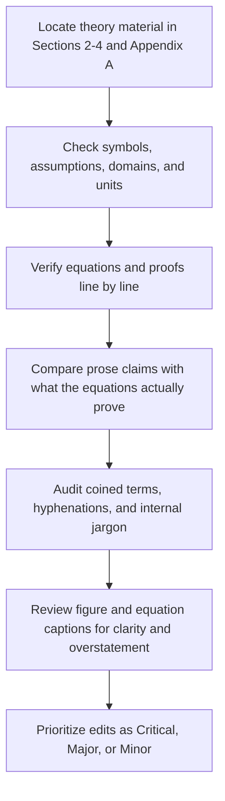

# Theory-Focused Review of the ESWA Submission

## Executive summary

The theory core is **mostly sound**. I did **not** find a fatal algebraic error in Proposition 1, Proposition 2, Equation (4), Equation (9), Equation (10), Equation (11), or Appendix A.1–A.2. The most important theorem-level argument in Appendix A.2 is internally coherent: because \(M>c>0\), the interval in (A.5) is nonempty, so one can choose \(q_e\) so that AoI and covariance favor \(\pi_1\) while forecast loss favors \(\pi_2\). That proof is logically valid as an existence argument. fileciteturn0file0

The main problems are instead **one critical mathematical notation error**, **two major consistency errors**, and **a cluster of terminology and prose issues** that make the theory read more “generated” than it needs to. The critical issue is Equation (16): as typeset, the “advantage-weighted behavior-cloning term” is missing a multiplication between the weight \(\ell_t[\hat A_t]_+\) and the log-probability. In its current printed form, the numerator reads like a sum of a weight and a log-probability, which is not the stated objective and is mathematically different from standard weighted negative log-likelihood. fileciteturn0file0

The first major consistency error is in **Table 2**, where \(I_t\) is defined as if minimum-activation checks are already included. That contradicts Section 3.1 and Equation (3), which clearly assign minimum-duration enforcement to the deterministic guard \(G_t\), not to the feasible-index set \(I_t\). The second major issue is **notation drift**: the same latent label family is called *regime*, *event type*, *subtype*, and *context class* across Sections 3–4. This is not just stylistic. It weakens mathematical precision when Equations (5), (6), (11), and (17) are read together. fileciteturn0file0

Against the standard literature, the paper’s framing is directionally correct. PPO is commonly written with a clipped surrogate that is either maximized directly or negated and minimized as a loss; the manuscript’s sign convention therefore works in principle. Double DQN is correctly described at a high level as a value-based method that decouples selection and evaluation. AoI is indeed a freshness metric, not a downstream forecasting metric, so the motivation behind Proposition 2 is conceptually legitimate. Semi-Markov terminology is also standard when a process is described through an embedded chain plus non-exponential holding times. citeturn0search1turn0search0turn3search3turn3search0turn1search4

My bottom-line recommendation is: **do not rewrite the theory from scratch**. Instead, do one disciplined pass with four objectives: fix Equation (16); repair symbol definitions and conditioning; unify terminology; and replace “AI-style” prose with shorter, literal statements of what each equation proves and what each figure shows. The paper is already close to being theoretically publishable, but it still reads less rigorously than the underlying mathematics actually is. fileciteturn0file0

## Review workflow

## Factual correctness and logical rigor

The strongest part of the theory is **Section 3 plus Appendix A**. The action-set construction is well organized: Equation (1) defines the structural set, Equation (2) adds instantaneous power and startup feasibility, and Equation (3) cleanly separates the minimum-duration hold rule from feasibility masking. That decomposition is logically good and much clearer than pushing all constraints into one overloaded feasible set. It also matches the engineering interpretation of “mask first, then apply timer-based execution.” fileciteturn0file0

Equation (4) is dimensionally consistent. Each target error is normalized by a target scale \(\sigma_j\), so the numerator is dimensionless; the denominator is a sum of nonnegative weights, so the full per-step loss is dimensionless and comparable across targets. Equation (6) is also logically coherent: it averages regime-level losses after normalizing each regime by a validation-derived fixed-schedule reference scale \(s_c\). The manuscript explicitly states the boundary conditions \(|T_c|>0\) and \(s_c>0\), which is exactly what is needed to make the macro score well-defined. fileciteturn0file0

Section 4.2 is statistically careful in a way that should be preserved. Equation (9) is the standard precision-weighted fusion rule for repeated scalar measurements, and the text correctly adds the caveat that it is minimum-variance only under conditional independence and configured variances. That caveat is important: inverse-variance weighting is optimal only under the usual independence/unbiasedness conditions, so the manuscript’s wording here is materially correct and better than claiming a Kalman-style optimal estimator. fileciteturn0file0turn2search3

Section 4.4 is also broadly correct relative to standard PPO notation. The clipped surrogate in Equation (13) is written in the common “negative objective for minimization” form, and Equation (15) is therefore acceptable **if** the implementation minimizes total loss rather than maximizing reward directly. That is consistent with the original PPO formulation. Likewise, the Double-DQN description in Section 4.5 is conceptually aligned with the canonical value-based control formulation, even though the full target equation is moved out of the main text. fileciteturn0file0turn0search1turn0search0

Appendix A.1 is valid but elementary: it is a weighted-sum argument, not a deep theorem. That is fine. The manuscript should not over-sell it. Appendix A.2 is the more substantive piece, and it works. The construction is simple but rigorous: two independent random walks, one noiseless observation per epoch, and a forecast target with unequal coefficients \(M>c\). The inequalities in (A.5) ensure that \(\pi_1\) has lower AoI and lower covariance trace while \(\pi_2\) has lower forecast-error variance and therefore lower expected absolute forecast loss. The proof is clean. fileciteturn0file0

The weakest factual points are not theorem errors; they are **definition mismatches and over-strong prose**. First, Table 2 says \(I_t\) includes minimum-activation checks, but Section 3.1 makes clear that minimum-duration is enforced afterward by \(G_t\). Second, Equation (12) and Algorithm 1 do not use exactly the same conditioning notation: Algorithm 1 writes \(\pi_\theta(\cdot\mid o_t, I_t)\), while Equation (12) writes \(\pi_\theta(u\mid o_t)\) and then inserts \(I_t\) only through the sum and indicator. Third, Section 3.2 says the simulator “enforces” the incompatibility condition in Proposition 1. That is too strong. The simulator **instantiates** or **was designed to satisfy** that condition; it does not prove it in the same sense that Appendix A proves Proposition 1. fileciteturn0file0

One scope caveat matters. The current main manuscript repeatedly refers to Supplementary Sections S1–S6 for the full clipped history indicators, reward-control recursions, actor equations, and reference rules. Those omitted sections are not visible in the uploaded main file. I therefore reviewed **all theory and equations that are printed in the main manuscript and Appendix A**, but I could not independently line-check the supplementary definitions that the main text cites but does not reproduce. fileciteturn0file0

## Terminology audit and recommended replacements

The paper’s terminology problem is not that hyphenation exists. Many hyphenated terms here are standard and should stay: **sample-and-hold**, **semi-Markov**, **inverse-variance weighted**, **zero-mean**, **one-step**, and **held-out** are all normal technical English. The real problem is the accumulation of **internal or semi-coined compounds** that are understandable to the authors but not standard to readers. fileciteturn0file0

The most damaging inconsistency is the latent-label vocabulary. The manuscript alternates among **regime**, **event type**, **subtype**, and **context class**. In theory sections, one term should dominate. I recommend using **regime** everywhere for the latent physical category, and reserving **class label** only when referring to the auxiliary classifier in Equation (17). Thus, Equation (5) should average over regimes; Equation (11) should use regime-dependent weights/scales; and Equation (17) should say “auxiliary regime-classification loss.” This single change would remove a large amount of low-grade confusion. fileciteturn0file0

The second terminology issue is the family of minimum-duration phrases. The manuscript currently mixes **minimum-duration**, **minimum activation duration**, **minimum-activation checks**, and **duration guard**. Standard engineering prose would be clearer if you choose one phrase and hold it everywhere. My recommendation is **minimum-on-time** for prose and **minimum-on-time guard** for \(G_t\). It is short, standard, and avoids the current contradiction where Table 2 implies “minimum-activation checks” occur in \(I_t\) even though Equation (3) shows otherwise. fileciteturn0file0

A third group of terms sounds generated rather than authored. **AoI-inspired runtime proxy**, **event-balanced evaluation objective**, **candidate-mask logits**, **empirical information reference**, **replayable references**, and **schedule-induced partial histories** all convey the idea, but each can be replaced by a standard phrase with less friction. In almost every case, the best replacement is shorter and more literal. fileciteturn0file0

The table below lists the coined or borderline-coined theory terms that most need revision. Standard terms that are already acceptable are omitted to keep the edit list useful rather than exhaustive.

| Current term | Recommendation | Why this is better |
|---|---|---|
| ready-sampling age | time since last ready sample | More literal; easier to parse on first read |
| candidate-mask logits | action logits over feasible masks | Standard RL phrasing |
| mandatory-backbone system | system with a fixed backbone channel | More natural engineering English |
| regime-label baseline | oracle baseline with regime labels | Puts “oracle” first, which is what matters |
| event-balanced evaluation objective | regime-weighted training objective | Matches what Equation (11) actually does |
| context-classification loss | auxiliary regime-classification loss | Links directly to Equation (17) |
| AoI-inspired runtime proxy | channel freshness measure | Plainer and standard |
| schedule-induced partial histories | partial histories generated by the schedule | Removes internal jargon |
| empirical information reference | privileged information reference | Standard evaluation language |
| replayable references | replay-based comparisons | Clearer noun phrase |
| alternative forecaster evaluation | rescoring with a second forecaster | More direct |
| forecast-sensitive variable | variable with larger forecast coefficient | Tied to Appendix A.2 math |
| state-dependent hold | timer-based hold rule | Says exactly what the guard is |
| minimum-duration rule | minimum-on-time rule | Most standard and most consistent |
| minimum-activation checks | minimum-on-time enforcement by \(G_t\) | Prevents contradiction with \(I_t\) |
| supplied warning scores | provided warning scores | Removes awkward, machine-like diction |

These replacements are stylistic, but they also improve rigor because they make it easier to see which pieces are **state variables**, which are **labels**, which are **objectives**, and which are **diagnostic baselines**. That matters in a paper whose core contribution depends on clear separation between online information and offline scoring. fileciteturn0file0

## Argumentation style and caption revisions

The current theory prose has improved compared with earlier drafts, but it still carries several features that read as “AI-style”: verbs that overstate causality, unnecessary defensive clarifications, and long noun-heavy sentences that hide the main point. The best cure is not to “sound more human” in an abstract sense. It is to make every sentence answer one of three questions: **what is defined, what is assumed, or what follows**. fileciteturn0file0

A typical example is the sentence after Equation (3): the paper says that power and startup rules act through the categorical action mask, while the minimum-duration rule acts through a state-dependent hold on the complete channel subset. That is not wrong, but it is needlessly abstract. A clearer version is: **“Power and startup constraints are enforced by masking infeasible actions. Minimum on-time is enforced afterward by holding the previous mask until its timer expires.”** The rewrite is shorter, keeps the logic intact, and removes the “acts through” phrasing that feels synthetic. fileciteturn0file0

Another example is the “verification of the incompatibility condition” paragraph below Figure 2. The phrase “enforce the incompatibility condition” is too strong because the manuscript is not proving a simulator theorem there; it is explaining how the designed channel-regime mapping makes Proposition 1 relevant. A more rigorous and less AI-like paragraph is:

> “The simulator is designed so that particle, flux, and thermal intervals are best observed by different specialist channels: laser, FC4, and surface infrared, respectively. Under the one-specialist budget, no fixed specialist can match all three regimes simultaneously. Table 6 then tests whether the learned policy exploits that designed incompatibility in the final evaluation.” fileciteturn0file0

The forecaster paragraph in Section 4.3 has a similar issue. “Holding its parameters fixed attributes score differences to the observation patterns induced by the schedules” is too strong and too Latinate. A better sentence is: **“Because the forecaster is frozen, score differences reflect differences in the observation sequences presented to the same evaluator.”** That still does not over-claim causal isolation, and it reads like a paper sentence rather than a generated summary. fileciteturn0file0

The captions need one more editing pass. Figure 1’s caption is serviceable, but Panel C should say explicitly that the forecaster is used **offline for training rewards and offline scoring**, not during online action selection. Figure 2’s caption is informative but too long, and the last sentence—pointing readers to Section 5 for the sensor mapping—is not caption material. Captions should identify the figure’s content, not redirect the reader elsewhere. fileciteturn0file0

Recommended caption rewrites:

**Figure 1 current intent, revised caption**

> **Figure 1. PD-PPO training and execution workflow.** Panel A shows the chronological partitions used for forecaster fitting, policy training, validation, and final evaluation. Panel B shows the online loop: update observations, mask infeasible actions, select a candidate mask, and apply the minimum-on-time guard before execution. Panel C shows the offline path used to compute forecast-loss rewards and update the policy during training. The frozen forecaster is not queried during online execution. fileciteturn0file0

**Figure 2 current intent, revised caption**

> **Figure 2. Sufficient condition under which adaptive specialist switching can outperform any fixed specialist.** Different regimes prefer different specialists, so every fixed specialist mismatches at least one positive-weight regime. If the excess regime losses remain positive after transition costs are included, the weighted normalized loss of any fixed specialist exceeds that of the regime-aware policy. fileciteturn0file0

These revisions remove internal wording such as “label access,” “weighted normalized-loss bound,” and the needless Section 5 cross-reference, while preserving the theorem’s meaning. fileciteturn0file0

## Claim-strength assessment

Theoretical writing often goes wrong not because equations are false, but because the prose claims slightly more than the equations prove. That is the case here in a few places. The table below calibrates the major theory claims to the actual evidence printed in the manuscript. fileciteturn0file0

| Claim | Current strength | Assessment | Recommended wording |
|---|---|---|---|
| Proposition 1 gives a sufficient condition for dynamic value | Supported | The proposition and Appendix A.1 prove exactly this | Keep as is, but do not call it a guarantee for the trained policy |
| The simulator “enforces” the incompatibility condition | Weakly supported | The simulator is designed to instantiate that condition, but the manuscript does not prove it as a separate theorem | “The simulator is designed so that the incompatibility condition is relevant” |
| Forecast loss is not equivalent to AoI or covariance objectives | Supported | Proposition 2 proves non-equivalence by construction | Keep, but prefer “not equivalent to” over “not a proxy for” |
| Holding the forecaster fixed attributes score differences to schedules | Weakly supported | Freezing the evaluator helps isolate observation-pattern effects, but does not prove total causal isolation | “Using a frozen evaluator helps isolate score differences due to observation patterns” |
| Matched reward controls compare scalar objectives within a shared training pipeline | Supported | This is accurate once the guide/auxiliary scaffold is stated explicitly | Keep, but always mention the shared scaffold |
| The oracle regime-label baseline is not an upper bound on feasible sequential control | Supported | This is conceptually correct because a myopic or mapped oracle need not solve the full sequential control problem | Keep, but call it a privileged diagnostic, not an upper bound |

The key general recommendation is simple: whenever a sentence refers to **what the theorem proves**, use “implies,” “shows,” or “proves.” Whenever it refers to **what the simulator was built to make possible**, use “is designed so that,” “instantiates,” or “creates a setting in which.” That single distinction will remove most of the remaining overstatement. fileciteturn0file0

## Detailed edit log

All locations below refer to the current main manuscript’s Sections 2–4 and Appendix A in the uploaded PDF. The table is prioritized by technical importance rather than reading order. fileciteturn0file0

| Location | Original text or equation | Issue type | Suggested edit | Rationale | Priority | Estimated edit |
|---|---|---|---|---|---|---|
| Section 4.4, Eq. (16) | \(L_{BC}\) numerator lacks a visible multiplication between \(\ell_t[\hat A_t]_+\) and \(\log \pi_\theta(g_t\mid o_t)\) | **Math** | Write \(L_{BC}= -\dfrac{\sum_t \ell_t[\hat A_t]_+ \log \pi_\theta(g_t\mid o_t,I_t)}{\sum_t \ell_t[\hat A_t]_+ + \epsilon}\) | Current typeset form reads as “weight + log-probability,” which is not the stated advantage-weighted cloning loss | **Critical** | 1 equation line |
| Table 2, \(I_t\) row | “after power, startup, and minimum-activation checks” | **Factual / notation** | Change to “after power and startup checks” | Minimum duration is enforced by \(G_t\) in Eq. (3), not by \(I_t\) | **Critical** | 1 table row |
| Section 4.4, Eqs. (12)–(14) vs Algorithm 1 | Algorithm uses \(\pi_\theta(\cdot\mid o_t,I_t)\), equations use \(\pi_\theta(u\mid o_t)\) | **Math / notation** | Condition on \(I_t\) in Eqs. (12)–(14), or state explicitly that \(I_t\) is a deterministic function of \(o_t\) | Removes internal inconsistency in the policy definition | **Major** | 2–3 equation lines |
| Section 4.3, Eq. (11) | \(c_t\), \(d_{c_t}\), and \(\omega_{c_t}\) used, but calm case is only explained in prose | **Math / definition** | Define \(c_t\in\{\text{calm, particle, flux, thermal}\}\) and specify \(d_c,\omega_c\) for all four classes, including \(d_{\text{calm}}\), \(\omega_{\text{calm}}=1\) | Avoids a silent exception to the equation | **Major** | 2–4 lines |
| Section 3.2 and Appendix A.1 | Uses \(S_0\) both as a subset and as a single specialist | **Terminology / math** | Use \(s_0\in S\) for the single-specialist case; reserve \(S_0\subseteq S\) for multi-specialist subsets | Prevents set/element ambiguity in Proposition 1 and Figure 2 | **Major** | 6–10 scattered symbol edits |
| Section 3.2, paragraph under Figure 2 | “action geometry and observation model enforce the incompatibility condition” | **Claim / style** | Replace “enforce” with “are designed so that” or “instantiate” | Current verb overstates what is shown | **Major** | 1 paragraph |
| Sections 3.2–4.5 | Regime / event type / subtype / context class all used for closely related labels | **Terminology** | Pick one main term: “regime.” Use “auxiliary regime class” only for Eq. (17) | Most important terminology cleanup in the theory | **Major** | 15–30 scattered edits |
| Sections 3.1–4.2 and Table 2 | minimum-duration / minimum activation duration / minimum-activation checks / duration guard | **Terminology** | Unify as “minimum-on-time” and “minimum-on-time guard” | Improves consistency and removes the \(I_t\) confusion | **Major** | 15–25 scattered edits |
| Section 4.3 | “Holding its parameters fixed attributes score differences…” | **Style / claim** | “Because the forecaster is frozen, score differences reflect differences in the observation sequences presented to the same evaluator.” | Shorter and more precise | **Minor** | 1 sentence |
| Section 4.2 | “AoI-inspired runtime proxy” | **Terminology** | “channel freshness measure” | Simpler and standard | **Minor** | 1 phrase |
| Section 4.3 | “event-balanced evaluation objective” | **Terminology / style** | “regime-weighted training objective” | Closer to Eq. (11) | **Minor** | 1 phrase |
| Table 1 | “replayable references” | **Terminology** | “replay-based comparisons” | “Replayable references” sounds internal | **Minor** | 1 table cell |
| Figure 2 caption | Ends by saying Section 5 defines the sensor mapping | **Caption / style** | Delete that sentence | Captions should explain the figure, not redirect the reader | **Minor** | 1 sentence |
| Figure 2 panel C label | “Label access” | **Figure terminology** | “Oracle policy with regime labels” | Makes the panel’s role explicit | **Minor** | 2–4 words |
| Section 4.1 | “A compact guide to the recurring action, metric, and comparator terms is provided…” | **Style** | Delete or move to a footnote | Reads like manuscript management rather than theory | **Minor** | 1 sentence |
| Introduction and Section 4.1 | “power, or startup rules” | **Style** | Remove comma: “power or startup rules” | Simple grammar fix | **Minor** | 1 line |
| Section 3.4 title | “Why forecast loss is not an AoI or covariance proxy” | **Claim / wording** | “Why forecast loss is not equivalent to AoI or covariance objectives” | Proposition 2 proves non-equivalence, not a broad statement about proxies | **Minor** | 1 heading |
| Appendix A.2 opening | Proof jumps directly to age vectors \((0,1)\) and \((2,0)\) | **Rigor / exposition** | Add one sentence explaining how these ages arise under two feasible one-channel schedules | Makes the construction easier to follow | **Minor** | 1–2 lines |

## Example rewrites and corrected derivations

The first item below is a true correction, not merely a style preference.

### Corrected behavior-cloning loss

Current Section 4.4 says the term is “advantage-weighted,” but Equation (16) is missing the multiplication that makes it weighted. The corrected expression should be

\[
\mathcal{L}_{BC}
=
-
\frac{
\sum_t \ell_t [\hat A_t]_+ \log \pi_\theta(g_t \mid o_t, I_t)
}{
\sum_t \ell_t [\hat A_t]_+ + \varepsilon
}.
\]

This version does three things that the present typeset equation does not do clearly:

1. it actually multiplies the log-probability by the nonnegative advantage weight;
2. it correctly normalizes by the sum of weights;
3. it makes the masking dependence explicit through \(I_t\). fileciteturn0file0turn0search1

### Cleaner masked-policy definition

The current Equation (12) is mathematically usable, but the notation is cleaner if the conditioning matches Algorithm 1:

\[
\pi_\theta(u \mid o_t, I_t)
=
\frac{\exp z_\theta(o_t,u)}
{\sum_{v\in I_t}\exp z_\theta(o_t,v)},
\qquad u\in I_t,
\]

and \(\pi_\theta(u \mid o_t, I_t)=0\) for \(u\notin I_t\). Then

\[
\rho_t(\theta)
=
\frac{\pi_\theta(u_t\mid o_t, I_t)}
{\pi_{\theta_{\mathrm{old}}}(u_t\mid o_t, I_t)}.
\]

That version removes the current ambiguity about whether \(I_t\) is part of the state, part of the action support, or both. fileciteturn0file0

### Rewritten Proposition 1 follow-up paragraph

A stronger, cleaner version of the current paragraph after Proposition 1 is:

> Proposition 1 gives a sufficient condition under which specialist switching can outperform every fixed specialist under the same startup and minimum-on-time rules. It does not imply that the trained PD-PPO policy must outperform a fixed specialist in every environment. The privileged regime-label baseline used later is only an information diagnostic; it is not assumed to realize \(\pi^{\mathrm{reg}}\) or to solve the sequential control problem exactly. fileciteturn0file0

This keeps the same claim boundary, but it removes the slightly defensive phrasing and states the logic more directly.

### Rewritten Section 4.2 paragraph on fusion and runtime state

A more compact version of the current material is:

> The environment uses sample-and-hold updates rather than a Kalman filter. When multiple ready channels observe the same scalar variable, their measurements are fused using the precision-weighted mean in Equation (9). Wind direction is fused separately by a weighted circular mean. If no channel observes a variable at epoch \(t\), the previous value is carried forward and the observation mask records that no new measurement was obtained. The scheduler then receives the last 20 value/mask pairs, channel runtime state, time since each channel last became ready, the previous executed mask, and warning scores. fileciteturn0file0turn2search3

This rewrite removes redundant metacommentary and keeps the statistical caveat available in the next sentence if desired.

### Rewritten Figure 2 verification paragraph

Use this instead of the current “enforce the incompatibility condition” paragraph:

> The simulator is designed so that different regimes favor different specialists: laser for particle intervals, FC4 for flux intervals, and surface infrared for thermal intervals. Because only one specialist can be active at a time, no fixed specialist can match all three regimes simultaneously. The regime-specific results in Table 6 then test whether the learned policy exploits that designed incompatibility in the final evaluation. fileciteturn0file0

## Final judgment

If I restrict the review to the theory material visible in the uploaded manuscript, my judgment is:

- **No fatal theorem failure found.**
- **One critical mathematical correction is required**: Equation (16).
- **Two major consistency repairs are required**: the definition of \(I_t\), and the regime/event/subtype terminology.
- **Most remaining problems are prose and caption issues**, not theoretical validity problems. fileciteturn0file0

In practical submission terms, the theory is already strong enough for ESWA **once those repairs are made**. Proposition 1 and Proposition 2 are appropriate as framing results; they are not over-ambitious mathematically, and that is a strength. The next revision should therefore be a **precision pass**, not a conceptual rewrite: repair the notation, simplify the language, and make every claim track exactly what the printed equations prove. fileciteturn0file0