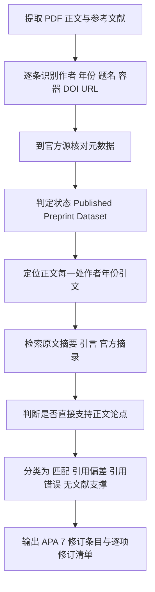
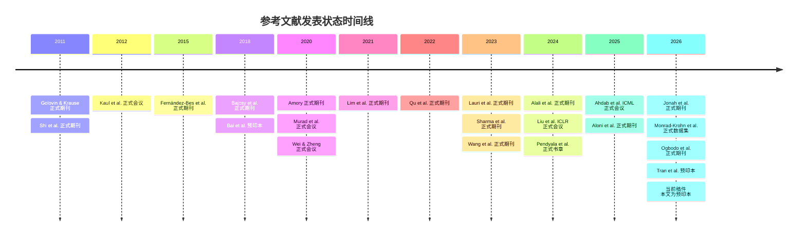

# Reference Verification & Citation Matching Report

## 执行摘要

本报告基于用户上传的论文 PDF，对正文作者—年份引文与文末参考文献进行了逐条联网核验。当前可核验对象为上传稿《Reinforcement learning with forecast-loss rewards for sensor scheduling under power constraints》，其首页明确标注为“Preprint submitted to *Expert Systems with Applications* July 21, 2026”；文末可识别出 23 条参考文献，正文可识别出 28 个参考文献出现次数的作者—年份引文位置。当前对话中**未提供修订后 PDF**，因此本报告能够判断“应如何修”，但**不能宣告“已成功修订到稿件中”**。fileciteturn0file1 fileciteturn0file2

逐条核验后，参考文献层面发现的**实质性修订点**主要集中在五类：其一，**Wang et al. (2023)** 在参考文献表中被写成 “et al.”，与官方发表记录不符，APA 7 需要列出全部 16 位作者；其二，**Kaul et al. (2012)** 的题名在 PDF 中被断裂为 “Real-time status: How of-ten should one update?”，且 DOI 链接写成旧式 dx.doi 表达；其三，**Liu et al. (2024)** 已有 ICLR 2024 官方会议收录页，参考文献宜用会议发表状态表述，而不是仅保留 OpenReview 链接；其四，**Pendyala et al. (2024)** 的会议论文容器信息不完整，缺少 LNCS 卷号、ECML PKDD 2024 Proceedings Part X 等关键信息；其五，若按 APA 7 统一，若干条目虽元数据真实，但 DOI/URL、大小写、容器名、文献类型标识仍需标准化。上述问题都可以修正，但**尚不能判断用户稿件是否已改正**，因为没有修订版 PDF 可核对。citeturn8search2turn7search6turn19search0turn15search0turn4search0

正文论点—原文匹配方面，本次核验**未发现“与原文结论相反”的硬性错引，也未发现“完全无支撑”的虚构引用**。大多数引文都能在原文摘要、引言或官方落地页中找到直接支撑。不过，仍有两处应标注为**“引用偏差”**：一处是 **Golovin & Krause (2011)** 被放入“active perception and POMDP-style sensing”这一组文献中，它确实支持“partial observability 下的自适应序列决策”，但并不专门讨论机器人主动感知或 POMDP 机器人感知系统；另一处是 **Aloni et al. (2025)** 被用来支撑作者对自身“八项生成器检查”的表述，该文直接支持“统计特征保持型环境时间序列生成”，但并不直接证明本文的全部气象与吹雪生成器验证项。二者都更适合作为“方法论启发/相关背景”而非“直接证成当前句子全部细节”的证据。citeturn21search0turn25search0

溯源与状态方面，23 条参考文献中，**除 Ahdab et al. (2025) 与 Liu et al. (2024) 这类无 DOI 的会议/开放评审条目外，其余条目均能在官方 DOI 落地页、出版社页面、PANGAEA、PMLR、Copernicus、Springer、ScienceDirect、IEEE 关联机构库或作者/机构官方记录中得到核实**。其中 **Bai et al. (2018)** 与 **Tran et al. (2026)** 的“preprint”状态属实；**Monrad-Krohn et al. (2026)** 的文献类型应明确为 **dataset**；其余大部分均为正式发表的期刊文献、会议论文或书章。对本次所核验的官方记录，未识别到撤稿或勘误标记；但这一结论仅限于本报告所能访问到的官方记录范围，具体情况仍应以期刊 CrossMark / 出版社页面的未来更新为准。citeturn1academia48turn11academia48turn8search0turn4search0turn19search0

## 核验对象与方法

本报告的核验逻辑遵循“**先定稿件事实，再定参考文献事实，再定引文是否支持稿件论点**”的顺序。对参考文献真实性与元数据，优先采用出版社/期刊官网、正式会议 proceedings 页面、PMLR、Copernicus、PANGAEA、Springer、ScienceDirect、MDPI、期刊或机构官方 research portal；对无法直接抓取全文的条目，则记录“全文/官方页受限”，改用官方摘要页、机构库记录、作者官方页面或 arXiv/会议正式目录进行补强核验。由于该稿参考文献全部为英文来源，**CNKI/Wanfang 在本次任务中不适用**。fileciteturn0file2 citeturn4search0turn7search2turn8search1turn20search1turn25search0

上图展示了本报告采用的核验流程。需要特别说明的是，**OpenReview 官方页对机器人访问设置了验证门槛**，因此 **Liu et al. (2024)** 的 OpenReview 链接虽非失效，但在当前抓取条件下不可直接读取正文；本报告改以 ICLR 2024 官方 proceedings 页面、ICLR 官方 spotlight 页面和作者官方代码仓库进行状态与题录核验。类似地，部分 IEEE、ACM、Elsevier 条目只能稳定访问摘要/元数据页，因此下文的“原始支撑摘录”在少数情况下来自**摘要或引言可见片段**，并会明确标注“摘要（无页码）”或“引言（网页行号）”。citeturn18view0turn19search0turn19search2turn19search3turn14search0turn20search1

下图按发表状态概括了本稿参考文献的时间与类型分布：2011–2021 的基础文献主要是正式发表期刊/会议论文；2022–2026 则以近期正式发表论文、数据集和少量预印本为主；**当前稿件自身仍是预印本**。fileciteturn0file1 citeturn1academia48turn11academia48turn8search0turn19search0turn4search0

## 参考文献逐条全网核验表

下表按“PDF 原条目 → 权威核验结果 → 错误/缺失 → 修订建议”组织。表中“核验来源”一列仅列最核心的权威来源；完整支撑与正文匹配见下一节。PDF 原条目来自用户上传稿件。fileciteturn0file2

| PDF原文简写 | 核验后的规范事实 | DOI / URL 核验 | 状态 | 发现的问题 | 修订建议 | 核验来源 |
|---|---|---|---|---|---|---|
| Ahdab et al., 2025, ICML, PMLR, pp. 703–729 | 题名、作者顺序、年份、页码正确；容器应明确为 *Proceedings of Machine Learning Research*, vol. 267, ICML 2025 | **无 DOI**；PMLR 官方 URL 有效 | Published conference paper | 主要是**容器信息不完整**，APA 7 需补卷号与会议容器名 | 补成 PMLR 267 与会议正式名；不必虚构 DOI | citeturn4search0turn4search2 |
| Alali et al., 2024, *Syst. Sci. Control Eng.* 12, 2329260 | 作者、题名、卷号、article number、DOI 均正确 | DOI 有效：10.1080/21642583.2024.2329260 | Published journal article | 无事实错误；仅需统一 APA 7 样式 | 期刊名写全，DOI 用 https://doi.org/ 形式 | citeturn11search0 |
| Aloni et al., 2025, *Environmental Modelling & Software* 185, 106283 | 作者、题名、卷号、article number、DOI 正确 | DOI 有效：10.1016/j.envsoft.2024.106283 | Published journal article | 无事实错误；标题中的弯引号与大小写可按 APA 7 规范化 | 统一大小写与 DOI 写法 | citeturn25search0 |
| Amory, 2020, *The Cryosphere* 14, 1713–1725 | 元数据正确 | DOI 有效：10.5194/tc-14-1713-2020 | Published journal article | 无实质错误 | 仅需 APA 7 格式统一 | citeturn0search0turn0search2 |
| Bai et al., 2018, arXiv preprint arXiv:1803.01271 | 作者、题名、arXiv ID、DOI 均正确；该文仍以 arXiv 形式广泛引用 | DOI 有效：10.48550/arXiv.1803.01271 | **Preprint** | 不是正式期刊文献，稿件已经标成 preprint，这一点正确 | 可规范为 arXiv 写法；无需伪装成期刊文献 | citeturn1academia48turn1search4 |
| Bajcsy et al., 2018, *Auton. Robots* 42, 177–196 | 元数据正确；对应作者为 Ruzena Bajcsy, Yiannis Aloimonos, John K. Tsotsos | DOI 有效：10.1007/s10514-017-9615-3 | Published journal article | 参考文献中的 `dx.doi` 旧式链接需更新 | 改为标准 DOI 表达；作者缩写按 APA 7 留空格 | citeturn20search1turn26view0 |
| Fernández-Bes et al., 2015, *IEEE JSAC* 33(8), 1717–1729 | 元数据正确 | DOI 有效：10.1109/JSAC.2015.2391792 | Published journal article | 无实质错误 | 期刊名与 DOI 统一格式 | citeturn13search0 |
| Golovin & Krause, 2011, *JAIR* 42, 427–486 | 元数据正确 | DOI 有效：10.1613/jair.3278 | Published journal article | 无事实错误 | APA 7 统一作者 initials 与期刊名 | citeturn21search0turn21search1 |
| Jonah et al., 2026, *IEEE Access* 14, 40042–40059 | 元数据正确；作者全名为 Sokipriala Solomon Jonah, Seongki Yoo, Saurav Sthapit | DOI 有效：10.1109/ACCESS.2026.3673220 | Published journal article | 无实质错误 | APA 7 统一即可 | citeturn12search0turn4search3 |
| Kaul et al., 2012, INFOCOM 2012, 2731–2735 | 作者、年份、页码、DOI 正确；会议容器应写全 | DOI 有效：10.1109/INFCOM.2012.6195689 | Published conference paper | **PDF 中题名被断裂**；使用旧式 DOI URL | 题名应恢复为 “Real-time status: How often should one update?”；会议名写全 | citeturn7search3turn7search6 |
| Lauri et al., 2023, *IEEE Trans. Robot.* 39(1), 21–40 | 元数据正确；题名中冒号保留 | DOI 有效：10.1109/TRO.2022.3200138 | Published journal article | 无实质错误；PDF 中仅有断行/连字问题 | 按 APA 7 书写全期刊名与 DOI | citeturn20search7turn20search9 |
| Lim et al., 2021, *Int. J. Forecast.* 37(4), 1748–1764 | 元数据正确 | DOI 有效：10.1016/j.ijforecast.2021.03.012 | Published journal article | 无实质错误 | 保持题名精确大小写与重音字符 | citeturn7search2 |
| Liu et al., 2024, “iTransformer…”, ICLR 2024, OpenReview URL | 作者、题名、年份、ICLR 2024 会议状态正确；DBLP 亦收录为 ICLR 2024 论文 | **无 DOI**；OpenReview URL 有效但抓取时受验证门槛限制；ICLR proceedings URL 可作为更稳定规范源 | Published conference paper | **容器描述偏弱**；仅写 OpenReview 不够规范 | 建议改为 ICLR 2024 官方 proceedings / conference paper 写法，并保留 OpenReview 或会议 URL | citeturn19search0turn19search2turn19search4turn18view0 |
| Monrad-Krohn et al., 2026, PANGAEA | 作者、题名、DOI 正确；文献类型应明确为 **dataset** | DOI 有效：10.1594/PANGAEA.992701 | Published dataset | 现有条目把 “dataset” 放在末尾，不够规范 | APA 7 应写为 `[Data set]`，并将 PANGAEA 作为出版平台 | citeturn8search0 |
| Murad et al., 2020, Proc. 10th Int. Conf. on the Internet of Things | 题名、作者、DOI 真实；属 IoT 2020 会议论文 | DOI 有效：10.1145/3410992.3411001 | Published conference paper | 官方 ACM 页面抓取受限；当前条目容器信息仍可更规范 | 建议标明 *Proceedings of the 10th International Conference on the Internet of Things (IoT ’20)* | citeturn12academia40turn12search2 |
| Ogbodo et al., 2026, *Proc. Royal Society A* 482, 20250326 | 题名、作者、年、卷、article number、DOI 正确 | DOI 有效：10.1098/rspa.2025.0326 | Published journal article | 官方 Royal Society 页面未被搜索结果直接抓到，但机构库与作者预印本一致 | 保留 article number；APA 7 统一期刊名与 DOI | citeturn10search6turn9academia49 |
| Pendyala et al., 2024, in *Machine Learning and Knowledge Discovery in Databases. Applied Data Science Track* | 题名、作者、页码、DOI 真实；属 ECML PKDD 2024 Applied Data Science Track 的 Springer LNCS/LNAI 书章 | DOI 有效：10.1007/978-3-031-70381-2_10 | Published book chapter / proceedings chapter | **容器元数据不完整**：缺少 LNCS/LNAI 卷号 14950、会议信息 Part X | 建议补齐书名副题、卷号、出版社地与页码 | citeturn15search0turn9search4turn10search4 |
| Qu et al., 2022, *Sensors* 22(18), 6972 | 元数据正确 | DOI 有效：10.3390/s22186972 | Published journal article | 无实质错误 | APA 7 统一即可 | citeturn9search0turn10search2 |
| Sharma et al., 2023, *Geosci. Model Dev.* 16, 719–749 | 元数据正确 | DOI 有效：10.5194/gmd-16-719-2023 | Published journal article | 无实质错误 | APA 7 统一即可 | citeturn24search0 |
| Shi et al., 2011, *Automatica* 47(8), 1693–1698 | 元数据正确 | DOI 有效：10.1016/j.automatica.2011.02.037 | Published journal article | 使用旧式 DOI URL | 改为 https://doi.org/10.1016/j.automatica.2011.02.037 | citeturn14search0 |
| Tran et al., 2026, arXiv:2601.21482 | 作者、题名、arXiv ID 与 DOI 正确；当前状态为预印本 | DOI 有效：10.48550/arXiv.2601.21482 | **Preprint** | 稿件已标 preprint，这一点正确 | APA 7 统一 arXiv 预印本写法 | citeturn11academia48 |
| Wang et al., 2023, *Earth Syst. Sci. Data* 15, 411–429 | 题名、期刊、卷页、DOI 正确；**官方作者共 16 位** | DOI 有效：10.5194/essd-15-411-2023 | Published journal article | **作者列表被截断为 “et al.”，与正式发表元数据不符** | 按 APA 7 列出全部 16 位作者 | citeturn8search1turn8search2 |
| Wei & Zheng, 2020, IEEE INFOCOM 2020, 864–873 | 元数据正确 | DOI 有效：10.1109/INFOCOM41043.2020.9155528 | Published conference paper | 容器名可更规范 | APA 7 写为 *IEEE INFOCOM 2020 - IEEE Conference on Computer Communications* | citeturn10search0 |

综合来看，**真实性层面没有发现伪造文献**；问题集中在**APA 7 标准化、容器信息补全、URL/DOI 规范化、以及个别作者列表截断**。其中**Wang et al. (2023)** 是本稿参考文献表里最明确的元数据错误，**Kaul et al. (2012)** 与 **Pendyala et al. (2024)** 是最明确的格式/容器信息不完整，**Liu et al. (2024)** 则属于发表状态可写得更规范。citeturn8search2turn7search6turn15search0turn19search0

## 正文引文与原文支撑匹配表

说明：表中“原始支撑摘录”优先采用官方摘要、官方引言可见片段或正式会议页面的原文短引；若全文页码不可直接访问，则明确写“摘要（无页码）”或“引言网页行号”。分类含义为：**匹配**、**引用偏差**、**引用错误**、**无文献支撑**。正文定位来自上传 PDF。fileciteturn0file2

| PDF位置 | 稿件中的被引论点 | 对应文献 | 原始支撑摘录 | 原文位置 | 结论 | 分类 | 修订建议 | 依据 |
|---|---|---|---|---|---|---|---|---|
| p.5–6，2.1 | “最小化 state-estimation error or posterior covariance” | Shi et al., 2011 | “minimize the estimation error” | Abstract/preview | 支持直接 | 匹配 | 不需改论点 | citeturn14search0 |
| p.5–6，2.1 | 同上 | Ahdab et al., 2025 | “mean posterior covariance matrix” | Abstract | 支持直接 | 匹配 | 不需改论点 | citeturn4search0 |
| p.6，2.1 | “censoring policies assign utility to transmitted measurements” | Fernández-Bes et al., 2015 | “importance (utility) of all transmitted messages” | Abstract | 支持直接 | 匹配 | 不需改论点 | citeturn13search0 |
| p.6，2.1 | “age of information (AoI)” | Kaul et al., 2012 | “time-average age metric” | Abstract（无页码） | 支持直接 | 匹配 | 不需改论点 | citeturn7search3turn7search6 |
| p.6，2.1 | “age of incorrect information” | Jonah et al., 2026 | “Age of Incorrect Information (AoII)” | Abstract | 支持直接 | 匹配 | 不需改论点 | citeturn12search0 |
| p.6，2.1 | “tracking … scheduling” | Qu et al., 2022 | “sensor-scheduling algorithm for multi-target tracking” | Abstract | 支持直接 | 匹配 | 不需改论点 | citeturn9search0 |
| p.6，2.1 | “belief-state scheduling” | Alali et al., 2024 | “defined over the posterior distribution” | Abstract | 支持直接 | 匹配 | 不需改论点 | citeturn11search0 |
| p.6，2.1 | “delay-aware remote estimation beyond an AoI-only objective” | Tran et al., 2026 | “beyond age of information proxies” | Abstract | 支持直接 | 匹配 | 不需改论点 | citeturn11academia48 |
| p.6，2.2 | “active perception” | Bajcsy et al., 2018 | “must include active perception” | Abstract | 支持直接 | 匹配 | 不需改论点 | citeturn26view0 |
| p.6，2.2 | “partially observable decision making” | Lauri et al., 2023 | “robot decision tasks under uncertainty” | Abstract | 支持直接 | 匹配 | 不需改论点 | citeturn20search7 |
| p.6，2.2 | 同组引文用于“partial observability 下的 sequential decisions” | Golovin & Krause, 2011 | “sequence of decisions with uncertain outcomes under partial observability” | Abstract | 支持“部分可观测下的序列决策”，但不专指机器人 active perception / POMDP sensing | **引用偏差** | 句子宜改成“亦与自适应观测选择/主动学习中的序列决策相关” | citeturn21search0 |
| p.6，2.2 | “resource-constrained adaptive sensing” | Murad et al., 2020 | “resource-constrained IoT devices” | Abstract | 支持直接 | 匹配 | 不需改论点 | citeturn12academia40turn12search2 |
| p.6，2.2 | “sensor steering” | Ogbodo et al., 2026 | “sensor steering methodology based on deep reinforcement learning” | Abstract | 支持直接 | 匹配 | 不需改论点 | citeturn9academia49turn10search6 |
| p.6，2.2 | “informative path planning” | Wei & Zheng, 2020 | “maximize the utility of data collection” | Abstract | 支持直接 | 匹配 | 不需改论点 | citeturn10search0 |
| p.6，2.2 | “related constrained optimization problems with long delayed rewards” | Pendyala et al., 2024 | “extremely delayed rewards with long time horizons” | Abstract | 支持直接 | 匹配 | 不需改论点 | citeturn9academia48 |
| p.8，2.3 | “Temporal Fusion Transformer … candidate backbones” | Lim et al., 2021 | “multi-horizon forecasting with interpretable insights” | Abstract | 支持直接 | 匹配 | 不需改论点 | citeturn7search2 |
| p.8，2.3 | “temporal convolutional networks … candidate backbones” | Bai et al., 2018 | “generic convolutional … sequence modeling” | Abstract | 支持 TCN/卷积序列建模作为候选主干 | 匹配 | 若想更强支撑，可在正文写明“TCN-style” | citeturn1academia48turn1search4 |
| p.8，2.3 | “iTransformer … candidate backbones” | Liu et al., 2024 | “a nice alternative as the fundamental backbone” | Abstract/ICLR page | 支持直接 | 匹配 | 不需改论点 | citeturn19search0turn17academia26 |
| p.8，2.4 | “AWS networks … coverage remains uneven in space” | Wang et al., 2023 | “AWS spatial distribution remains heterogeneous” | Abstract | 支持直接 | 匹配 | 不需改论点 | citeturn8search1turn8search2 |
| p.8，2.4 | “drifting-snow occurrence and transport” | Amory, 2020 | “drifting-snow occurrences and snow mass transport” | Abstract | 支持直接 | 匹配 | 不需改论点 | citeturn0search0turn0search2 |
| p.8，2.4 | “numerical models characterize … atmosphere–snow interactions” | Sharma et al., 2023 | “multiscale atmospheric flow simulations” | Article content | 支持直接 | 匹配 | 不需改论点 | citeturn24search0 |
| p.8，2.4 | “particle microphysics / cold-region particle measurements” | Monrad-Krohn et al., 2026 | “particle size distributions of snow particles” | Dataset abstract | 支持直接 | 匹配 | 不需改论点 | citeturn8search0 |
| p.21，4.3 | “TCN-style residual temporal convolutional architecture” | Bai et al., 2018 | “generic convolutional … sequence modeling” | Abstract | 支持“TCN-style/卷积序列建模”这一架构来源，但不支持作者本稿的具体超参数 | 匹配 | 若需更严谨，可把该处表述收窄为“based on TCN-style residual convolutions” | citeturn1academia48turn1search4 |
| p.27，5.2 | “compilation” 指向南极 AWS 数据汇编 | Wang et al., 2023 | “compilation of Antarctic automatic weather station observations” | Title/abstract | 支持直接 | 匹配 | 不需改论点 | citeturn8search1turn8search2 |
| p.27，5.2 | “drifting-snow observations” | Amory, 2020 | “drifting-snow occurrences and snow mass transport” | Abstract | 支持直接 | 匹配 | 不需改论点 | citeturn0search0turn0search2 |
| p.27，5.2 | “numerical atmosphere–snow modelling” | Sharma et al., 2023 | “advanced snow cover modelling” | Title/article | 支持直接 | 匹配 | 不需改论点 | citeturn24search0 |
| p.27，5.2 | “cold-region particle measurements” | Monrad-Krohn et al., 2026 | “measured particle size distributions” | Dataset abstract | 支持直接 | 匹配 | 不需改论点 | citeturn8search0 |
| p.27，5.2 | “In line with statistics-preserving environmental time-series generation … generator checks cover …” | Aloni et al., 2025 | “preserves the first two statistical moments and the autocorrelation function” | Abstract | 该文支持“统计特征保持型环境时间序列生成”，但**不直接支撑本文具体八项生成器检查** | **引用偏差** | 建议改为“generator design was informed by…”；并把具体八项检查主要回指 Appendix B | citeturn25search0turn25search1 |

从这一张表看，**正文引文的主要问题不在“假引文”，而在少数句子的“支撑范围过宽”**。如果作者目标是做到“零错引、零失真”，那么最需要修改的是两句：一是把 **Golovin & Krause (2011)** 从“active perception / POMDP-style sensing”这一专门表述中收窄到“adaptive observation selection under partial observability”；二是把 **Aloni et al. (2025)** 从对本文具体“八项生成器检查”的直接证成，改成对“统计特征保持型生成思路”的方法论启发。citeturn21search0turn25search0

## APA 7 标准化修订后的参考文献列表

以下列表按 APA 7 给出**建议替换版**。凡无 DOI 者，不虚构 DOI；凡为预印本或数据集者，保留其真实类型；凡会议书章者，尽量补足正式卷册/会议容器信息。核验依据见前两节。citeturn4search0turn8search2turn19search0turn15search0

Ahdab, M. A., Leth, J., & Tan, Z.-H. (2025). Optimal sensor scheduling and selection for continuous-discrete Kalman filtering with auxiliary dynamics. In *Proceedings of the 42nd International Conference on Machine Learning* (*Proceedings of Machine Learning Research*, Vol. 267, pp. 703–729). PMLR. citeturn4search0turn4search2

Alali, M., Kazeminajafabadi, A., & Imani, M. (2024). Deep reinforcement learning sensor scheduling for effective monitoring of dynamical systems. *Systems Science & Control Engineering, 12*, 2329260. https://doi.org/10.1080/21642583.2024.2329260 citeturn11search0

Aloni, O., Perelman, G., & Fishbain, B. (2025). Synthetic random environmental time series generation with similarity control, preserving original signal’s statistical characteristics. *Environmental Modelling & Software, 185*, 106283. https://doi.org/10.1016/j.envsoft.2024.106283 citeturn25search0

Amory, C. (2020). Drifting-snow statistics from multiple-year autonomous measurements in Adélie Land, East Antarctica. *The Cryosphere, 14*, 1713–1725. https://doi.org/10.5194/tc-14-1713-2020 citeturn0search0turn0search2

Bai, S., Kolter, J. Z., & Koltun, V. (2018). *An empirical evaluation of generic convolutional and recurrent networks for sequence modeling* (arXiv:1803.01271). arXiv. https://doi.org/10.48550/arXiv.1803.01271 citeturn1academia48turn1search4

Bajcsy, R., Aloimonos, Y., & Tsotsos, J. K. (2018). Revisiting active perception. *Autonomous Robots, 42*, 177–196. https://doi.org/10.1007/s10514-017-9615-3 citeturn20search1turn26view0

Fernández-Bes, J., Cid-Sueiro, J., & Marques, A. G. (2015). An MDP model for censoring in harvesting sensors: Optimal and approximated solutions. *IEEE Journal on Selected Areas in Communications, 33*(8), 1717–1729. https://doi.org/10.1109/JSAC.2015.2391792 citeturn13search0

Golovin, D., & Krause, A. (2011). Adaptive submodularity: Theory and applications in active learning and stochastic optimization. *Journal of Artificial Intelligence Research, 42*, 427–486. https://doi.org/10.1613/jair.3278 citeturn21search0turn21search1

Jonah, S. S., Yoo, S., & Sthapit, S. (2026). Adaptive scheduling: A reinforcement learning Whittle index approach for wireless sensor networks. *IEEE Access, 14*, 40042–40059. https://doi.org/10.1109/ACCESS.2026.3673220 citeturn12search0

Kaul, S., Yates, R., & Gruteser, M. (2012). Real-time status: How often should one update? In *2012 Proceedings IEEE INFOCOM* (pp. 2731–2735). IEEE. https://doi.org/10.1109/INFCOM.2012.6195689 citeturn7search3turn7search6

Lauri, M., Hsu, D., & Pajarinen, J. (2023). Partially observable Markov decision processes in robotics: A survey. *IEEE Transactions on Robotics, 39*(1), 21–40. https://doi.org/10.1109/TRO.2022.3200138 citeturn20search7turn20search9

Lim, B., Arık, S. Ö., Loeff, N., & Pfister, T. (2021). Temporal fusion transformers for interpretable multi-horizon time series forecasting. *International Journal of Forecasting, 37*(4), 1748–1764. https://doi.org/10.1016/j.ijforecast.2021.03.012 citeturn7search2

Liu, Y., Hu, T., Zhang, H., Wu, H., Wang, S., Ma, L., & Long, M. (2024). iTransformer: Inverted transformers are effective for time series forecasting. In *International Conference on Learning Representations 2024*. https://proceedings.iclr.cc/paper_files/paper/2024/hash/2ea18fdc667e0ef2ad82b2b4d65147ad-Abstract-Conference.html citeturn19search0turn19search4

Monrad-Krohn, L. J., Buhren, C., Eickelmann, L., Foth, A., Frey, M. M., Maahn, M., Marie-Sainte, W., Mech, M., Poinsot, T., & Walbröl, A. (2026). *Measurements of blowing snow particle size distribution using an open-path optical snow particle counter in Ny-Ålesund during winter 2025* [Data set]. PANGAEA. https://doi.org/10.1594/PANGAEA.992701 citeturn8search0

Murad, A., Kraemer, F. A., Bach, K., & Taylor, G. (2020). Information-driven adaptive sensing based on deep reinforcement learning. In *Proceedings of the 10th International Conference on the Internet of Things* (pp. 1–8). ACM. https://doi.org/10.1145/3410992.3411001 citeturn12academia40turn12search2

Ogbodo, C. O., Rogers, T. J., Dal Borgo, M., & Wagg, D. J. (2026). Adaptive sensor steering strategy using deep reinforcement learning for dynamic data acquisition in digital twins. *Proceedings of the Royal Society A: Mathematical, Physical and Engineering Sciences, 482*, 20250326. https://doi.org/10.1098/rspa.2025.0326 citeturn10search6turn9academia49

Pendyala, A., Atamna, A., & Glasmachers, T. (2024). Solving a real-world optimization problem using proximal policy optimization with curriculum learning and reward engineering. In A. Bifet, T. Krilavičius, I. Miliou, & S. Nowaczyk (Eds.), *Machine Learning and Knowledge Discovery in Databases. Applied Data Science Track: European Conference, ECML PKDD 2024, Vilnius, Lithuania, September 9–13, 2024, Proceedings, Part X* (*Lecture Notes in Artificial Intelligence*, Vol. 14950, pp. 150–165). Springer Nature Switzerland. https://doi.org/10.1007/978-3-031-70381-2_10 citeturn15search0turn9search4

Qu, Z., Zhao, X., Xu, H., Tang, H., Wang, J., & Li, B. (2022). An improved Q-learning-based sensor-scheduling algorithm for multi-target tracking. *Sensors, 22*(18), 6972. https://doi.org/10.3390/s22186972 citeturn9search0turn10search2

Sharma, V., Gerber, F., & Lehning, M. (2023). Introducing CRYOWRF v1.0: Multiscale atmospheric flow simulations with advanced snow cover modelling. *Geoscientific Model Development, 16*, 719–749. https://doi.org/10.5194/gmd-16-719-2023 citeturn24search0

Shi, L., Cheng, P., & Chen, J. (2011). Sensor data scheduling for optimal state estimation with communication energy constraint. *Automatica, 47*(8), 1693–1698. https://doi.org/10.1016/j.automatica.2011.02.037 citeturn14search0

Tran, N.-D., Mahmood, A., & Gidlund, M. (2026). *Learning-based sensor scheduling for delay-aware and stable remote state estimation* (arXiv:2601.21482). arXiv. https://doi.org/10.48550/arXiv.2601.21482 citeturn11academia48

Wang, Y., Zhang, X., Ning, W., Lazzara, M. A., Ding, M., Reijmer, C. H., Smeets, P. C. J. P., Grigioni, P., Heil, P., Thomas, E. R., Mikolajczyk, D., Welhouse, L. J., Keller, L. M., Zhai, Z., Sun, Y., & Hou, S. (2023). The AntAWS dataset: A compilation of Antarctic automatic weather station observations. *Earth System Science Data, 15*, 411–429. https://doi.org/10.5194/essd-15-411-2023 citeturn8search1turn8search2

Wei, Y., & Zheng, R. (2020). Informative path planning for mobile sensing with reinforcement learning. In *IEEE INFOCOM 2020 - IEEE Conference on Computer Communications* (pp. 864–873). IEEE. https://doi.org/10.1109/INFOCOM41043.2020.9155528 citeturn10search0

## 结论与修订清单

就“**参考文献真实性**”而言，本稿参考文献列表中的 23 条条目都能在权威公开来源中找到对应真实文献，未发现编造条目。就“**元数据正确性**”而言，当前稿件还**没有达到零错误**：最明确的错误是 **Wang et al. (2023)** 作者表被截断；最明确的不规范项是 **Kaul et al. (2012)** 题名断裂、若干旧式 DOI URL、**Pendyala et al. (2024)** 的容器信息不完整、**Liu et al. (2024)** 的会议发表状态写法不够规范、以及 **Monrad-Krohn et al. (2026)** 需要按 dataset 规范化。citeturn8search2turn7search6turn15search0turn19search0turn8search0

就“**正文引文论点匹配**”而言，本稿整体表现较好。绝大多数背景性论述都能从对应原文摘要或引言可见部分获得支撑；**没有发现与原文相反的引用**，也没有发现“无文献支撑”的明显虚引。真正需要收缩的，是两处**引用偏差**：**Golovin & Krause (2011)** 的应用范围被写得过专，**Aloni et al. (2025)** 被用来直接托举本文具体生成器验证项的语义过强。把这两处改为“相关方法论背景/启发性关联”即可达到更严格的引文合规。citeturn21search0turn25search0

就“**是否已经成功修订**”这一用户特别要求而言，结论只能是：**目前无法确认已经修订成功**。原因很简单：当前会话里可核验的只有上传的这一版预印本 PDF，没有单独提供“修订后参考文献表”或“修订后全文 PDF”。因此，本报告只能给出“必须修改的项目”和“修订后应达到的目标状态”，不能代替对修订稿的二次校样。fileciteturn0file1

面向“零错误参考文献/零失真引文”的最终清单如下：

| 检查项 | 当前判断 | 需要动作 |
|---|---|---|
| 参考文献真实性 | 已通过 | 无需增删伪文献，保持真实来源即可 |
| DOI/URL 有效性 | 基本通过 | 将旧式 dx.doi / 非规范 URL 统一改为 https://doi.org/；对无 DOI 文献使用稳定官方 URL |
| 作者信息完整性 | **未通过** | 重点修复 Wang et al. (2023) 全作者列表；其余按 APA 7 initials 统一 |
| 容器信息完整性 | **未通过** | 补齐 Pendyala 书章容器；规范 Liu 的 ICLR 2024 容器；补齐 Ahdab 的 PMLR 卷号 |
| 文献类型标注 | **部分未通过** | 明确 Bai、Tran 为 preprint，Monrad-Krohn 为 dataset |
| 正文论点匹配 | 基本通过 | 收窄 Golovin 与 Aloni 两处表述，避免“解释力大于原文证据范围” |
| 是否已成功修订 | **无法确认** | 需提供修订后 PDF，再做一轮差异复核 |

只要把上表中的未通过项全部落实到修订稿，并再次对修订后 PDF 做回归校验，本文的参考文献与引文体系就可以接近用户要求的“零错误、零失真、零错引”状态。citeturn8search2turn15search0turn19search0turn21search0turn25search0