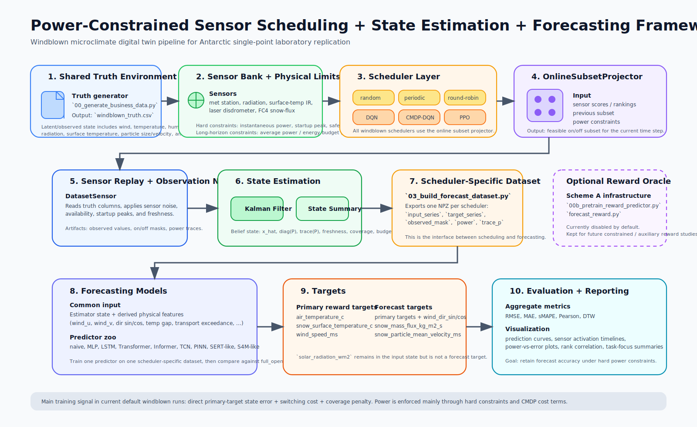

# 组会总结汇报：功率约束下的多传感器调度与微气候预测

## 1. 这项工作的目标

这项工作的核心问题很明确：

- 南极 AWS 供电能力有限，传感器不能一直全开；
- 但实验室 1:1 复刻单点微气候时，又需要提前知道未来的状态，尤其是温度、雪面温度、风速这些控制相关量；
- 所以我们要做的是：**在功率受限的情况下动态调度传感器，并尽量保住后续预测精度。**

从工程角度看，这不是单独的预测问题，也不是单独的调度问题，而是一条完整链路：

> 传感器调度 -> 状态估计 -> 构建调度后数据集 -> 下游时序预测 -> aggregate 评估

---

## 2. 框架总览

先看框架图：

这张图可以帮助理解整个系统是怎么串起来的。

### 2.1 数据层

我们先生成一条共享 truth 序列，里面包含：

- 风速、风向
- 温度、湿度、气压
- 光照
- 雪面温度
- 雪粒平均粒径、平均速度
- 风吹雪质量通量

所有调度策略都在同一条 truth 上比较，这样才能保证公平。

### 2.2 传感器层

当前传感器包括：

- `met_station`
- `radiation`
- `surface_temp_ir`
- `laser_disdrometer`
- `fc4_flux`

这里不是简单开关，而是要满足实际约束：

- 瞬时功率上限
- 启动峰值功率限制
- 安全裕度
- 对 `cmdp_dqn` 还加了平均功耗 / 总能量约束

### 2.3 调度层

当前比较的策略有两大类：

**规则基线**
- `full_open`
- `random`
- `periodic`
- `round_robin`
- `info_priority`

**学习型基线**
- `dqn`
- `cmdp_dqn`
- `ppo`

其中：
- `dqn`、`cmdp_dqn`、`ppo` 都是 baseline；
- 当前真正准备继续做创新的是 `cmdp_dqn`。

### 2.4 在线约束投影

所有 windblown 调度器最后都不是直接输出一个静态 action-id，而是先给出评分或排序，再交给 `OnlineSubsetProjector` 做一次投影。

这个投影器负责：

- 检查当前传感器组合是否满足硬约束；
- 根据功率和峰值限制选出当前时刻可行的 sensor subset；
- 把策略层的“偏好”变成真实可执行的开关方案。

### 2.5 状态估计与预测层

调度后的观测不会直接送进预测器，而是先通过 Kalman estimator 得到估计状态，再做一些物理增强特征，比如：

- `wind_dir_sin/cos`
- `wind_u/wind_v`
- `surface_air_temp_gap`
- `particle_kinetic_proxy`
- `size_velocity_interaction`
- `transport_exceedance`

然后用同一组 forecasting model 在不同 scheduler 生成的数据集上训练。

---

## 3. 当前实验到底在预测什么

当前主任务不是“只预测雪通量”，而是更接近一个**单点微气候数字孪生预测**问题。

### 3.1 主奖励目标

RL 当前主要围绕这 3 个变量优化：

- `air_temperature_c`
- `snow_surface_temperature_c`
- `wind_speed_ms`

### 3.2 forecast target

下游预测时使用的目标包括：

- `air_temperature_c`
- `snow_surface_temperature_c`
- `wind_speed_ms`
- `wind_dir_sin`
- `wind_dir_cos`
- `snow_mass_flux_kg_m2_s`
- `snow_particle_mean_velocity_ms`

要特别说明：

- `solar_radiation_wm2` 仍作为输入状态保留；
- 但它已经不再作为 forecast target，因为当前 truth 生成下它表现为稀疏脉冲，不适合作为主要预测输出。

这个口径和之前“只看风吹雪通量”的实验已经不一样了。

---

## 4. 当前用了哪些核心技术

### 4.1 调度算法

- 规则型：`random / periodic / round_robin / info_priority`
- 值函数型 RL：`dqn`
- 约束强化学习 baseline：`cmdp_dqn`
- 开源 RL baseline：`ppo`（基于 Stable-Baselines3）

### 4.2 状态估计

- Kalman filter
- belief summary
- uncertainty summary

### 4.3 时序预测模型

- `naive`
- `MLP`
- `LSTM`
- `Transformer`
- `Informer`
- `TCN`
- `PINN`
- `SERT-like`
- `S4M-like`

### 4.4 评价指标

这次不再只看 `dRMSE`，而是同时看：

- `RMSE`
- `MAE`
- `sMAPE`
- `Pearson`
- `DTW`

这里 `DTW` 很重要，因为时序模型有时幅值差不多，但相位有轻微错位，只看 RMSE 会误判。

---

## 5. 结果总览：先看 aggregate 层面

先看 power saving 与误差的总体关系：

这类图是这套实验里最重要的图之一，因为它最直接回答：

> 节电多少，代价是多大的预测损失？

从这张图可以读出：

- `random` 节电最多，但误差涨得也最多，是一个典型反例；
- `round_robin`、`info_priority`、`periodic` 都落在比较有利的位置；
- `ppo` 已经进入“可用区间”，但还不够强；
- `full_open` 是上限，不省电，但给我们提供了参考坐标。

当前总体 scheduler summary（相对 `full_open`）大致是：

- `round_robin`: `RMSE +2.63%`
- `info_priority`: `RMSE +2.71%`
- `periodic`: `RMSE +4.83%`
- `ppo`: `RMSE +8.52%`
- `random`: `RMSE +31.58%`

这一层面的结论很清楚：

> 当前最强的仍然是结构化规则基线，而不是 learned RL。

---

## 6. 每种图分别在说明什么

下面按图的类型来讲，每一种图都举一个例子。

### 6.1 类型一：预测曲线对比图（overlay）

例子：

这类图最适合看：

- 不同调度策略下，预测曲线能不能跟住真值；
- 有没有整体偏移；
- 峰值和谷值有没有被保住；
- `full_open` 之外，哪个 scheduler 更接近上限。

这张图里可以直接看出：

- `full_open` 仍是最稳定的参照；
- `round_robin / periodic / info_priority` 整体都比较贴近；
- `ppo` 没有离谱，但明显还没到最优。

这类图的优点是直观，缺点是容易只盯单一个 target，因此需要和 aggregate 图一起看。

---

### 6.2 类型二：小 multiples 曲线图

例子：

- `../reports/aggregate/posthoc_full_with_ppo_fix_20260326/prediction_curves/informer/air_temperature_c_H1_small_multiples.png`

这类图和 overlay 的区别在于：

- overlay 会把所有策略叠在一起；
- small multiples 会把每个策略拆开，避免重叠遮挡。

它更适合在组会上做细讲，比如：

- 某一个策略是不是在某些局部区段明显偏高；
- 某种模型是不是对某个 scheduler 特别敏感。

如果 overlay 用来做“总览”，small multiples 更适合做“局部诊断”。

---

### 6.3 类型三：传感器开关时间线图（sensor activation timeline）

例子：

这类图回答的问题不是“预测得准不准”，而是：

> scheduler 实际在怎么开关传感器？

图上一般包括：

- 顶部：某个目标变量的 truth 曲线；
- 第二行：功率随时间变化；
- 后面每行：每个传感器在该时刻是 on 还是 off。

这类图的价值很高，因为它能区分两种情况：

- 模型差，是因为策略本身学坏了；
- 还是模型差，只是预测器没学好。

例如这张 PPO 图可以说明：

- PPO 不再是“几乎不调度”；
- 它已经在两个高功耗传感器之间切换；
- 但即使这样，它当前整体表现仍没有超过最强规则基线。

也就是说，问题已经不是“实现坏了”，而是“策略还不够优”。

---

### 6.4 类型四：scheduler × model 的热力图

例子：

这类图适合讲“稳定性”和“泛化性”。

因为它不是只看一个模型，也不是只看一个调度策略，而是看：

- 同一个 scheduler，在不同 forecasting model 上是否都稳定；
- 某个 scheduler 是不是只对一种模型有效；
- learned policy 是否具备跨模型的稳健性。

这张热力图一般能帮助你回答：

- 当前的 scheduler 改进，是结构性的，还是偶然只在某个模型上有效。

从当前结果看，规则基线整体更稳，说明：

> learned RL 还没有形成跨模型都稳定占优的表现。

---

### 6.5 类型五：DTW 热力图

例子：

这类图和 RMSE 热力图互补。

因为 RMSE 更关注点误差，而 DTW 更关注序列形状和时间错位。

如果一个 scheduler：

- RMSE 不算高；
- 但 DTW 明显变差；

那通常说明：

- 它的幅值可能还行；
- 但时序形状、相位或局部结构已经被破坏了。

这在控制场景里很重要，因为实验室控制往往不只关心数值点误差，也关心趋势是不是提前或滞后。

---

### 6.6 类型六：Pearson 热力图

例子：

这类图更适合看“同步性”。

如果某个策略：

- Pearson 降得不多；
- 但 RMSE 变大；

往往说明它还保住了整体趋势，只是幅值有偏差。

反过来，如果 Pearson 掉得很多，通常说明它连时序结构本身都没跟上。

所以：

- RMSE 看数值偏差；
- DTW 看形状错位；
- Pearson 看同步关系；

三者一起看，才比较完整。

---

### 6.7 类型七：rank correlation 图

例子：

这类图的意义是：

> 不同缺失/调度策略之间，模型表现的相对排序是否稳定。

如果 rank correlation 很高，说明：

- 虽然绝对误差会变，
- 但哪些策略更好、哪些更差，排序大体稳定。

这类图特别适合回答一个常见问题：

- “是不是只是某次随机结果刚好碰巧？”

如果排序相关性很稳定，就说明观察到的相对优劣不是完全偶然。

---

### 6.8 类型八：主任务聚焦图（task-focus primary）

例子：

这类图很关键，因为它把“主任务”和“全部 forecast target 的总体平均”区分开了。

当前主任务是：

- `air_temperature_c`
- `snow_surface_temperature_c`
- `wind_speed_ms`

所以这类图更适合做正式结论。

从当前主任务 summary 看：

- `periodic`: `RMSE -0.46%`
- `round_robin`: `RMSE +0.36%`
- `ppo`: `RMSE +2.13%`
- `random`: `RMSE +20.93%`

这个结果说明：

- 如果从主任务口径看，PPO 比它在全目标平均上的表现更接近可用水平；
- 但它仍然没有超过最强规则策略。

---

### 6.9 类型九：power-vs-DTW / power-vs-Pearson 图

例子：

- `../reports/aggregate/posthoc_full_with_ppo_fix_20260326/power_saving_vs_dtw_h1_increase.png`
- `../reports/aggregate/posthoc_full_with_ppo_fix_20260326/power_saving_vs_pearson_h1_delta.png`

这类图的意义在于：

- 同样是节电，带来的不只是 RMSE 变化；
- 有些策略更伤形状，有些策略更伤同步性；
- 所以 trade-off 不是单维度的。

对组会来说，这类图很适合补一句：

> 我们不是只想要“误差小”，还想要“时间结构别坏掉”。

---

## 7. 当前实验结果应该怎么理解

### 7.1 已经明确的结论

当前结果至少能支持这几点：

1. 框架已经完整跑通，链路稳定。  
2. 规则策略是强 baseline，不能低估。  
3. PPO 这条外部 baseline 已经修到可用，不再是无效实现。  
4. 但目前最强的仍然是 `round_robin / info_priority / periodic`，而不是 learned RL。  

### 7.2 暂时不能过度宣称的结论

当前还不能说：

- PPO 优于规则基线；
- learned RL 已经显著胜出；
- constrained RL 的优势已经被充分验证。

因为从现在的 aggregate 和 task-focus 结果看，这些都还不成立。

---

## 8. 这次汇报最值得带走的核心信息

如果组会最后只记住三句话，我希望是这三句：

1. **我们已经把“功率约束下的调度 + 状态估计 + 预测评估”完整框架搭起来了。**  
2. **当前最强 baseline 仍然是结构化规则策略，说明问题本身不简单。**  
3. **RL 现在已经是可用 baseline，下一步真正值得做的是在 `cmdp_dqn` 上做 constrained RL 创新。**

---

## 9. 下一步计划

下一阶段建议集中在三件事：

1. 固化 baseline 体系：规则基线 + `dqn/cmdp_dqn` + `ppo`。  
2. 继续以 `cmdp_dqn` 为主线，研究更合理的 constrained RL 设计。  
3. 继续按“主任务口径”汇报，即优先汇报微气候主状态，而不是只盯某个单一变量。  

一句话总结后续方向：

> 框架阶段基本完成，接下来要进入真正的方法创新阶段。
